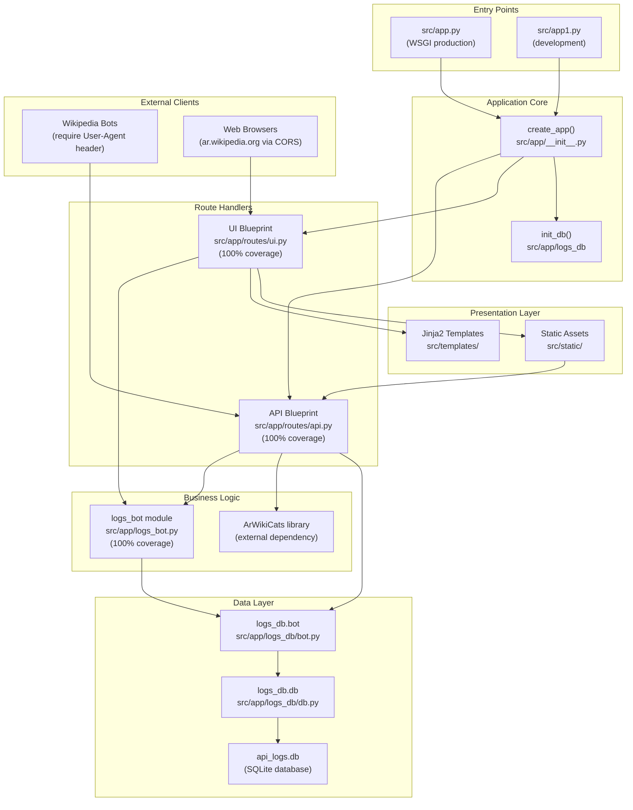
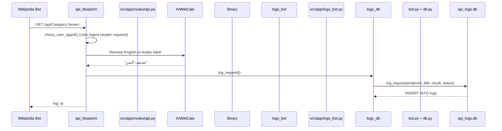
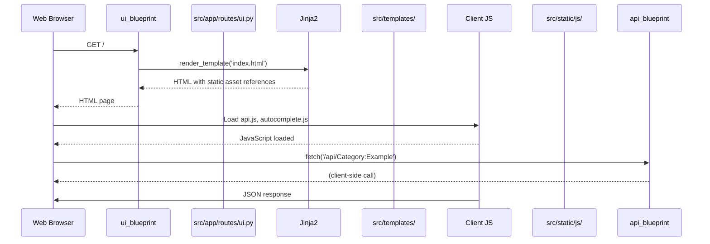
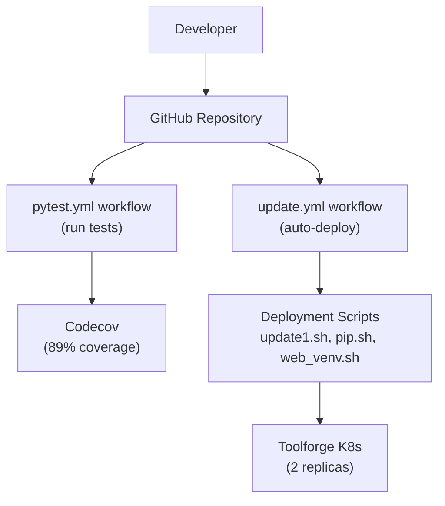

# Overview

> **Relevant source files**
> * [README.md](https://github.com/ArWikiCats/ArWikiCatsWeb/blob/88f42d13/README.md)
> * [src/app.py](https://github.com/ArWikiCats/ArWikiCatsWeb/blob/88f42d13/src/app.py)

## Purpose and Scope

This document provides a high-level introduction to ArWikiCatsWeb, an Arabic Wikipedia category label resolution service. It describes the system's purpose, core components, and architecture.

For detailed information about specific subsystems, see:

* Installation and local development: [Getting Started](/ArWikiCats/ArWikiCatsWeb/2-getting-started)
* Detailed architectural patterns: [Architecture](/ArWikiCats/ArWikiCatsWeb/3-architecture)
* REST API documentation: [REST API](/ArWikiCats/ArWikiCatsWeb/4-rest-api)
* Web interface details: [Web Interface](/ArWikiCats/ArWikiCatsWeb/5-web-interface)
* Logging infrastructure: [Logging System](/ArWikiCats/ArWikiCatsWeb/6-logging-system)
* Database operations: [Database Layer](/ArWikiCats/ArWikiCatsWeb/7-database-layer)
* Production deployment: [Deployment](/ArWikiCats/ArWikiCatsWeb/8-deployment)
* Testing strategy: [Testing](/ArWikiCats/ArWikiCatsWeb/9-testing)

Sources: [README.md L1-L271](https://github.com/ArWikiCats/ArWikiCatsWeb/blob/88f42d13/README.md#L1-L271)

## System Purpose

ArWikiCatsWeb is a Flask-based web service that resolves Arabic Wikipedia category labels by translating English category names to their Arabic equivalents. The system serves two primary user types:

1. **Wikipedia bots and automated tools** via a REST API that requires User-Agent header validation
2. **Human users** via a web interface for interactive category lookup and batch processing

The service integrates with the **ArWikiCats** library, which provides the core category resolution logic. All requests are logged to a SQLite database for usage tracking, analytics, and debugging.

Sources: [README.md L1-L18](https://github.com/ArWikiCats/ArWikiCatsWeb/blob/88f42d13/README.md#L1-L18)

 [README.md L245-L252](https://github.com/ArWikiCats/ArWikiCatsWeb/blob/88f42d13/README.md#L245-L252)

## Core Components

The application follows Flask's application factory pattern with clear separation of concerns:

| Component | File Path | Purpose |
| --- | --- | --- |
| **WSGI Entry Point** | [src/app.py L1-L16](https://github.com/ArWikiCats/ArWikiCatsWeb/blob/88f42d13/src/app.py#L1-L16) | Production entry point using `create_app()` factory |
| **Development Entry Point** | `src/app1.py` | Alternative entry point for development |
| **Application Factory** | `src/app/__init__.py` | `create_app()` function that initializes Flask app |
| **API Blueprint** | `src/app/routes/api.py` | REST API endpoints for category resolution and log retrieval |
| **UI Blueprint** | `src/app/routes/ui.py` | Web interface routes |
| **Logs Bot** | `src/app/logs_bot.py` | Business logic for log retrieval and filtering (100% test coverage) |
| **Logs DB Module** | `src/app/logs_db/` | Database abstraction layer (`bot.py`, `db.py`) |
| **Templates** | `src/templates/` | Jinja2 HTML templates using template inheritance |
| **Static Assets** | `src/static/` | JavaScript, CSS, and theme files |

Sources: [README.md L73-L108](https://github.com/ArWikiCats/ArWikiCatsWeb/blob/88f42d13/README.md#L73-L108)

 [src/app.py L1-L16](https://github.com/ArWikiCats/ArWikiCatsWeb/blob/88f42d13/src/app.py#L1-L16)

 [README.md L236-L240](https://github.com/ArWikiCats/ArWikiCatsWeb/blob/88f42d13/README.md#L236-L240)

## System Architecture

The following diagram maps the system's major components to their concrete implementations in the codebase:



**Component Relationships:**

* Both entry points ([src/app.py L10](https://github.com/ArWikiCats/ArWikiCatsWeb/blob/88f42d13/src/app.py#L10-L10)  `src/app1.py`) invoke `create_app()` to instantiate the Flask application
* `create_app()` registers two blueprints: `api_blueprint` and `ui_blueprint`
* The API blueprint depends on both `logs_bot` for log retrieval and `ArWikiCats` for category resolution
* The UI blueprint serves templates that include static assets; these assets make client-side calls back to the API
* All data persistence flows through `logs_db.bot` → `logs_db.db` → SQLite
* `init_db()` is called on application startup to ensure database schema exists

Sources: [src/app.py L1-L16](https://github.com/ArWikiCats/ArWikiCatsWeb/blob/88f42d13/src/app.py#L1-L16)

 [README.md L73-L108](https://github.com/ArWikiCats/ArWikiCatsWeb/blob/88f42d13/README.md#L73-L108)

 [README.md L236-L240](https://github.com/ArWikiCats/ArWikiCatsWeb/blob/88f42d13/README.md#L236-L240)

## Request Processing Flow

The system handles two distinct request patterns:

### API Request Flow



### Web UI Request Flow



**Key Differences:**

1. **API requests** require a `User-Agent` header; validation occurs in the blueprint before processing
2. **UI requests** return server-rendered HTML that subsequently makes client-side API calls
3. **Logging** occurs on API requests, capturing the endpoint, input title, resolved result, and response status
4. **ArWikiCats integration** is invoked directly by API endpoints, not by UI routes

Sources: [README.md L110-L169](https://github.com/ArWikiCats/ArWikiCatsWeb/blob/88f42d13/README.md#L110-L169)

 [README.md L179-L193](https://github.com/ArWikiCats/ArWikiCatsWeb/blob/88f42d13/README.md#L179-L193)

## Major Subsystems

### REST API (detailed documentation)

The API blueprint provides endpoints for:

* **Single category resolution**: `GET /api/<title>`
* **Batch processing**: `POST /api/list` with JSON body
* **Log retrieval**: Multiple endpoints for querying logs with filtering, pagination, and date aggregation
* **User-Agent validation**: All API requests must include a valid `User-Agent` header

See [REST API](/ArWikiCats/ArWikiCatsWeb/4-rest-api) for complete endpoint documentation.

Sources: [README.md L110-L169](https://github.com/ArWikiCats/ArWikiCatsWeb/blob/88f42d13/README.md#L110-L169)

### Web Interface (detailed documentation)

The UI provides interactive pages built with Jinja2 templates:

* **Category lookup**: `/` for single category, `/list` for batch processing
* **Log viewing**: `/logs` with pagination, `/logs_by_day` with date grouping
* **Visualizations**: `/chart` for statistics with Chart.js integration
* **Template inheritance**: Base template (`main.html`) provides Bootstrap, jQuery, DataTables, Font Awesome

See [Web Interface](/ArWikiCats/ArWikiCatsWeb/5-web-interface) for UI components and client-side JavaScript.

Sources: [README.md L170-L177](https://github.com/ArWikiCats/ArWikiCatsWeb/blob/88f42d13/README.md#L170-L177)

### Logging System (detailed documentation)

The logging infrastructure consists of:

* **Two-table schema**: `logs` table for general API requests, `list_logs` table for batch endpoints
* **Two-layer abstraction**: `logs_db.db` for raw SQL operations, `logs_bot` for business logic
* **Comprehensive tracking**: All API requests are logged with title, result, status, timestamp, User-Agent
* **Analysis functions**: `logs_bot` provides functions for filtering, pagination, date aggregation, and status categorization

See [Logging System](/ArWikiCats/ArWikiCatsWeb/6-logging-system) for schema details and querying patterns.

Sources: [README.md L159-L169](https://github.com/ArWikiCats/ArWikiCatsWeb/blob/88f42d13/README.md#L159-L169)

 [README.md L245-L252](https://github.com/ArWikiCats/ArWikiCatsWeb/blob/88f42d13/README.md#L245-L252)

### Database Layer (detailed documentation)

The `logs_db` module provides database operations:

* **`logs_db.db`**: Core functions like `fetch_all()`, `db_commit()`, `init_db()`
* **`logs_db.bot`**: Higher-level functions like `log_request()`, `get_all_logs()`
* **SQLite storage**: Single `api_logs.db` file with two tables
* **Schema initialization**: `init_db()` called on app startup ([src/app.py L13](https://github.com/ArWikiCats/ArWikiCatsWeb/blob/88f42d13/src/app.py#L13-L13) )

See [Database Layer](/ArWikiCats/ArWikiCatsWeb/7-database-layer) for operation details.

Sources: [src/app.py L8-L15](https://github.com/ArWikiCats/ArWikiCatsWeb/blob/88f42d13/src/app.py#L8-L15)

 [README.md L80-L85](https://github.com/ArWikiCats/ArWikiCatsWeb/blob/88f42d13/README.md#L80-L85)

## Deployment Architecture

### Toolforge Kubernetes Deployment

The service runs on Wikimedia Toolforge with the following configuration:

| Resource | Value |
| --- | --- |
| **Backend** | Kubernetes |
| **Python Version** | 3.11 |
| **CPU Allocation** | 3 cores |
| **Memory Allocation** | 6Gi |
| **Replicas** | 2 (high availability) |
| **Web Server** | UWSGI |

Configuration is defined in `service.template`.

### CI/CD Pipeline



* **Quality gates**: Tests run automatically on pull requests
* **Automated deployment**: Pushes to `main` branch trigger deployment to Toolforge
* **Test coverage**: 89% overall, 100% on critical modules (`api.py`, `ui.py`, `logs_bot.py`)

See [Deployment](/ArWikiCats/ArWikiCatsWeb/8-deployment) for deployment scripts and [Testing](/ArWikiCats/ArWikiCatsWeb/9-testing) for test infrastructure.

Sources: [README.md L196-L214](https://github.com/ArWikiCats/ArWikiCatsWeb/blob/88f42d13/README.md#L196-L214)

 [README.md L217-L244](https://github.com/ArWikiCats/ArWikiCatsWeb/blob/88f42d13/README.md#L217-L244)

## Technology Stack

| Layer | Technologies |
| --- | --- |
| **Backend** | Flask (application factory pattern), Flask-CORS |
| **External Library** | ArWikiCats (category resolution) |
| **Database** | SQLite 3 |
| **Frontend** | Bootstrap 5.3.0, jQuery 3.7.0, DataTables 2.2.2, Font Awesome 6.7.2, Chart.js |
| **Testing** | pytest, pytest-cov, unittest.mock |
| **Deployment** | Kubernetes, UWSGI |
| **CI/CD** | GitHub Actions |

Sources: [README.md L19-L26](https://github.com/ArWikiCats/ArWikiCatsWeb/blob/88f42d13/README.md#L19-L26)

 [README.md L245-L252](https://github.com/ArWikiCats/ArWikiCatsWeb/blob/88f42d13/README.md#L245-L252)

## Project File Structure

```markdown
ArWikiCatsWeb/
├── src/
│   ├── app/
│   │   ├── __init__.py          # create_app() factory
│   │   ├── logs_bot.py          # Log retrieval business logic
│   │   ├── logs_db/             # Database abstraction
│   │   │   ├── bot.py           # Higher-level DB operations
│   │   │   └── db.py            # Core SQL operations
│   │   └── routes/
│   │       ├── api.py           # API endpoints
│   │       └── ui.py            # Web UI routes
│   ├── templates/               # Jinja2 templates
│   ├── static/                  # JS, CSS assets
│   ├── app.py                  # WSGI entry point
│   └── app1.py                 # Development entry point
├── tests/                       # Test suite (89% coverage)
├── .github/workflows/           # CI/CD workflows
├── service.template            # Toolforge K8s config
└── requirements.txt            # Python dependencies
```

Sources: [README.md L73-L108](https://github.com/ArWikiCats/ArWikiCatsWeb/blob/88f42d13/README.md#L73-L108)