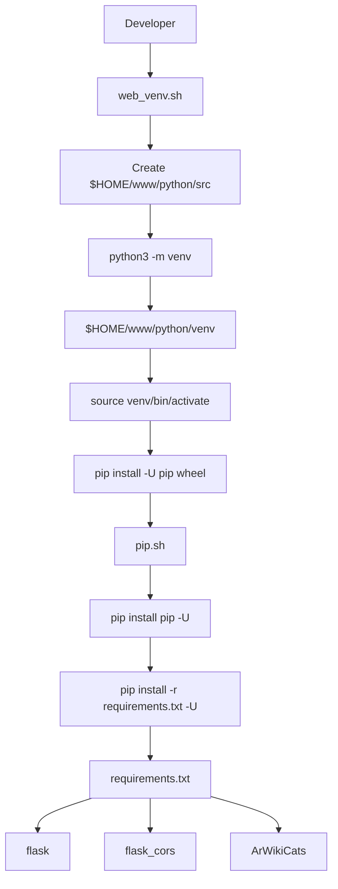
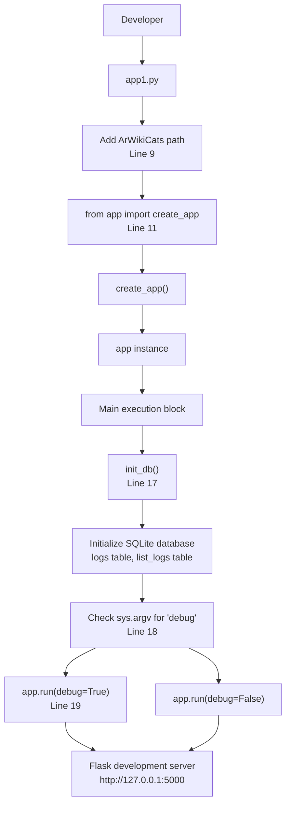

# Getting Started

> **Relevant source files**
> * [src/app1.py](https://github.com/ArWikiCats/ArWikiCatsWeb/blob/88f42d13/src/app1.py)
> * [src/requirements.txt](https://github.com/ArWikiCats/ArWikiCatsWeb/blob/88f42d13/src/requirements.txt)
> * [web_sh/pip.sh](https://github.com/ArWikiCats/ArWikiCatsWeb/blob/88f42d13/web_sh/pip.sh)
> * [web_sh/web_venv.sh](https://github.com/ArWikiCats/ArWikiCatsWeb/blob/88f42d13/web_sh/web_venv.sh)

This document provides step-by-step instructions for installing, configuring, and running the ArWikiCatsWeb application on your local development machine. It covers environment setup, dependency installation, database initialization, and launching the development server.

For information about the application's overall architecture and component organization, see [Architecture](/ArWikiCats/ArWikiCatsWeb/3-architecture). For deployment to production Toolforge infrastructure, see [Deployment](/ArWikiCats/ArWikiCatsWeb/8-deployment).

---

## Prerequisites

Before installing ArWikiCatsWeb, ensure your development environment meets the following requirements:

| Requirement | Version | Purpose |
| --- | --- | --- |
| Python | 3.11+ | Primary runtime environment |
| pip | Latest | Package management |
| Git | Any | Repository cloning |
| SQLite | 3.x | Database (bundled with Python) |

**Note**: While the production deployment uses Python 3.11 on Toolforge, the application should work with Python 3.9+. However, Python 3.11 is recommended for consistency with production.

Sources: [web_sh/pip.sh L1-L13](https://github.com/ArWikiCats/ArWikiCatsWeb/blob/88f42d13/web_sh/pip.sh#L1-L13)

 [src/requirements.txt L1-L4](https://github.com/ArWikiCats/ArWikiCatsWeb/blob/88f42d13/src/requirements.txt#L1-L4)

---

## Installation

### Clone the Repository

Clone the ArWikiCatsWeb repository from GitHub:

```
git clone https://github.com/ArWikiCats/ArWikiCatsWeb.git
cd ArWikiCatsWeb
```

### Directory Structure

After cloning, the repository contains the following key directories and files:

```markdown
ArWikiCatsWeb/
├── src/
│   ├── app.py              # Production WSGI entry point
│   ├── app1.py             # Development entry point
│   ├── requirements.txt    # Python dependencies
│   └── app/
│       ├── __init__.py     # Application factory (create_app)
│       ├── routes/         # API and UI blueprints
│       └── logs_db/        # Database layer
├── web_sh/                 # Deployment scripts
│   ├── web_venv.sh         # Virtual environment setup
│   └── pip.sh              # Dependency installation
├── templates/              # Jinja2 HTML templates
└── static/                 # CSS, JavaScript, assets
```

### Virtual Environment Setup

#### Manual Setup (Recommended for Local Development)

Create and activate a Python virtual environment:

**Linux/macOS:**

```
python3 -m venv venv
source venv/bin/activate
```

**Windows:**

```
python -m venv venv
venv\Scripts\activate
```

#### Automated Setup (Toolforge-style)

The repository includes shell scripts for automated environment setup, mirroring the Toolforge deployment process:

```
cd web_sh
./web_venv.sh
```

The `web_venv.sh` script performs the following operations:

1. Creates directory structure at `$HOME/www/python/src`
2. Creates virtual environment at `$HOME/www/python/venv`
3. Upgrades pip and installs wheel support
4. Invokes `pip.sh` to install dependencies

**Diagram: Environment Setup Flow**



Sources: [web_sh/web_venv.sh L1-L17](https://github.com/ArWikiCats/ArWikiCatsWeb/blob/88f42d13/web_sh/web_venv.sh#L1-L17)

 [web_sh/pip.sh L1-L13](https://github.com/ArWikiCats/ArWikiCatsWeb/blob/88f42d13/web_sh/pip.sh#L1-L13)

### Install Dependencies

With the virtual environment activated, install the required Python packages:

```
pip install -r src/requirements.txt
```

The `requirements.txt` file specifies three core dependencies:

| Package | Purpose |
| --- | --- |
| `flask` | Web framework and application core |
| `flask_cors` | Cross-Origin Resource Sharing support for Arabic Wikipedia clients |
| `ArWikiCats` | External library for Arabic category label resolution |

**Important**: The `ArWikiCats` package is the critical dependency that provides category resolution functionality. It is maintained as a separate library and must be available in the Python environment.

Sources: [src/requirements.txt L1-L4](https://github.com/ArWikiCats/ArWikiCatsWeb/blob/88f42d13/src/requirements.txt#L1-L4)

---

## Database Initialization

ArWikiCatsWeb uses SQLite for logging API requests and responses. The database must be initialized before first run.

The database initialization is handled automatically by the `init_db()` function, which is called during application startup. When running the development server via `app1.py`, this initialization occurs automatically.

For manual database initialization or management, see [Database Initialization and Management](/ArWikiCats/ArWikiCatsWeb/7.2-database-initialization-and-management).

Sources: [src/app1.py L12](https://github.com/ArWikiCats/ArWikiCatsWeb/blob/88f42d13/src/app1.py#L12-L12)

 [src/app1.py L17](https://github.com/ArWikiCats/ArWikiCatsWeb/blob/88f42d13/src/app1.py#L17-L17)

---

## Running the Application

### Development Server (Recommended for Local Development)

The primary entry point for local development is `app1.py`, located in the `src/` directory.

**Diagram: Development Server Startup Flow**



Sources: [src/app1.py L1-L20](https://github.com/ArWikiCats/ArWikiCatsWeb/blob/88f42d13/src/app1.py#L1-L20)

#### Basic Startup

Navigate to the `src/` directory and run:

```
cd src
python app1.py
```

The development server will start on `http://127.0.0.1:5000` by default.

#### Debug Mode

To enable Flask debug mode with auto-reload and detailed error pages:

```
python app1.py debug
```

or:

```
python app1.py DEBUG
```

The debug flag is detected by checking for `"debug"` or `"DEBUG"` in `sys.argv` ([src/app1.py L18](https://github.com/ArWikiCats/ArWikiCatsWeb/blob/88f42d13/src/app1.py#L18-L18)

).

#### Development Mode Features

When running via `app1.py`, the following development features are enabled:

* **Auto-reload**: The server restarts automatically when code changes are detected (debug mode only)
* **Detailed error pages**: Stack traces and interactive debugger in the browser (debug mode only)
* **Database auto-initialization**: `init_db()` is called on startup to ensure database schema exists
* **Local path configuration**: Line 9 inserts a hardcoded path for the ArWikiCats library location (local development only)

**Important**: The path insertion at [src/app1.py L9](https://github.com/ArWikiCats/ArWikiCatsWeb/blob/88f42d13/src/app1.py#L9-L9)

 (`sys.path.insert(0, "D:/categories_bot/make2_new")`) is specific to the original developer's environment. You should either:

1. Remove this line if ArWikiCats is installed via pip
2. Modify it to match your local ArWikiCats development directory
3. Use an environment variable for the path

### Production WSGI Entry Point

For production deployment or WSGI server testing, use `app.py` instead of `app1.py`:

```
cd src
python app.py
```

The production entry point differs from the development entry point in the following ways:

* No automatic database initialization (handled by deployment scripts)
* No debug mode or auto-reload
* Designed for WSGI servers (uWSGI, Gunicorn)
* No local path manipulation

For detailed information about production deployment with uWSGI and Kubernetes, see [Toolforge Configuration](/ArWikiCats/ArWikiCatsWeb/8.1-toolforge-configuration).

Sources: [src/app1.py L1-L20](https://github.com/ArWikiCats/ArWikiCatsWeb/blob/88f42d13/src/app1.py#L1-L20)

---

## Verification

After starting the development server, verify the installation by accessing the following endpoints:

### Web Interface

Open a web browser and navigate to:

```yaml
http://127.0.0.1:5000/
```

You should see the main category lookup page with:

* Input field for English category labels
* "Get Arabic Label" button
* Bootstrap-styled responsive interface

For detailed information about the web interface and its pages, see [Web Interface](/ArWikiCats/ArWikiCatsWeb/5-web-interface).

### API Endpoints

Test the API functionality using curl or a similar HTTP client:

```markdown
# Single category lookup
curl -A "MyBot/1.0 (user@example.com)" \
  "http://127.0.0.1:5000/api?category=History"

# Health check
curl "http://127.0.0.1:5000/api/health"
```

**Note**: The API requires a valid User-Agent header for category resolution endpoints. For details, see [User-Agent Validation](/ArWikiCats/ArWikiCatsWeb/4.3-user-agent-validation).

Expected response for a successful category lookup:

```json
{
  "category": "History",
  "result": "تاريخ",
  "status": "success"
}
```

For comprehensive API documentation, see [REST API](/ArWikiCats/ArWikiCatsWeb/4-rest-api).

### Database Verification

Verify that the SQLite database was created successfully:

```
ls -la src/api_logs.db
```

The database file should exist at `src/api_logs.db`. To inspect the schema:

```
sqlite3 src/api_logs.db ".schema"
```

Expected tables:

* `logs`: General API request logs
* `list_logs`: Batch endpoint logs

For detailed schema documentation, see [Log Database Schema](/ArWikiCats/ArWikiCatsWeb/6.1-log-database-schema).

---

## Troubleshooting

### Common Issues

| Issue | Solution |
| --- | --- |
| `ModuleNotFoundError: No module named 'app'` | Ensure you're running from the `src/` directory |
| `ModuleNotFoundError: No module named 'ArWikiCats'` | Install dependencies: `pip install -r requirements.txt` |
| Path error at line 9 | Remove or modify the hardcoded path in `app1.py` |
| Database lock errors | Close any existing connections; delete `api_logs.db` and restart |
| Port 5000 already in use | Stop other processes or specify a different port: `app.run(port=5001)` |

### System Requirements Check

Verify your Python version meets requirements:

```markdown
python --version  # Should be 3.9 or higher
```

Verify all dependencies are installed:

```
pip list | grep -E "flask|ArWikiCats"
```

Expected output:

```
flask          3.x.x
flask-cors     4.x.x
ArWikiCats     x.x.x
```

---

## Next Steps

After successfully running the application locally:

1. **Explore the Web Interface**: Navigate to different pages to understand the UI structure. See [Web Interface](/ArWikiCats/ArWikiCatsWeb/5-web-interface) for details.
2. **Test API Endpoints**: Use the API documentation to test different endpoints with various parameters. See [REST API](/ArWikiCats/ArWikiCatsWeb/4-rest-api).
3. **Review the Architecture**: Understand the application factory pattern and component organization. See [Architecture](/ArWikiCats/ArWikiCatsWeb/3-architecture).
4. **Examine the Logging System**: Review how requests are logged and how to query log data. See [Logging System](/ArWikiCats/ArWikiCatsWeb/6-logging-system).
5. **Run Tests**: Execute the test suite to verify everything works correctly. See [Testing](/ArWikiCats/ArWikiCatsWeb/9-testing).

Sources: [src/app1.py L1-L20](https://github.com/ArWikiCats/ArWikiCatsWeb/blob/88f42d13/src/app1.py#L1-L20)

 [src/requirements.txt L1-L4](https://github.com/ArWikiCats/ArWikiCatsWeb/blob/88f42d13/src/requirements.txt#L1-L4)

 [web_sh/pip.sh L1-L13](https://github.com/ArWikiCats/ArWikiCatsWeb/blob/88f42d13/web_sh/pip.sh#L1-L13)

 [web_sh/web_venv.sh L1-L17](https://github.com/ArWikiCats/ArWikiCatsWeb/blob/88f42d13/web_sh/web_venv.sh#L1-L17)