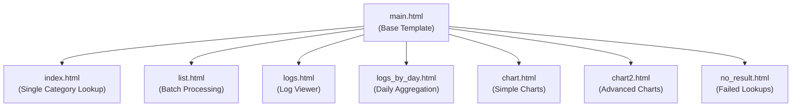
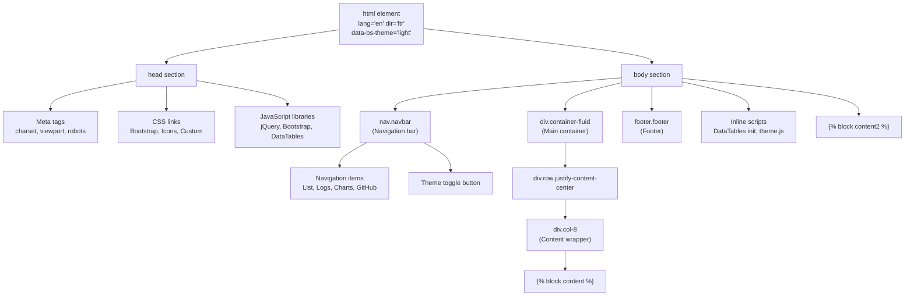
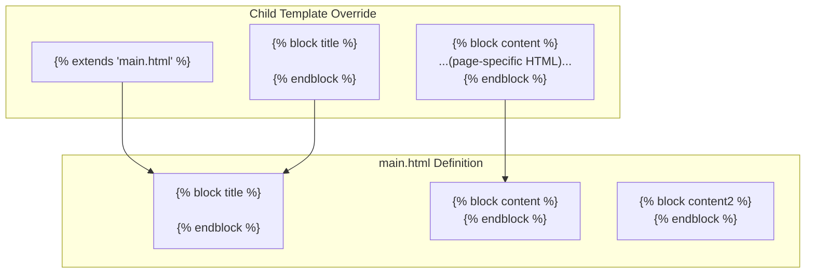
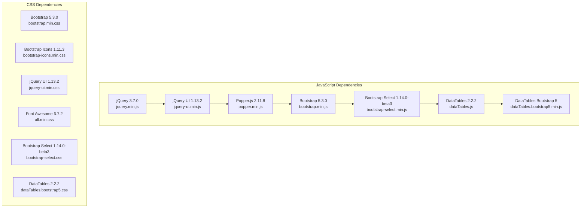
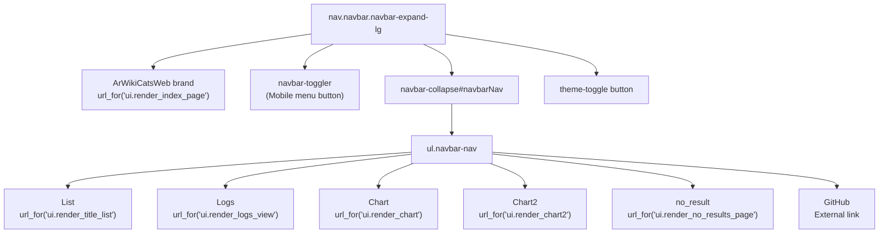
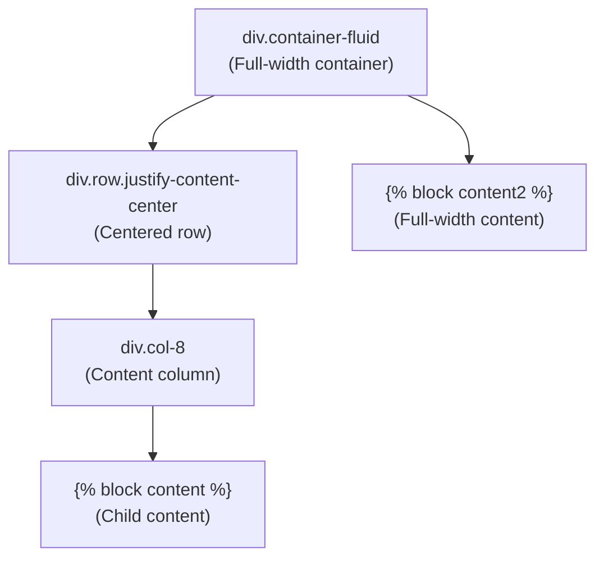
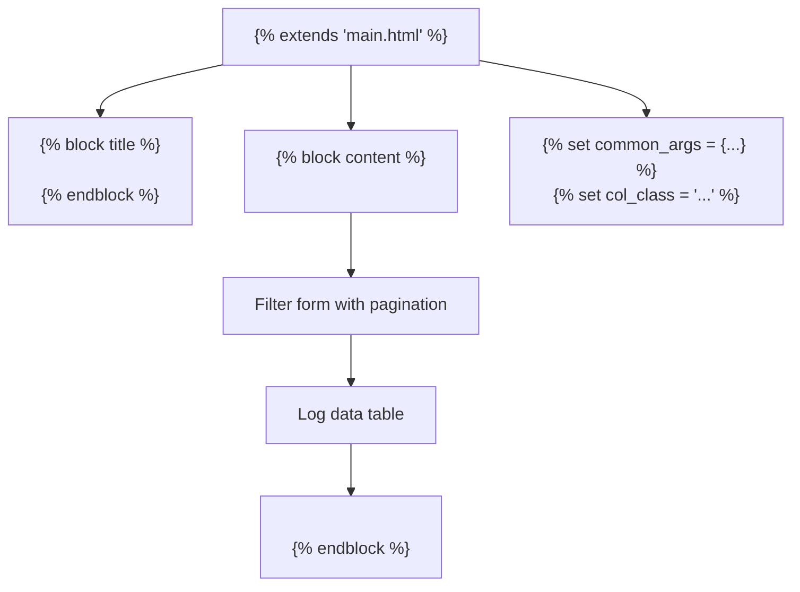

# Base Template System

> **Relevant source files**
> * [.gitignore](https://github.com/ArWikiCats/ArWikiCatsWeb/blob/88f42d13/.gitignore)
> * [src/templates/chart2.html](https://github.com/ArWikiCats/ArWikiCatsWeb/blob/88f42d13/src/templates/chart2.html)
> * [src/templates/logs.html](https://github.com/ArWikiCats/ArWikiCatsWeb/blob/88f42d13/src/templates/logs.html)
> * [src/templates/main.html](https://github.com/ArWikiCats/ArWikiCatsWeb/blob/88f42d13/src/templates/main.html)

## Purpose and Scope

The Base Template System provides the foundational HTML structure and shared resources for all web pages in ArWikiCatsWeb. It uses Jinja2 template inheritance to establish a consistent layout, navigation, and styling across the application. This document covers the base template (`main.html`), its block structure, third-party dependencies, custom assets, and the theme system.

For information about specific pages that extend this base template, see [Category Lookup Pages](/ArWikiCats/ArWikiCatsWeb/5.2-category-lookup-pages), [Log Viewing Pages](/ArWikiCats/ArWikiCatsWeb/5.3-log-viewing-pages), and [Chart and Visualization Pages](/ArWikiCats/ArWikiCatsWeb/5.4-chart-and-visualization-pages). For client-side JavaScript functionality, see [Client-Side JavaScript](/ArWikiCats/ArWikiCatsWeb/5.5-client-side-javascript).

## Template Inheritance Architecture

The system follows a single-parent inheritance pattern where `main.html` serves as the base template and all other pages extend it. The Jinja2 `` directive establishes this relationship.

### Template Inheritance Hierarchy



**Sources:** [src/templates/main.html L1-L157](https://github.com/ArWikiCats/ArWikiCatsWeb/blob/88f42d13/src/templates/main.html#L1-L157)

 [src/templates/logs.html L1](https://github.com/ArWikiCats/ArWikiCatsWeb/blob/88f42d13/src/templates/logs.html#L1-L1)

 [src/templates/chart2.html L1](https://github.com/ArWikiCats/ArWikiCatsWeb/blob/88f42d13/src/templates/chart2.html#L1-L1)

## Main Template Structure

The `main.html` file defines the complete HTML document structure, including DOCTYPE, head section, body layout, navigation, and footer. It establishes a responsive layout using Bootstrap's grid system.

### Core HTML Structure



**Sources:** [src/templates/main.html L2-L156](https://github.com/ArWikiCats/ArWikiCatsWeb/blob/88f42d13/src/templates/main.html#L2-L156)

### CDN Configuration

All third-party libraries are loaded from Wikimedia Toolforge's CDN to ensure availability and reduce hosting requirements. The CDN base URL is defined as a Jinja2 variable.

[src/templates/main.html L1](https://github.com/ArWikiCats/ArWikiCatsWeb/blob/88f42d13/src/templates/main.html#L1-L1)

```

```

**Sources:** [src/templates/main.html L1](https://github.com/ArWikiCats/ArWikiCatsWeb/blob/88f42d13/src/templates/main.html#L1-L1)

## Block System

`main.html` defines three Jinja2 blocks that child templates can override to customize specific sections while maintaining the overall structure.

### Block Definitions and Usage

| Block Name | Location | Default Content | Purpose |
| --- | --- | --- | --- |
| `title` | `<head>` section | `<title>Categories titles</title>` | Page title displayed in browser tab |
| `content` | Inside `div.col-8` wrapper | Empty | Primary page content area |
| `content2` | After `container-fluid` | Empty | Full-width content outside main container |

### Block Implementation Pattern



**Sources:** [src/templates/main.html L11-L13](https://github.com/ArWikiCats/ArWikiCatsWeb/blob/88f42d13/src/templates/main.html#L11-L13)

 [src/templates/main.html L107](https://github.com/ArWikiCats/ArWikiCatsWeb/blob/88f42d13/src/templates/main.html#L107-L107)

 [src/templates/main.html L111](https://github.com/ArWikiCats/ArWikiCatsWeb/blob/88f42d13/src/templates/main.html#L111-L111)

 [src/templates/logs.html L1-L5](https://github.com/ArWikiCats/ArWikiCatsWeb/blob/88f42d13/src/templates/logs.html#L1-L5)

 [src/templates/chart2.html L1-L7](https://github.com/ArWikiCats/ArWikiCatsWeb/blob/88f42d13/src/templates/chart2.html#L1-L7)

### Example: logs.html Block Usage

The `logs.html` template demonstrates typical block override patterns:

[src/templates/logs.html L1-L5](https://github.com/ArWikiCats/ArWikiCatsWeb/blob/88f42d13/src/templates/logs.html#L1-L5)

```xml


<title>API LOGS</title>

```

[src/templates/logs.html L21-L22](https://github.com/ArWikiCats/ArWikiCatsWeb/blob/88f42d13/src/templates/logs.html#L21-L22)

```html

</div>
<div class="col-11">
    <!-- Log viewing interface -->

```

**Sources:** [src/templates/logs.html L1-L266](https://github.com/ArWikiCats/ArWikiCatsWeb/blob/88f42d13/src/templates/logs.html#L1-L266)

## Third-Party Dependencies

The base template loads six major third-party libraries via CDN, providing comprehensive UI functionality without local hosting.

### Dependency Loading Sequence



### Dependency Specifications

| Library | Version | Purpose | Load Order |
| --- | --- | --- | --- |
| Bootstrap | 5.3.0 | Responsive layout, UI components | CSS: Line 14, JS: Line 26 |
| Bootstrap Icons | 1.11.3 | Icon font | CSS: Line 15 |
| jQuery | 3.7.0 | DOM manipulation, AJAX | JS: Line 23 |
| jQuery UI | 1.13.2 | Autocomplete widgets | CSS: Line 16, JS: Line 24 |
| Font Awesome | 6.7.2 | Additional icon font | CSS: Line 17 |
| Bootstrap Select | 1.14.0-beta3 | Enhanced select dropdowns | CSS: Line 18, JS: Line 27 |
| DataTables | 2.2.2 | Table enhancement | CSS: Line 19, JS: Lines 28-29 |
| Popper.js | 2.11.8 | Tooltip/popover positioning | JS: Line 25 |

**Sources:** [src/templates/main.html L14-L29](https://github.com/ArWikiCats/ArWikiCatsWeb/blob/88f42d13/src/templates/main.html#L14-L29)

## Custom Assets

The base template loads four custom assets that provide application-specific styling and functionality.

### Custom Asset Loading

[src/templates/main.html L21-L22](https://github.com/ArWikiCats/ArWikiCatsWeb/blob/88f42d13/src/templates/main.html#L21-L22)

```
<link href="{{ url_for('static', filename='style.css') }}" rel="stylesheet">
<link href="{{ url_for('static', filename='theme.css') }}" rel="stylesheet">
```

[src/templates/main.html L112-L113](https://github.com/ArWikiCats/ArWikiCatsWeb/blob/88f42d13/src/templates/main.html#L112-L113)

```xml
<script src="{{ url_for('static', filename='theme.js') }}"></script>
<script src="{{ url_for('static', filename='autocomplete.js') }}"></script>
```

### Custom Asset Roles

| Asset | Type | Purpose | Location |
| --- | --- | --- | --- |
| `style.css` | CSS | General application styling | `src/static/style.css` |
| `theme.css` | CSS | Theme-specific styles (light/dark mode) | `src/static/theme.css` |
| `theme.js` | JavaScript | Theme toggle functionality | `src/static/theme.js` |
| `autocomplete.js` | JavaScript | Category name autocomplete | `src/static/autocomplete.js` |

**Sources:** [src/templates/main.html L21-L22](https://github.com/ArWikiCats/ArWikiCatsWeb/blob/88f42d13/src/templates/main.html#L21-L22)

 [src/templates/main.html L112-L113](https://github.com/ArWikiCats/ArWikiCatsWeb/blob/88f42d13/src/templates/main.html#L112-L113)

## Navigation System

The navigation bar provides consistent access to all major application features and external resources.

### Navigation Structure



### Navigation Items and Routes

| Link Text | Route Function | URL Endpoint | Purpose |
| --- | --- | --- | --- |
| ArWikiCatsWeb (brand) | `ui.render_index_page` | `/` | Homepage |
| List | `ui.render_title_list` | `/list` | Batch processing |
| Logs | `ui.render_logs_view` | `/logs` | Log viewer |
| Chart | `ui.render_chart` | `/chart` | Simple charts |
| Chart2 | `ui.render_chart2` | `/chart2` | Advanced charts |
| no_result | `ui.render_no_results_page` | `/no_result` | Failed lookups |
| GitHub | External | `https://github.com/WikiAr/ArWikiCatsWeb` | Source code |

**Sources:** [src/templates/main.html L38-L103](https://github.com/ArWikiCats/ArWikiCatsWeb/blob/88f42d13/src/templates/main.html#L38-L103)

## Theme System

The template includes a light/dark theme toggle system controlled by the `data-bs-theme` attribute on the `<html>` element.

### Theme Implementation

[src/templates/main.html L3](https://github.com/ArWikiCats/ArWikiCatsWeb/blob/88f42d13/src/templates/main.html#L3-L3)

```html
<html lang="en" dir="ltr" data-bs-theme="light">
```

[src/templates/main.html L98-L101](https://github.com/ArWikiCats/ArWikiCatsWeb/blob/88f42d13/src/templates/main.html#L98-L101)

```xml
<button class="theme-toggle btn btn-link me-ms-auto" aria-label="Toggle theme">
    <i class="bi bi-moon-stars-fill"></i>
</button>
```

The theme toggle button is placed in the navigation bar and invokes functionality from `theme.js` to switch between light and dark modes by changing the `data-bs-theme` attribute value.

**Sources:** [src/templates/main.html L3](https://github.com/ArWikiCats/ArWikiCatsWeb/blob/88f42d13/src/templates/main.html#L3-L3)

 [src/templates/main.html L97-L101](https://github.com/ArWikiCats/ArWikiCatsWeb/blob/88f42d13/src/templates/main.html#L97-L101)

 [src/templates/main.html L112](https://github.com/ArWikiCats/ArWikiCatsWeb/blob/88f42d13/src/templates/main.html#L112-L112)

## Shared Inline Scripts

The base template includes inline JavaScript that is available to all child templates.

### DataTables Initialization

[src/templates/main.html L116-L121](https://github.com/ArWikiCats/ArWikiCatsWeb/blob/88f42d13/src/templates/main.html#L116-L121)

```yaml
$('.soro').DataTable({
    paging: false,
    info: false,
    searching: false,
    order: []
});
```

This configuration initializes DataTables on any table with the `soro` class, disabling pagination, info display, and search functionality while preserving sorting.

### Copy Functionality

[src/templates/main.html L122-L150](https://github.com/ArWikiCats/ArWikiCatsWeb/blob/88f42d13/src/templates/main.html#L122-L150)

```javascript
function copyResult(id, event) {
    const resultText = document.getElementById(id);
    if (resultText.value === '') return;
    // ... Clipboard API implementation
}
```

The `copyResult` function provides text copying functionality using the Clipboard API, with visual feedback for successful operations.

**Sources:** [src/templates/main.html L114-L151](https://github.com/ArWikiCats/ArWikiCatsWeb/blob/88f42d13/src/templates/main.html#L114-L151)

## Layout System

The base template establishes a responsive layout using Bootstrap's grid system.

### Layout Structure



### Layout Characteristics

* **Main Content Area**: Wrapped in `col-8`, providing an 8-column width (66.67% of container) on medium and larger screens
* **Centered Layout**: `justify-content-center` centers the content column horizontally
* **Responsive Behavior**: Bootstrap's responsive classes adapt the layout for different screen sizes
* **Full-Width Content**: `content2` block bypasses the grid system for full-width layouts (used in `chart2.html`)

**Sources:** [src/templates/main.html L104-L111](https://github.com/ArWikiCats/ArWikiCatsWeb/blob/88f42d13/src/templates/main.html#L104-L111)

## Child Template Integration Example

The `logs.html` template demonstrates how child templates integrate with the base system.

### Integration Pattern



### Key Integration Techniques

1. **Block Override**: Replaces `title` block with page-specific title
2. **Layout Adjustment**: Closes inherited `col-8` div and opens `col-11` for wider layout
3. **Jinja2 Variables**: Defines local variables (`common_args`, `col_class`) for template logic
4. **URL Generation**: Uses `url_for()` extensively for route references
5. **Conditional Rendering**: Employs `` statements for dynamic content

**Sources:** [src/templates/logs.html L1-L266](https://github.com/ArWikiCats/ArWikiCatsWeb/blob/88f42d13/src/templates/logs.html#L1-L266)

## Meta Configuration

The base template includes several meta tags that affect how the page is indexed and displayed.

### Meta Tag Configuration

[src/templates/main.html L6-L10](https://github.com/ArWikiCats/ArWikiCatsWeb/blob/88f42d13/src/templates/main.html#L6-L10)

```
<meta charset="UTF-8">
<meta name="robots" content="noindex">
<meta http-equiv="X-UA-Compatible" content="IE=edge">
<meta name="viewport" content="width=device-width, initial-scale=1">
<link rel="icon" href="https://www.mediawiki.org/static/images/icons/mediawikiwiki.svg" type="image/svg+xml">
```

| Meta Tag | Value | Purpose |
| --- | --- | --- |
| charset | UTF-8 | Character encoding for international text |
| robots | noindex | Prevents search engine indexing |
| X-UA-Compatible | IE=edge | Forces latest IE rendering mode |
| viewport | width=device-width, initial-scale=1 | Responsive mobile layout |
| icon | MediaWiki SVG | Favicon using MediaWiki icon |

**Sources:** [src/templates/main.html L6-L10](https://github.com/ArWikiCats/ArWikiCatsWeb/blob/88f42d13/src/templates/main.html#L6-L10)