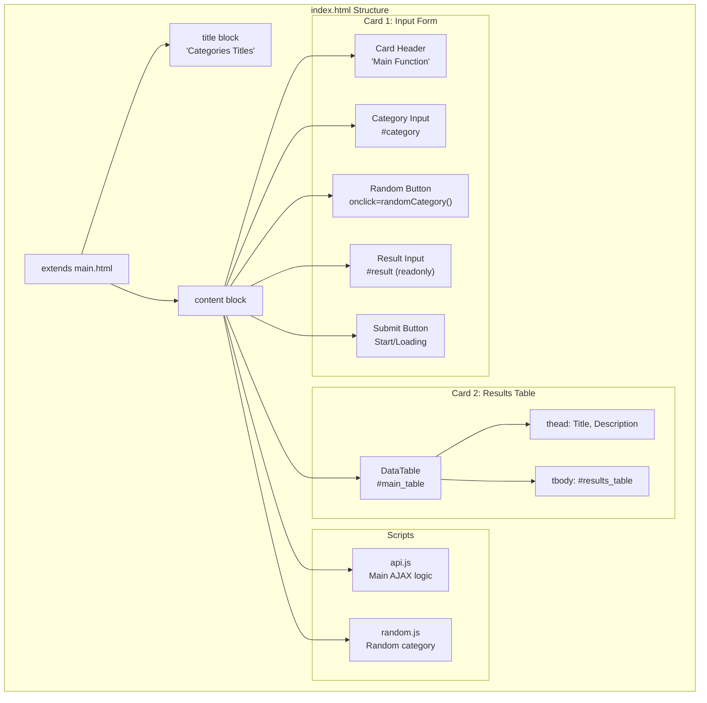
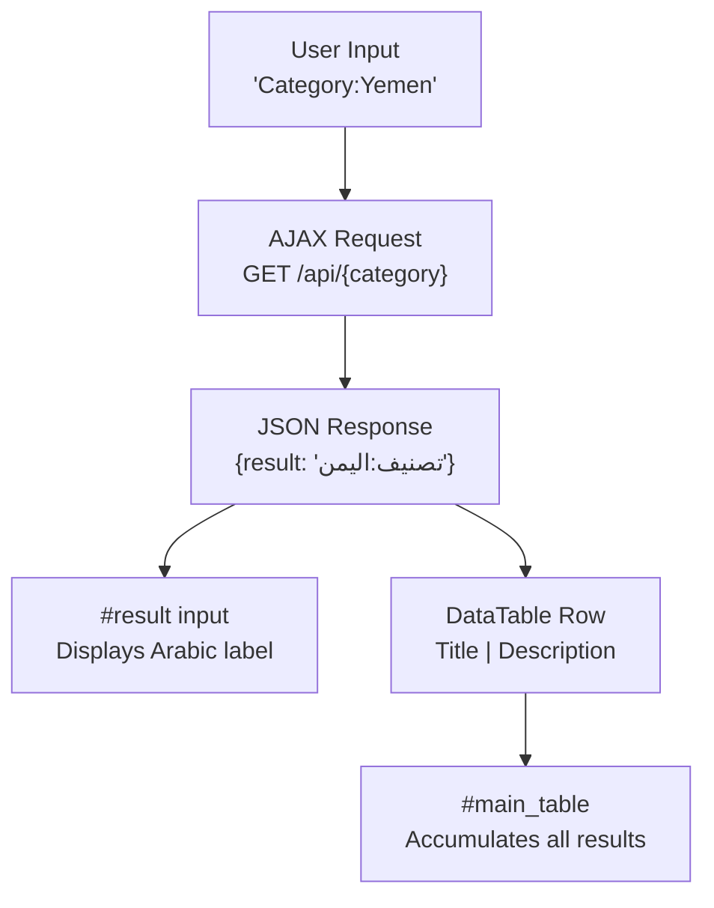
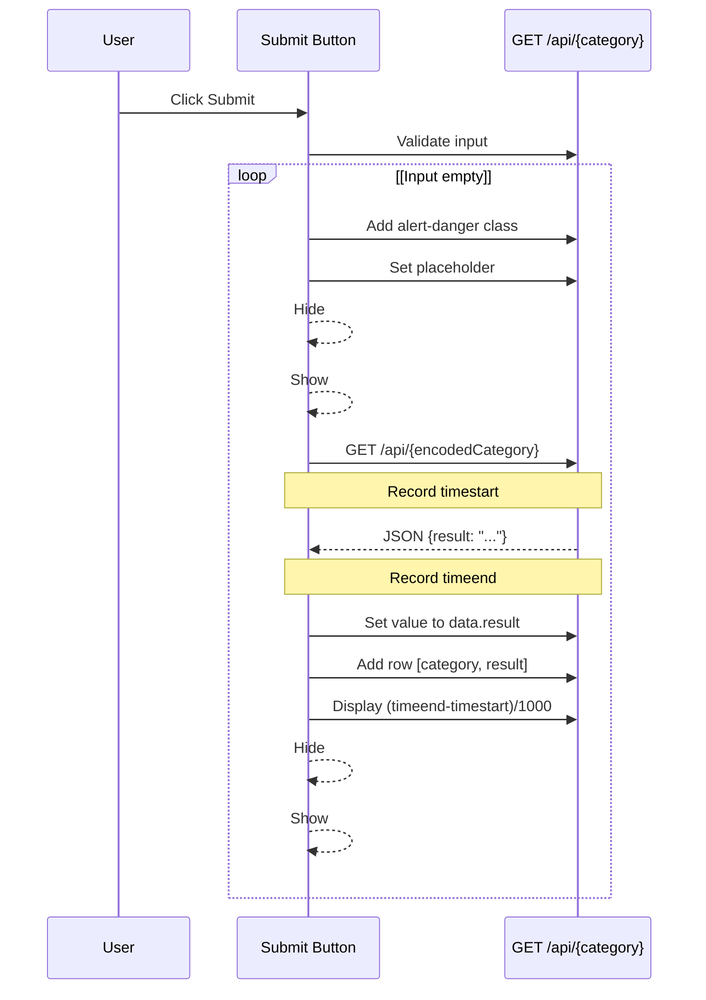
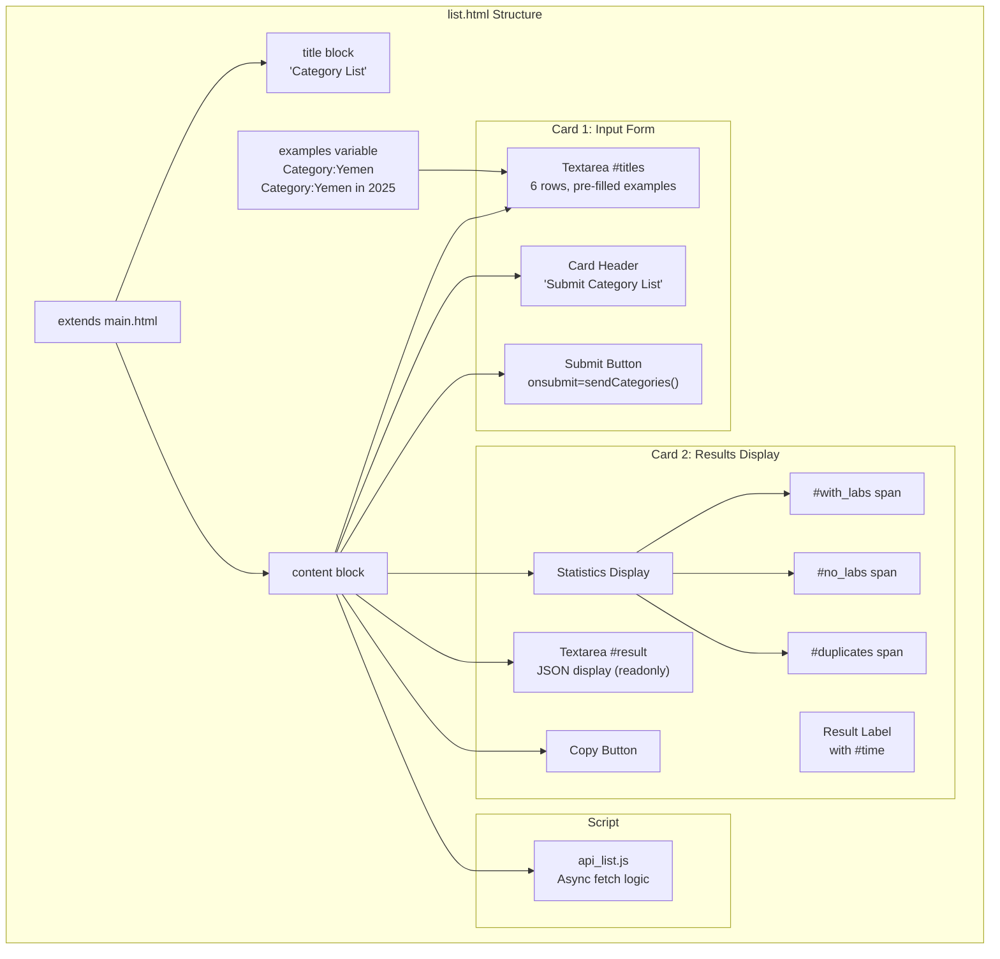
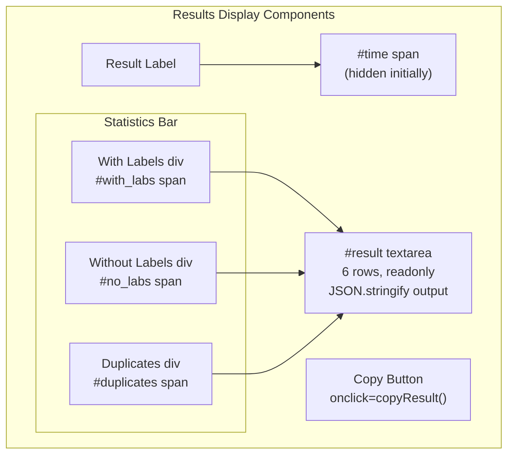
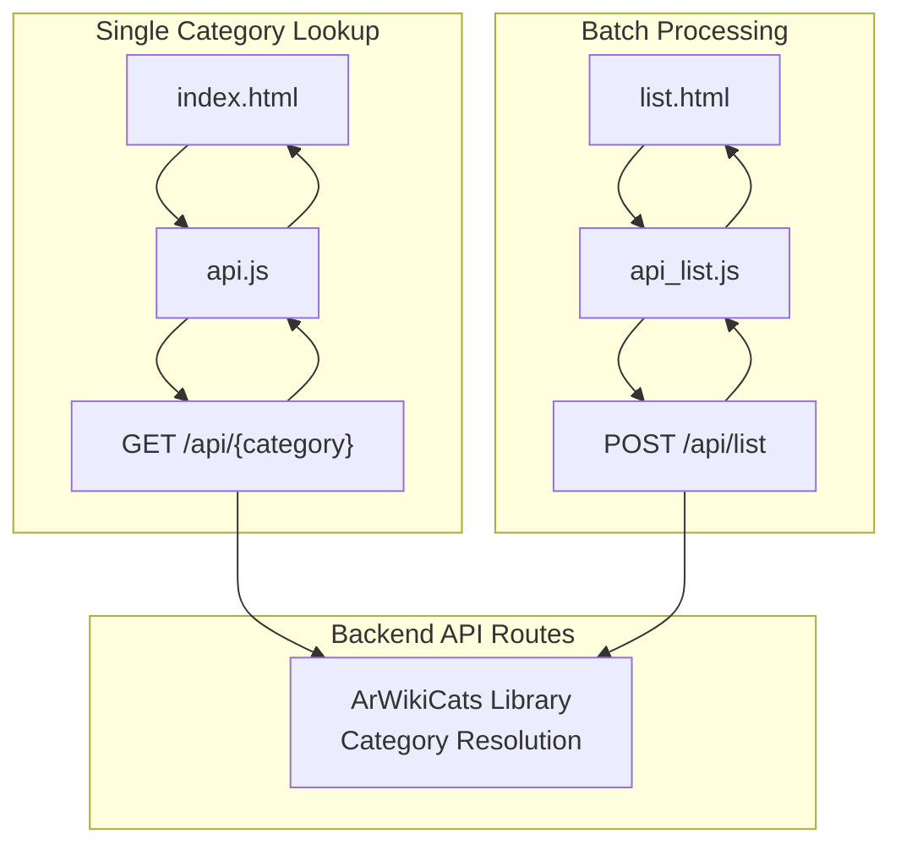

# Category Lookup Pages

> **Relevant source files**
> * [src/static/api.js](https://github.com/ArWikiCats/ArWikiCatsWeb/blob/88f42d13/src/static/api.js)
> * [src/static/api_list.js](https://github.com/ArWikiCats/ArWikiCatsWeb/blob/88f42d13/src/static/api_list.js)
> * [src/templates/index.html](https://github.com/ArWikiCats/ArWikiCatsWeb/blob/88f42d13/src/templates/index.html)
> * [src/templates/list.html](https://github.com/ArWikiCats/ArWikiCatsWeb/blob/88f42d13/src/templates/list.html)

## Purpose and Scope

This document describes the two primary category lookup interfaces in the web UI: the single category lookup page and the batch processing page. These pages allow users to resolve English category titles to their Arabic labels.

For information about the base template system and shared resources, see [Base Template System](/ArWikiCats/ArWikiCatsWeb/5.1-base-template-system). For details about client-side JavaScript architecture, see [Client-Side JavaScript](/ArWikiCats/ArWikiCatsWeb/5.5-client-side-javascript). For API endpoint documentation, see [Category Resolution Endpoints](/ArWikiCats/ArWikiCatsWeb/4.1-category-resolution-endpoints).

## Overview

ArWikiCatsWeb provides two distinct category lookup interfaces:

| Page | Template | JavaScript | Purpose | Input Method |
| --- | --- | --- | --- | --- |
| Single Lookup | `index.html` | `api.js` | Resolve one category at a time | Text input with autocomplete |
| Batch Processing | `list.html` | `api_list.js` | Resolve multiple categories in one request | Multi-line textarea |

Both pages extend `main.html` and follow the same visual design patterns, but differ in their interaction models and result presentation.

**Sources:** [src/templates/index.html L1-L88](https://github.com/ArWikiCats/ArWikiCatsWeb/blob/88f42d13/src/templates/index.html#L1-L88)

 [src/templates/list.html L1-L62](https://github.com/ArWikiCats/ArWikiCatsWeb/blob/88f42d13/src/templates/list.html#L1-L62)

## Single Category Lookup Page

### Page Structure

The single category lookup page is served at the root path (`/`) and rendered from `index.html`. It provides an interactive form for resolving individual category titles.



The page consists of two primary cards:

1. **Input Card** ([src/templates/index.html L7-L65](https://github.com/ArWikiCats/ArWikiCatsWeb/blob/88f42d13/src/templates/index.html#L7-L65) ): Contains the category input field, result display, and submit button
2. **Results Table Card** ([src/templates/index.html L66-L85](https://github.com/ArWikiCats/ArWikiCatsWeb/blob/88f42d13/src/templates/index.html#L66-L85) ): Displays a history of resolved categories using DataTables

**Sources:** [src/templates/index.html L1-L88](https://github.com/ArWikiCats/ArWikiCatsWeb/blob/88f42d13/src/templates/index.html#L1-L88)

### Form Components

#### Category Input Field

The category input field supports autocomplete functionality and includes a random category button:

[src/templates/index.html L17-L34](https://github.com/ArWikiCats/ArWikiCatsWeb/blob/88f42d13/src/templates/index.html#L17-L34)

| Element | ID | Attributes | Purpose |
| --- | --- | --- | --- |
| Input | `#category` | `type="text"`, `required`, `class="ltr_left"` | Accepts English category title |
| Button | Random button | `onclick="randomCategory()"` | Loads a random category from `random.js` |
| Spinner | `#autocomplete_loading` | `display: none` initially | Indicates autocomplete loading state |

The `ltr_left` class ensures left-to-right text direction for English input in the right-to-left Arabic interface.

#### Result Display

The result field is read-only and displays the resolved Arabic label:

[src/templates/index.html L39-L51](https://github.com/ArWikiCats/ArWikiCatsWeb/blob/88f42d13/src/templates/index.html#L39-L51)

| Element | ID | Function |
| --- | --- | --- |
| Input | `#result` | Displays Arabic label result |
| Span | `#time` | Shows request duration in seconds |
| Button | Copy button | `onclick="copyResult('result', event)"` copies result to clipboard |

#### Submit Button

The submit button implements a loading state toggle:

[src/templates/index.html L56-L64](https://github.com/ArWikiCats/ArWikiCatsWeb/blob/88f42d13/src/templates/index.html#L56-L64)

* `#notloading` span: Displays "Start" text when idle
* `#loading` div: Shows spinner and "Loading..." text during API request
* Button triggers AJAX request via `api.js` event handler

**Sources:** [src/templates/index.html L17-L64](https://github.com/ArWikiCats/ArWikiCatsWeb/blob/88f42d13/src/templates/index.html#L17-L64)

### Results Table

The page maintains a persistent results table using DataTables:

[src/templates/index.html L70-L80](https://github.com/ArWikiCats/ArWikiCatsWeb/blob/88f42d13/src/templates/index.html#L70-L80)



The DataTable is configured with [src/static/api.js L1-L5](https://github.com/ArWikiCats/ArWikiCatsWeb/blob/88f42d13/src/static/api.js#L1-L5)

:

* `paging: false` - No pagination
* `info: false` - No record count display
* `searching: false` - Search box disabled

Each successful lookup adds a new row with the English title and Arabic label [src/static/api.js L52](https://github.com/ArWikiCats/ArWikiCatsWeb/blob/88f42d13/src/static/api.js#L52-L52)

**Sources:** [src/templates/index.html L70-L80](https://github.com/ArWikiCats/ArWikiCatsWeb/blob/88f42d13/src/templates/index.html#L70-L80)

 [src/static/api.js L1-L5](https://github.com/ArWikiCats/ArWikiCatsWeb/blob/88f42d13/src/static/api.js#L1-L5)

 [src/static/api.js L52](https://github.com/ArWikiCats/ArWikiCatsWeb/blob/88f42d13/src/static/api.js#L52-L52)

### JavaScript Interaction Flow

The `api.js` module handles all client-side interaction:



**Key implementation details:**

1. **Input Validation** [src/static/api.js L17-L22](https://github.com/ArWikiCats/ArWikiCatsWeb/blob/88f42d13/src/static/api.js#L17-L22) : Trims whitespace and validates non-empty input
2. **URL Encoding** [src/static/api.js L29](https://github.com/ArWikiCats/ArWikiCatsWeb/blob/88f42d13/src/static/api.js#L29-L29) : Uses `encodeURIComponent()` for safe URL construction
3. **Timing Measurement** [src/static/api.js L34-L58](https://github.com/ArWikiCats/ArWikiCatsWeb/blob/88f42d13/src/static/api.js#L34-L58) : Calculates request duration in milliseconds
4. **Error Handling** [src/static/api.js L41-L64](https://github.com/ArWikiCats/ArWikiCatsWeb/blob/88f42d13/src/static/api.js#L41-L64) : Detects empty results and AJAX errors
5. **Table Update** [src/static/api.js L52](https://github.com/ArWikiCats/ArWikiCatsWeb/blob/88f42d13/src/static/api.js#L52-L52) : Adds row and redraws DataTable

**Sources:** [src/static/api.js L1-L72](https://github.com/ArWikiCats/ArWikiCatsWeb/blob/88f42d13/src/static/api.js#L1-L72)

## Batch Processing Page

### Page Structure

The batch processing page is served at `/list` and rendered from `list.html`. It processes multiple category titles in a single API request.



**Sources:** [src/templates/list.html L1-L62](https://github.com/ArWikiCats/ArWikiCatsWeb/blob/88f42d13/src/templates/list.html#L1-L62)

### Input Form

The input form uses a textarea for multi-line input:

[src/templates/list.html L16-L34](https://github.com/ArWikiCats/ArWikiCatsWeb/blob/88f42d13/src/templates/list.html#L16-L34)

| Element | ID | Configuration | Purpose |
| --- | --- | --- | --- |
| Form | `#categoriesForm` | `onsubmit="sendCategories(); return false;"` | Prevents default form submission |
| Textarea | `#titles` | `rows="6"`, `class="ltr_left"`, pre-filled with examples | Accepts newline-separated category titles |
| Submit Button | - | Shows #notloading or #loading states | Triggers `sendCategories()` function |

The examples variable [src/templates/list.html L6](https://github.com/ArWikiCats/ArWikiCatsWeb/blob/88f42d13/src/templates/list.html#L6-L6)

 provides default content:

```yaml
Category:Yemen
Category:Yemen in 2025
```

**Sources:** [src/templates/list.html L6-L34](https://github.com/ArWikiCats/ArWikiCatsWeb/blob/88f42d13/src/templates/list.html#L6-L34)

### Results Display

The results card displays comprehensive statistics and JSON output:

[src/templates/list.html L36-L58](https://github.com/ArWikiCats/ArWikiCatsWeb/blob/88f42d13/src/templates/list.html#L36-L58)



All statistics spans are initially hidden [src/static/api_list.js L13-L16](https://github.com/ArWikiCats/ArWikiCatsWeb/blob/88f42d13/src/static/api_list.js#L13-L16)

 and revealed after API response [src/static/api_list.js L45-L55](https://github.com/ArWikiCats/ArWikiCatsWeb/blob/88f42d13/src/static/api_list.js#L45-L55)

**Sources:** [src/templates/list.html L36-L58](https://github.com/ArWikiCats/ArWikiCatsWeb/blob/88f42d13/src/templates/list.html#L36-L58)

 [src/static/api_list.js L13-L55](https://github.com/ArWikiCats/ArWikiCatsWeb/blob/88f42d13/src/static/api_list.js#L13-L55)

### JavaScript Processing Flow

The `api_list.js` module implements asynchronous batch processing:

```mermaid
sequenceDiagram
  participant User
  participant Form Submit
  participant sendCategories()
  participant POST /api/list
  participant Statistics Spans

  User->>Form Submit: Click Submit
  Form Submit->>sendCategories(): Call sendCategories()
  sendCategories()->>sendCategories(): Get value and trim
  loop [Titles empty]
    sendCategories()-->>sendCategories(): Return early
    sendCategories()-->>sendCategories(): Show
    sendCategories()-->>Statistics Spans: Hide all statistics
    sendCategories()->>sendCategories(): Split by \
    note over sendCategories(),POST /api/list: Record timestart
    sendCategories()->>POST /api/list: and filter
    POST /api/list-->>sendCategories(): POST {titles: titles_list}
    note over sendCategories(),POST /api/list: Record timeend, calculate time
    sendCategories()->>Statistics Spans: JSON {results, with_labs, no_labs, duplicates}
    sendCategories()->>Statistics Spans: Show
    sendCategories()->>Statistics Spans: Show
    sendCategories()->>Statistics Spans: Show
    sendCategories()->>Statistics Spans: Show
    sendCategories()-->>sendCategories(): Set JSON.stringify(data.results, null, 2)
  end
```

**Implementation details:**

1. **Input Processing** [src/static/api_list.js L2-L19](https://github.com/ArWikiCats/ArWikiCatsWeb/blob/88f42d13/src/static/api_list.js#L2-L19) : Trims whitespace and splits by newline
2. **Empty Line Filtering** [src/static/api_list.js L19](https://github.com/ArWikiCats/ArWikiCatsWeb/blob/88f42d13/src/static/api_list.js#L19-L19) : Removes blank lines with `filter(t => t.trim() !== "")`
3. **Async/Await Pattern** [src/static/api_list.js L1-L28](https://github.com/ArWikiCats/ArWikiCatsWeb/blob/88f42d13/src/static/api_list.js#L1-L28) : Uses modern JavaScript async function
4. **Fetch API** [src/static/api_list.js L22-L28](https://github.com/ArWikiCats/ArWikiCatsWeb/blob/88f42d13/src/static/api_list.js#L22-L28) : POST request with JSON body
5. **Statistics Update** [src/static/api_list.js L38-L55](https://github.com/ArWikiCats/ArWikiCatsWeb/blob/88f42d13/src/static/api_list.js#L38-L55) : Updates four statistics displays
6. **JSON Formatting** [src/static/api_list.js L57](https://github.com/ArWikiCats/ArWikiCatsWeb/blob/88f42d13/src/static/api_list.js#L57-L57) : Pretty-prints results with 2-space indentation
7. **Error Handling** [src/static/api_list.js L59-L61](https://github.com/ArWikiCats/ArWikiCatsWeb/blob/88f42d13/src/static/api_list.js#L59-L61) : Catches and logs errors

**Sources:** [src/static/api_list.js L1-L67](https://github.com/ArWikiCats/ArWikiCatsWeb/blob/88f42d13/src/static/api_list.js#L1-L67)

## Page Interaction with API Layer

Both pages interact with the REST API through distinct patterns:



| Feature | Single Lookup | Batch Processing |
| --- | --- | --- |
| HTTP Method | GET | POST |
| Endpoint | `/api/{category}` | `/api/list` |
| Request Format | URL parameter | JSON body with `titles` array |
| Response Format | `{result: string}` | `{results: object, with_labs: int, no_labs: int, duplicates: int}` |
| JavaScript Library | jQuery ($.ajax) | Native Fetch API |
| Result Display | Single input field + table | Textarea with JSON + statistics |
| Timing Display | Updates #time span | Updates #time span |

**Sources:** [src/static/api.js L35-L69](https://github.com/ArWikiCats/ArWikiCatsWeb/blob/88f42d13/src/static/api.js#L35-L69)

 [src/static/api_list.js L22-L58](https://github.com/ArWikiCats/ArWikiCatsWeb/blob/88f42d13/src/static/api_list.js#L22-L58)

## User Experience Features

Both pages implement several UX enhancements:

### Loading States

Both pages implement consistent loading indicators:

[src/templates/index.html L58-L63](https://github.com/ArWikiCats/ArWikiCatsWeb/blob/88f42d13/src/templates/index.html#L58-L63)

 [src/templates/list.html L25-L31](https://github.com/ArWikiCats/ArWikiCatsWeb/blob/88f42d13/src/templates/list.html#L25-L31)

### Input Validation

The single lookup page implements client-side validation [src/static/api.js L17-L22](https://github.com/ArWikiCats/ArWikiCatsWeb/blob/88f42d13/src/static/api.js#L17-L22)

:

* Trims whitespace from input
* Checks for empty string
* Adds `alert-danger` class and placeholder text on validation failure
* Removes error styling on successful validation

### Performance Timing

Both pages measure and display request duration:

* Start time recorded before API call [src/static/api.js L34](https://github.com/ArWikiCats/ArWikiCatsWeb/blob/88f42d13/src/static/api.js#L34-L34)  [src/static/api_list.js L21](https://github.com/ArWikiCats/ArWikiCatsWeb/blob/88f42d13/src/static/api_list.js#L21-L21)
* End time recorded after response [src/static/api.js L56](https://github.com/ArWikiCats/ArWikiCatsWeb/blob/88f42d13/src/static/api.js#L56-L56)  [src/static/api_list.js L42](https://github.com/ArWikiCats/ArWikiCatsWeb/blob/88f42d13/src/static/api_list.js#L42-L42)
* Duration calculated as `(timeend - timestart) / 1000` in seconds
* Displayed with 2 decimal places using `.toFixed(2)` [src/static/api.js L58](https://github.com/ArWikiCats/ArWikiCatsWeb/blob/88f42d13/src/static/api.js#L58-L58)  [src/static/api_list.js L54](https://github.com/ArWikiCats/ArWikiCatsWeb/blob/88f42d13/src/static/api_list.js#L54-L54)

### Copy to Clipboard

Both pages provide copy buttons for results:

* Single lookup: Copies `#result` input value [src/templates/index.html L42-L45](https://github.com/ArWikiCats/ArWikiCatsWeb/blob/88f42d13/src/templates/index.html#L42-L45)
* Batch processing: Copies `#result` textarea content [src/templates/list.html L50-L52](https://github.com/ArWikiCats/ArWikiCatsWeb/blob/88f42d13/src/templates/list.html#L50-L52)

The `copyResult()` function is defined in the base template system (see [Base Template System](/ArWikiCats/ArWikiCatsWeb/5.1-base-template-system)).

**Sources:** [src/templates/index.html L17-L64](https://github.com/ArWikiCats/ArWikiCatsWeb/blob/88f42d13/src/templates/index.html#L17-L64)

 [src/templates/list.html L16-L58](https://github.com/ArWikiCats/ArWikiCatsWeb/blob/88f42d13/src/templates/list.html#L16-L58)

 [src/static/api.js L14-L70](https://github.com/ArWikiCats/ArWikiCatsWeb/blob/88f42d13/src/static/api.js#L14-L70)

 [src/static/api_list.js L1-L66](https://github.com/ArWikiCats/ArWikiCatsWeb/blob/88f42d13/src/static/api_list.js#L1-L66)

## Error Handling

### Single Lookup Error Handling

The `api.js` module handles three error scenarios:

1. **Empty Result** [src/static/api.js L46-L49](https://github.com/ArWikiCats/ArWikiCatsWeb/blob/88f42d13/src/static/api.js#L46-L49) : * Condition: `data.result == ""` * Action: Set placeholder "no result", add `alert-danger` class
2. **API Error Response** [src/static/api.js L41-L43](https://github.com/ArWikiCats/ArWikiCatsWeb/blob/88f42d13/src/static/api.js#L41-L43) : * Condition: `data.error` exists * Action: Log error to console
3. **AJAX Failure** [src/static/api.js L60-L64](https://github.com/ArWikiCats/ArWikiCatsWeb/blob/88f42d13/src/static/api.js#L60-L64) : * Condition: AJAX error callback * Action: Display "Cannot get data", add `alert-danger` class, log error

### Batch Processing Error Handling

The `api_list.js` module uses try-catch for error handling:

1. **API Error Response** [src/static/api_list.js L33-L36](https://github.com/ArWikiCats/ArWikiCatsWeb/blob/88f42d13/src/static/api_list.js#L33-L36) : * Condition: `data.error` exists * Action: Log error to console, return early
2. **Network/Parse Error** [src/static/api_list.js L59-L61](https://github.com/ArWikiCats/ArWikiCatsWeb/blob/88f42d13/src/static/api_list.js#L59-L61) : * Condition: Caught exception * Action: Display "An error occurred while connecting to the server", log error
3. **Finally Block** [src/static/api_list.js L63-L65](https://github.com/ArWikiCats/ArWikiCatsWeb/blob/88f42d13/src/static/api_list.js#L63-L65) : * Always hides loading state and shows idle state

**Sources:** [src/static/api.js L41-L64](https://github.com/ArWikiCats/ArWikiCatsWeb/blob/88f42d13/src/static/api.js#L41-L64)

 [src/static/api_list.js L33-L65](https://github.com/ArWikiCats/ArWikiCatsWeb/blob/88f42d13/src/static/api_list.js#L33-L65)
