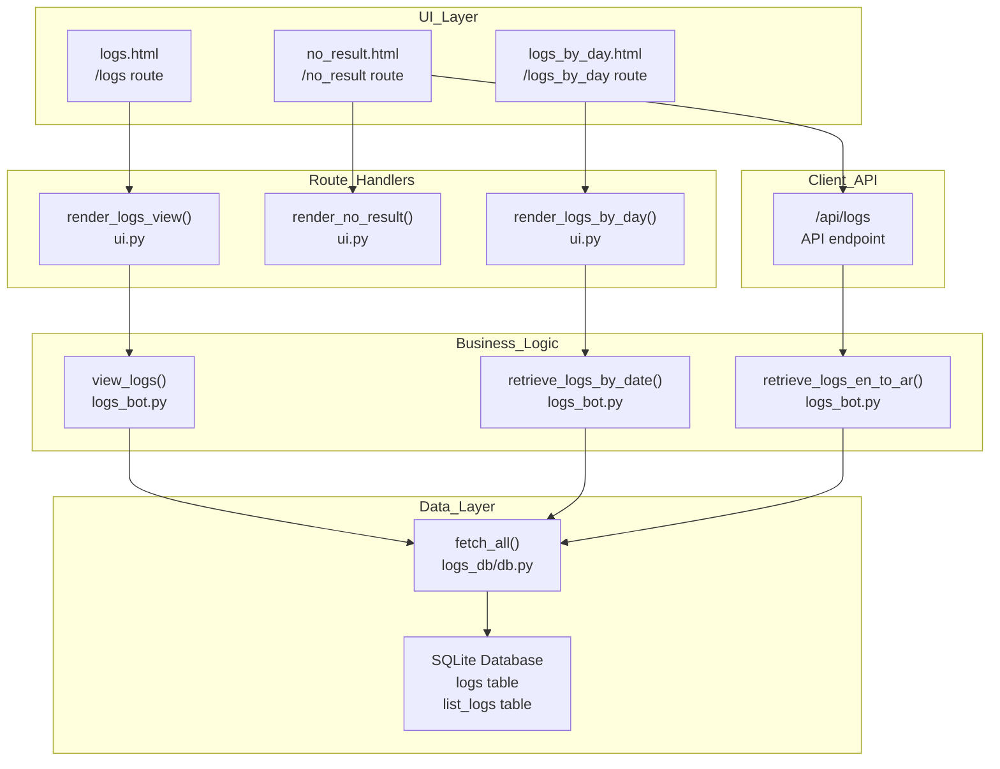
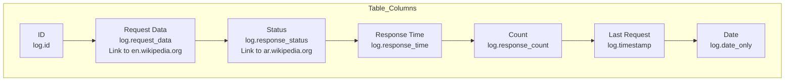
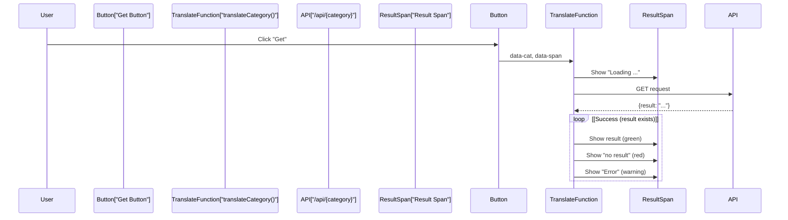
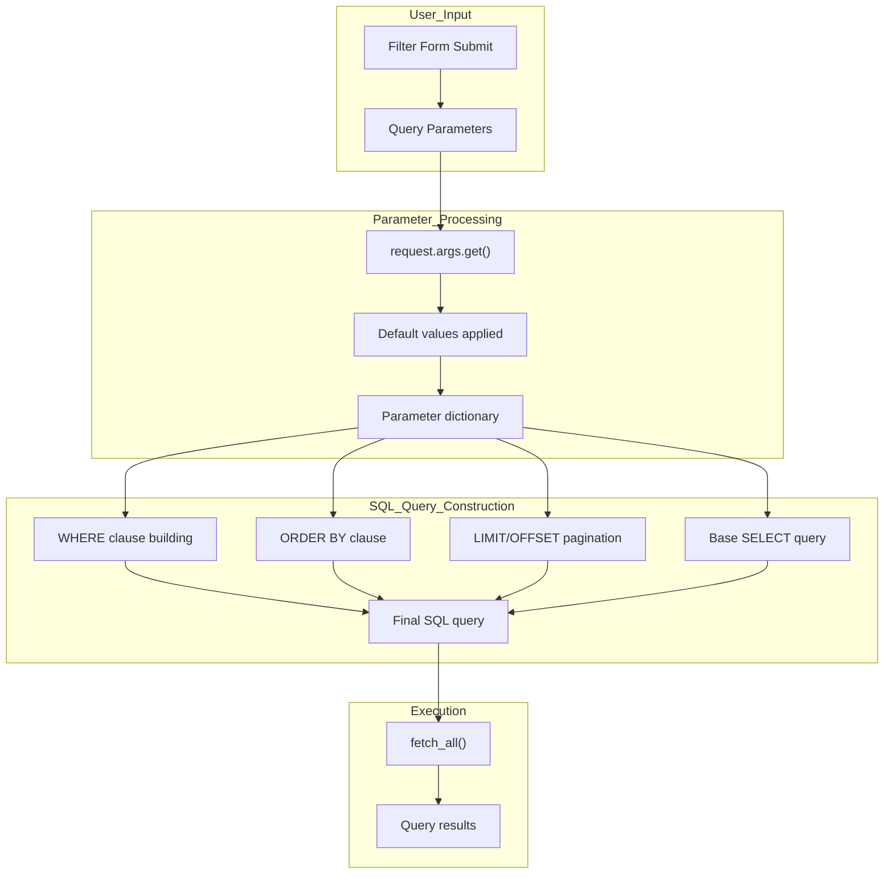

# Log Viewing Pages

> **Relevant source files**
> * [.gitignore](https://github.com/ArWikiCats/ArWikiCatsWeb/blob/88f42d13/.gitignore)
> * [src/static/style.css](https://github.com/ArWikiCats/ArWikiCatsWeb/blob/88f42d13/src/static/style.css)
> * [src/templates/logs.html](https://github.com/ArWikiCats/ArWikiCatsWeb/blob/88f42d13/src/templates/logs.html)
> * [src/templates/no_result.html](https://github.com/ArWikiCats/ArWikiCatsWeb/blob/88f42d13/src/templates/no_result.html)
> * [tests/test_db_operations.py](https://github.com/ArWikiCats/ArWikiCatsWeb/blob/88f42d13/tests/test_db_operations.py)
> * [tests/test_ui.py](https://github.com/ArWikiCats/ArWikiCatsWeb/blob/88f42d13/tests/test_ui.py)

This page documents the web-based log viewing interfaces that provide users with the ability to browse, filter, and analyze API request logs stored in the SQLite database. These pages offer different perspectives on the logged data: a general paginated view with flexible filtering, a specialized view for failed category resolutions, and a temporal aggregation view grouped by day.

For information about the chart visualizations built on log data, see [Chart and Visualization Pages](/ArWikiCats/ArWikiCatsWeb/5.4-chart-and-visualization-pages). For details on the template inheritance system used by these pages, see [Base Template System](/ArWikiCats/ArWikiCatsWeb/5.1-base-template-system). For backend log retrieval functions, see [Log Retrieval and Analysis](/ArWikiCats/ArWikiCatsWeb/6.3-log-retrieval-and-analysis).

## Overview

The ArWikiCatsWeb application provides three primary log viewing interfaces, each served by the UI Blueprint and rendered through Jinja2 templates:

| Page | Template | Route | Primary Function | Purpose |
| --- | --- | --- | --- | --- |
| Main Logs View | `logs.html` | `/logs` | `view_logs()` | General log browsing with filtering and pagination |
| No Result View | `no_result.html` | `/no_result` | N/A (client-side) | Interactive view of failed category resolutions |
| Logs by Day | `logs_by_day.html` | `/logs_by_day` | `retrieve_logs_by_date()` | Daily aggregated log statistics |

**Sources:** [src/templates/logs.html L1-L267](https://github.com/ArWikiCats/ArWikiCatsWeb/blob/88f42d13/src/templates/logs.html#L1-L267)

 [src/templates/no_result.html L1-L148](https://github.com/ArWikiCats/ArWikiCatsWeb/blob/88f42d13/src/templates/no_result.html#L1-L148)

 [tests/test_ui.py L28-L78](https://github.com/ArWikiCats/ArWikiCatsWeb/blob/88f42d13/tests/test_ui.py#L28-L78)

## Log Viewing Architecture

The following diagram illustrates how the log viewing pages integrate with the backend logging system:



**Sources:** [src/templates/logs.html L1-L267](https://github.com/ArWikiCats/ArWikiCatsWeb/blob/88f42d13/src/templates/logs.html#L1-L267)

 [src/templates/no_result.html L1-L148](https://github.com/ArWikiCats/ArWikiCatsWeb/blob/88f42d13/src/templates/no_result.html#L1-L148)

 [tests/test_ui.py L28-L78](https://github.com/ArWikiCats/ArWikiCatsWeb/blob/88f42d13/tests/test_ui.py#L28-L78)

## Main Logs Page

The main logs viewing page is rendered by `logs.html` and provides comprehensive filtering, sorting, and pagination capabilities for browsing API request logs.

### Page Structure

The logs page extends `main.html` and consists of three primary sections:

1. **Filter Form** - Query parameter controls
2. **Pagination Navigation** - Page selection controls
3. **Data Table** - Log entries display

**Sources:** [src/templates/logs.html L21-L266](https://github.com/ArWikiCats/ArWikiCatsWeb/blob/88f42d13/src/templates/logs.html#L21-L266)

### Filter Form Parameters

The filter form [src/templates/logs.html L32-L125](https://github.com/ArWikiCats/ArWikiCatsWeb/blob/88f42d13/src/templates/logs.html#L32-L125)

 accepts the following query parameters:

| Parameter | Type | Options | Description |
| --- | --- | --- | --- |
| `table_name` | string | `logs`, `list_logs` | Which database table to query |
| `per_page` | integer | 10, 20, 50, 100, 150, 200 | Number of records per page |
| `order_by` | string | varies by table | Column to sort by (e.g., `response_count`, `timestamp`) |
| `order` | string | `ASC`, `DESC` | Sort direction |
| `status` | string | dynamic | Filter by response status (e.g., `All`, `no_result`) |
| `like` | string | any | SQL LIKE pattern for request_data |
| `day` | string | date format | Filter by specific date (YYYY-MM-DD) |
| `db_path` | string | varies | Select alternate database file (if configured) |
| `page` | integer | 1-n | Current page number |

**Sources:** [src/templates/logs.html L6-L13](https://github.com/ArWikiCats/ArWikiCatsWeb/blob/88f42d13/src/templates/logs.html#L6-L13)

 [src/templates/logs.html L32-L125](https://github.com/ArWikiCats/ArWikiCatsWeb/blob/88f42d13/src/templates/logs.html#L32-L125)

### Data Display Table

The logs table [src/templates/logs.html L184-L220](https://github.com/ArWikiCats/ArWikiCatsWeb/blob/88f42d13/src/templates/logs.html#L184-L220)

 displays the following columns:



Each `request_data` value links to the English Wikipedia article [src/templates/logs.html L203-L206](https://github.com/ArWikiCats/ArWikiCatsWeb/blob/88f42d13/src/templates/logs.html#L203-L206)

 and each `response_status` links to the Arabic Wikipedia article [src/templates/logs.html L208-L211](https://github.com/ArWikiCats/ArWikiCatsWeb/blob/88f42d13/src/templates/logs.html#L208-L211)

 enabling quick verification of the logged translations.

**Sources:** [src/templates/logs.html L184-L220](https://github.com/ArWikiCats/ArWikiCatsWeb/blob/88f42d13/src/templates/logs.html#L184-L220)

### Pagination System

The pagination controls [src/templates/logs.html L129-L173](https://github.com/ArWikiCats/ArWikiCatsWeb/blob/88f42d13/src/templates/logs.html#L129-L173)

 provide navigation through log pages:

* **First Page** (`<<`) - Jump to page 1
* **Previous** (`<`) - Previous page
* **Page Numbers** - Direct page selection (visible range: `start_page` to `end_page`)
* **Next** (`>`) - Next page
* **Last Page** (`>>`) - Jump to final page

Pagination state is maintained through the `common_args` template variable [src/templates/logs.html L6-L13](https://github.com/ArWikiCats/ArWikiCatsWeb/blob/88f42d13/src/templates/logs.html#L6-L13)

 which preserves all filter parameters across page navigation.

Page information is displayed below the pagination controls [src/templates/logs.html L177-L180](https://github.com/ArWikiCats/ArWikiCatsWeb/blob/88f42d13/src/templates/logs.html#L177-L180)

:

```text
Page {current} of {total} ({start_log} - {end_log} out of {total_logs} records)
```

**Sources:** [src/templates/logs.html L129-L180](https://github.com/ArWikiCats/ArWikiCatsWeb/blob/88f42d13/src/templates/logs.html#L129-L180)

### Backend Integration

The `render_logs_view()` route handler calls `view_logs()` from the `logs_bot` module, which returns a dictionary containing:

```css
{
    "logs": [],  # List of log dictionaries
    "tab": {
        "sum_all": str,      # Total request count
        "total_pages": int,  # Total number of pages
        "total_logs": str,   # Total log entries
        "start_log": int,    # First log index on page
        "end_log": int,      # Last log index on page
        "start_page": int,   # First page in pagination range
        "end_page": int,     # Last page in pagination range
        "order": str,        # ASC or DESC
        "order_by": str,     # Column name
        "per_page": int,     # Records per page
        "page": int,         # Current page
        "status": str,       # Status filter value
        "like": str,         # LIKE pattern
        "day": str,          # Day filter
        "db_path": str,      # Database path
        "table_name": str    # Table name
    },
    "order_by_types": [],  # Available sort columns
    "status_table": [],    # Available status values
    "dbs": []              # Available database files
}
```

**Sources:** [tests/test_ui.py L31-L54](https://github.com/ArWikiCats/ArWikiCatsWeb/blob/88f42d13/tests/test_ui.py#L31-L54)

## No Result Page

The no result page (`no_result.html`) provides a specialized, interactive interface for viewing and re-processing category lookups that previously returned no results. This page is particularly useful for identifying categories that may need manual intervention or that might benefit from retrying the resolution.

### Page Features

The page [src/templates/no_result.html L1-L148](https://github.com/ArWikiCats/ArWikiCatsWeb/blob/88f42d13/src/templates/no_result.html#L1-L148)

 displays:

1. **Dynamic Data Table** - Uses DataTables library to load data from the API endpoint
2. **Interactive Translation** - "Get" buttons for individual category re-translation
3. **Batch Processing** - "Start All" button to process all categories sequentially
4. **Result Display** - Real-time display of translation results

**Sources:** [src/templates/no_result.html L1-L148](https://github.com/ArWikiCats/ArWikiCatsWeb/blob/88f42d13/src/templates/no_result.html#L1-L148)

### Data Fetching

The page fetches data client-side via AJAX [src/templates/no_result.html L64-L72](https://github.com/ArWikiCats/ArWikiCatsWeb/blob/88f42d13/src/templates/no_result.html#L64-L72)

:

```yaml
Endpoint: /api/logs
Parameters:
  - table_name: logs
  - per_page: 200
  - order_by: response_count
  - order: DESC
  - status: no_result
```

This retrieves the top 200 most-requested categories that resulted in `no_result`, sorted by request count in descending order.

**Sources:** [src/templates/no_result.html L64](https://github.com/ArWikiCats/ArWikiCatsWeb/blob/88f42d13/src/templates/no_result.html#L64-L64)

### Table Structure

The DataTable configuration [src/templates/no_result.html L66-L119](https://github.com/ArWikiCats/ArWikiCatsWeb/blob/88f42d13/src/templates/no_result.html#L66-L119)

 defines five columns:

| Column | Data Source | Rendering |
| --- | --- | --- |
| # | Row index | Auto-numbered (1, 2, 3...) |
| Title | `request_data` | Link to en.wikipedia.org |
| Count | `response_count` | Formatted number with locale separators |
| Get | `request_data` | Button triggering translation API call |
| Ar | Generated | Span element for displaying translation result |

**Sources:** [src/templates/no_result.html L77-L117](https://github.com/ArWikiCats/ArWikiCatsWeb/blob/88f42d13/src/templates/no_result.html#L77-L117)

### Interactive Translation Workflow

The translation workflow is implemented through JavaScript functions [src/templates/no_result.html L44-L62](https://github.com/ArWikiCats/ArWikiCatsWeb/blob/88f42d13/src/templates/no_result.html#L44-L62)

:



**Sources:** [src/templates/no_result.html L44-L62](https://github.com/ArWikiCats/ArWikiCatsWeb/blob/88f42d13/src/templates/no_result.html#L44-L62)

### Batch Processing

The "Start All" button [src/templates/no_result.html L129-L143](https://github.com/ArWikiCats/ArWikiCatsWeb/blob/88f42d13/src/templates/no_result.html#L129-L143)

 processes all categories sequentially:

1. Disables button and shows "⏳ Loading..."
2. Iterates through all `[data-cat]` buttons
3. Calls `translateCategory()` for each
4. Waits 100ms between requests (rate limiting)
5. Re-enables button when complete

**Sources:** [src/templates/no_result.html L129-L143](https://github.com/ArWikiCats/ArWikiCatsWeb/blob/88f42d13/src/templates/no_result.html#L129-L143)

## Logs by Day Page

The logs by day page provides temporal aggregation of log data, grouping requests by date and response status. This enables analysis of usage patterns and identification of trends over time.

### Data Structure

The `retrieve_logs_by_date()` function returns aggregated data [tests/test_ui.py L69-L74](https://github.com/ArWikiCats/ArWikiCatsWeb/blob/88f42d13/tests/test_ui.py#L69-L74)

:

```css
{
    "logs": [],  # Aggregated log entries grouped by date and status
    "tab": {
        "sum_all": str,      # Total request count
        "db_path": str,      # Database path
        "table_name": str    # Table name
    },
    "status_table": [],  # List of unique status values
    "dbs": []            # Available database files
}
```

The aggregated logs include statistics such as:

* Date
* Response status
* Total count of requests
* Percentage of total

**Sources:** [tests/test_ui.py L66-L78](https://github.com/ArWikiCats/ArWikiCatsWeb/blob/88f42d13/tests/test_ui.py#L66-L78)

### Use Cases

The logs by day page supports:

1. **Trend Analysis** - Identifying usage patterns over time
2. **Status Distribution** - Understanding the proportion of successful vs. failed lookups per day
3. **Historical Comparison** - Comparing activity across different time periods
4. **Anomaly Detection** - Spotting unusual spikes or drops in activity

**Sources:** [tests/test_ui.py L66-L78](https://github.com/ArWikiCats/ArWikiCatsWeb/blob/88f42d13/tests/test_ui.py#L66-L78)

## Filtering and Query Parameters

All log viewing pages support filtering through query parameters. The following diagram shows how query parameters flow through the system:



### Common Filter Patterns

**Status Filtering:**

* `status=All` - No filtering (all statuses)
* `status=no_result` - Only failed resolutions
* `status={specific_value}` - Specific Arabic category name or other status

**Text Search (LIKE):**

* `like=%Movie%` - Categories containing "Movie"
* `like=Category:2024_%` - Categories starting with "Category:2024_"

**Date Filtering:**

* `day=2025-01-27` - Specific day
* `day=2025-01` - Entire month (uses SQL LIKE)

**Table Selection:**

* `table_name=logs` - Main API logs
* `table_name=list_logs` - Batch endpoint logs

**Sources:** [src/templates/logs.html L32-L125](https://github.com/ArWikiCats/ArWikiCatsWeb/blob/88f42d13/src/templates/logs.html#L32-L125)

 [tests/test_ui.py L144-L189](https://github.com/ArWikiCats/ArWikiCatsWeb/blob/88f42d13/tests/test_ui.py#L144-L189)

## Database Selection

When multiple database files are available, the logs pages provide a database selector dropdown [src/templates/logs.html L106-L118](https://github.com/ArWikiCats/ArWikiCatsWeb/blob/88f42d13/src/templates/logs.html#L106-L118)

:

```sql
<select name="db_path" id="db_path">
    
    <option value="{{ db }}" selected>
        {{ db }}
    </option>
    
</select>
```

This enables viewing logs from different database instances, useful for:

* Comparing production vs. staging logs
* Analyzing historical archived databases
* Debugging with test databases

**Sources:** [src/templates/logs.html L106-L118](https://github.com/ArWikiCats/ArWikiCatsWeb/blob/88f42d13/src/templates/logs.html#L106-L118)

## Styling and CSS Classes

The log viewing pages utilize several CSS classes for consistent presentation:

| Class | Purpose | File Reference |
| --- | --- | --- |
| `.ltr_left` | Left-align English text (LTR) | [src/static/style.css L64-L67](https://github.com/ArWikiCats/ArWikiCatsWeb/blob/88f42d13/src/static/style.css#L64-L67) |
| `.ltr_right` | Right-align Arabic text (RTL) | [src/static/style.css L69-L72](https://github.com/ArWikiCats/ArWikiCatsWeb/blob/88f42d13/src/static/style.css#L69-L72) |
| `.table-striped` | Zebra striping for table rows | Bootstrap 5 |
| `.table-hover` | Hover effect on table rows | Bootstrap 5 |
| `.table-bordered` | Table borders | Bootstrap 5 |

The `.ltr_left` class is applied to the Request Data column [src/templates/logs.html L202](https://github.com/ArWikiCats/ArWikiCatsWeb/blob/88f42d13/src/templates/logs.html#L202-L202)

 to ensure English category names are properly left-aligned, while `.ltr_right` is applied to the Status column [src/templates/logs.html L207](https://github.com/ArWikiCats/ArWikiCatsWeb/blob/88f42d13/src/templates/logs.html#L207-L207)

 for Arabic category names.

**Sources:** [src/templates/logs.html L202-L211](https://github.com/ArWikiCats/ArWikiCatsWeb/blob/88f42d13/src/templates/logs.html#L202-L211)

 [src/static/style.css L64-L72](https://github.com/ArWikiCats/ArWikiCatsWeb/blob/88f42d13/src/static/style.css#L64-L72)

## Testing

The log viewing pages are tested in `test_ui.py` with the following test cases:

| Test | Validates | Route |
| --- | --- | --- |
| `test_logs_page` | Successful rendering with mocked data | `/logs` |
| `test_no_result_page` | No result page renders | `/no_result` |
| `test_logs_by_day_page` | Logs by day renders with mocked data | `/logs_by_day` |
| `test_logs_page_with_pagination` | Pagination parameters work | `/logs?page=2&per_page=10` |
| `test_logs_page_with_status_filter` | Status filtering works | `/logs?status=no_result` |
| `test_logs_by_day_with_table_name` | Table selection works | `/logs_by_day?table_name=list_logs` |

All tests use mocking to isolate the UI layer from the database layer, ensuring fast, reliable test execution.

**Sources:** [tests/test_ui.py L28-L189](https://github.com/ArWikiCats/ArWikiCatsWeb/blob/88f42d13/tests/test_ui.py#L28-L189)