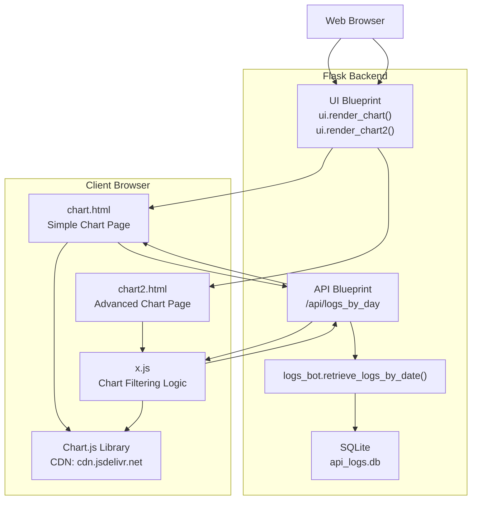
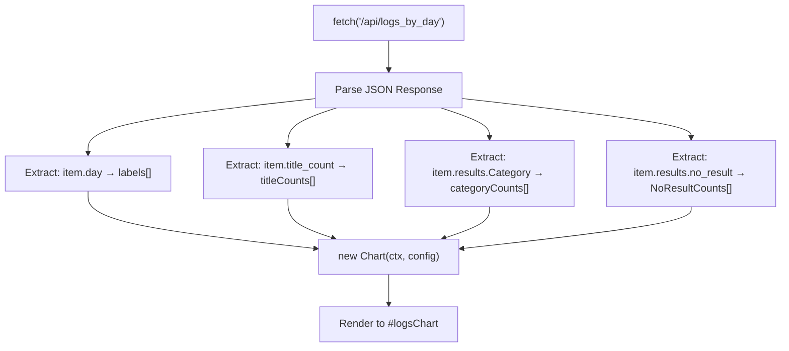
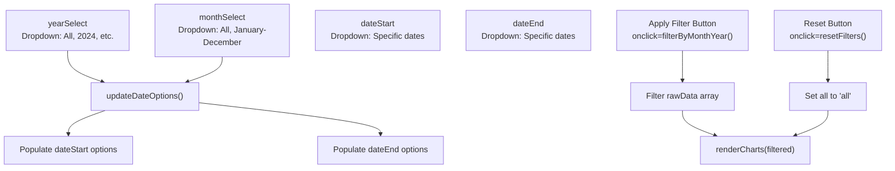
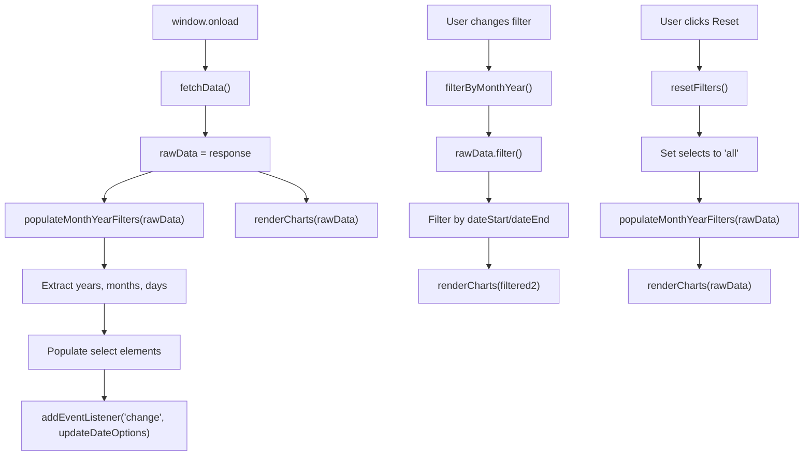
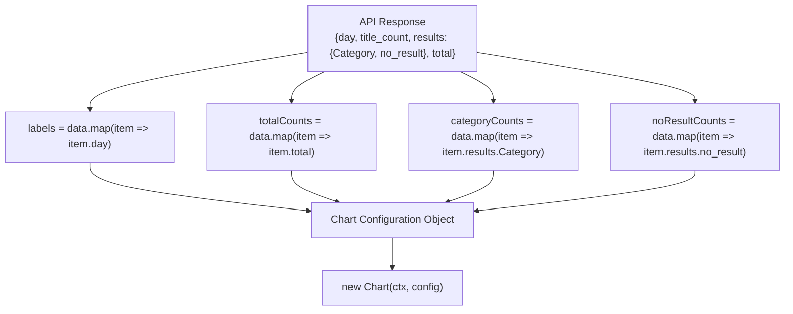

# Chart and Visualization Pages

> **Relevant source files**
> * [src/static/x.js](https://github.com/ArWikiCats/ArWikiCatsWeb/blob/88f42d13/src/static/x.js)
> * [src/templates/chart.html](https://github.com/ArWikiCats/ArWikiCatsWeb/blob/88f42d13/src/templates/chart.html)
> * [src/templates/chart2.html](https://github.com/ArWikiCats/ArWikiCatsWeb/blob/88f42d13/src/templates/chart2.html)
> * [src/templates/logs_by_day.html](https://github.com/ArWikiCats/ArWikiCatsWeb/blob/88f42d13/src/templates/logs_by_day.html)
> * [src/templates/main.html](https://github.com/ArWikiCats/ArWikiCatsWeb/blob/88f42d13/src/templates/main.html)

## Purpose and Scope

This page documents the chart and visualization interfaces in ArWikiCatsWeb. These pages provide graphical representations of API usage logs aggregated by date, enabling users to analyze trends in category resolution requests, success rates, and no-result cases over time.

The system provides two chart pages:

* **Chart** - A simple bar chart displaying daily aggregated metrics
* **Chart2** - An advanced chart with filtering capabilities by year, month, and date range

For information about the log viewing pages that display raw log data in table format, see [Log Viewing Pages](/ArWikiCats/ArWikiCatsWeb/5.3-log-viewing-pages). For details about the API endpoints that supply data to these charts, see [Log Retrieval Endpoints](/ArWikiCats/ArWikiCatsWeb/4.2-log-retrieval-endpoints).

## Chart Page Overview

Both chart pages fetch aggregated log data from the `/api/logs_by_day` endpoint and render visualizations using Chart.js. They are accessible via the navigation bar in the base template.

| Page | Route | Template | Description |
| --- | --- | --- | --- |
| Chart | `/chart` | `chart.html` | Simple bar chart with three metrics |
| Chart2 | `/chart2` | `chart2.html` | Advanced line/bar chart with date filtering |

Sources: [src/templates/main.html L74-L82](https://github.com/ArWikiCats/ArWikiCatsWeb/blob/88f42d13/src/templates/main.html#L74-L82)

## Architecture and Data Flow



Sources: [src/templates/chart.html L17-L74](https://github.com/ArWikiCats/ArWikiCatsWeb/blob/88f42d13/src/templates/chart.html#L17-L74)

 [src/templates/chart2.html L49-L56](https://github.com/ArWikiCats/ArWikiCatsWeb/blob/88f42d13/src/templates/chart2.html#L49-L56)

 [src/static/x.js L14-L22](https://github.com/ArWikiCats/ArWikiCatsWeb/blob/88f42d13/src/static/x.js#L14-L22)

## Simple Chart Page (chart.html)

The simple chart page provides a straightforward bar chart visualization of daily log data without filtering capabilities.

### Template Structure

The chart page extends `main.html` and defines a single canvas element for rendering the chart. Chart.js is loaded from CDN and the chart is rendered inline using a `<script>` tag.

**Key Elements:**

* Canvas element: `<canvas id="logsChart">` at [src/templates/chart.html L15](https://github.com/ArWikiCats/ArWikiCatsWeb/blob/88f42d13/src/templates/chart.html#L15-L15)
* Chart.js CDN import at [src/templates/chart.html L7](https://github.com/ArWikiCats/ArWikiCatsWeb/blob/88f42d13/src/templates/chart.html#L7-L7)
* Inline fetch and render logic at [src/templates/chart.html L17-L74](https://github.com/ArWikiCats/ArWikiCatsWeb/blob/88f42d13/src/templates/chart.html#L17-L74)

### Data Visualization

The chart displays three datasets as grouped bars:

| Dataset | Source Field | Color | Description |
| --- | --- | --- | --- |
| Title Count | `item.title_count` | Blue (rgba(54, 162, 235)) | Number of unique category lookups per day |
| Category | `item.results.Category` | Red (rgba(255, 99, 132)) | Successful category resolutions |
| No Result | `item.results.no_result` | Yellow (rgba(255, 206, 86)) | Failed resolutions with no result |

### Chart Configuration



The chart is configured as a bar chart with:

* Type: `'bar'` at [src/templates/chart.html L28](https://github.com/ArWikiCats/ArWikiCatsWeb/blob/88f42d13/src/templates/chart.html#L28-L28)
* Responsive: `true` at [src/templates/chart.html L56](https://github.com/ArWikiCats/ArWikiCatsWeb/blob/88f42d13/src/templates/chart.html#L56-L56)
* Y-axis starting at zero at [src/templates/chart.html L59](https://github.com/ArWikiCats/ArWikiCatsWeb/blob/88f42d13/src/templates/chart.html#L59-L59)
* Labeled axes at [src/templates/chart.html L60-L69](https://github.com/ArWikiCats/ArWikiCatsWeb/blob/88f42d13/src/templates/chart.html#L60-L69)

Sources: [src/templates/chart.html L1-L80](https://github.com/ArWikiCats/ArWikiCatsWeb/blob/88f42d13/src/templates/chart.html#L1-L80)

## Advanced Chart Page (chart2.html)

The advanced chart page provides a line chart with comprehensive filtering capabilities, allowing users to filter data by year, month, and specific date ranges.

### Template Structure

Unlike the simple chart, `chart2.html` uses the `content2` block to span the full container width and loads filtering logic from an external JavaScript file.

**Key Elements:**

* Year filter: `<select id="yearSelect">` at [src/templates/chart2.html L24](https://github.com/ArWikiCats/ArWikiCatsWeb/blob/88f42d13/src/templates/chart2.html#L24-L24)
* Month filter: `<select id="monthSelect">` at [src/templates/chart2.html L28](https://github.com/ArWikiCats/ArWikiCatsWeb/blob/88f42d13/src/templates/chart2.html#L28-L28)
* Date range filters: `dateStart` and `dateEnd` at [src/templates/chart2.html L32-L36](https://github.com/ArWikiCats/ArWikiCatsWeb/blob/88f42d13/src/templates/chart2.html#L32-L36)
* External script: `x.js` loaded at [src/templates/chart2.html L50](https://github.com/ArWikiCats/ArWikiCatsWeb/blob/88f42d13/src/templates/chart2.html#L50-L50)
* Canvas: `<canvas id="totalLineChart">` at [src/templates/chart2.html L45](https://github.com/ArWikiCats/ArWikiCatsWeb/blob/88f42d13/src/templates/chart2.html#L45-L45)

### Filter Controls

The page provides four filter controls that work together:



Sources: [src/templates/chart2.html L20-L42](https://github.com/ArWikiCats/ArWikiCatsWeb/blob/88f42d13/src/templates/chart2.html#L20-L42)

 [src/static/x.js L4-L12](https://github.com/ArWikiCats/ArWikiCatsWeb/blob/88f42d13/src/static/x.js#L4-L12)

 [src/static/x.js L120-L152](https://github.com/ArWikiCats/ArWikiCatsWeb/blob/88f42d13/src/static/x.js#L120-L152)

## Client-Side Chart Logic (x.js)

The `x.js` file contains all client-side logic for data fetching, filtering, and chart rendering for the advanced chart page.

### Core Functions

| Function | Purpose | Key Operations |
| --- | --- | --- |
| `fetchData()` | Fetch and initialize | Calls `/api/logs_by_day`, stores in `rawData`, populates filters, renders initial charts |
| `populateMonthYearFilters(data)` | Build filter dropdowns | Extracts unique years/months/days, populates select elements, sets up event listeners |
| `filterByMonthYear()` | Apply filters | Filters `rawData` by selected year/month/date range, re-renders charts |
| `resetFilters()` | Clear filters | Sets all selects to 'all', re-renders with full dataset |
| `renderCharts(data)` | Create charts | Destroys existing charts, creates new Chart.js instances with filtered data |

### Data Flow in x.js



Sources: [src/static/x.js L14-L22](https://github.com/ArWikiCats/ArWikiCatsWeb/blob/88f42d13/src/static/x.js#L14-L22)

 [src/static/x.js L24-L118](https://github.com/ArWikiCats/ArWikiCatsWeb/blob/88f42d13/src/static/x.js#L24-L118)

 [src/static/x.js L120-L152](https://github.com/ArWikiCats/ArWikiCatsWeb/blob/88f42d13/src/static/x.js#L120-L152)

 [src/static/x.js L157-L219](https://github.com/ArWikiCats/ArWikiCatsWeb/blob/88f42d13/src/static/x.js#L157-L219)

### Filter Logic Implementation

The filtering system uses a two-stage approach:

**Stage 1: Month/Year Filtering** at [src/static/x.js L126-L132](https://github.com/ArWikiCats/ArWikiCatsWeb/blob/88f42d13/src/static/x.js#L126-L132)

```
Filter by:
- selectedYear === 'all' OR year matches
- selectedMonth === 'all' OR month matches
```

**Stage 2: Date Range Filtering** at [src/static/x.js L134-L149](https://github.com/ArWikiCats/ArWikiCatsWeb/blob/88f42d13/src/static/x.js#L134-L149)

```
If dates specified:
- Start only: item.day >= selectedStartDate
- End only: item.day <= selectedEndDate  
- Both: item.day between start and end
```

The `updateDateOptions()` function at [src/static/x.js L76-L116](https://github.com/ArWikiCats/ArWikiCatsWeb/blob/88f42d13/src/static/x.js#L76-L116)

 dynamically populates date dropdowns based on the selected month and year, automatically selecting the first and last available dates as defaults.

Sources: [src/static/x.js L120-L152](https://github.com/ArWikiCats/ArWikiCatsWeb/blob/88f42d13/src/static/x.js#L120-L152)

 [src/static/x.js L76-L116](https://github.com/ArWikiCats/ArWikiCatsWeb/blob/88f42d13/src/static/x.js#L76-L116)

## Chart Rendering Details

### Chart Instance Management

Both chart implementations use global variables to track chart instances and destroy them before re-rendering to prevent memory leaks:

* Simple chart: Uses local scope, rendered once at [src/templates/chart.html L27](https://github.com/ArWikiCats/ArWikiCatsWeb/blob/88f42d13/src/templates/chart.html#L27-L27)
* Advanced chart: Global variables `totalChart` and `resultsChart` at [src/static/x.js L155](https://github.com/ArWikiCats/ArWikiCatsWeb/blob/88f42d13/src/static/x.js#L155-L155)
* Destruction before re-render at [src/static/x.js L169-L170](https://github.com/ArWikiCats/ArWikiCatsWeb/blob/88f42d13/src/static/x.js#L169-L170)

### Chart Types and Configuration

**Simple Chart (chart.html):**

* Type: `bar` chart
* Datasets: 3 (Title Count, Category, No Result)
* Configuration at [src/templates/chart.html L27-L73](https://github.com/ArWikiCats/ArWikiCatsWeb/blob/88f42d13/src/templates/chart.html#L27-L73)

**Advanced Chart (chart2.html):**

* Type: `line` chart with mixed `line` and `bar` datasets
* Primary dataset: Total count as filled line chart
* Secondary datasets: Category and No Result counts
* Configuration at [src/static/x.js L173-L219](https://github.com/ArWikiCats/ArWikiCatsWeb/blob/88f42d13/src/static/x.js#L173-L219)

### Data Transformation



The transformation happens at:

* Simple chart: [src/templates/chart.html L21-L24](https://github.com/ArWikiCats/ArWikiCatsWeb/blob/88f42d13/src/templates/chart.html#L21-L24)
* Advanced chart: [src/static/x.js L158-L167](https://github.com/ArWikiCats/ArWikiCatsWeb/blob/88f42d13/src/static/x.js#L158-L167)

Sources: [src/templates/chart.html L27-L73](https://github.com/ArWikiCats/ArWikiCatsWeb/blob/88f42d13/src/templates/chart.html#L27-L73)

 [src/static/x.js L157-L219](https://github.com/ArWikiCats/ArWikiCatsWeb/blob/88f42d13/src/static/x.js#L157-L219)

## Navigation Integration

Both chart pages are accessible from the main navigation bar defined in `main.html`:

* Chart link: [src/templates/main.html L73-L77](https://github.com/ArWikiCats/ArWikiCatsWeb/blob/88f42d13/src/templates/main.html#L73-L77)
* Chart2 link: [src/templates/main.html L78-L83](https://github.com/ArWikiCats/ArWikiCatsWeb/blob/88f42d13/src/templates/main.html#L78-L83)

The navigation uses Flask's `url_for()` function to generate routes:

* `url_for('ui.render_chart')` for the simple chart
* `url_for('ui.render_chart2')` for the advanced chart

Sources: [src/templates/main.html L73-L83](https://github.com/ArWikiCats/ArWikiCatsWeb/blob/88f42d13/src/templates/main.html#L73-L83)

## Summary of Chart Components

| Component | File | Key Functions/Elements | Purpose |
| --- | --- | --- | --- |
| Simple Chart Template | `chart.html` | `<canvas id="logsChart">`, inline fetch | Display basic bar chart |
| Advanced Chart Template | `chart2.html` | `<canvas id="totalLineChart">`, filter controls | Display filterable line chart |
| Chart Logic | `x.js` | `fetchData()`, `filterByMonthYear()`, `renderCharts()` | Handle data processing and rendering |
| Base Template | `main.html` | Chart.js CDN, navigation links | Provide framework and navigation |
| Data Source | API endpoint `/api/logs_by_day` | Returns aggregated log data | Supply chart data |

Sources: [src/templates/chart.html](https://github.com/ArWikiCats/ArWikiCatsWeb/blob/88f42d13/src/templates/chart.html)

 [src/templates/chart2.html](https://github.com/ArWikiCats/ArWikiCatsWeb/blob/88f42d13/src/templates/chart2.html)

 [src/static/x.js](https://github.com/ArWikiCats/ArWikiCatsWeb/blob/88f42d13/src/static/x.js)

 [src/templates/main.html L7-L9](https://github.com/ArWikiCats/ArWikiCatsWeb/blob/88f42d13/src/templates/main.html#L7-L9)