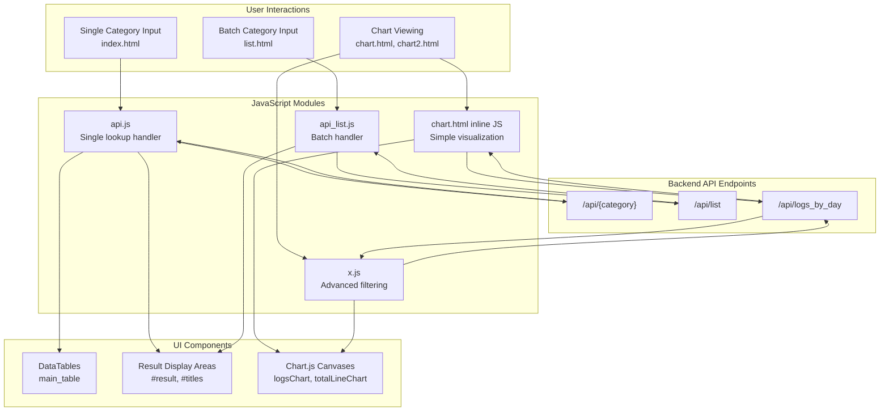
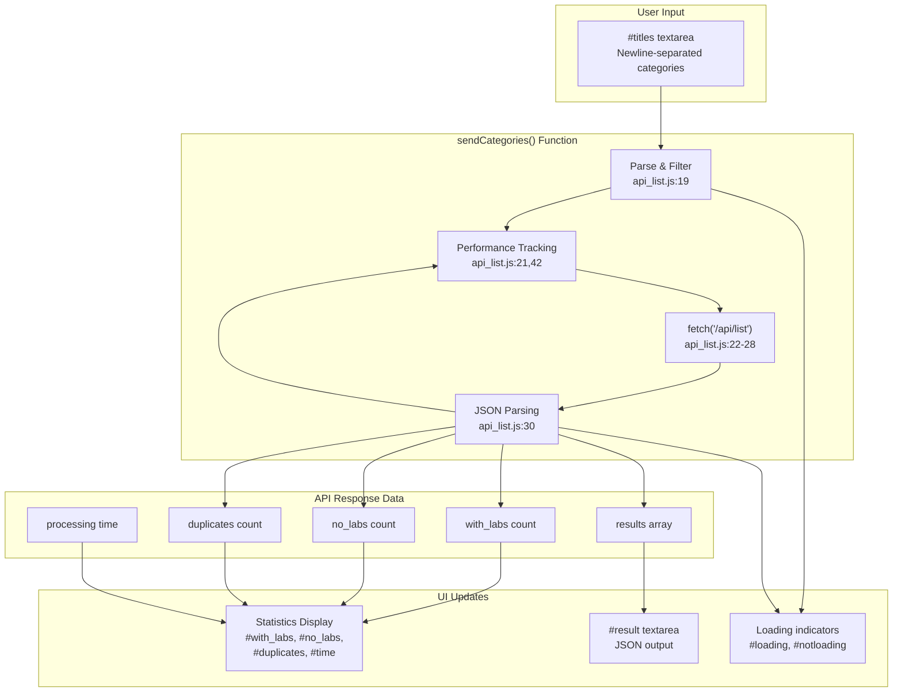
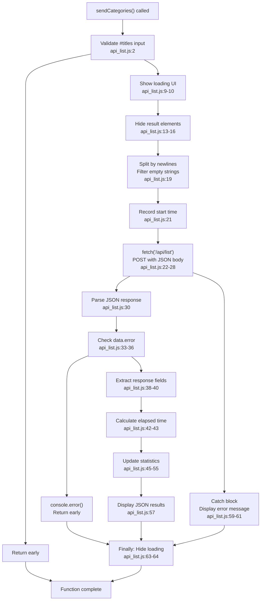
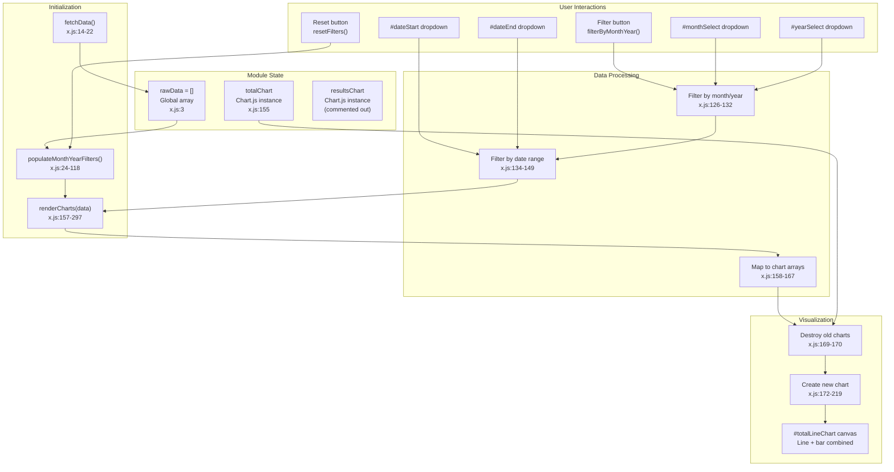
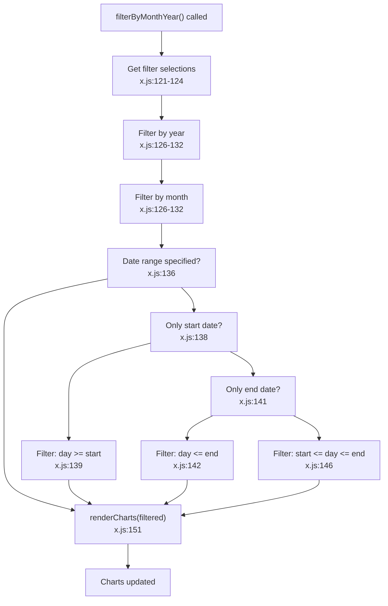

# Client-Side JavaScript

> **Relevant source files**
> * [src/static/api.js](https://github.com/ArWikiCats/ArWikiCatsWeb/blob/88f42d13/src/static/api.js)
> * [src/static/api_list.js](https://github.com/ArWikiCats/ArWikiCatsWeb/blob/88f42d13/src/static/api_list.js)
> * [src/static/x.js](https://github.com/ArWikiCats/ArWikiCatsWeb/blob/88f42d13/src/static/x.js)
> * [src/templates/chart.html](https://github.com/ArWikiCats/ArWikiCatsWeb/blob/88f42d13/src/templates/chart.html)
> * [src/templates/logs_by_day.html](https://github.com/ArWikiCats/ArWikiCatsWeb/blob/88f42d13/src/templates/logs_by_day.html)

## Purpose and Scope

This page documents the client-side JavaScript modules that handle user interactions, API communication, and dynamic UI updates in the ArWikiCatsWeb application. These modules provide the interactive functionality for category lookup, batch processing, and data visualization.

For information about the server-side API endpoints these modules interact with, see [REST API](/ArWikiCats/ArWikiCatsWeb/4-rest-api). For details on the HTML templates that include these scripts, see [Category Lookup Pages](/ArWikiCats/ArWikiCatsWeb/5.2-category-lookup-pages) and [Chart and Visualization Pages](/ArWikiCats/ArWikiCatsWeb/5.4-chart-and-visualization-pages).

## Overview

The client-side JavaScript is organized into four primary modules, each serving a distinct purpose:

| Module | File | Primary Function | Key Technologies |
| --- | --- | --- | --- |
| Single Category Lookup | `src/static/api.js` | Handle individual category resolution requests | jQuery, AJAX, DataTables |
| Batch Processing | `src/static/api_list.js` | Process multiple categories simultaneously | Fetch API, async/await |
| Simple Charts | `src/templates/chart.html` (inline) | Display basic log statistics | Chart.js |
| Advanced Charts | `src/static/x.js` | Render filterable, interactive charts | Chart.js, date filtering |



**Sources:** [src/static/api.js L1-L72](https://github.com/ArWikiCats/ArWikiCatsWeb/blob/88f42d13/src/static/api.js#L1-L72)

 [src/static/api_list.js L1-L67](https://github.com/ArWikiCats/ArWikiCatsWeb/blob/88f42d13/src/static/api_list.js#L1-L67)

 [src/templates/chart.html L1-L80](https://github.com/ArWikiCats/ArWikiCatsWeb/blob/88f42d13/src/templates/chart.html#L1-L80)

 [src/static/x.js L1-L298](https://github.com/ArWikiCats/ArWikiCatsWeb/blob/88f42d13/src/static/x.js#L1-L298)

## Single Category Lookup Module

The `api.js` module handles single category resolution requests with real-time UI feedback and result tracking.

### Core Functionality

The module initializes a DataTables instance named `main_table` for displaying lookup history:

[src/static/api.js L1-L5](https://github.com/ArWikiCats/ArWikiCatsWeb/blob/88f42d13/src/static/api.js#L1-L5)

Key DOM elements are cached on document ready:

| Element ID | Purpose | Type |
| --- | --- | --- |
| `#category` | User input field for category name | Input |
| `#result` | Display area for Arabic label result | Input |
| `#loading` | Loading indicator during API call | Div |
| `#notloading` | Submit button container | Div |
| `#time` | Request duration display | Span |

[src/static/api.js L7-L12](https://github.com/ArWikiCats/ArWikiCatsWeb/blob/88f42d13/src/static/api.js#L7-L12)

### Request Flow

```mermaid
sequenceDiagram
  participant User
  participant Submit Button
  participant api.js:14
  participant Input Validation
  participant api.js:17-22
  participant $.ajax()
  participant api.js:35-69
  participant /api/{category}
  participant UI Updates
  participant DataTables
  participant main_table

  User->>Submit Button: Click submit
  Submit Button->>Input Validation: Check category input
  loop [Success with Result]
    Input Validation->>UI Updates: Show error placeholder
    Input Validation->>UI Updates: Add alert-danger class
    Input Validation->>UI Updates: Remove error classes
    Input Validation->>UI Updates: Hide submit button
    Input Validation->>UI Updates: Show loading indicator
    Input Validation->>$.ajax(): Send GET request
    $.ajax()->>/api/{category}: GET /api/{encoded_category}
    /api/{category}->>$.ajax(): Return {result: "Arabic label"}
    $.ajax()->>UI Updates: Display result in
    $.ajax()->>DataTables: Add row [category, result]
    $.ajax()->>UI Updates: Show elapsed time
    /api/{category}->>$.ajax(): Return {result: ""}
    $.ajax()->>UI Updates: Show "no result" placeholder
    $.ajax()->>UI Updates: Add alert-danger class
    /api/{category}->>$.ajax(): Error response
    $.ajax()->>UI Updates: Display "Cannot get data"
    $.ajax()->>UI Updates: Add alert-danger class
    $.ajax()->>UI Updates: Hide loading indicator
    $.ajax()->>UI Updates: Show submit button
  end
```

**Sources:** [src/static/api.js L14-L71](https://github.com/ArWikiCats/ArWikiCatsWeb/blob/88f42d13/src/static/api.js#L14-L71)

### Key Implementation Details

**Input Validation and Sanitization:**

The module trims whitespace and validates non-empty input before processing:

[src/static/api.js L17-L22](https://github.com/ArWikiCats/ArWikiCatsWeb/blob/88f42d13/src/static/api.js#L17-L22)

**URI Encoding:**

Category names are URL-encoded to handle special characters:

[src/static/api.js L29](https://github.com/ArWikiCats/ArWikiCatsWeb/blob/88f42d13/src/static/api.js#L29-L29)

**Performance Tracking:**

Request duration is measured and displayed in seconds:

[src/static/api.js L34-L58](https://github.com/ArWikiCats/ArWikiCatsWeb/blob/88f42d13/src/static/api.js#L34-L58)

**DataTables Integration:**

Successful lookups are added to the history table:

[src/static/api.js L52](https://github.com/ArWikiCats/ArWikiCatsWeb/blob/88f42d13/src/static/api.js#L52-L52)

**Error Handling:**

The module distinguishes between three result states:

* Success with result: Display Arabic label
* Success without result: Show "no result" with error styling
* Request error: Display "Cannot get data" with console error

[src/static/api.js L41-L64](https://github.com/ArWikiCats/ArWikiCatsWeb/blob/88f42d13/src/static/api.js#L41-L64)

**Sources:** [src/static/api.js L1-L72](https://github.com/ArWikiCats/ArWikiCatsWeb/blob/88f42d13/src/static/api.js#L1-L72)

## Batch Category Processing Module

The `api_list.js` module handles bulk category resolution using modern async/await patterns and the Fetch API.

### Architecture



**Sources:** [src/static/api_list.js L1-L67](https://github.com/ArWikiCats/ArWikiCatsWeb/blob/88f42d13/src/static/api_list.js#L1-L67)

### Input Processing

The function parses newline-separated input and filters out empty lines:

[src/static/api_list.js L2-L19](https://github.com/ArWikiCats/ArWikiCatsWeb/blob/88f42d13/src/static/api_list.js#L2-L19)

### Async Request Pattern

The module uses modern async/await syntax with error handling:



**Sources:** [src/static/api_list.js L1-L67](https://github.com/ArWikiCats/ArWikiCatsWeb/blob/88f42d13/src/static/api_list.js#L1-L67)

### Request Configuration

The POST request includes proper headers and JSON serialization:

[src/static/api_list.js L22-L28](https://github.com/ArWikiCats/ArWikiCatsWeb/blob/88f42d13/src/static/api_list.js#L22-L28)

### Response Data Structure

The API response contains four key metrics:

| Field | Type | Description | Display Element |
| --- | --- | --- | --- |
| `with_labs` | Integer | Count of successfully resolved categories | `#with_labs` |
| `no_labs` | Integer | Count of categories with no results | `#no_labs` |
| `duplicates` | Integer | Count of duplicate input categories | `#duplicates` |
| `results` | Object | Detailed resolution mapping | `#result` (JSON formatted) |

[src/static/api_list.js L38-L40](https://github.com/ArWikiCats/ArWikiCatsWeb/blob/88f42d13/src/static/api_list.js#L38-L40)

### UI State Management

The module manages loading states using jQuery's show/hide:

[src/static/api_list.js L9-L64](https://github.com/ArWikiCats/ArWikiCatsWeb/blob/88f42d13/src/static/api_list.js#L9-L64)

Statistics are conditionally displayed using jQuery:

[src/static/api_list.js L45-L55](https://github.com/ArWikiCats/ArWikiCatsWeb/blob/88f42d13/src/static/api_list.js#L45-L55)

**Sources:** [src/static/api_list.js L1-L67](https://github.com/ArWikiCats/ArWikiCatsWeb/blob/88f42d13/src/static/api_list.js#L1-L67)

## Chart Visualization System

The application includes two chart implementations: a simple inline chart and an advanced filtering system.

### Simple Chart Implementation

The `chart.html` template includes inline JavaScript for basic log visualization using Chart.js.

```mermaid
flowchart TD

Canvas[""]
Script["Inline"]
FetchCall["fetch('/api/logs_by_day')<br>chart.html:18"]
JSONParse[".then(response.json())<br>chart.html:19"]
DataTransform["Map data arrays<br>chart.html:21-24"]
Labels["labels = data.map(day)<br>chart.html:21"]
TitleCounts["titleCounts = data.map(title_count)<br>chart.html:22"]
CategoryCounts["categoryCounts = data.map(Category)<br>chart.html:23"]
NoResultCounts["NoResultCounts = data.map(no_result)<br>chart.html:24"]
Context["getContext('2d')<br>chart.html:26"]
ChartType["type: 'bar'<br>chart.html:28"]
Datasets["3 datasets<br>chart.html:31-53"]
Options["Responsive options<br>chart.html:55-72"]

Script --> FetchCall
DataTransform --> Labels
DataTransform --> TitleCounts
DataTransform --> CategoryCounts
DataTransform --> NoResultCounts
Labels --> Context
TitleCounts --> Datasets
CategoryCounts --> Datasets
NoResultCounts --> Datasets

subgraph subGraph3 ["Chart.js Configuration"]
    Context
    ChartType
    Datasets
    Options
    Context --> ChartType
    ChartType --> Datasets
    Datasets --> Options
end

subgraph subGraph2 ["Data Extraction"]
    Labels
    TitleCounts
    CategoryCounts
    NoResultCounts
end

subgraph subGraph1 ["Data Fetching"]
    FetchCall
    JSONParse
    DataTransform
    FetchCall --> JSONParse
    JSONParse --> DataTransform
end

subgraph subGraph0 ["chart.html Template"]
    Canvas
    Script
    Canvas --> Script
end
```

**Sources:** [src/templates/chart.html L1-L80](https://github.com/ArWikiCats/ArWikiCatsWeb/blob/88f42d13/src/templates/chart.html#L1-L80)

#### Chart Configuration

The chart displays three datasets as bars:

1. **Title Count** - Blue bars (`rgba(54, 162, 235)`)
2. **Category** - Red bars (`rgba(255, 99, 132)`)
3. **No Result** - Yellow bars (`rgba(255, 206, 86)`)

[src/templates/chart.html L31-L53](https://github.com/ArWikiCats/ArWikiCatsWeb/blob/88f42d13/src/templates/chart.html#L31-L53)

#### Chart Options

The chart is configured with responsive sizing and axis titles:

[src/templates/chart.html L55-L72](https://github.com/ArWikiCats/ArWikiCatsWeb/blob/88f42d13/src/templates/chart.html#L55-L72)

**Sources:** [src/templates/chart.html L7-L76](https://github.com/ArWikiCats/ArWikiCatsWeb/blob/88f42d13/src/templates/chart.html#L7-L76)

### Advanced Chart System (x.js)

The `x.js` module provides a sophisticated filtering and visualization system for log data.



**Sources:** [src/static/x.js L1-L298](https://github.com/ArWikiCats/ArWikiCatsWeb/blob/88f42d13/src/static/x.js#L1-L298)

#### Data Fetching and Initialization

The module fetches log data and initializes the UI:

[src/static/x.js L14-L22](https://github.com/ArWikiCats/ArWikiCatsWeb/blob/88f42d13/src/static/x.js#L14-L22)

#### Filter Population

The `populateMonthYearFilters` function dynamically populates filter dropdowns from the data:

[src/static/x.js L24-L118](https://github.com/ArWikiCats/ArWikiCatsWeb/blob/88f42d13/src/static/x.js#L24-L118)

Key features:

* Extracts unique months, years, and days from the dataset
* Sorts values chronologically
* Converts month numbers to localized names
* Dynamically updates date range dropdowns based on month/year selection
* Sets default date range to first and last day of selected period

[src/static/x.js L76-L116](https://github.com/ArWikiCats/ArWikiCatsWeb/blob/88f42d13/src/static/x.js#L76-L116)

#### Filtering Logic

The `filterByMonthYear` function applies cascading filters:



**Sources:** [src/static/x.js L120-L152](https://github.com/ArWikiCats/ArWikiCatsWeb/blob/88f42d13/src/static/x.js#L120-L152)

#### Chart Rendering

The `renderCharts` function creates a combined line and bar chart:

[src/static/x.js L157-L297](https://github.com/ArWikiCats/ArWikiCatsWeb/blob/88f42d13/src/static/x.js#L157-L297)

**Data Preparation:**

[src/static/x.js L158-L167](https://github.com/ArWikiCats/ArWikiCatsWeb/blob/88f42d13/src/static/x.js#L158-L167)

**Chart Destruction:**

Previous chart instances are destroyed before creating new ones to prevent memory leaks:

[src/static/x.js L169-L170](https://github.com/ArWikiCats/ArWikiCatsWeb/blob/88f42d13/src/static/x.js#L169-L170)

**Chart Configuration:**

The chart combines three datasets on a single canvas:

| Dataset | Type | Color | Data Source |
| --- | --- | --- | --- |
| Total | Line | Green (`rgba(75, 192, 192)`) | `item.total` |
| Category Count | Bar | Red (`rgba(255, 99, 132)`) | `item.results.Category` |
| No Result Count | Bar | Yellow (`rgba(255, 206, 86)`) | `item.results.no_result` |

[src/static/x.js L172-L219](https://github.com/ArWikiCats/ArWikiCatsWeb/blob/88f42d13/src/static/x.js#L172-L219)

#### Reset Functionality

The `resetFilters` function restores default state:

[src/static/x.js L4-L12](https://github.com/ArWikiCats/ArWikiCatsWeb/blob/88f42d13/src/static/x.js#L4-L12)

**Sources:** [src/static/x.js L1-L298](https://github.com/ArWikiCats/ArWikiCatsWeb/blob/88f42d13/src/static/x.js#L1-L298)

## Common Patterns and Best Practices

### Error Handling Patterns

All modules implement consistent error handling:

| Module | Error Detection | User Feedback | Console Logging |
| --- | --- | --- | --- |
| `api.js` | AJAX error callback | Alert styling, error message | `console.error()` |
| `api_list.js` | Try-catch block | Error message in result box | `console.error()` |
| `chart.html` | Fetch promise chain | (N/A - no user input) | Implicit promise rejection |
| `x.js` | Fetch promise chain | (N/A - automatic retry) | Implicit promise rejection |

### Loading State Management

Both API modules follow a consistent loading state pattern.

**Implementation in api.js:**

* Loading: [src/static/api.js L27-L33](https://github.com/ArWikiCats/ArWikiCatsWeb/blob/88f42d13/src/static/api.js#L27-L33)
* Complete: [src/static/api.js L65-L68](https://github.com/ArWikiCats/ArWikiCatsWeb/blob/88f42d13/src/static/api.js#L65-L68)

**Implementation in api_list.js:**

* Loading: [src/static/api_list.js L9-L16](https://github.com/ArWikiCats/ArWikiCatsWeb/blob/88f42d13/src/static/api_list.js#L9-L16)
* Complete: [src/static/api_list.js L62-L64](https://github.com/ArWikiCats/ArWikiCatsWeb/blob/88f42d13/src/static/api_list.js#L62-L64)

### Performance Tracking

Both API modules measure request duration:

[src/static/api.js L34-L58](https://github.com/ArWikiCats/ArWikiCatsWeb/blob/88f42d13/src/static/api.js#L34-L58)

[src/static/api_list.js L21-L43](https://github.com/ArWikiCats/ArWikiCatsWeb/blob/88f42d13/src/static/api_list.js#L21-L43)

### Data Transformation Patterns

Chart modules use functional programming for data transformation:

```javascript
// Common pattern in chart modules
const labels = data.map(item => item.day);
const values = data.map(item => item.field || 0);
```

Examples:

* [src/templates/chart.html L21-L24](https://github.com/ArWikiCats/ArWikiCatsWeb/blob/88f42d13/src/templates/chart.html#L21-L24)
* [src/static/x.js L158-L167](https://github.com/ArWikiCats/ArWikiCatsWeb/blob/88f42d13/src/static/x.js#L158-L167)

### jQuery vs Vanilla JavaScript

The codebase uses a mixed approach:

| Module | Primary API | Reason |
| --- | --- | --- |
| `api.js` | jQuery (`$`) | Leverages DataTables integration, DOM manipulation, AJAX |
| `api_list.js` | Mixed (Fetch API + jQuery) | Modern async with jQuery selectors |
| `chart.html` | Vanilla JS | Simple script, no complex DOM manipulation |
| `x.js` | Vanilla JS | Filter logic doesn't require jQuery |

**Sources:** [src/static/api.js L1-L72](https://github.com/ArWikiCats/ArWikiCatsWeb/blob/88f42d13/src/static/api.js#L1-L72)

 [src/static/api_list.js L1-L67](https://github.com/ArWikiCats/ArWikiCatsWeb/blob/88f42d13/src/static/api_list.js#L1-L67)

 [src/templates/chart.html L1-L80](https://github.com/ArWikiCats/ArWikiCatsWeb/blob/88f42d13/src/templates/chart.html#L1-L80)

 [src/static/x.js L1-L298](https://github.com/ArWikiCats/ArWikiCatsWeb/blob/88f42d13/src/static/x.js#L1-L298)

## Integration with Backend API

All JavaScript modules communicate with specific API endpoints:

| Module | Endpoint(s) | Method | Request Format | Response Format |
| --- | --- | --- | --- | --- |
| `api.js` | `/api/{category}` | GET | URL parameter | `{result: string}` or `{error: string}` |
| `api_list.js` | `/api/list` | POST | `{titles: string[]}` | `{with_labs: int, no_labs: int, duplicates: int, results: object}` |
| `chart.html` | `/api/logs_by_day` | GET | None | Array of log aggregations |
| `x.js` | `/api/logs_by_day` | GET | None | Array of log aggregations |

For detailed API specifications, see [REST API](/ArWikiCats/ArWikiCatsWeb/4-rest-api), [Category Resolution Endpoints](/ArWikiCats/ArWikiCatsWeb/4.1-category-resolution-endpoints), and [Log Retrieval Endpoints](/ArWikiCats/ArWikiCatsWeb/4.2-log-retrieval-endpoints).

**Sources:** [src/static/api.js L36](https://github.com/ArWikiCats/ArWikiCatsWeb/blob/88f42d13/src/static/api.js#L36-L36)

 [src/static/api_list.js L22](https://github.com/ArWikiCats/ArWikiCatsWeb/blob/88f42d13/src/static/api_list.js#L22-L22)

 [src/templates/chart.html L18](https://github.com/ArWikiCats/ArWikiCatsWeb/blob/88f42d13/src/templates/chart.html#L18-L18)

 [src/static/x.js L15](https://github.com/ArWikiCats/ArWikiCatsWeb/blob/88f42d13/src/static/x.js#L15-L15)