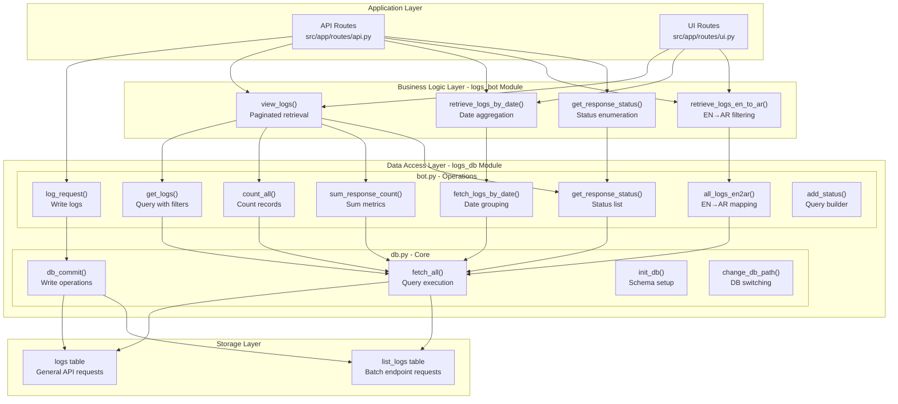
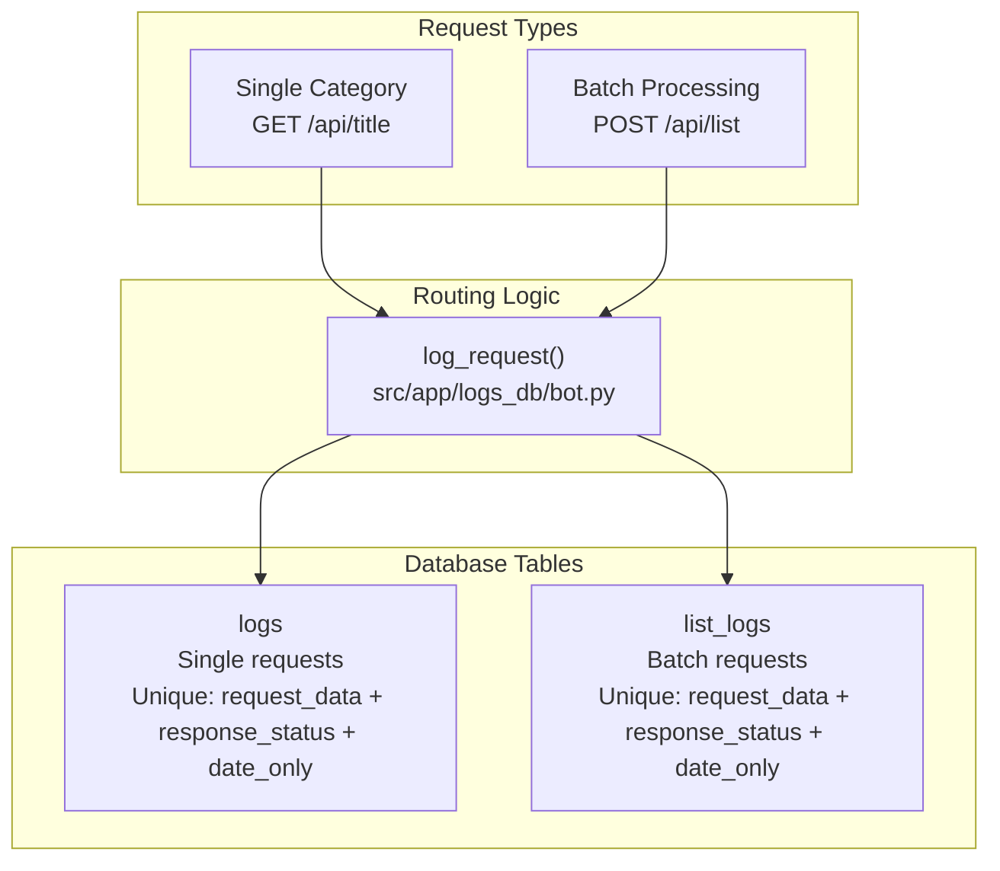
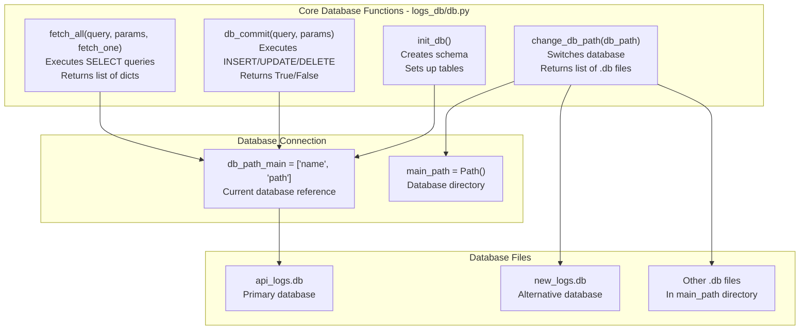
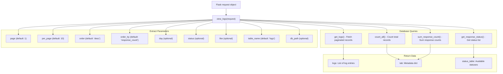
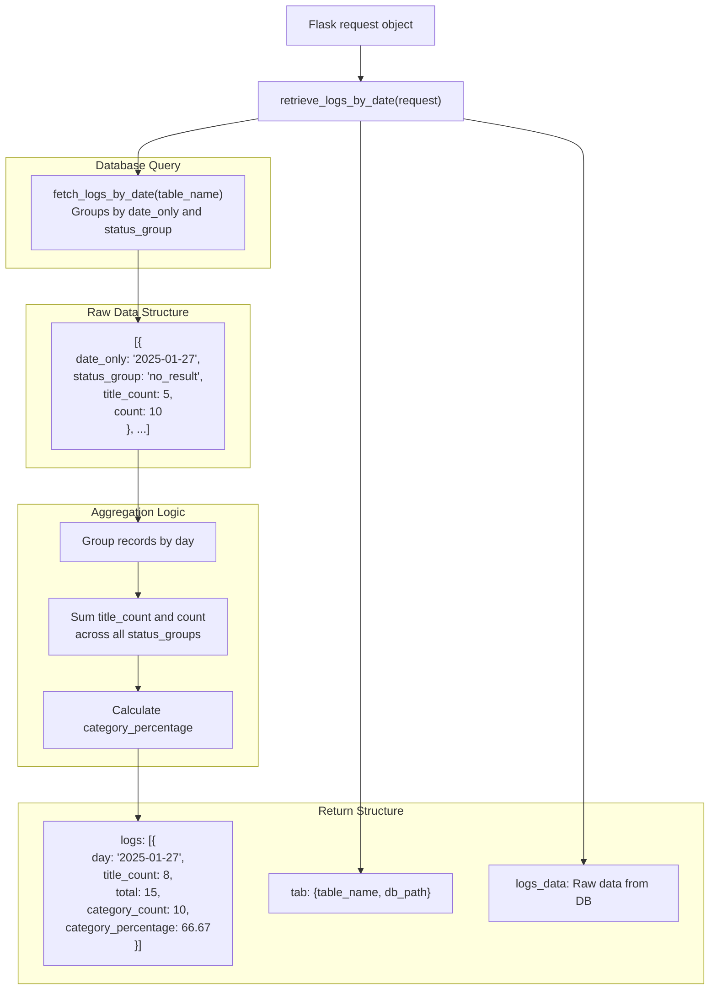
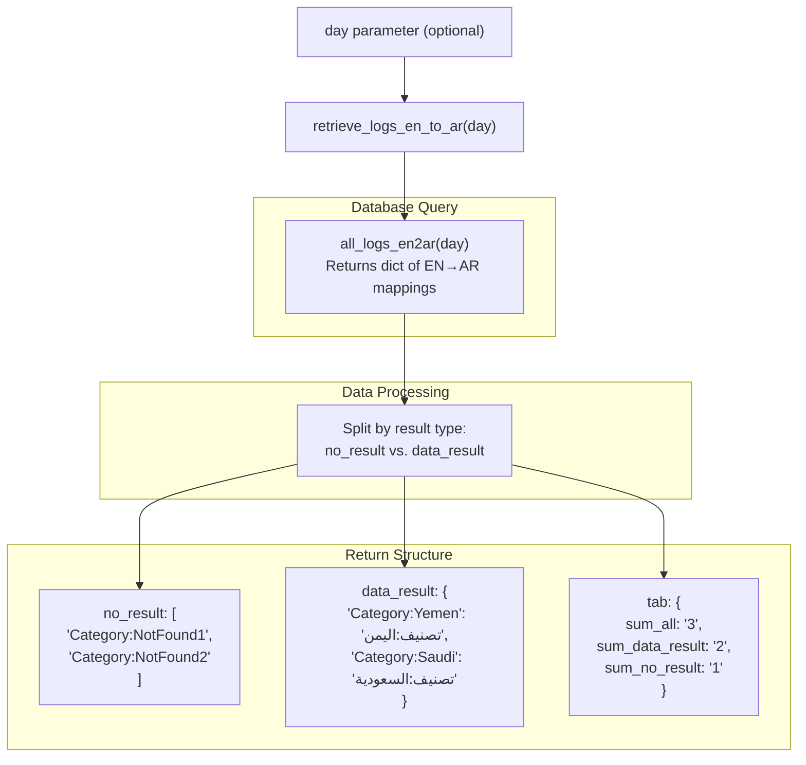
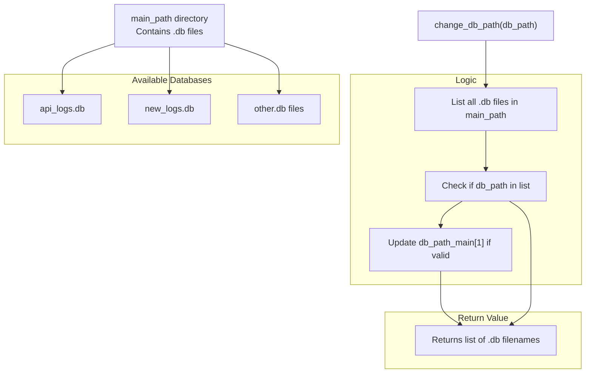

# Logging System

> **Relevant source files**
> * [README.md](https://github.com/ArWikiCats/ArWikiCatsWeb/blob/88f42d13/README.md)
> * [pyproject.toml](https://github.com/ArWikiCats/ArWikiCatsWeb/blob/88f42d13/pyproject.toml)
> * [pytest.ini](https://github.com/ArWikiCats/ArWikiCatsWeb/blob/88f42d13/pytest.ini)
> * [tests/conftest.py](https://github.com/ArWikiCats/ArWikiCatsWeb/blob/88f42d13/tests/conftest.py)
> * [tests/test_api.py](https://github.com/ArWikiCats/ArWikiCatsWeb/blob/88f42d13/tests/test_api.py)
> * [tests/test_log.py](https://github.com/ArWikiCats/ArWikiCatsWeb/blob/88f42d13/tests/test_log.py)
> * [tests/test_logs_bot.py](https://github.com/ArWikiCats/ArWikiCatsWeb/blob/88f42d13/tests/test_logs_bot.py)

The logging system is a comprehensive observability infrastructure that tracks all API requests and provides analytical capabilities for monitoring usage patterns, performance metrics, and troubleshooting failed category resolutions. It uses a dual-table SQLite database with a two-tier abstraction layer that separates low-level database operations from business logic.

For information about the REST API endpoints that expose log data, see [Log Retrieval Endpoints](/ArWikiCats/ArWikiCatsWeb/4.2-log-retrieval-endpoints). For details about the database schema and table structure, see [Log Database Schema](/ArWikiCats/ArWikiCatsWeb/6.1-log-database-schema). For information about how logs are recorded, see [Log Recording](/ArWikiCats/ArWikiCatsWeb/6.2-log-recording).

---

## Architecture Overview

The logging system is organized into three distinct layers that provide separation of concerns and enable flexible querying and analysis:



**Sources:** [src/app/logs_bot.py](https://github.com/ArWikiCats/ArWikiCatsWeb/blob/88f42d13/src/app/logs_bot.py)

 [src/app/logs_db/bot.py](https://github.com/ArWikiCats/ArWikiCatsWeb/blob/88f42d13/src/app/logs_db/bot.py)

 [src/app/logs_db/db.py](https://github.com/ArWikiCats/ArWikiCatsWeb/blob/88f42d13/src/app/logs_db/db.py)

 [README.md L75-L91](https://github.com/ArWikiCats/ArWikiCatsWeb/blob/88f42d13/README.md#L75-L91)

The architecture separates concerns into three distinct layers:

| Layer | Module | Responsibility |
| --- | --- | --- |
| **Application** | `src/app/routes/api.py`, `src/app/routes/ui.py` | Triggers logging and retrieves data for endpoints |
| **Business Logic** | `src/app/logs_bot.py` | Provides high-level functions for log retrieval, filtering, and aggregation |
| **Data Access** | `src/app/logs_db/bot.py`, `src/app/logs_db/db.py` | Handles database queries, writes, and schema management |
| **Storage** | SQLite database | Persists log data in `logs` and `list_logs` tables |

---

## Dual-Table Architecture

The logging system uses two separate tables to optimize storage and querying for different request types:



**Sources:** [src/app/logs_db/bot.py L1-L50](https://github.com/ArWikiCats/ArWikiCatsWeb/blob/88f42d13/src/app/logs_db/bot.py#L1-L50)

 [tests/test_log.py L244-L262](https://github.com/ArWikiCats/ArWikiCatsWeb/blob/88f42d13/tests/test_log.py#L244-L262)

The `log_request()` function automatically routes logs to the appropriate table based on the endpoint path. The `/api/list` endpoint uses the `list_logs` table, while all other API endpoints use the `logs` table. Both tables share an identical schema but are separated to:

* Optimize query performance by partitioning data
* Enable independent analysis of batch vs. single requests
* Prevent unique constraint conflicts between different request types

---

## Data Flow: Recording a Request

The following diagram shows how a request is logged from an API endpoint through the data access layer to the database:

```mermaid
sequenceDiagram
  participant API Route
  participant /api/title
  participant check_user_agent()
  participant log_request()
  participant logs_db/bot.py
  participant db_commit()
  participant logs_db/db.py
  participant SQLite Database

  API Route->>check_user_agent(): Validate User-Agent
  loop [No User-Agent]
    check_user_agent()->>log_request(): log_request(endpoint, data, "no_user_agent", 0)
    log_request()->>db_commit(): INSERT with table=logs
    db_commit()->>SQLite Database: Write to logs table
    check_user_agent()-->>API Route: Return error response
    check_user_agent()-->>API Route: Continue processing
    API Route->>API Route: Process request (resolve category)
    API Route->>log_request(): log_request(endpoint, data, result, response_time)
    log_request()->>log_request(): Round response_time to 3 decimals
    log_request()->>log_request(): Convert response_status to string
    log_request()->>log_request(): Determine table (logs or list_logs)
    log_request()->>db_commit(): INSERT ON CONFLICT DO UPDATE
    db_commit()->>SQLite Database: Write/update log entry
    db_commit()-->>log_request(): Return True
    log_request()-->>API Route: Return last_row_id
  end
```

**Sources:** [src/app/routes/api.py L1-L200](https://github.com/ArWikiCats/ArWikiCatsWeb/blob/88f42d13/src/app/routes/api.py#L1-L200)

 [src/app/logs_db/bot.py L1-L50](https://github.com/ArWikiCats/ArWikiCatsWeb/blob/88f42d13/src/app/logs_db/bot.py#L1-L50)

 [tests/test_log.py L224-L271](https://github.com/ArWikiCats/ArWikiCatsWeb/blob/88f42d13/tests/test_log.py#L224-L271)

The logging process captures:

* **Endpoint**: The API route that handled the request (e.g., `/api/Category:Test`)
* **Request Data**: The category title or data being processed
* **Response Status**: The result (Arabic label, `"no_result"`, `"no_user_agent"`, etc.)
* **Response Time**: Processing duration rounded to 3 decimal places
* **Response Count**: Incremented on duplicate requests via `ON CONFLICT` clause
* **Timestamp**: Automatic timestamp of when the log was created/updated
* **Date Only**: Extracted date for efficient daily aggregation

---

## Core Database Operations

The `logs_db/db.py` module provides fundamental database operations used throughout the logging system:



**Sources:** [src/app/logs_db/db.py](https://github.com/ArWikiCats/ArWikiCatsWeb/blob/88f42d13/src/app/logs_db/db.py)

 [tests/test_log.py L160-L221](https://github.com/ArWikiCats/ArWikiCatsWeb/blob/88f42d13/tests/test_log.py#L160-L221)

### fetch_all()

The `fetch_all()` function executes SELECT queries and returns results as a list of dictionaries:

```sql
# Returns list of dicts with column names as keys
logs = fetch_all("SELECT * FROM logs WHERE response_status = ?", ["no_result"])
# Returns single dict when fetch_one=True
log = fetch_all("SELECT * FROM logs WHERE id = ?", [1], fetch_one=True)
```

**Sources:** [src/app/logs_db/db.py](https://github.com/ArWikiCats/ArWikiCatsWeb/blob/88f42d13/src/app/logs_db/db.py)

 [tests/test_log.py L160-L205](https://github.com/ArWikiCats/ArWikiCatsWeb/blob/88f42d13/tests/test_log.py#L160-L205)

### db_commit()

The `db_commit()` function executes write operations (INSERT, UPDATE, DELETE) and returns a boolean indicating success:

```sql
success = db_commit(
    "INSERT INTO logs (endpoint, request_data, response_status) VALUES (?, ?, ?)",
    ["/api/test", "Category:Test", "no_result"]
)
```

**Sources:** [src/app/logs_db/db.py](https://github.com/ArWikiCats/ArWikiCatsWeb/blob/88f42d13/src/app/logs_db/db.py)

 [tests/test_log.py L207-L221](https://github.com/ArWikiCats/ArWikiCatsWeb/blob/88f42d13/tests/test_log.py#L207-L221)

---

## Log Retrieval Functions

The `logs_bot.py` module provides high-level functions for retrieving and analyzing log data:

### view_logs()

Retrieves paginated logs with filtering and sorting capabilities:



**Sources:** [src/app/logs_bot.py L1-L100](https://github.com/ArWikiCats/ArWikiCatsWeb/blob/88f42d13/src/app/logs_bot.py#L1-L100)

 [tests/test_logs_bot.py L10-L121](https://github.com/ArWikiCats/ArWikiCatsWeb/blob/88f42d13/tests/test_logs_bot.py#L10-L121)

The function returns a dictionary with three keys:

* `logs`: List of log entries with `request_data` formatted (underscores replaced with spaces)
* `tab`: Metadata including counts, pagination info, and filter parameters
* `status_table`: Available response status values for filtering

Parameters support:

* **Pagination**: `page` and `per_page` for controlling result sets
* **Sorting**: `order` (ASC/DESC) and `order_by` (column name, validated against allowed list)
* **Filtering**: `day`, `status`, and `like` for restricting results
* **Table selection**: `table_name` to query `logs` or `list_logs`
* **Database switching**: `db_path` to change active database

**Sources:** [src/app/logs_bot.py](https://github.com/ArWikiCats/ArWikiCatsWeb/blob/88f42d13/src/app/logs_bot.py)

 [tests/test_logs_bot.py L40-L121](https://github.com/ArWikiCats/ArWikiCatsWeb/blob/88f42d13/tests/test_logs_bot.py#L40-L121)

### retrieve_logs_by_date()

Aggregates log data by date with counts and status breakdowns:



**Sources:** [src/app/logs_bot.py](https://github.com/ArWikiCats/ArWikiCatsWeb/blob/88f42d13/src/app/logs_bot.py)

 [tests/test_logs_bot.py L123-L183](https://github.com/ArWikiCats/ArWikiCatsWeb/blob/88f42d13/tests/test_logs_bot.py#L123-L183)

The function processes raw database results to produce daily aggregates:

* Groups records by unique `date_only` values
* Sums `title_count` (unique titles) and `count` (total requests) across all status groups
* Calculates `category_count` (successful resolutions) and `category_percentage`
* Sorts results by day in ascending order
* Returns both processed and raw data for flexible consumption

**Sources:** [tests/test_logs_bot.py L148-L183](https://github.com/ArWikiCats/ArWikiCatsWeb/blob/88f42d13/tests/test_logs_bot.py#L148-L183)

### retrieve_logs_en_to_ar()

Retrieves all English-to-Arabic category mappings and separates successful resolutions from failures:



**Sources:** [src/app/logs_bot.py](https://github.com/ArWikiCats/ArWikiCatsWeb/blob/88f42d13/src/app/logs_bot.py)

 [tests/test_logs_bot.py L185-L247](https://github.com/ArWikiCats/ArWikiCatsWeb/blob/88f42d13/tests/test_logs_bot.py#L185-L247)

The function returns three keys:

* `no_result`: List of English category titles that failed to resolve
* `data_result`: Dictionary mapping English titles to their Arabic equivalents
* `tab`: Summary statistics with counts of total, successful, and failed resolutions

When a `day` parameter is provided, results are filtered to that specific date using the `date_only` field.

**Sources:** [tests/test_logs_bot.py L189-L247](https://github.com/ArWikiCats/ArWikiCatsWeb/blob/88f42d13/tests/test_logs_bot.py#L189-L247)

---

## Query Building with add_status()

The `add_status()` function in `logs_db/bot.py` dynamically constructs WHERE clauses for filtering queries:

| Parameter | SQL Clause | Example |
| --- | --- | --- |
| `status` | `response_status = ?` | `status="no_result"` → `WHERE response_status = 'no_result'` |
| `status="Category"` | `response_status LIKE 'تصنيف%'` | Special handling for Arabic category prefix |
| `like` | `response_status LIKE ?` | `like="test%"` → `WHERE response_status LIKE 'test%'` |
| `day` | `date_only = ?` | `day="2025-01-27"` → `WHERE date_only = '2025-01-27'` |

**Sources:** [src/app/logs_db/bot.py](https://github.com/ArWikiCats/ArWikiCatsWeb/blob/88f42d13/src/app/logs_db/bot.py)

 [tests/test_log.py L13-L99](https://github.com/ArWikiCats/ArWikiCatsWeb/blob/88f42d13/tests/test_log.py#L13-L99)

The function validates the `day` parameter using a regex pattern `^\d{4}-\d{2}-\d{2}$` to ensure it matches the YYYY-MM-DD format. Multiple conditions are combined with `AND` operators. The function handles both list and tuple parameter types, converting tuples to lists for consistency.

**Sources:** [tests/test_log.py L52-L99](https://github.com/ArWikiCats/ArWikiCatsWeb/blob/88f42d13/tests/test_log.py#L52-L99)

---

## Aggregation and Counting

The `logs_db/bot.py` module provides several aggregation functions for analytics:

### count_all()

Counts the total number of log records with optional filtering:

```markdown
total = count_all()  # Count all records
filtered = count_all(status="no_result", day="2025-01-27")  # Count with filters
```

**Sources:** [src/app/logs_db/bot.py](https://github.com/ArWikiCats/ArWikiCatsWeb/blob/88f42d13/src/app/logs_db/bot.py)

 [tests/test_log.py L273-L337](https://github.com/ArWikiCats/ArWikiCatsWeb/blob/88f42d13/tests/test_log.py#L273-L337)

### sum_response_count()

Sums the `response_count` field across matching records, representing the total number of requests (including duplicates that increment the counter):

```markdown
total_requests = sum_response_count()  # Sum all response counts
success_requests = sum_response_count(status="success")  # Sum for specific status
```

**Sources:** [src/app/logs_db/bot.py](https://github.com/ArWikiCats/ArWikiCatsWeb/blob/88f42d13/src/app/logs_db/bot.py)

 [tests/test_log.py L430-L496](https://github.com/ArWikiCats/ArWikiCatsWeb/blob/88f42d13/tests/test_log.py#L430-L496)

### get_response_status()

Returns a list of distinct `response_status` values from the database, used for populating filter dropdowns in the UI:

```markdown
statuses = get_response_status()  # ["no_result", "تصنيف:اليمن", "no_user_agent", ...]
```

**Sources:** [src/app/logs_db/bot.py](https://github.com/ArWikiCats/ArWikiCatsWeb/blob/88f42d13/src/app/logs_db/bot.py)

 [src/app/routes/api.py](https://github.com/ArWikiCats/ArWikiCatsWeb/blob/88f42d13/src/app/routes/api.py)

---

## Integration with API Endpoints

The logging system integrates tightly with the API layer to capture every request:

```

```

**Sources:** [src/app/routes/api.py](https://github.com/ArWikiCats/ArWikiCatsWeb/blob/88f42d13/src/app/routes/api.py)

 [tests/test_api.py L179-L336](https://github.com/ArWikiCats/ArWikiCatsWeb/blob/88f42d13/tests/test_api.py#L179-L336)

Every API endpoint follows this pattern:

1. Validate User-Agent header using `check_user_agent()`
2. If invalid, log the request with status `"no_user_agent"` and return error
3. If valid, process the request (resolve category labels)
4. Log the request with the actual result and response time
5. Return the response to the client

The `log_request()` function returns the `last_row_id` which is included in API responses as the `sql` field, allowing clients to reference specific log entries.

**Sources:** [src/app/routes/api.py L1-L250](https://github.com/ArWikiCats/ArWikiCatsWeb/blob/88f42d13/src/app/routes/api.py#L1-L250)

 [tests/test_api.py L192-L215](https://github.com/ArWikiCats/ArWikiCatsWeb/blob/88f42d13/tests/test_api.py#L192-L215)

---

## Database Path Management

The logging system supports multiple databases through the `change_db_path()` function:



**Sources:** [src/app/logs_db/db.py](https://github.com/ArWikiCats/ArWikiCatsWeb/blob/88f42d13/src/app/logs_db/db.py)

 [tests/test_log.py L498-L521](https://github.com/ArWikiCats/ArWikiCatsWeb/blob/88f42d13/tests/test_log.py#L498-L521)

The `db_path_main` variable is a two-element list `['name', 'path']` that tracks the currently active database. The `change_db_path()` function:

* Scans the `main_path` directory for all `.db` files
* Validates the requested database path exists
* Updates `db_path_main[1]` if valid
* Returns the list of available database files

This enables the UI to switch between different log databases for analysis of historical data or testing purposes.

**Sources:** [tests/test_log.py L498-L521](https://github.com/ArWikiCats/ArWikiCatsWeb/blob/88f42d13/tests/test_log.py#L498-L521)

---

## Deduplication and Update Strategy

The logging system uses SQLite's `ON CONFLICT` clause to handle duplicate requests efficiently:

```sql
INSERT INTO logs (endpoint, request_data, response_status, response_time, date_only)
VALUES (?, ?, ?, ?, ?)
ON CONFLICT (request_data, response_status, date_only) 
DO UPDATE SET 
    response_count = response_count + 1,
    timestamp = CURRENT_TIMESTAMP
```

**Sources:** [src/app/logs_db/bot.py](https://github.com/ArWikiCats/ArWikiCatsWeb/blob/88f42d13/src/app/logs_db/bot.py)

The unique constraint on `(request_data, response_status, date_only)` ensures that:

* Each unique category request per day is stored once
* Duplicate requests increment the `response_count` field
* The `timestamp` is updated to reflect the most recent access
* Storage space is minimized while preserving request frequency data

This approach enables accurate tracking of:

* How many unique categories were requested
* How frequently each category is accessed
* Temporal patterns in category resolution requests

**Sources:** [tests/test_log.py L112-L124](https://github.com/ArWikiCats/ArWikiCatsWeb/blob/88f42d13/tests/test_log.py#L112-L124)

---

## Testing Coverage

The logging system has comprehensive test coverage across multiple test files:

| Test File | Focus | Coverage |
| --- | --- | --- |
| `tests/test_log.py` | Database operations, `log_request()`, query builders | Core database functions |
| `tests/test_logs_bot.py` | `view_logs()`, `retrieve_logs_by_date()`, `retrieve_logs_en_to_ar()` | Business logic layer |
| `tests/test_api.py` | API endpoint integration with logging | End-to-end logging flow |

**Sources:** [tests/test_log.py](https://github.com/ArWikiCats/ArWikiCatsWeb/blob/88f42d13/tests/test_log.py)

 [tests/test_logs_bot.py](https://github.com/ArWikiCats/ArWikiCatsWeb/blob/88f42d13/tests/test_logs_bot.py)

 [tests/test_api.py](https://github.com/ArWikiCats/ArWikiCatsWeb/blob/88f42d13/tests/test_api.py)

 [README.md L234-L240](https://github.com/ArWikiCats/ArWikiCatsWeb/blob/88f42d13/README.md#L234-L240)

The test suite validates:

* Correct table selection (`logs` vs `list_logs`) based on endpoint
* Response time rounding to 3 decimal places
* Status conversion to string type
* Query parameter validation and sanitization
* Pagination and sorting logic
* Aggregation and counting accuracy
* Database path switching
* `ON CONFLICT` behavior for deduplication
* Filter construction with `add_status()`

**Sources:** [tests/test_log.py L224-L271](https://github.com/ArWikiCats/ArWikiCatsWeb/blob/88f42d13/tests/test_log.py#L224-L271)

 [tests/test_logs_bot.py L10-L383](https://github.com/ArWikiCats/ArWikiCatsWeb/blob/88f42d13/tests/test_logs_bot.py#L10-L383)