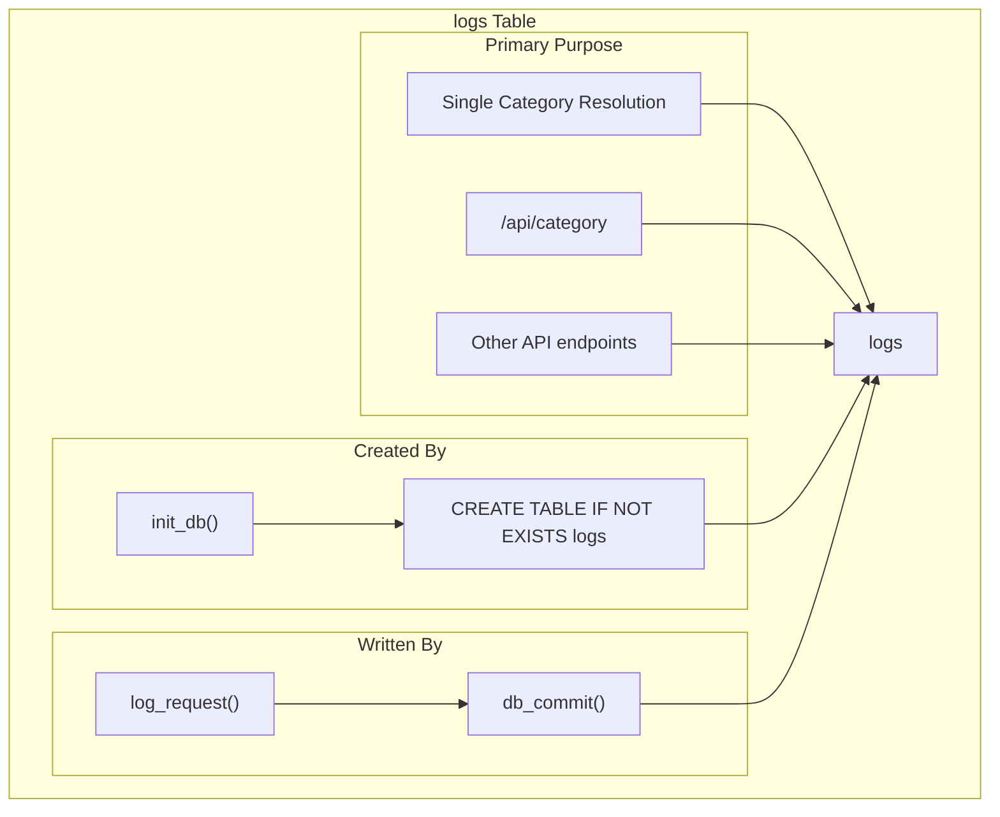
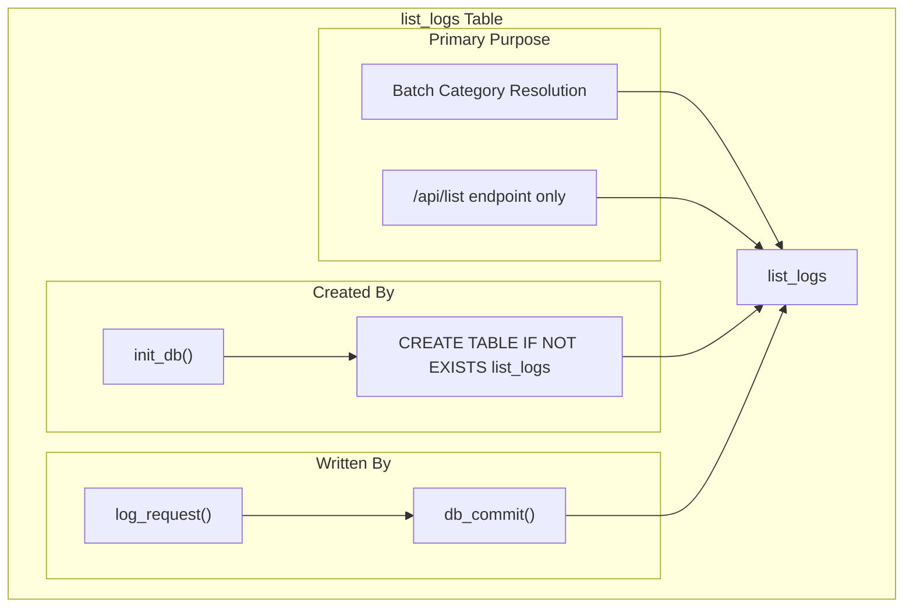
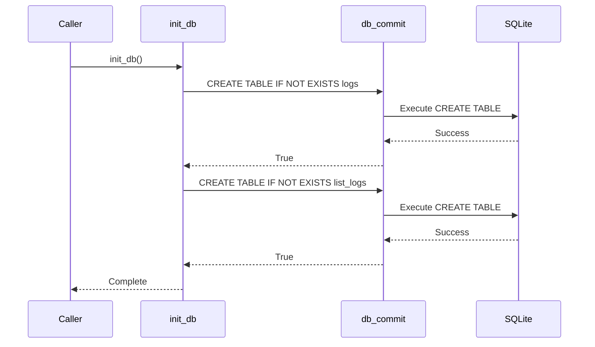

# Log Database Schema

> **Relevant source files**
> * [pyproject.toml](https://github.com/ArWikiCats/ArWikiCatsWeb/blob/88f42d13/pyproject.toml)
> * [pytest.ini](https://github.com/ArWikiCats/ArWikiCatsWeb/blob/88f42d13/pytest.ini)
> * [src/app/logs_db/db.py](https://github.com/ArWikiCats/ArWikiCatsWeb/blob/88f42d13/src/app/logs_db/db.py)
> * [src/app/routes/__init__.py](https://github.com/ArWikiCats/ArWikiCatsWeb/blob/88f42d13/src/app/routes/__init__.py)
> * [tests/conftest.py](https://github.com/ArWikiCats/ArWikiCatsWeb/blob/88f42d13/tests/conftest.py)
> * [tests/test_db_operations.py](https://github.com/ArWikiCats/ArWikiCatsWeb/blob/88f42d13/tests/test_db_operations.py)
> * [tests/test_log.py](https://github.com/ArWikiCats/ArWikiCatsWeb/blob/88f42d13/tests/test_log.py)
> * [tests/test_ui.py](https://github.com/ArWikiCats/ArWikiCatsWeb/blob/88f42d13/tests/test_ui.py)

This page documents the SQLite database schema used to store API request logs in the ArWikiCatsWeb application. The schema consists of two tables (`logs` and `list_logs`) that track all category resolution requests and their responses.

For information about how log data is recorded to these tables, see [Log Recording](/ArWikiCats/ArWikiCatsWeb/6.2-log-recording). For information about querying and analyzing the logged data, see [Log Retrieval and Analysis](/ArWikiCats/ArWikiCatsWeb/6.3-log-retrieval-and-analysis).

## Database File Location

The SQLite database file is stored at a path determined by the `db_path_main` dictionary in [src/app/logs_db/db.py L17](https://github.com/ArWikiCats/ArWikiCatsWeb/blob/88f42d13/src/app/logs_db/db.py#L17-L17)

 The path resolution logic follows this pattern:

* **Production environment**: `$HOME/www/python/dbs/new_logs.db`
* **Development environment**: Falls back to a path relative to the source directory

The `main_path` variable [src/app/logs_db/db.py L12](https://github.com/ArWikiCats/ArWikiCatsWeb/blob/88f42d13/src/app/logs_db/db.py#L12-L12)

 constructs the directory path, creating it if it doesn't exist [src/app/logs_db/db.py L14-L15](https://github.com/ArWikiCats/ArWikiCatsWeb/blob/88f42d13/src/app/logs_db/db.py#L14-L15)

 The actual database path is stored in `db_path_main[1]` [src/app/logs_db/db.py L17](https://github.com/ArWikiCats/ArWikiCatsWeb/blob/88f42d13/src/app/logs_db/db.py#L17-L17)

 and can be changed dynamically using the `change_db_path()` function [src/app/logs_db/db.py L20-L32](https://github.com/ArWikiCats/ArWikiCatsWeb/blob/88f42d13/src/app/logs_db/db.py#L20-L32)

**Sources:** [src/app/logs_db/db.py L11-L17](https://github.com/ArWikiCats/ArWikiCatsWeb/blob/88f42d13/src/app/logs_db/db.py#L11-L17)

## Schema Overview

The database contains two structurally identical tables that serve different purposes:

```

```

**Diagram: Database Schema - Two Tables with Identical Structure**

The separation into two tables enables efficient querying and analysis of different endpoint types without mixing data:

* **`logs`**: Records requests to single category resolution endpoints
* **`list_logs`**: Records requests to batch category resolution endpoints (`/api/list`)

**Sources:** [src/app/logs_db/db.py L48-L77](https://github.com/ArWikiCats/ArWikiCatsWeb/blob/88f42d13/src/app/logs_db/db.py#L48-L77)

 [tests/test_log.py L112-L139](https://github.com/ArWikiCats/ArWikiCatsWeb/blob/88f42d13/tests/test_log.py#L112-L139)

## Field Definitions

Both `logs` and `list_logs` tables share the following schema:

| Field Name | Data Type | Constraints | Default Value | Description |
| --- | --- | --- | --- | --- |
| `id` | INTEGER | PRIMARY KEY, AUTOINCREMENT | - | Unique identifier for each log entry |
| `endpoint` | TEXT | NOT NULL | - | API endpoint path (e.g., `/api/category`, `/api/list`) |
| `request_data` | TEXT | NOT NULL | - | Input category label (English or Arabic) |
| `response_status` | TEXT | NOT NULL | - | Result: Arabic category label, `"no_result"`, or error message |
| `response_time` | REAL | - | - | Request processing time in seconds (rounded to 3 decimal places) |
| `response_count` | INTEGER | - | 1 | Number of times this exact request occurred on this date |
| `timestamp` | DATETIME | - | CURRENT_TIMESTAMP | Exact timestamp when the log entry was first created |
| `date_only` | DATE | - | DATE('now') | Date portion only, used for daily aggregation |

### Field Usage Details

**`endpoint`**: Stores the API route path. Common values include `/api/category`, `/api/list`, and other API endpoints defined in [src/app/routes/api.py](https://github.com/ArWikiCats/ArWikiCatsWeb/blob/88f42d13/src/app/routes/api.py)

**`request_data`**: Contains the category label submitted by the client. This can be:

* English labels like `"Category:Physics"`
* Arabic labels like `"تصنيف:فيزياء"`
* Special characters are preserved using SQLite's UTF-8 support [tests/test_db_operations.py L51-L88](https://github.com/ArWikiCats/ArWikiCatsWeb/blob/88f42d13/tests/test_db_operations.py#L51-L88)

**`response_status`**: Stores the resolution result:

* Successful resolutions contain the Arabic category label (e.g., `"تصنيف:فيزياء"`)
* Failed resolutions store `"no_result"`
* Other status values may include error messages or special indicators

**`response_time`**: Rounded to 3 decimal places during insertion [tests/test_log.py L234-L242](https://github.com/ArWikiCats/ArWikiCatsWeb/blob/88f42d13/tests/test_log.py#L234-L242)

 This field enables performance analysis and monitoring.

**`response_count`**: Incremented when a duplicate request is made on the same date (see [Unique Constraint](https://github.com/ArWikiCats/ArWikiCatsWeb/blob/88f42d13/Unique Constraint)

 below). This provides efficient request frequency tracking.

**`timestamp`**: Automatically set to the current timestamp when a row is first inserted [src/app/logs_db/db.py L57](https://github.com/ArWikiCats/ArWikiCatsWeb/blob/88f42d13/src/app/logs_db/db.py#L57-L57)

**`date_only`**: Automatically extracted from the current date [src/app/logs_db/db.py L58](https://github.com/ArWikiCats/ArWikiCatsWeb/blob/88f42d13/src/app/logs_db/db.py#L58-L58)

 This field enables efficient date-based grouping and filtering without parsing timestamps.

**Sources:** [src/app/logs_db/db.py L50-L75](https://github.com/ArWikiCats/ArWikiCatsWeb/blob/88f42d13/src/app/logs_db/db.py#L50-L75)

 [tests/test_log.py L112-L154](https://github.com/ArWikiCats/ArWikiCatsWeb/blob/88f42d13/tests/test_log.py#L112-L154)

 [tests/test_db_operations.py L21-L32](https://github.com/ArWikiCats/ArWikiCatsWeb/blob/88f42d13/tests/test_db_operations.py#L21-L32)

## The logs Table



**Diagram: The `logs` Table - Purpose and Access Patterns**

The `logs` table is created by the `init_db()` function [src/app/logs_db/db.py L48-L62](https://github.com/ArWikiCats/ArWikiCatsWeb/blob/88f42d13/src/app/logs_db/db.py#L48-L62)

 using this SQL statement:

```sql
CREATE TABLE IF NOT EXISTS logs (
    id INTEGER PRIMARY KEY AUTOINCREMENT,
    endpoint TEXT NOT NULL,
    request_data TEXT NOT NULL,
    response_status TEXT NOT NULL,
    response_time REAL,
    response_count INTEGER DEFAULT 1,
    timestamp DATETIME DEFAULT CURRENT_TIMESTAMP,
    date_only DATE DEFAULT (DATE('now')),
    UNIQUE(request_data, response_status, date_only)
);
```

This table stores all API requests except those to `/api/list`. The routing logic in `log_request()` determines which table to use based on the endpoint path [tests/test_log.py L244-L252](https://github.com/ArWikiCats/ArWikiCatsWeb/blob/88f42d13/tests/test_log.py#L244-L252)

**Sources:** [src/app/logs_db/db.py L48-L62](https://github.com/ArWikiCats/ArWikiCatsWeb/blob/88f42d13/src/app/logs_db/db.py#L48-L62)

 [tests/test_log.py L244-L252](https://github.com/ArWikiCats/ArWikiCatsWeb/blob/88f42d13/tests/test_log.py#L244-L252)

## The list_logs Table



**Diagram: The `list_logs` Table - Dedicated to Batch Operations**

The `list_logs` table has an identical structure to `logs` but serves a specialized purpose. It is created by `init_db()` [src/app/logs_db/db.py L64-L77](https://github.com/ArWikiCats/ArWikiCatsWeb/blob/88f42d13/src/app/logs_db/db.py#L64-L77)

:

```sql
CREATE TABLE IF NOT EXISTS list_logs (
    id INTEGER PRIMARY KEY AUTOINCREMENT,
    endpoint TEXT NOT NULL,
    request_data TEXT NOT NULL,
    response_status TEXT NOT NULL,
    response_time REAL,
    response_count INTEGER DEFAULT 1,
    timestamp DATETIME DEFAULT CURRENT_TIMESTAMP,
    date_only DATE DEFAULT (DATE('now')),
    UNIQUE(request_data, response_status, date_only)
);
```

This separation allows the `/api/list` endpoint to handle batch category resolution requests without mixing data with single-category requests. The `log_request()` function routes to this table when the endpoint contains `/api/list` [tests/test_log.py L254-L261](https://github.com/ArWikiCats/ArWikiCatsWeb/blob/88f42d13/tests/test_log.py#L254-L261)

**Sources:** [src/app/logs_db/db.py L64-L77](https://github.com/ArWikiCats/ArWikiCatsWeb/blob/88f42d13/src/app/logs_db/db.py#L64-L77)

 [tests/test_log.py L254-L261](https://github.com/ArWikiCats/ArWikiCatsWeb/blob/88f42d13/tests/test_log.py#L254-L261)

## Unique Constraint

Both tables implement a composite UNIQUE constraint on three columns: `(request_data, response_status, date_only)` [src/app/logs_db/db.py L59](https://github.com/ArWikiCats/ArWikiCatsWeb/blob/88f42d13/src/app/logs_db/db.py#L59-L59)

 and [src/app/logs_db/db.py L74](https://github.com/ArWikiCats/ArWikiCatsWeb/blob/88f42d13/src/app/logs_db/db.py#L74-L74)

### Constraint Behavior

This constraint enforces that each unique combination of request, response, and date can only appear once in the table. When a duplicate request occurs:

1. The database attempts to insert a new row
2. The UNIQUE constraint violation is detected
3. The existing row's `response_count` is incremented instead
4. The `timestamp` remains unchanged (preserving the first occurrence time)

This mechanism provides automatic request deduplication and frequency counting without requiring separate aggregation queries.

### Example Constraint Enforcement

```mermaid
flowchart TD

Req3["Request: Category:Physics<br>Response: تصنيف:فيزياء<br>Date: 2025-01-28"]
Insert2["INSERT new row<br>response_count = 1"]
Row2["New row created"]
Req2["Request: Category:Physics<br>Response: تصنيف:فيزياء<br>Date: 2025-01-27"]
Constraint["UNIQUE constraint violation"]
Update["UPDATE response_count<br>response_count = 2"]
Req1["Request: Category:Physics<br>Response: تصنيف:فيزياء<br>Date: 2025-01-27"]
Insert1["INSERT new row<br>response_count = 1"]
Row1["Row created"]

subgraph subGraph2 ["Same Request Different Day"]
    Req3
    Insert2
    Row2
    Req3 --> Insert2
    Insert2 --> Row2
end

subgraph subGraph1 ["Duplicate Request Same Day"]
    Req2
    Constraint
    Update
    Req2 --> Constraint
    Constraint --> Update
end

subgraph subGraph0 ["First Request"]
    Req1
    Insert1
    Row1
    Req1 --> Insert1
    Insert1 --> Row1
end
```



**Diagram: UNIQUE Constraint Behavior - Deduplication and Counting**

The SQL that leverages this constraint uses `INSERT OR REPLACE` or similar upsert semantics. When a collision occurs, the `response_count` field is incremented to track request frequency [tests/test_log.py L273-L496](https://github.com/ArWikiCats/ArWikiCatsWeb/blob/88f42d13/tests/test_log.py#L273-L496)

**Sources:** [src/app/logs_db/db.py L59](https://github.com/ArWikiCats/ArWikiCatsWeb/blob/88f42d13/src/app/logs_db/db.py#L59-L59)

 [src/app/logs_db/db.py L74](https://github.com/ArWikiCats/ArWikiCatsWeb/blob/88f42d13/src/app/logs_db/db.py#L74-L74)

 [tests/test_db_operations.py L112-L139](https://github.com/ArWikiCats/ArWikiCatsWeb/blob/88f42d13/tests/test_db_operations.py#L112-L139)

## Schema Initialization

The `init_db()` function [src/app/logs_db/db.py L48-L77](https://github.com/ArWikiCats/ArWikiCatsWeb/blob/88f42d13/src/app/logs_db/db.py#L48-L77)

 is responsible for creating both tables. This function is called in several scenarios:

1. **Explicit initialization**: When the application starts or database is reset
2. **Error recovery**: Automatically called when a "no such table" error occurs [src/app/logs_db/db.py L100-L101](https://github.com/ArWikiCats/ArWikiCatsWeb/blob/88f42d13/src/app/logs_db/db.py#L100-L101)
3. **Testing**: Called by test fixtures to create temporary databases [tests/test_db_operations.py L342-L408](https://github.com/ArWikiCats/ArWikiCatsWeb/blob/88f42d13/tests/test_db_operations.py#L342-L408)

### Initialization Process



**Diagram: Schema Initialization Sequence**

The function uses `CREATE TABLE IF NOT EXISTS` [src/app/logs_db/db.py L50](https://github.com/ArWikiCats/ArWikiCatsWeb/blob/88f42d13/src/app/logs_db/db.py#L50-L50)

 making it idempotent—safe to call multiple times without error [tests/test_db_operations.py L381-L408](https://github.com/ArWikiCats/ArWikiCatsWeb/blob/88f42d13/tests/test_db_operations.py#L381-L408)

 Each table creation is executed as a separate `db_commit()` call [src/app/logs_db/db.py L62](https://github.com/ArWikiCats/ArWikiCatsWeb/blob/88f42d13/src/app/logs_db/db.py#L62-L62)

 and [src/app/logs_db/db.py L77](https://github.com/ArWikiCats/ArWikiCatsWeb/blob/88f42d13/src/app/logs_db/db.py#L77-L77)

**Sources:** [src/app/logs_db/db.py L48-L77](https://github.com/ArWikiCats/ArWikiCatsWeb/blob/88f42d13/src/app/logs_db/db.py#L48-L77)

 [src/app/logs_db/db.py L100-L101](https://github.com/ArWikiCats/ArWikiCatsWeb/blob/88f42d13/src/app/logs_db/db.py#L100-L101)

 [tests/test_db_operations.py L342-L408](https://github.com/ArWikiCats/ArWikiCatsWeb/blob/88f42d13/tests/test_db_operations.py#L342-L408)

## Database Access Patterns

The schema is accessed through the functions defined in `src/app/logs_db/db.py`:

| Function | Purpose | Usage |
| --- | --- | --- |
| `fetch_all()` | Execute SELECT queries and return results as list of dictionaries | [src/app/logs_db/db.py L80-L104](https://github.com/ArWikiCats/ArWikiCatsWeb/blob/88f42d13/src/app/logs_db/db.py#L80-L104) |
| `db_commit()` | Execute INSERT/UPDATE/DELETE queries with parameter binding | [src/app/logs_db/db.py L35-L45](https://github.com/ArWikiCats/ArWikiCatsWeb/blob/88f42d13/src/app/logs_db/db.py#L35-L45) |
| `init_db()` | Create both tables if they don't exist | [src/app/logs_db/db.py L48-L77](https://github.com/ArWikiCats/ArWikiCatsWeb/blob/88f42d13/src/app/logs_db/db.py#L48-L77) |
| `change_db_path()` | Switch active database file and list available databases | [src/app/logs_db/db.py L20-L32](https://github.com/ArWikiCats/ArWikiCatsWeb/blob/88f42d13/src/app/logs_db/db.py#L20-L32) |

### Row Factory Configuration

The `fetch_all()` function configures SQLite's row factory to return results as dictionaries [src/app/logs_db/db.py L84](https://github.com/ArWikiCats/ArWikiCatsWeb/blob/88f42d13/src/app/logs_db/db.py#L84-L84)

 This enables accessing columns by name rather than index:

```markdown
conn.row_factory = sqlite3.Row
# ...
logs = [dict(row) for row in rows]  # Convert Row objects to dicts
```

This pattern simplifies data access in the application code and makes the results JSON-serializable for API responses [tests/test_log.py L160-L190](https://github.com/ArWikiCats/ArWikiCatsWeb/blob/88f42d13/tests/test_log.py#L160-L190)

**Sources:** [src/app/logs_db/db.py L80-L104](https://github.com/ArWikiCats/ArWikiCatsWeb/blob/88f42d13/src/app/logs_db/db.py#L80-L104)

 [tests/test_log.py L160-L190](https://github.com/ArWikiCats/ArWikiCatsWeb/blob/88f42d13/tests/test_log.py#L160-L190)

## Character Encoding and Special Characters

The schema handles Unicode text natively through SQLite's UTF-8 support. This is critical for storing:

* **Arabic category labels**: Response values like `"تصنيف:فيزياء"` [tests/test_db_operations.py L71-L88](https://github.com/ArWikiCats/ArWikiCatsWeb/blob/88f42d13/tests/test_db_operations.py#L71-L88)
* **Special characters in English labels**: Quotes, apostrophes, and other punctuation [tests/test_db_operations.py L51-L69](https://github.com/ArWikiCats/ArWikiCatsWeb/blob/88f42d13/tests/test_db_operations.py#L51-L69)
* **Mixed-language data**: Requests and responses in multiple scripts

The database operations use parameterized queries [src/app/logs_db/db.py L39](https://github.com/ArWikiCats/ArWikiCatsWeb/blob/88f42d13/src/app/logs_db/db.py#L39-L39)

 to prevent SQL injection and ensure proper character escaping. All text fields are defined as `TEXT` type, which in SQLite stores strings in the database encoding (UTF-8 by default).

**Sources:** [tests/test_db_operations.py L51-L88](https://github.com/ArWikiCats/ArWikiCatsWeb/blob/88f42d13/tests/test_db_operations.py#L51-L88)

 [src/app/logs_db/db.py L35-L45](https://github.com/ArWikiCats/ArWikiCatsWeb/blob/88f42d13/src/app/logs_db/db.py#L35-L45)
