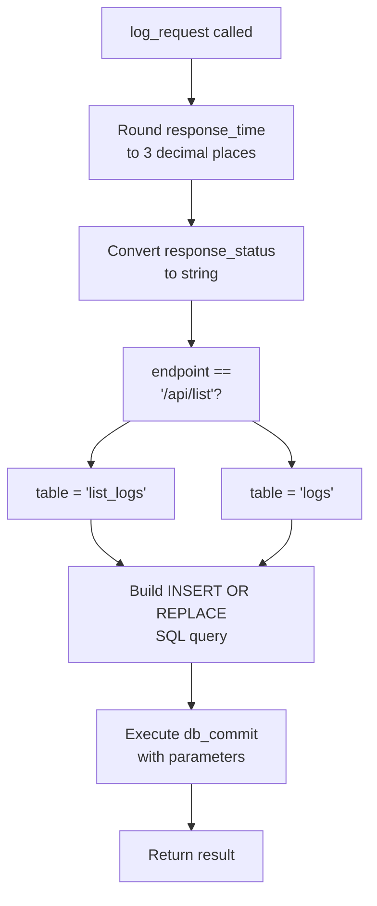
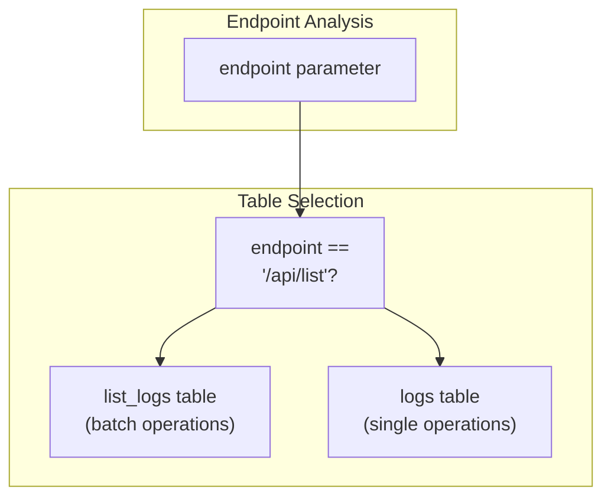
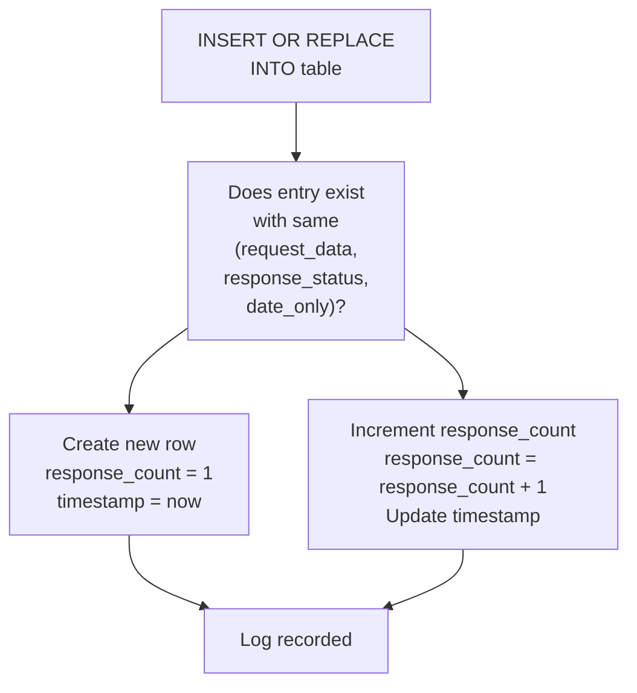
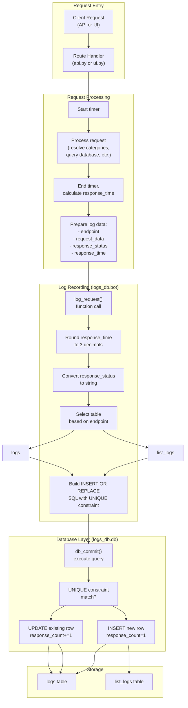

# Log Recording

> **Relevant source files**
> * [pyproject.toml](https://github.com/ArWikiCats/ArWikiCatsWeb/blob/88f42d13/pyproject.toml)
> * [pytest.ini](https://github.com/ArWikiCats/ArWikiCatsWeb/blob/88f42d13/pytest.ini)
> * [tests/conftest.py](https://github.com/ArWikiCats/ArWikiCatsWeb/blob/88f42d13/tests/conftest.py)
> * [tests/test_api.py](https://github.com/ArWikiCats/ArWikiCatsWeb/blob/88f42d13/tests/test_api.py)
> * [tests/test_log.py](https://github.com/ArWikiCats/ArWikiCatsWeb/blob/88f42d13/tests/test_log.py)
> * [tests/test_logs_bot.py](https://github.com/ArWikiCats/ArWikiCatsWeb/blob/88f42d13/tests/test_logs_bot.py)

## Purpose and Scope

This page documents the mechanism by which API and UI requests are recorded into the logging database. It covers the `log_request` function, its call sites, data processing logic, and table selection behavior. For information about the database schema and table structures, see [Log Database Schema](/ArWikiCats/ArWikiCatsWeb/6.1-log-database-schema). For information about querying and analyzing logged data, see [Log Retrieval and Analysis](/ArWikiCats/ArWikiCatsWeb/6.3-log-retrieval-and-analysis).

## Overview

Every request processed by the ArWikiCatsWeb application is logged to enable usage tracking, analytics, and troubleshooting. The logging system captures metadata about each request including the endpoint, request data, response status, response time, and timestamp. This data is stored in SQLite tables with UNIQUE constraints to prevent duplicate entries on the same day, instead incrementing a counter when the same request-response pair occurs multiple times.

The logging mechanism is implemented primarily through the `log_request` function in the `logs_db.bot` module, which is called from various route handlers in the API and UI blueprints.

## The log_request Function

### Function Signature

The `log_request` function is defined in [src/app/logs_db/bot.py](https://github.com/ArWikiCats/ArWikiCatsWeb/blob/88f42d13/src/app/logs_db/bot.py)

 and has the following signature:

```
log_request(endpoint, request_data, response_status, response_time)
```

**Parameters:**

* `endpoint` (str): The API or UI endpoint path (e.g., `/api/Category:Test`, `/api/list`)
* `request_data` (str): The request data, typically a category title or list of titles
* `response_status` (str/any): The response status or result (converted to string)
* `response_time` (float): The time taken to process the request in seconds

**Return Value:** The function returns the result of the database commit operation (typically `True` on success).

Sources: [tests/test_log.py L224-L271](https://github.com/ArWikiCats/ArWikiCatsWeb/blob/88f42d13/tests/test_log.py#L224-L271)

### Core Behavior

The function performs the following operations:

1. **Response Time Rounding**: Rounds the `response_time` to 3 decimal places for consistent precision
2. **Type Conversion**: Converts `response_status` to a string to ensure consistent storage
3. **Table Selection**: Determines whether to use the `logs` or `list_logs` table based on the endpoint
4. **Upsert Operation**: Executes an INSERT OR REPLACE query that either creates a new log entry or increments the `response_count` for existing entries



**Diagram: log_request Function Logic Flow**

Sources: [tests/test_log.py L234-L271](https://github.com/ArWikiCats/ArWikiCatsWeb/blob/88f42d13/tests/test_log.py#L234-L271)

## Call Sites

The `log_request` function is invoked from multiple locations throughout the application to ensure comprehensive logging coverage.

### API Blueprint Call Sites

The API routes in [src/app/routes/api.py](https://github.com/ArWikiCats/ArWikiCatsWeb/blob/88f42d13/src/app/routes/api.py)

 call `log_request` at various points:

| Endpoint Pattern | When Called | Request Data Format |
| --- | --- | --- |
| `/api/<title>` | After category resolution | Single category title |
| `/api/list` | After batch processing | JSON string of title list |
| Error handlers | When validation fails (e.g., missing User-Agent) | Error context data |

The `check_user_agent` function also calls `log_request` when User-Agent validation fails, ensuring that even rejected requests are logged for security and monitoring purposes.

Sources: [tests/test_api.py L61-L322](https://github.com/ArWikiCats/ArWikiCatsWeb/blob/88f42d13/tests/test_api.py#L61-L322)

 [tests/test_api.py L191-L199](https://github.com/ArWikiCats/ArWikiCatsWeb/blob/88f42d13/tests/test_api.py#L191-L199)

### UI Blueprint Call Sites

While the tests focus heavily on API endpoint logging, the UI routes also invoke logging, particularly when:

* Rendering pages that fetch log data
* Processing form submissions
* Handling redirects

Sources: [tests/test_api.py L78-L177](https://github.com/ArWikiCats/ArWikiCatsWeb/blob/88f42d13/tests/test_api.py#L78-L177)

## Table Selection Logic

The `log_request` function implements endpoint-based table selection to separate single-category requests from batch requests:



**Diagram: Table Selection Decision Tree**

This separation allows for:

* Different indexing strategies for single vs. batch operations
* Separate analysis of single-category lookups vs. bulk processing patterns
* Independent retention policies if needed in the future

**Test Evidence:**

* [tests/test_log.py L244-L252](https://github.com/ArWikiCats/ArWikiCatsWeb/blob/88f42d13/tests/test_log.py#L244-L252)  verifies non-list endpoints use the `logs` table
* [tests/test_log.py L254-L261](https://github.com/ArWikiCats/ArWikiCatsWeb/blob/88f42d13/tests/test_log.py#L254-L261)  verifies `/api/list` endpoint uses the `list_logs` table

Sources: [tests/test_log.py L244-L261](https://github.com/ArWikiCats/ArWikiCatsWeb/blob/88f42d13/tests/test_log.py#L244-L261)

## Data Processing and Transformations

### Response Time Rounding

All response times are rounded to 3 decimal places (millisecond precision) before storage. This:

* Reduces storage overhead
* Provides sufficient precision for performance analysis
* Ensures consistent comparison of response times

```markdown
# Conceptual example - actual implementation in src/app/logs_db/bot.py
response_time_rounded = round(response_time, 3)
```

**Test Evidence:** [tests/test_log.py L234-L242](https://github.com/ArWikiCats/ArWikiCatsWeb/blob/88f42d13/tests/test_log.py#L234-L242)

 verifies that a response time of `0.123456789` is stored as `0.123`.

Sources: [tests/test_log.py L234-L242](https://github.com/ArWikiCats/ArWikiCatsWeb/blob/88f42d13/tests/test_log.py#L234-L242)

### Response Status Type Conversion

The `response_status` parameter is always converted to a string before storage. This allows the function to accept various types (strings, integers, object references) and normalize them for consistent database storage and querying.

**Test Evidence:** [tests/test_log.py L263-L270](https://github.com/ArWikiCats/ArWikiCatsWeb/blob/88f42d13/tests/test_log.py#L263-L270)

 verifies that passing an integer status like `200` is stored as the string `"200"`.

Sources: [tests/test_log.py L263-L270](https://github.com/ArWikiCats/ArWikiCatsWeb/blob/88f42d13/tests/test_log.py#L263-L270)

## UNIQUE Constraint and Upsert Behavior

The logging system uses a UNIQUE constraint on `(request_data, response_status, date_only)` to handle duplicate requests intelligently. When a log entry with the same request data, response status, and date already exists, the database performs an upsert operation:



**Diagram: UNIQUE Constraint Upsert Behavior**

This approach provides several benefits:

1. **De-duplication**: Prevents database bloat from repeated identical requests
2. **Usage Metrics**: The `response_count` field tracks how many times a specific category was requested on a given day
3. **Temporal Accuracy**: The `timestamp` field is updated with each occurrence
4. **Day-based Aggregation**: Resets counts daily, enabling day-over-day analysis

The UNIQUE constraint is enforced at the database level (see [Log Database Schema](/ArWikiCats/ArWikiCatsWeb/6.1-log-database-schema) for details), and the `INSERT OR REPLACE` query in `log_request` leverages this constraint to implement the upsert behavior atomically.

Sources: [tests/test_log.py L102-L158](https://github.com/ArWikiCats/ArWikiCatsWeb/blob/88f42d13/tests/test_log.py#L102-L158)

## Complete Request-to-Log Flow

The following diagram shows the complete flow from an incoming request through to the logged record:



**Diagram: Complete Request-to-Log Recording Flow**

This flow ensures that:

* All requests are logged regardless of success or failure
* Timing data accurately reflects processing duration
* Data is normalized and validated before storage
* The appropriate table receives the log entry
* Duplicate requests are handled efficiently

Sources: [tests/test_api.py L61-L336](https://github.com/ArWikiCats/ArWikiCatsWeb/blob/88f42d13/tests/test_api.py#L61-L336)

 [tests/test_log.py L224-L271](https://github.com/ArWikiCats/ArWikiCatsWeb/blob/88f42d13/tests/test_log.py#L224-L271)

## Error Handling

The `log_request` function delegates error handling to the `db_commit` function in [src/app/logs_db/db.py](https://github.com/ArWikiCats/ArWikiCatsWeb/blob/88f42d13/src/app/logs_db/db.py)

 If a database error occurs during logging:

* The `db_commit` function returns `False`
* The error does not propagate to the request handler
* The client receives a successful response even if logging fails
* This prevents logging failures from impacting user-facing functionality

This design prioritizes service availability over logging completeness, which is appropriate for an operational system where logging is important but not critical to core functionality.

Sources: [tests/test_log.py L207-L221](https://github.com/ArWikiCats/ArWikiCatsWeb/blob/88f42d13/tests/test_log.py#L207-L221)

## Integration with API Validation

The logging system integrates closely with API validation, particularly User-Agent checking. When a request fails validation:

1. The validation function (`check_user_agent`) calls `log_request` with error details
2. The error response is logged with a special response_status
3. The client receives the error response
4. Security teams can analyze failed validation attempts in the logs

This integration is evident in the test suite where `log_request` is mocked during User-Agent validation tests, confirming that even rejected requests are logged.

Sources: [tests/test_api.py L55-L76](https://github.com/ArWikiCats/ArWikiCatsWeb/blob/88f42d13/tests/test_api.py#L55-L76)

 [tests/test_api.py L191-L199](https://github.com/ArWikiCats/ArWikiCatsWeb/blob/88f42d13/tests/test_api.py#L191-L199)