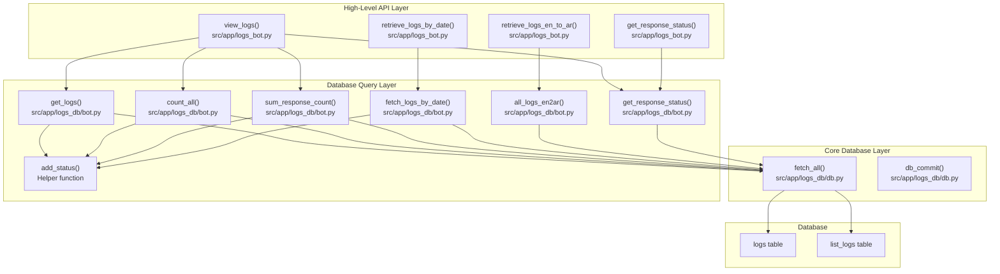
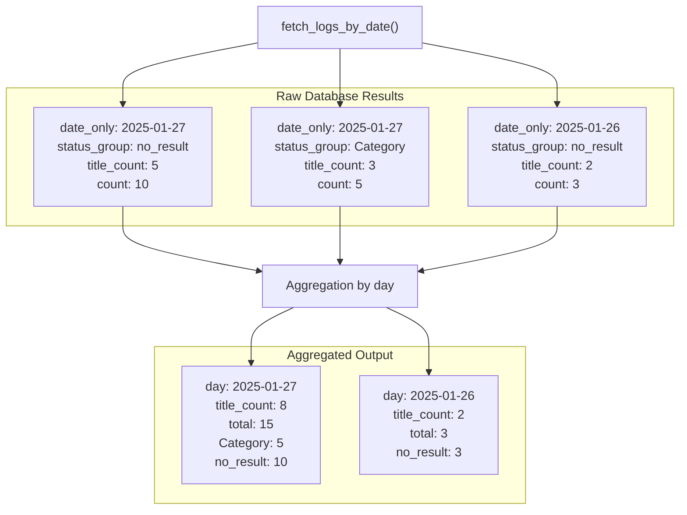
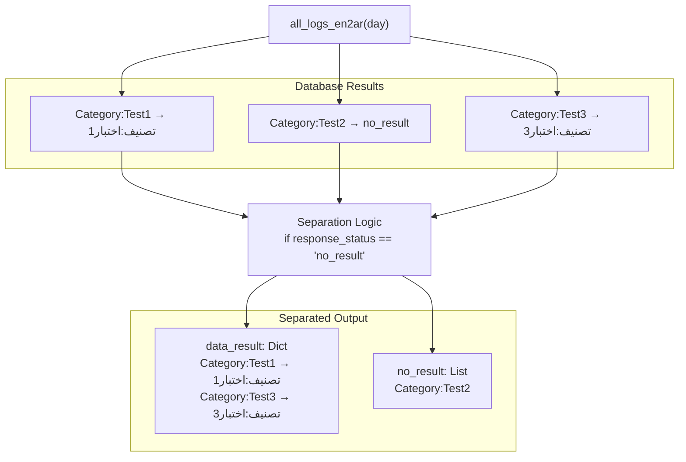
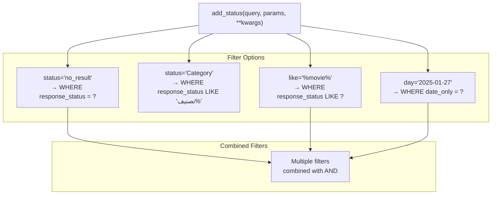
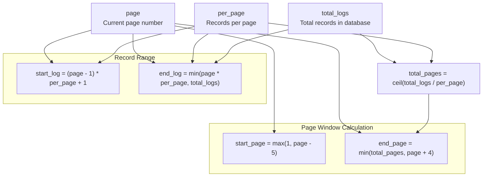
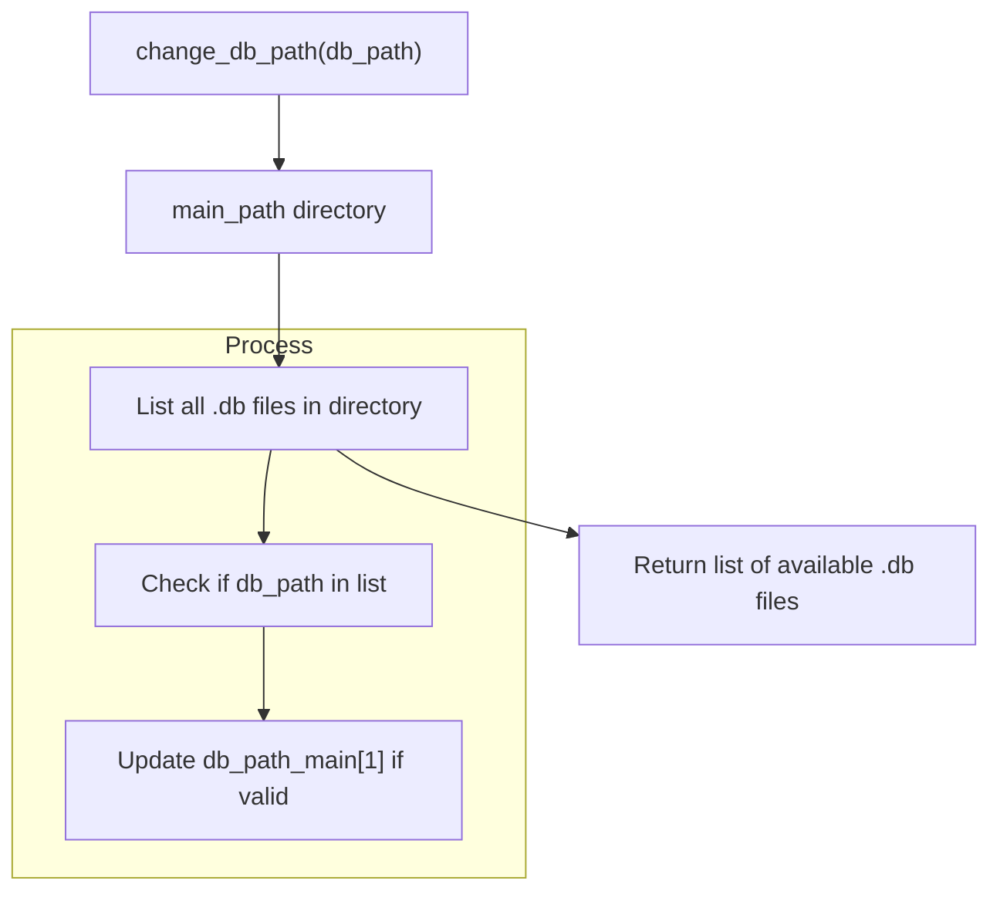

# Log Retrieval and Analysis

> **Relevant source files**
> * [.gitignore](https://github.com/ArWikiCats/ArWikiCatsWeb/blob/88f42d13/.gitignore)
> * [pyproject.toml](https://github.com/ArWikiCats/ArWikiCatsWeb/blob/88f42d13/pyproject.toml)
> * [pytest.ini](https://github.com/ArWikiCats/ArWikiCatsWeb/blob/88f42d13/pytest.ini)
> * [src/templates/logs.html](https://github.com/ArWikiCats/ArWikiCatsWeb/blob/88f42d13/src/templates/logs.html)
> * [tests/conftest.py](https://github.com/ArWikiCats/ArWikiCatsWeb/blob/88f42d13/tests/conftest.py)
> * [tests/test_api.py](https://github.com/ArWikiCats/ArWikiCatsWeb/blob/88f42d13/tests/test_api.py)
> * [tests/test_log.py](https://github.com/ArWikiCats/ArWikiCatsWeb/blob/88f42d13/tests/test_log.py)
> * [tests/test_logs_bot.py](https://github.com/ArWikiCats/ArWikiCatsWeb/blob/88f42d13/tests/test_logs_bot.py)

## Purpose and Scope

This document describes the log retrieval and analysis capabilities provided by the `logs_bot` module. It covers the functions that query, filter, aggregate, and transform log data from the SQLite database for presentation to users via the API or web interface.

For information about the database schema and tables structure, see [Log Database Schema](/ArWikiCats/ArWikiCatsWeb/6.1-log-database-schema). For details on how logs are initially recorded, see [Log Recording](/ArWikiCats/ArWikiCatsWeb/6.2-log-recording). For the web UI pages that consume these retrieval functions, see [Log Viewing Pages](/ArWikiCats/ArWikiCatsWeb/5.3-log-viewing-pages) and [Chart and Visualization Pages](/ArWikiCats/ArWikiCatsWeb/5.4-chart-and-visualization-pages).

---

## Module Architecture

The log retrieval system is organized into two layers:



**Sources:** [tests/test_logs_bot.py L1-L383](https://github.com/ArWikiCats/ArWikiCatsWeb/blob/88f42d13/tests/test_logs_bot.py#L1-L383)

 [tests/test_log.py L1-L521](https://github.com/ArWikiCats/ArWikiCatsWeb/blob/88f42d13/tests/test_log.py#L1-L521)

 [src/templates/logs.html L1-L267](https://github.com/ArWikiCats/ArWikiCatsWeb/blob/88f42d13/src/templates/logs.html#L1-L267)

---

## Core Retrieval Functions

### view_logs Function

The `view_logs()` function is the primary interface for retrieving paginated, filtered log data for display in the web UI.

#### Function Signature and Parameters

The function accepts a Flask `request` object and extracts the following query parameters:

| Parameter | Type | Default | Description |
| --- | --- | --- | --- |
| `page` | int | 1 | Current page number for pagination |
| `per_page` | int | 10 | Number of records per page |
| `order` | str | "DESC" | Sort order: "ASC" or "DESC" |
| `order_by` | str | "response_count" | Column to sort by |
| `status` | str | "" | Filter by response status |
| `like` | str | "" | LIKE pattern for filtering |
| `day` | str | "" | Filter by specific date (YYYY-MM-DD format) |
| `table_name` | str | "logs" | Target table: "logs" or "list_logs" |
| `db_path` | str | None | Optional database file path |

#### Return Structure



```mermaid
flowchart TD

ViewLogsFunc["view_logs()"]
LogsList["logs: List[Dict]<br>Log records"]
TabDict["tab: Dict<br>Pagination metadata"]
StatusTable["status_table: List[str]<br>Available status values"]
DbsOpt["dbs: List[str]<br>(optional) Available databases"]
Page["page: current page"]
PerPage["per_page: records per page"]
TotalPages["total_pages: total pages"]
TotalLogs["total_logs: total records"]
SumAll["sum_all: sum of response_count"]
StartLog["start_log: first record number"]
EndLog["end_log: last record number"]
StartPage["start_page: pagination start"]
EndPage["end_page: pagination end"]
OrderBy["order_by: sort column"]
Order["order: ASC/DESC"]
Status["status: filter value"]
Like["like: pattern filter"]
Day["day: date filter"]
TableName["table_name: target table"]
DbPath["db_path: database path"]

ViewLogsFunc --> LogsList
ViewLogsFunc --> TabDict
ViewLogsFunc --> StatusTable
ViewLogsFunc --> DbsOpt
TabDict --> Page
TabDict --> PerPage
TabDict --> TotalPages

subgraph subGraph1 ["Tab Dictionary Fields"]
    Page
    PerPage
    TotalPages
    TotalLogs
    SumAll
    StartLog
    EndLog
    StartPage
    EndPage
    OrderBy
    Order
    Status
    Like
    Day
    TableName
    DbPath
end

subgraph subGraph0 ["Return Dictionary"]
    LogsList
    TabDict
    StatusTable
    DbsOpt
end
```

**Sources:** [tests/test_logs_bot.py L10-L121](https://github.com/ArWikiCats/ArWikiCatsWeb/blob/88f42d13/tests/test_logs_bot.py#L10-L121)

 [src/templates/logs.html L1-L267](https://github.com/ArWikiCats/ArWikiCatsWeb/blob/88f42d13/src/templates/logs.html#L1-L267)

#### Data Transformation

The function performs several transformations on retrieved log data:

1. **Underscore Replacement**: Replaces underscores in `request_data` with spaces for better readability * Input: `"Category:Test_Data_Here"` * Output: `"Category:Test Data Here"`
2. **Pagination Calculation**: Computes window of page numbers to display (typically 10 pages)
3. **Record Range**: Calculates which records are displayed (e.g., "21-30 out of 150 records")

**Sources:** [tests/test_logs_bot.py L96-L121](https://github.com/ArWikiCats/ArWikiCatsWeb/blob/88f42d13/tests/test_logs_bot.py#L96-L121)

#### Table Name Validation

The function validates the `table_name` parameter against allowed values:

* Valid: `"logs"`, `"list_logs"`
* Invalid values default to `"logs"`

**Sources:** [tests/test_logs_bot.py L73-L94](https://github.com/ArWikiCats/ArWikiCatsWeb/blob/88f42d13/tests/test_logs_bot.py#L73-L94)

---

### retrieve_logs_by_date Function

This function aggregates log data by date for temporal analysis and charting.

#### Aggregation Structure



**Sources:** [tests/test_logs_bot.py L123-L183](https://github.com/ArWikiCats/ArWikiCatsWeb/blob/88f42d13/tests/test_logs_bot.py#L123-L183)

#### Return Structure

The function returns a dictionary with three keys:

| Key | Type | Description |
| --- | --- | --- |
| `logs` | List[Dict] | Aggregated log entries by date |
| `tab` | Dict | Metadata (table_name, db_path) |
| `logs_data` | Dict | Dictionary mapping dates to aggregated data |

Each entry in the `logs` list contains:

* `day`: Date string (YYYY-MM-DD)
* `title_count`: Total unique titles requested that day
* `total`: Total request count (sum of all status groups)
* Status-specific counts (e.g., `Category`, `no_result`, `success`)

**Sources:** [tests/test_logs_bot.py L134-L183](https://github.com/ArWikiCats/ArWikiCatsWeb/blob/88f42d13/tests/test_logs_bot.py#L134-L183)

#### Sorting Behavior

Results are sorted by date in ascending order, making it suitable for time-series charts.

**Sources:** [tests/test_logs_bot.py L169-L183](https://github.com/ArWikiCats/ArWikiCatsWeb/blob/88f42d13/tests/test_logs_bot.py#L169-L183)

---

### retrieve_logs_en_to_ar Function

This specialized function retrieves all English-to-Arabic category resolution logs and separates them into successful and failed resolutions.

#### Data Separation Logic



**Sources:** [tests/test_logs_bot.py L185-L247](https://github.com/ArWikiCats/ArWikiCatsWeb/blob/88f42d13/tests/test_logs_bot.py#L185-L247)

#### Return Structure

```css
{
    "tab": {
        "sum_all": "3",          # Total entries
        "sum_data_result": "2",  # Successful resolutions
        "sum_no_result": "1"     # Failed resolutions
    },
    "no_result": ["Category:Test2"],  # List of failed titles
    "data_result": {                   # Dict of successful resolutions
        "Category:Test1": "تصنيف:اختبار1",
        "Category:Test3": "تصنيف:اختبار3"
    }
}
```

**Sources:** [tests/test_logs_bot.py L189-L247](https://github.com/ArWikiCats/ArWikiCatsWeb/blob/88f42d13/tests/test_logs_bot.py#L189-L247)

#### Day Parameter Support

The function accepts an optional `day` parameter (YYYY-MM-DD format) to filter results for a specific date:

```
retrieve_logs_en_to_ar(day="2025-01-27")
```

**Sources:** [tests/test_logs_bot.py L225-L233](https://github.com/ArWikiCats/ArWikiCatsWeb/blob/88f42d13/tests/test_logs_bot.py#L225-L233)

---

## Query Filtering System

### add_status Helper Function

The `add_status()` helper function in `src/app/logs_db/bot.py` dynamically constructs WHERE clauses for filtering queries.

#### Filter Types Supported



**Sources:** [tests/test_log.py L13-L99](https://github.com/ArWikiCats/ArWikiCatsWeb/blob/88f42d13/tests/test_log.py#L13-L99)

#### Filter Combination Rules

1. **Status Filter**: Exact match on `response_status` * Special case: `status="Category"` becomes `response_status LIKE 'تصنيف%'`
2. **Like Filter**: Pattern matching on `response_status`
3. **Day Filter**: Validates format with regex `^\d{4}-\d{2}-\d{2}$` before applying
4. **Multiple Filters**: Combined with `AND` operator

**Sources:** [tests/test_log.py L39-L99](https://github.com/ArWikiCats/ArWikiCatsWeb/blob/88f42d13/tests/test_log.py#L39-L99)

#### Parameter Handling

The function accepts both tuple and list parameter arrays, converting tuples to lists for modification:

```sql
query = "SELECT * FROM logs"
params = ()  # Empty tuple
result_query, result_params = add_status(query, params, status="no_result")
# result_params is now a list: ["no_result"]
```

**Sources:** [tests/test_log.py L89-L99](https://github.com/ArWikiCats/ArWikiCatsWeb/blob/88f42d13/tests/test_log.py#L89-L99)

---

## Pagination System

### Pagination Calculation

The pagination system in `view_logs()` calculates a window of page numbers to display:



**Sources:** [src/templates/logs.html L127-L181](https://github.com/ArWikiCats/ArWikiCatsWeb/blob/88f42d13/src/templates/logs.html#L127-L181)

### UI Pagination Controls

The logs viewing page [src/templates/logs.html L127-L181](https://github.com/ArWikiCats/ArWikiCatsWeb/blob/88f42d13/src/templates/logs.html#L127-L181)

 renders pagination controls with:

* First page button (`«««`)
* Previous page button (`««`)
* Page number buttons (window of ~10 pages)
* Next page button (`»»`)
* Last page button (`»»»`)

Disabled states are applied when:

* On first page: First/Previous buttons disabled
* On last page: Next/Last buttons disabled

**Sources:** [src/templates/logs.html L127-L181](https://github.com/ArWikiCats/ArWikiCatsWeb/blob/88f42d13/src/templates/logs.html#L127-L181)

---

## Ordering and Sorting

### Valid Order Columns

The `order_by` parameter accepts these column names:

| Column Name | Description |
| --- | --- |
| `id` | Primary key |
| `endpoint` | API endpoint path |
| `request_data` | Category title requested |
| `response_status` | Resolution result |
| `response_time` | Processing time |
| `response_count` | Number of requests |
| `timestamp` | Last request timestamp |
| `date_only` | Date portion only |

Invalid column names default to `"timestamp"`.

**Sources:** [tests/test_logs_bot.py L312-L336](https://github.com/ArWikiCats/ArWikiCatsWeb/blob/88f42d13/tests/test_logs_bot.py#L312-L336)

### Order Direction

The `order` parameter accepts:

* `"DESC"`: Descending order (default)
* `"ASC"`: Ascending order
* Invalid values default to `"DESC"`

**Sources:** [tests/test_log.py L386-L427](https://github.com/ArWikiCats/ArWikiCatsWeb/blob/88f42d13/tests/test_log.py#L386-L427)

---

## Database Path Management

### change_db_path Function

The `change_db_path()` function in `src/app/logs_db/db.py` allows switching between different database files:



**Sources:** [tests/test_log.py L498-L521](https://github.com/ArWikiCats/ArWikiCatsWeb/blob/88f42d13/tests/test_log.py#L498-L521)

### Usage in view_logs

When `db_path` parameter is provided in the request:

1. `change_db_path(db_path)` is called
2. Returns list of available database files
3. If requested `db_path` not in list, defaults to primary database
4. List of databases included in response for UI dropdown

**Sources:** [tests/test_logs_bot.py L259-L311](https://github.com/ArWikiCats/ArWikiCatsWeb/blob/88f42d13/tests/test_logs_bot.py#L259-L311)

---

## Integration with Web UI

### Logs Viewing Page Flow

```mermaid
sequenceDiagram
  participant Browser
  participant ui.render_logs_view()
  participant view_logs(request)
  participant logs_db module
  participant logs.html

  Browser->>ui.render_logs_view(): GET /logs?page=2&status=no_result
  ui.render_logs_view()->>view_logs(request): Pass Flask request object
  view_logs(request)->>logs_db module: get_logs(per_page, offset, filters)
  logs_db module-->>view_logs(request): List of log records
  view_logs(request)->>logs_db module: count_all(filters)
  logs_db module-->>view_logs(request): Total count
  view_logs(request)->>logs_db module: sum_response_count(filters)
  logs_db module-->>view_logs(request): Sum of counts
  view_logs(request)-->>ui.render_logs_view(): Return dict with logs, tab, status_table
  ui.render_logs_view()->>logs.html: Render with result data
  logs.html-->>Browser: HTML with table and pagination
```

**Sources:** [src/templates/logs.html L1-L267](https://github.com/ArWikiCats/ArWikiCatsWeb/blob/88f42d13/src/templates/logs.html#L1-L267)

### Filter Form Processing

The logs page [src/templates/logs.html L32-L125](https://github.com/ArWikiCats/ArWikiCatsWeb/blob/88f42d13/src/templates/logs.html#L32-L125)

 provides a filter form with:

1. **Per Page Selector**: Dropdown with values [10, 20, 50, 100, 150, 200]
2. **Sort By Selector**: Dropdown with all valid column names
3. **Order Radio Buttons**: ASC/DESC options
4. **Status Selector**: Dropdown populated from `status_table`
5. **Like Input**: Text field for pattern matching
6. **Day Input**: Text field for date filtering (YYYY-MM-DD)
7. **Database Selector**: (Optional) Dropdown if multiple databases available

All filters preserve their values across page loads using form value attributes.

**Sources:** [src/templates/logs.html L32-L125](https://github.com/ArWikiCats/ArWikiCatsWeb/blob/88f42d13/src/templates/logs.html#L32-L125)

### Data Display Table

The results table [src/templates/logs.html L184-L220](https://github.com/ArWikiCats/ArWikiCatsWeb/blob/88f42d13/src/templates/logs.html#L184-L220)

 displays:

| Column | Data | Link |
| --- | --- | --- |
| ID | `log.id` | - |
| Request Data | `log.request_data` | Link to en.wikipedia.org |
| Status | `log.response_status` | Link to ar.wikipedia.org |
| Response Time | `log.response_time` | - |
| Count | `log.response_count` | - |
| Last Request | `log.timestamp` | - |
| Date | `log.date_only` | - |

**Sources:** [src/templates/logs.html L184-L220](https://github.com/ArWikiCats/ArWikiCatsWeb/blob/88f42d13/src/templates/logs.html#L184-L220)

---

## API Endpoints

### /api/logs Endpoint

This endpoint exposes the `view_logs()` functionality via REST API:

```css
# Example request
GET /api/logs?page=1&per_page=20&status=no_result&order=DESC&order_by=timestamp

# Response structure
{
    "logs": [...],
    "tab": {
        "page": 1,
        "per_page": 20,
        "total_pages": 15,
        ...
    },
    "status_table": ["all", "no_result", "Category", ...]
}
```

**Sources:** [tests/test_api.py L109-L117](https://github.com/ArWikiCats/ArWikiCatsWeb/blob/88f42d13/tests/test_api.py#L109-L117)

### /api/logs_by_day Endpoint

Exposes the `retrieve_logs_by_date()` functionality:

```css
# Example request
GET /api/logs_by_day

# Response structure
{
    "logs": [
        {
            "day": "2025-01-27",
            "title_count": 150,
            "total": 523,
            "Category": 120,
            "no_result": 30,
            ...
        },
        ...
    ],
    "tab": {...},
    "logs_data": {...}
}
```

**Sources:** [tests/test_api.py L90-L99](https://github.com/ArWikiCats/ArWikiCatsWeb/blob/88f42d13/tests/test_api.py#L90-L99)

### /api/all and /api/all/ Endpoints

These endpoints use `retrieve_logs_en_to_ar()`:

```css
# Request all logs
GET /api/all

# Request logs for specific day
GET /api/all/2025-01-27

# Response structure
{
    "tab": {
        "sum_all": "1523",
        "sum_data_result": "1400",
        "sum_no_result": "123"
    },
    "no_result": ["Category:...", ...],
    "data_result": {
        "Category:Test": "تصنيف:اختبار",
        ...
    }
}
```

**Sources:** [tests/test_api.py L118-L177](https://github.com/ArWikiCats/ArWikiCatsWeb/blob/88f42d13/tests/test_api.py#L118-L177)

---

## Performance Characteristics

### Query Optimization

1. **Indexed Columns**: The UNIQUE constraint on `(request_data, response_status, date_only)` creates an implicit index for efficient filtering
2. **Aggregation Efficiency**: The `fetch_logs_by_date()` query uses `GROUP BY` at the database level rather than application-level aggregation
3. **Pagination**: Uses SQL `LIMIT` and `OFFSET` clauses to fetch only required records

**Sources:** [tests/test_log.py L112-L139](https://github.com/ArWikiCats/ArWikiCatsWeb/blob/88f42d13/tests/test_log.py#L112-L139)

### Default Query Parameters

The system provides sensible defaults to optimize initial page loads:

* `per_page=10`: Small default page size
* `order_by="response_count"`: Shows most frequently requested categories first
* `order="DESC"`: Most recent/popular items first

**Sources:** [tests/test_logs_bot.py L21-L37](https://github.com/ArWikiCats/ArWikiCatsWeb/blob/88f42d13/tests/test_logs_bot.py#L21-L37)

---

## Testing Coverage

The logs_bot module has comprehensive test coverage:

### Test Classes

1. **TestViewLogs**: Tests core pagination and filtering functionality * Default parameters * Table name validation * Request data formatting * Pagination calculations
2. **TestRetrieveLogsByDate**: Tests date aggregation * Data aggregation by date * Sorting behavior * Multiple status groups per date
3. **TestRetrieveLogsEnToAr**: Tests result separation * Successful vs failed resolutions * Count calculations * Day parameter filtering
4. **TestViewLogsEdgeCases**: Tests edge cases * Database path switching * Invalid parameters * Default fallback behavior

**Sources:** [tests/test_logs_bot.py L1-L383](https://github.com/ArWikiCats/ArWikiCatsWeb/blob/88f42d13/tests/test_logs_bot.py#L1-L383)