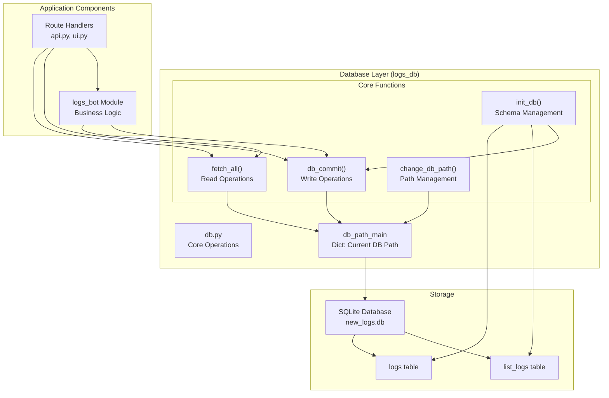
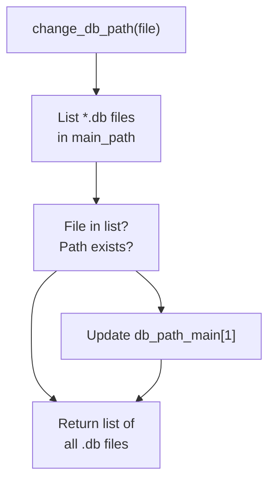
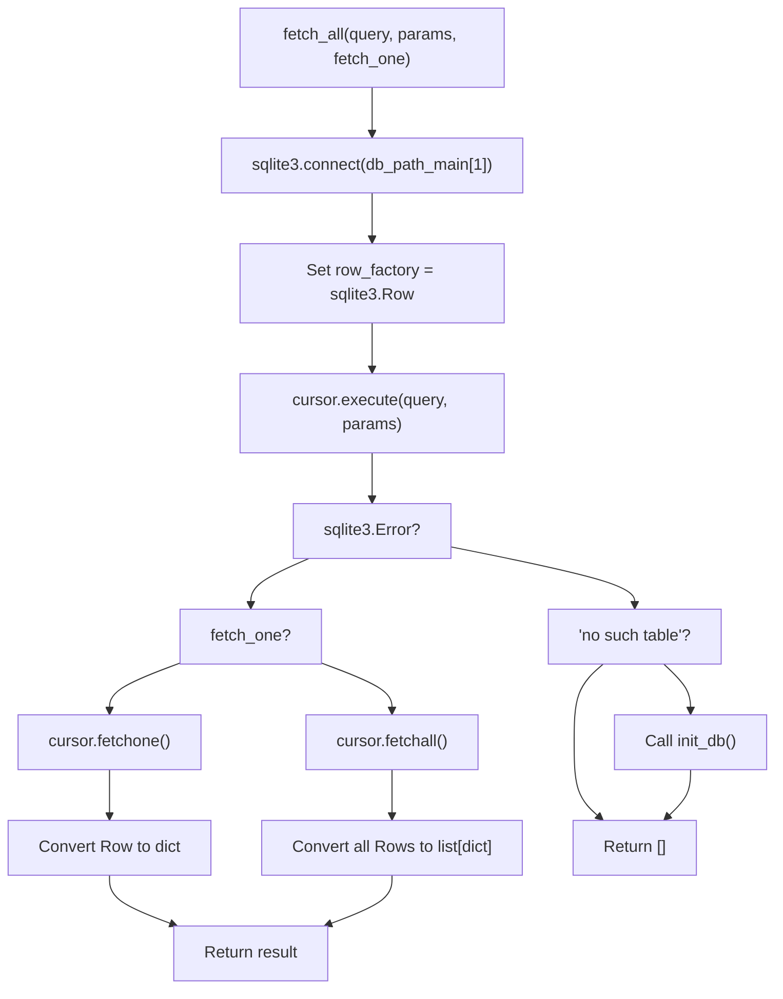
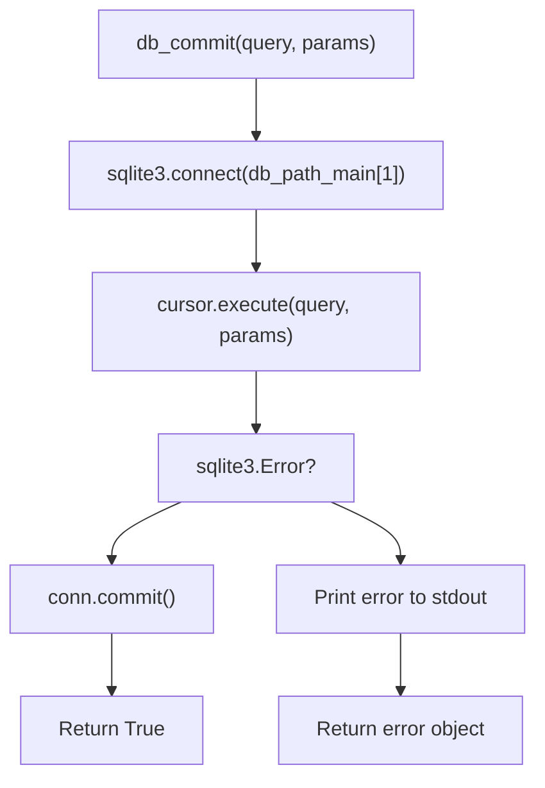
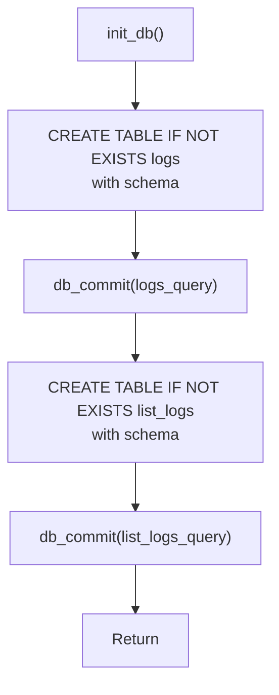

# Database Layer

> **Relevant source files**
> * [pyproject.toml](https://github.com/ArWikiCats/ArWikiCatsWeb/blob/88f42d13/pyproject.toml)
> * [pytest.ini](https://github.com/ArWikiCats/ArWikiCatsWeb/blob/88f42d13/pytest.ini)
> * [src/app/logs_db/db.py](https://github.com/ArWikiCats/ArWikiCatsWeb/blob/88f42d13/src/app/logs_db/db.py)
> * [src/app/routes/__init__.py](https://github.com/ArWikiCats/ArWikiCatsWeb/blob/88f42d13/src/app/routes/__init__.py)
> * [tests/conftest.py](https://github.com/ArWikiCats/ArWikiCatsWeb/blob/88f42d13/tests/conftest.py)
> * [tests/test_db_operations.py](https://github.com/ArWikiCats/ArWikiCatsWeb/blob/88f42d13/tests/test_db_operations.py)
> * [tests/test_log.py](https://github.com/ArWikiCats/ArWikiCatsWeb/blob/88f42d13/tests/test_log.py)
> * [tests/test_ui.py](https://github.com/ArWikiCats/ArWikiCatsWeb/blob/88f42d13/tests/test_ui.py)

## Purpose and Scope

The Database Layer provides a thin abstraction over SQLite database operations for the ArWikiCatsWeb application. This module is located in `src/app/logs_db/` and is responsible for managing database connections, executing queries, and maintaining the schema for API request logs.

For higher-level log retrieval and analysis operations that use this database layer, see [Log Retrieval and Analysis](/ArWikiCats/ArWikiCatsWeb/6.3-log-retrieval-and-analysis). For information about how logs are recorded into the database, see [Log Recording](/ArWikiCats/ArWikiCatsWeb/6.2-log-recording). For the database schema details, see [Log Database Schema](/ArWikiCats/ArWikiCatsWeb/6.1-log-database-schema).

**Sources:** [src/app/logs_db/db.py L1-L105](https://github.com/ArWikiCats/ArWikiCatsWeb/blob/88f42d13/src/app/logs_db/db.py#L1-L105)

## Architecture Overview

The database layer consists of a single module that provides low-level database operations. It is designed to be simple and focused, with all complexity handled at higher layers.



**Architecture Pattern:** The database layer uses a simple functional approach with a module-level state dictionary (`db_path_main`) to track the current database file path. All database operations go through context managers to ensure proper connection handling.

**Sources:** [src/app/logs_db/db.py L1-L105](https://github.com/ArWikiCats/ArWikiCatsWeb/blob/88f42d13/src/app/logs_db/db.py#L1-L105)

 [tests/test_log.py L101-L222](https://github.com/ArWikiCats/ArWikiCatsWeb/blob/88f42d13/tests/test_log.py#L101-L222)

 [tests/test_db_operations.py L1-L409](https://github.com/ArWikiCats/ArWikiCatsWeb/blob/88f42d13/tests/test_db_operations.py#L1-L409)

## Database Path Management

The database layer maintains a configurable database file path that can be changed at runtime to support multiple database files.

### Path Initialization

The default database path is determined during module initialization:

| Component | Value | Description |
| --- | --- | --- |
| `HOME` | Environment variable | Retrieved via `os.getenv("HOME")` |
| `main_path` | `{HOME}/www/python/dbs` or fallback | Primary storage directory |
| `db_path_main` | Dictionary `{1: path_string}` | Current active database path |
| Default DB | `new_logs.db` | Default database filename |

The path resolution logic creates the directory if it doesn't exist and falls back to the module's parent directory if `HOME` is not set.

**Sources:** [src/app/logs_db/db.py L11-L17](https://github.com/ArWikiCats/ArWikiCatsWeb/blob/88f42d13/src/app/logs_db/db.py#L11-L17)

### change_db_path Function



The `change_db_path(file)` function serves dual purposes:

1. **Switch Active Database:** If the specified file exists in `main_path`, updates `db_path_main[1]` to point to it
2. **Enumerate Databases:** Always returns a list of all `.db` files in the directory

**Function Signature:** `change_db_path(file) -> list`

**Sources:** [src/app/logs_db/db.py L20-L32](https://github.com/ArWikiCats/ArWikiCatsWeb/blob/88f42d13/src/app/logs_db/db.py#L20-L32)

 [tests/test_log.py L498-L521](https://github.com/ArWikiCats/ArWikiCatsWeb/blob/88f42d13/tests/test_log.py#L498-L521)

## Core Database Operations

The database layer provides two primary functions for interacting with SQLite: `fetch_all` for read operations and `db_commit` for write operations.

### fetch_all Function

Executes SELECT queries and returns results as dictionaries.

**Function Signature:**

```
fetch_all(query, params=[], fetch_one=False) -> list[dict] | dict | []
```

**Parameters:**

| Parameter | Type | Default | Description |
| --- | --- | --- | --- |
| `query` | str | Required | SQL SELECT statement |
| `params` | list | `[]` | Parameterized query values |
| `fetch_one` | bool | `False` | Return single dict instead of list |

**Return Values:**

| Condition | Return Type | Description |
| --- | --- | --- |
| Multiple rows | `list[dict]` | List of dictionaries (one per row) |
| Single row (`fetch_one=True`) | `dict` or `None` | Single dictionary or None if no match |
| No results | `[]` | Empty list |
| Database error | `[]` | Empty list (error printed to stdout) |

**Key Implementation Details:**

1. **Row Factory:** Uses `sqlite3.Row` to enable dictionary-style access to columns
2. **Context Manager:** Automatically handles connection lifecycle
3. **Error Recovery:** Calls `init_db()` if table doesn't exist
4. **Unicode Safe:** Handles Arabic and special characters correctly



**Sources:** [src/app/logs_db/db.py L80-L104](https://github.com/ArWikiCats/ArWikiCatsWeb/blob/88f42d13/src/app/logs_db/db.py#L80-L104)

 [tests/test_log.py L160-L206](https://github.com/ArWikiCats/ArWikiCatsWeb/blob/88f42d13/tests/test_log.py#L160-L206)

 [tests/test_db_operations.py L38-L90](https://github.com/ArWikiCats/ArWikiCatsWeb/blob/88f42d13/tests/test_db_operations.py#L38-L90)

### db_commit Function

Executes INSERT, UPDATE, DELETE, or other write operations.

**Function Signature:**

```
db_commit(query, params=[]) -> bool | sqlite3.Error
```

**Parameters:**

| Parameter | Type | Default | Description |
| --- | --- | --- | --- |
| `query` | str | Required | SQL statement (INSERT, UPDATE, etc.) |
| `params` | list | `[]` | Parameterized query values |

**Return Values:**

| Condition | Return Value | Description |
| --- | --- | --- |
| Success | `True` | Transaction committed successfully |
| Error | `sqlite3.Error` | The exception object (not raised) |

**Key Implementation Details:**

1. **Transaction Safety:** Uses context manager with automatic commit
2. **Error Handling:** Returns error object instead of raising exceptions
3. **Parameterized Queries:** Always use params list to prevent SQL injection



**Sources:** [src/app/logs_db/db.py L35-L45](https://github.com/ArWikiCats/ArWikiCatsWeb/blob/88f42d13/src/app/logs_db/db.py#L35-L45)

 [tests/test_log.py L207-L222](https://github.com/ArWikiCats/ArWikiCatsWeb/blob/88f42d13/tests/test_log.py#L207-L222)

 [tests/test_db_operations.py L95-L112](https://github.com/ArWikiCats/ArWikiCatsWeb/blob/88f42d13/tests/test_db_operations.py#L95-L112)

## Database Schema

The database contains two tables with identical schemas: `logs` for single category lookups and `list_logs` for batch operations.

### Table Structure

Both `logs` and `list_logs` tables share the following schema:

| Column | Type | Constraints | Description |
| --- | --- | --- | --- |
| `id` | INTEGER | PRIMARY KEY AUTOINCREMENT | Unique identifier |
| `endpoint` | TEXT | NOT NULL | API endpoint path (e.g., `/api/en_to_ar`) |
| `request_data` | TEXT | NOT NULL | Input category (e.g., `Category:Test`) |
| `response_status` | TEXT | NOT NULL | Output category or status (e.g., `تصنيف:اختبار` or `no_result`) |
| `response_time` | REAL | - | Request processing time in seconds |
| `response_count` | INTEGER | DEFAULT 1 | Number of times this combination occurred |
| `timestamp` | DATETIME | DEFAULT CURRENT_TIMESTAMP | Most recent occurrence timestamp |
| `date_only` | DATE | DEFAULT (DATE('now')) | Date portion for grouping |

**Unique Constraint:**

```
UNIQUE(request_data, response_status, date_only)
```

This constraint enables efficient upsert operations: if the same request produces the same response on the same day, the `response_count` is incremented instead of creating a duplicate row.

**Sources:** [src/app/logs_db/db.py L48-L77](https://github.com/ArWikiCats/ArWikiCatsWeb/blob/88f42d13/src/app/logs_db/db.py#L48-L77)

 [tests/test_db_operations.py L21-L32](https://github.com/ArWikiCats/ArWikiCatsWeb/blob/88f42d13/tests/test_db_operations.py#L21-L32)

 [tests/test_log.py L112-L139](https://github.com/ArWikiCats/ArWikiCatsWeb/blob/88f42d13/tests/test_log.py#L112-L139)

### Schema Diagram

_Schema diagram will be added here once finalized._

**Table Separation Rationale:**

* `logs`: Stores single category resolution requests from `/api/en_to_ar` and similar endpoints
* `list_logs`: Stores batch category resolution requests from `/api/list`

This separation allows for independent querying and analysis of single vs. batch operations.

**Sources:** [src/app/logs_db/db.py L48-L77](https://github.com/ArWikiCats/ArWikiCatsWeb/blob/88f42d13/src/app/logs_db/db.py#L48-L77)

## Database Initialization

The `init_db()` function creates the database schema if it doesn't already exist.

### init_db Function

**Function Signature:**

```
init_db() -> None
```

**Behavior:**

1. Executes `CREATE TABLE IF NOT EXISTS logs (...)` via `db_commit()`
2. Executes `CREATE TABLE IF NOT EXISTS list_logs (...)` via `db_commit()`
3. **Idempotent:** Safe to call multiple times; does not error if tables exist
4. **Automatic Invocation:** Called by `fetch_all()` when "no such table" error occurs



**Usage Patterns:**

| Context | Trigger | Purpose |
| --- | --- | --- |
| Application startup | Explicit call | Ensure database exists before first request |
| Error recovery | `fetch_all()` catches "no such table" | Automatically recreate missing tables |
| Testing | Test fixtures | Create fresh database for each test |

**Sources:** [src/app/logs_db/db.py L48-L77](https://github.com/ArWikiCats/ArWikiCatsWeb/blob/88f42d13/src/app/logs_db/db.py#L48-L77)

 [tests/test_db_operations.py L339-L409](https://github.com/ArWikiCats/ArWikiCatsWeb/blob/88f42d13/tests/test_db_operations.py#L339-L409)

## Connection Management and Error Handling

The database layer implements consistent patterns for connection management and error handling across all operations.

### Connection Pattern

All database operations use Python's context manager protocol (`with` statement) to ensure proper resource cleanup:

```markdown
with sqlite3.connect(db_path_main[1]) as conn:
    # Database operations
    conn.commit()  # Automatic commit on success
# Automatic connection close on exit
```

**Benefits:**

* **Automatic Cleanup:** Connection closed even if exception occurs
* **Transaction Safety:** Automatic rollback on error
* **Resource Management:** No connection leaks

**Sources:** [src/app/logs_db/db.py L37-L40](https://github.com/ArWikiCats/ArWikiCatsWeb/blob/88f42d13/src/app/logs_db/db.py#L37-L40)

 [src/app/logs_db/db.py L82-L88](https://github.com/ArWikiCats/ArWikiCatsWeb/blob/88f42d13/src/app/logs_db/db.py#L82-L88)

### Error Handling Strategy

The database layer employs a defensive error handling strategy that prioritizes application stability over strict error propagation.

| Function | Error Handling | Return Value on Error | Side Effect |
| --- | --- | --- | --- |
| `fetch_all()` | Catch `sqlite3.Error` | Empty list `[]` | Print error, call `init_db()` if table missing |
| `db_commit()` | Catch `sqlite3.Error` | Return exception object | Print error message |
| `init_db()` | Relies on `db_commit()` | N/A | Errors printed by `db_commit()` |

**Error Logging:**

* Errors are printed to stdout using `print()` statements
* Format: `"Database error in {context}: {error_message}"`
* Example: `"init_db Database error: near 'INVALID': syntax error"`

**Self-Healing Behavior:**

When `fetch_all()` encounters a "no such table" error:

1. Prints diagnostic message
2. Calls `init_db()` to recreate tables
3. Returns empty list (subsequent call will succeed)

**Sources:** [src/app/logs_db/db.py L98-L102](https://github.com/ArWikiCats/ArWikiCatsWeb/blob/88f42d13/src/app/logs_db/db.py#L98-L102)

 [src/app/logs_db/db.py L43-L45](https://github.com/ArWikiCats/ArWikiCatsWeb/blob/88f42d13/src/app/logs_db/db.py#L43-L45)

 [tests/test_db_operations.py L92-L132](https://github.com/ArWikiCats/ArWikiCatsWeb/blob/88f42d13/tests/test_db_operations.py#L92-L132)

### Special Character and Unicode Handling

The database layer correctly handles Arabic text, special characters, and Unicode throughout:

**Test Coverage Includes:**

* Arabic category names: `تصنيف:اختبار_عربي`
* Quotes and special characters: `Category:Test'Quote"Double`
* Mixed Unicode: Combined English and Arabic text

**Implementation:** SQLite3's native Unicode support combined with proper parameterized queries ensures safe handling without additional encoding/decoding logic.

**Sources:** [tests/test_db_operations.py L51-L89](https://github.com/ArWikiCats/ArWikiCatsWeb/blob/88f42d13/tests/test_db_operations.py#L51-L89)

## Summary of Key Design Decisions

| Decision | Rationale | Trade-off |
| --- | --- | --- |
| Dictionary return format | Easy consumption by Flask templates and JSON serialization | Slight memory overhead vs. tuples |
| Module-level `db_path_main` | Simple state management for path switching | Global state (acceptable for single-threaded Flask app) |
| Return errors instead of raising | Prevents crashes from database issues | Caller must check return value |
| Separate tables for logs vs list_logs | Independent analysis of single vs. batch operations | Schema duplication |
| UNIQUE constraint with date_only | Automatic deduplication per day | Must handle conflict resolution in ON CONFLICT clauses |
| `sqlite3.Row` factory | Named column access in queries | Slight overhead vs. default tuple access |
| Self-healing on missing table | Automatic recovery from database deletion | May mask underlying issues |

**Sources:** [src/app/logs_db/db.py L1-L105](https://github.com/ArWikiCats/ArWikiCatsWeb/blob/88f42d13/src/app/logs_db/db.py#L1-L105)

 [tests/test_db_operations.py L1-L409](https://github.com/ArWikiCats/ArWikiCatsWeb/blob/88f42d13/tests/test_db_operations.py#L1-L409)
