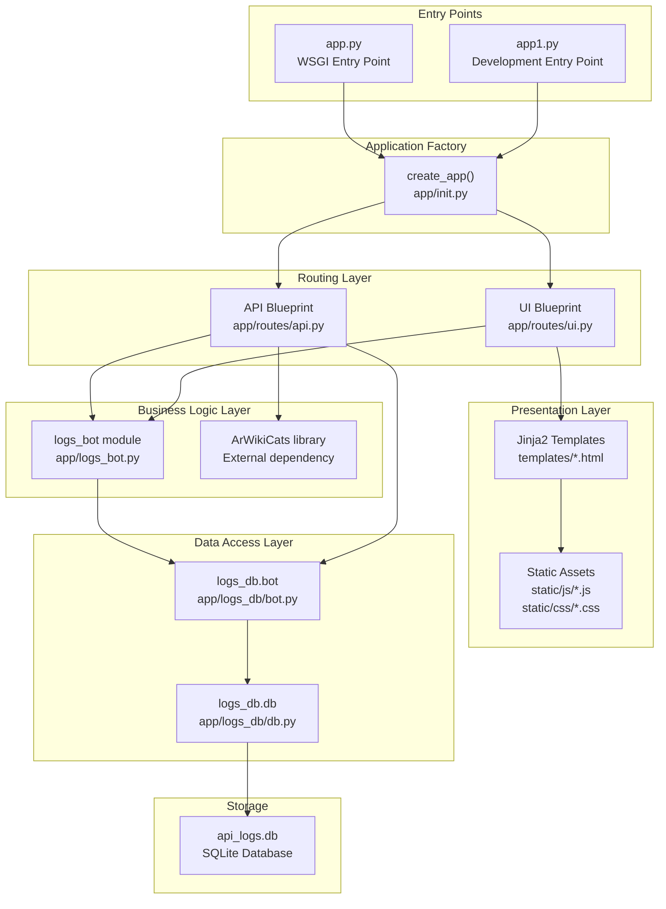
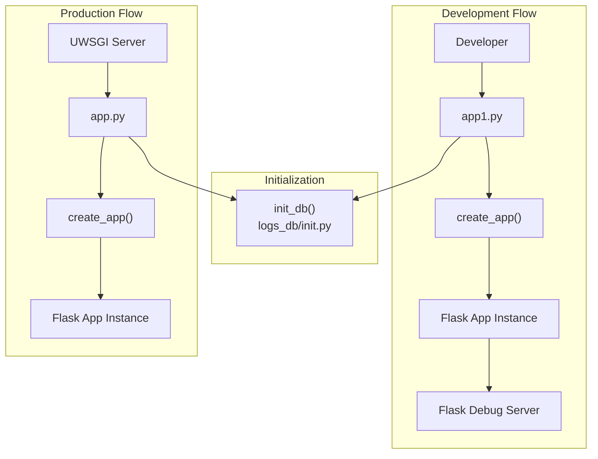
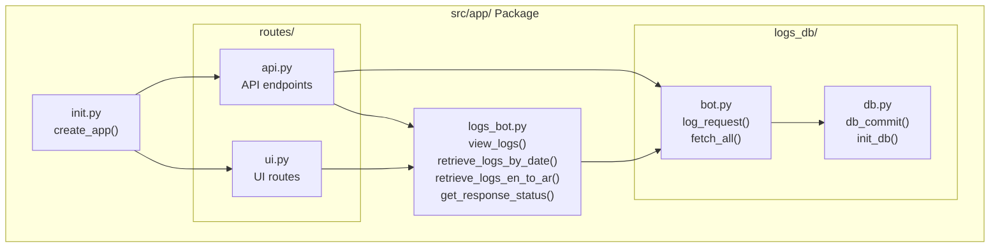
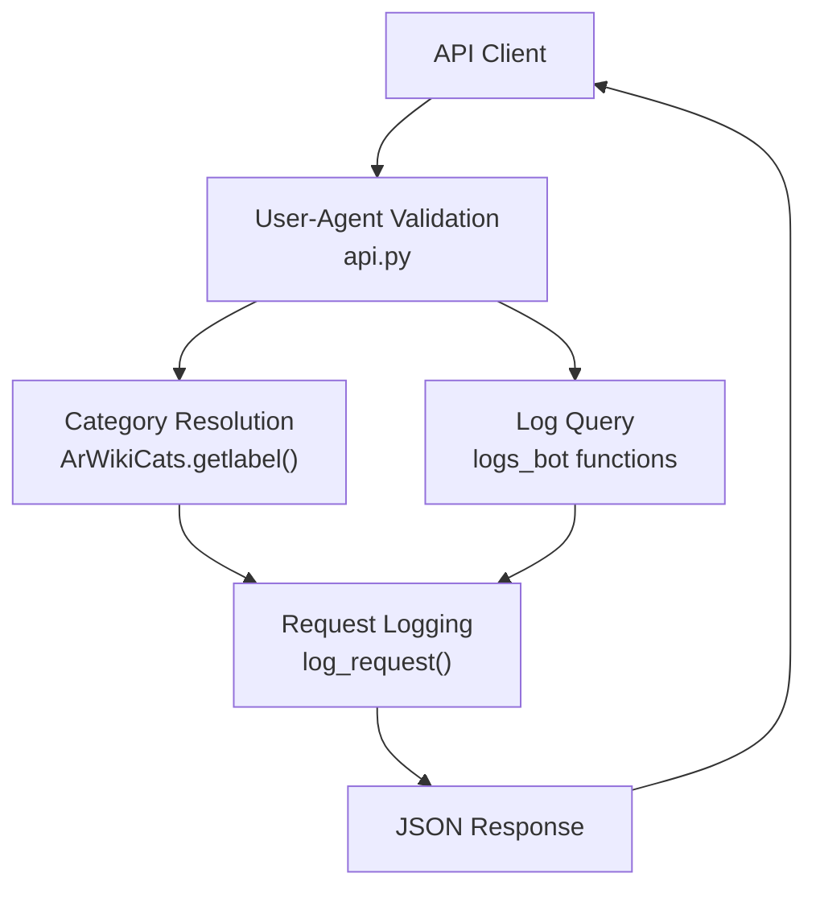
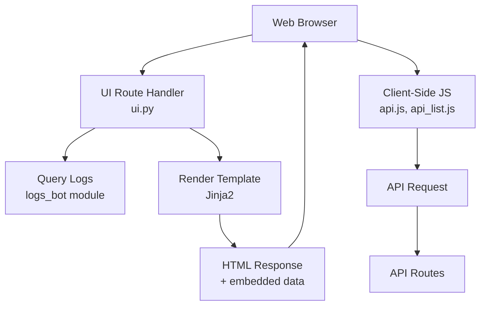
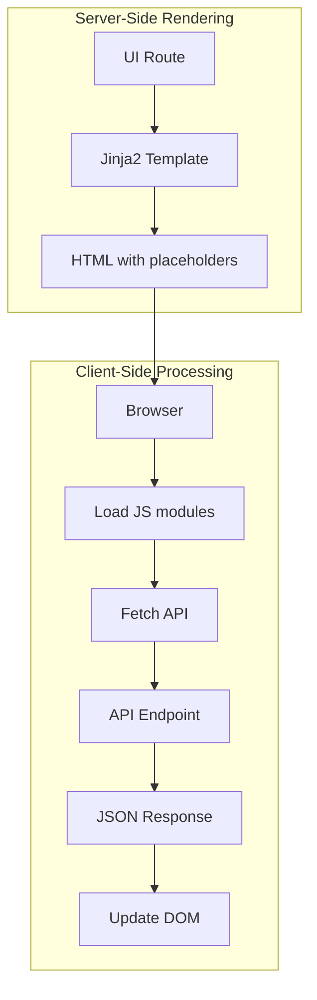

# Architecture

> **Relevant source files**
> * [README.md](https://github.com/ArWikiCats/ArWikiCatsWeb/blob/88f42d13/README.md)
> * [service.template](https://github.com/ArWikiCats/ArWikiCatsWeb/blob/88f42d13/service.template)
> * [src/app.py](https://github.com/ArWikiCats/ArWikiCatsWeb/blob/88f42d13/src/app.py)

## Purpose and Scope

This document explains the overall architectural structure of ArWikiCatsWeb, including the application factory pattern, component organization, and request flow patterns. It provides a high-level view of how the system's modules interact and how requests are processed through different layers.

For detailed information about specific components:

* Application initialization and WSGI entry points: see [Application Core](/ArWikiCats/ArWikiCatsWeb/3.1-application-core)
* Blueprint registration and route organization: see [Routing and Blueprints](/ArWikiCats/ArWikiCatsWeb/3.2-routing-and-blueprints)
* REST API implementation details: see [REST API](/ArWikiCats/ArWikiCatsWeb/4-rest-api)
* Web interface implementation: see [Web Interface](/ArWikiCats/ArWikiCatsWeb/5-web-interface)
* Database operations: see [Database Layer](/ArWikiCats/ArWikiCatsWeb/7-database-layer)

## Layered Architecture

ArWikiCatsWeb follows a layered architecture pattern that separates concerns into distinct tiers. The application is structured as a Flask web application with clear boundaries between presentation, business logic, and data access layers.

**Sources:** [src/app.py L1-L16](https://github.com/ArWikiCats/ArWikiCatsWeb/blob/88f42d13/src/app.py#L1-L16)

 [src/app/__init__.py](https://github.com/ArWikiCats/ArWikiCatsWeb/blob/88f42d13/src/app/__init__.py)

 [src/app/routes/api.py](https://github.com/ArWikiCats/ArWikiCatsWeb/blob/88f42d13/src/app/routes/api.py)

 [src/app/routes/ui.py](https://github.com/ArWikiCats/ArWikiCatsWeb/blob/88f42d13/src/app/routes/ui.py)

 [src/app/logs_bot.py](https://github.com/ArWikiCats/ArWikiCatsWeb/blob/88f42d13/src/app/logs_bot.py)

 [src/app/logs_db/bot.py](https://github.com/ArWikiCats/ArWikiCatsWeb/blob/88f42d13/src/app/logs_db/bot.py)

 [src/app/logs_db/db.py](https://github.com/ArWikiCats/ArWikiCatsWeb/blob/88f42d13/src/app/logs_db/db.py)

 [README.md L74-L108](https://github.com/ArWikiCats/ArWikiCatsWeb/blob/88f42d13/README.md#L74-L108)

## Application Factory Pattern

The application uses the **factory pattern** through the `create_app()` function located in [src/app/__init__.py](https://github.com/ArWikiCats/ArWikiCatsWeb/blob/88f42d13/src/app/__init__.py)

 This pattern provides several architectural benefits:

| Benefit | Description |
| --- | --- |
| **Testability** | Enables creating multiple application instances with different configurations for testing |
| **Modularity** | Centralizes application initialization and configuration |
| **Flexibility** | Supports different configurations for development, testing, and production |

### Entry Points

The application has two distinct entry points:

1. **Production Entry Point**: [src/app.py L1-L16](https://github.com/ArWikiCats/ArWikiCatsWeb/blob/88f42d13/src/app.py#L1-L16) * WSGI-compatible entry point for production deployment * Imports `create_app()` from the `app` package * Initializes the database via `init_db()` when run directly * Creates the Flask application instance as `app` variable for UWSGI
2. **Development Entry Point**: `src/app1.py` * Alternative entry point for local development * Similar structure to `app.py` but may have different debug settings

**Sources:** [src/app.py L1-L16](https://github.com/ArWikiCats/ArWikiCatsWeb/blob/88f42d13/src/app.py#L1-L16)

 [README.md L45-L55](https://github.com/ArWikiCats/ArWikiCatsWeb/blob/88f42d13/README.md#L45-L55)

## Component Organization

The codebase follows a modular structure with clear separation between different functional areas:

### Directory Structure

| Directory/Module | Purpose | Key Components |
| --- | --- | --- |
| `src/app/` | Application package root | `__init__.py` (factory function) |
| `src/app/routes/` | Request routing layer | `api.py`, `ui.py` |
| `src/app/logs_db/` | Data access layer | `bot.py`, `db.py` |
| `src/app/logs_bot.py` | Business logic for log retrieval | Query functions, status processing |
| `src/templates/` | Presentation layer | Jinja2 HTML templates |
| `src/static/` | Client-side assets | JavaScript modules, CSS files |
| `tests/` | Test suite | Unit and integration tests |

**Sources:** [README.md L74-L108](https://github.com/ArWikiCats/ArWikiCatsWeb/blob/88f42d13/README.md#L74-L108)

## Request Processing Flow

The application handles two distinct types of requests with different processing patterns:

### API Request Flow

API requests are processed through the `api.py` blueprint with validation, business logic, and logging:

**Key Functions:**

* User-Agent validation in [src/app/routes/api.py](https://github.com/ArWikiCats/ArWikiCatsWeb/blob/88f42d13/src/app/routes/api.py)
* Category resolution via `ArWikiCats.getlabel()` method
* Request logging via `log_request()` in [src/app/logs_db/bot.py](https://github.com/ArWikiCats/ArWikiCatsWeb/blob/88f42d13/src/app/logs_db/bot.py)

### UI Request Flow

UI requests are processed through the `ui.py` blueprint, rendering server-side templates that load client-side JavaScript for API interaction:

**Sources:** [src/app/routes/api.py](https://github.com/ArWikiCats/ArWikiCatsWeb/blob/88f42d13/src/app/routes/api.py)

 [src/app/routes/ui.py](https://github.com/ArWikiCats/ArWikiCatsWeb/blob/88f42d13/src/app/routes/ui.py)

 Diagram 2 from high-level architecture

## Key Architectural Patterns

### Blueprint Pattern

The application uses Flask's **Blueprint** pattern to organize routes into logical modules:

| Blueprint | Purpose | Registration |
| --- | --- | --- |
| `api_blueprint` | REST API endpoints | Registered with `/api` prefix |
| `ui_blueprint` | Web interface routes | Registered at root path `/` |

Each blueprint is self-contained and registered with the application factory during initialization.

**Sources:** [src/app/routes/api.py](https://github.com/ArWikiCats/ArWikiCatsWeb/blob/88f42d13/src/app/routes/api.py)

 [src/app/routes/ui.py](https://github.com/ArWikiCats/ArWikiCatsWeb/blob/88f42d13/src/app/routes/ui.py)

 [README.md L110-L176](https://github.com/ArWikiCats/ArWikiCatsWeb/blob/88f42d13/README.md#L110-L176)

### Separation of Concerns

The architecture enforces strict separation between layers:

1. **Routing Layer** (`routes/`): Handles HTTP requests/responses, validation, error handling
2. **Business Logic Layer** (`logs_bot.py`): Implements domain logic for log processing and analysis
3. **Data Access Layer** (`logs_db/`): Abstracts database operations with two-tier structure: * `bot.py`: High-level operations (`log_request`, `fetch_all`) * `db.py`: Low-level database primitives (`db_commit`, `init_db`)

### Hybrid Rendering Strategy

The application employs a **hybrid server-side and client-side rendering** approach:

* Server-side: Jinja2 templates render initial page structure and static content
* Client-side: JavaScript modules (`api.js`, `api_list.js`, `x.js`) fetch dynamic data via AJAX

This pattern optimizes for both initial page load performance and interactive user experience.

**Sources:** [src/templates/](https://github.com/ArWikiCats/ArWikiCatsWeb/blob/88f42d13/src/templates/)

 [src/static/js/](https://github.com/ArWikiCats/ArWikiCatsWeb/blob/88f42d13/src/static/js/)

 Diagram 5 from high-level architecture

## Configuration and Deployment Architecture

The application is configured for deployment on **Wikimedia Toolforge** using Kubernetes:

| Configuration | Value | File |
| --- | --- | --- |
| Backend | Kubernetes | [service.template L7](https://github.com/ArWikiCats/ArWikiCatsWeb/blob/88f42d13/service.template#L7-L7) |
| Python Version | 3.11 | [service.template L20](https://github.com/ArWikiCats/ArWikiCatsWeb/blob/88f42d13/service.template#L20-L20) |
| CPU Allocation | 3 cores | [service.template L10](https://github.com/ArWikiCats/ArWikiCatsWeb/blob/88f42d13/service.template#L10-L10) |
| Memory | 6Gi | [service.template L13](https://github.com/ArWikiCats/ArWikiCatsWeb/blob/88f42d13/service.template#L13-L13) |
| Replicas | 2 | [service.template L16](https://github.com/ArWikiCats/ArWikiCatsWeb/blob/88f42d13/service.template#L16-L16) |

The high-availability setup with 2 replicas ensures continuous service even during pod restarts or updates.

**Sources:** [service.template L1-L27](https://github.com/ArWikiCats/ArWikiCatsWeb/blob/88f42d13/service.template#L1-L27)

 [README.md L196-L215](https://github.com/ArWikiCats/ArWikiCatsWeb/blob/88f42d13/README.md#L196-L215)

## Summary

ArWikiCatsWeb implements a well-structured Flask application with:

* **Factory Pattern**: Centralized application initialization via `create_app()`
* **Layered Architecture**: Clear separation between routing, business logic, and data access
* **Blueprint Organization**: Modular route handlers for API and UI
* **Dual Entry Points**: Separate configurations for production (UWSGI) and development
* **Hybrid Rendering**: Server-side templates with client-side dynamic updates
* **High Availability**: Kubernetes deployment with 2 replicas

This architecture supports both programmatic access via REST API and human interaction via web interface, while maintaining comprehensive logging for observability and analytics.