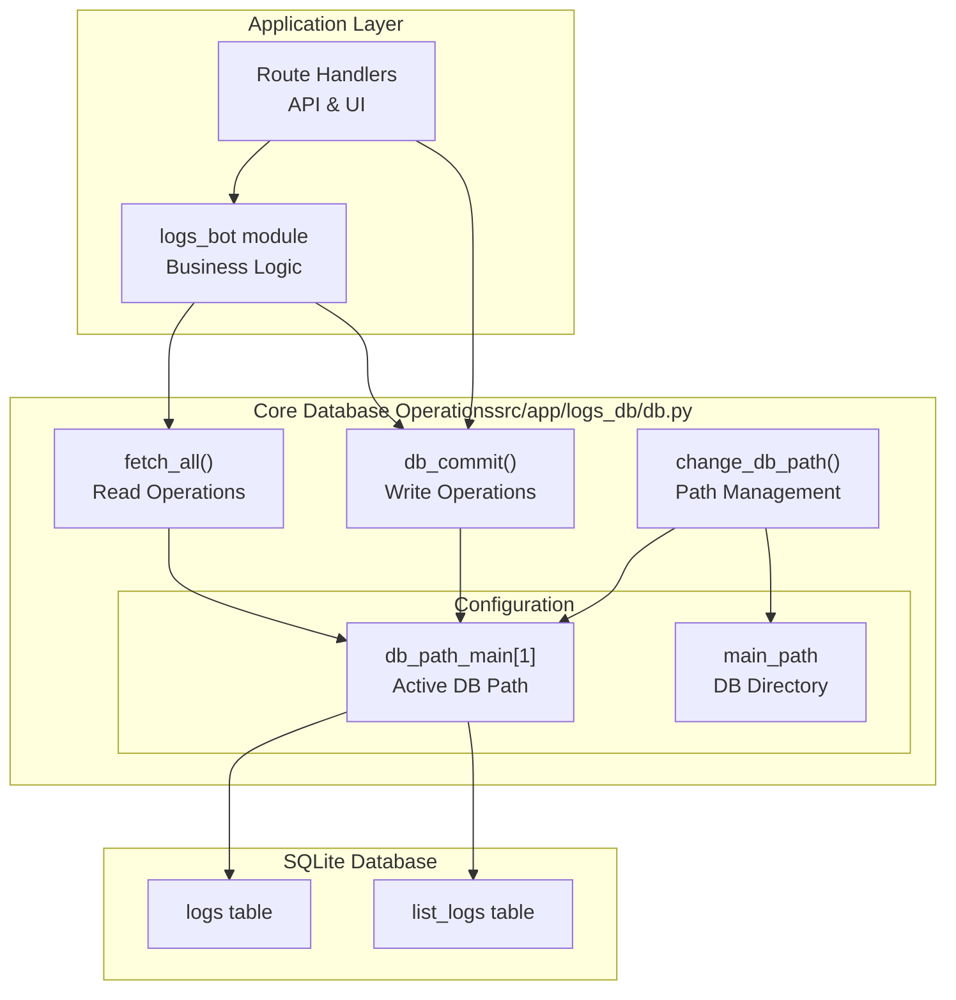
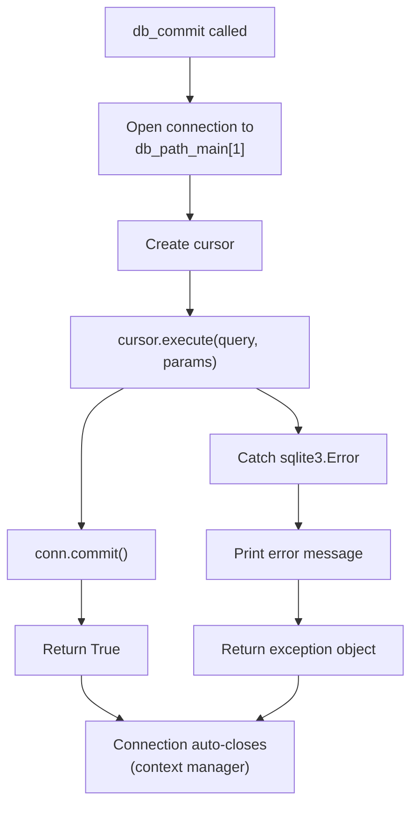
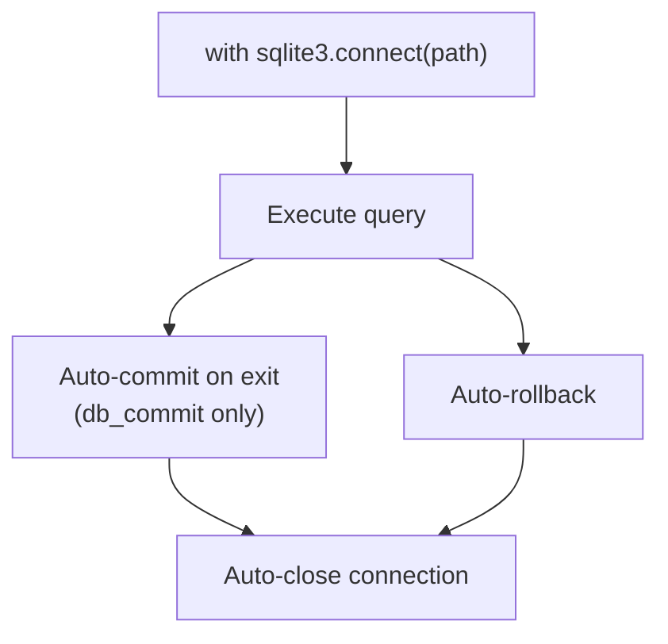
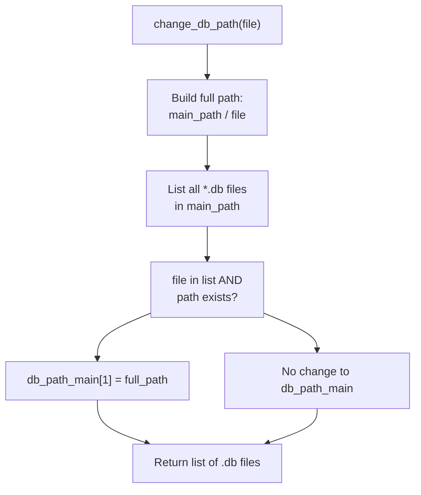
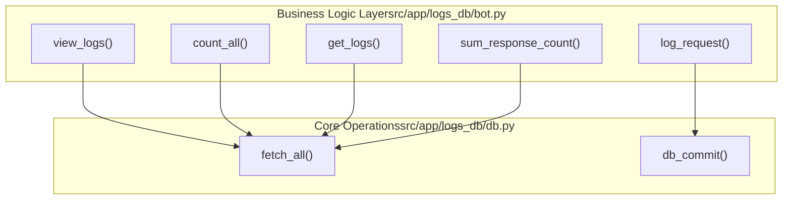

# Core Database Operations

> **Relevant source files**
> * [pyproject.toml](https://github.com/ArWikiCats/ArWikiCatsWeb/blob/88f42d13/pyproject.toml)
> * [pytest.ini](https://github.com/ArWikiCats/ArWikiCatsWeb/blob/88f42d13/pytest.ini)
> * [src/app/logs_db/db.py](https://github.com/ArWikiCats/ArWikiCatsWeb/blob/88f42d13/src/app/logs_db/db.py)
> * [src/app/routes/__init__.py](https://github.com/ArWikiCats/ArWikiCatsWeb/blob/88f42d13/src/app/routes/__init__.py)
> * [tests/conftest.py](https://github.com/ArWikiCats/ArWikiCatsWeb/blob/88f42d13/tests/conftest.py)
> * [tests/test_log.py](https://github.com/ArWikiCats/ArWikiCatsWeb/blob/88f42d13/tests/test_log.py)

## Purpose and Scope

This page documents the core database operations provided by the `logs_db.db` module, which handles all SQLite database interactions for the ArWikiCatsWeb application. These operations form the foundation of the data access layer, providing basic read and write capabilities.

For database initialization and schema management, see [Database Initialization and Management](/ArWikiCats/ArWikiCatsWeb/7.2-database-initialization-and-management). For higher-level log retrieval and business logic, see [Log Retrieval and Analysis](/ArWikiCats/ArWikiCatsWeb/6.3-log-retrieval-and-analysis).

**Sources:** [src/app/logs_db/db.py L1-L105](https://github.com/ArWikiCats/ArWikiCatsWeb/blob/88f42d13/src/app/logs_db/db.py#L1-L105)

---

## Module Overview

The `src/app/logs_db/db.py` module provides a thin abstraction layer over SQLite database operations. It manages database connections, executes queries, and handles errors. All database interactions in the application flow through these core functions.

### Database Path Configuration

The module maintains a global database path configuration:

| Variable | Type | Purpose |
| --- | --- | --- |
| `HOME` | `str` | Environment variable pointing to home directory |
| `main_path` | `Path` | Directory containing database files |
| `db_path_main` | `dict` | Dictionary holding the active database path at key `1` |

The database path is determined at module load time: if `HOME` environment variable exists (production on Toolforge), it uses `~/www/python/dbs/new_logs.db`, otherwise it uses a path relative to the module location (development).

**Sources:** [src/app/logs_db/db.py L11-L17](https://github.com/ArWikiCats/ArWikiCatsWeb/blob/88f42d13/src/app/logs_db/db.py#L11-L17)

---

## Database Operation Architecture



**Sources:** [src/app/logs_db/db.py L1-L105](https://github.com/ArWikiCats/ArWikiCatsWeb/blob/88f42d13/src/app/logs_db/db.py#L1-L105)

 [tests/test_log.py L101-L521](https://github.com/ArWikiCats/ArWikiCatsWeb/blob/88f42d13/tests/test_log.py#L101-L521)

---

## Read Operations: fetch_all

The `fetch_all` function executes SELECT queries and returns results as dictionaries.

### Function Signature

```python
def fetch_all(query, params=[], fetch_one=False):
```

### Parameters

| Parameter | Type | Default | Description |
| --- | --- | --- | --- |
| `query` | `str` | Required | SQL SELECT query with `?` placeholders |
| `params` | `list` | `[]` | Parameters to bind to query placeholders |
| `fetch_one` | `bool` | `False` | If `True`, returns single dict; if `False`, returns list of dicts |

### Return Values

* **Multiple results** (`fetch_one=False`): Returns `list[dict]` where each dict represents a row
* **Single result** (`fetch_one=True`): Returns `dict` or `None` if no result found
* **On error**: Returns empty list `[]` or `None`

### Implementation Details

The function uses SQLite's `Row` factory to return dictionary-like objects:

1. Opens connection to `db_path_main[1]`
2. Sets `conn.row_factory = sqlite3.Row` for dictionary-style access
3. Executes parameterized query
4. Converts `sqlite3.Row` objects to standard Python dictionaries
5. Handles errors by catching `sqlite3.Error` and initializing database if table missing

**Sources:** [src/app/logs_db/db.py L80-L104](https://github.com/ArWikiCats/ArWikiCatsWeb/blob/88f42d13/src/app/logs_db/db.py#L80-L104)

### Usage Examples

```sql
# Fetch all logs
logs = fetch_all("SELECT * FROM logs")
# Returns: [{'id': 1, 'endpoint': '/api/test', ...}, ...]

# Fetch with filtering
logs = fetch_all(
    "SELECT * FROM logs WHERE id = ?", 
    [1], 
    fetch_one=True
)
# Returns: {'id': 1, 'endpoint': '/api/test', ...}

# Fetch with multiple parameters
logs = fetch_all(
    "SELECT * FROM logs WHERE endpoint = ? AND response_status = ?",
    ["/api/cat", "success"]
)
```

**Sources:** [tests/test_log.py L160-L205](https://github.com/ArWikiCats/ArWikiCatsWeb/blob/88f42d13/tests/test_log.py#L160-L205)

---

## Write Operations: db_commit

The `db_commit` function executes INSERT, UPDATE, and DELETE operations.

### Function Signature

```python
def db_commit(query, params=[]):
```

### Parameters

| Parameter | Type | Default | Description |
| --- | --- | --- | --- |
| `query` | `str` | Required | SQL DML query (INSERT/UPDATE/DELETE) with `?` placeholders |
| `params` | `list` | `[]` | Parameters to bind to query placeholders |

### Return Values

* **Success**: Returns `True`
* **Failure**: Returns `sqlite3.Error` exception object

### Implementation Details



**Sources:** [src/app/logs_db/db.py L35-L45](https://github.com/ArWikiCats/ArWikiCatsWeb/blob/88f42d13/src/app/logs_db/db.py#L35-L45)

### Usage Examples

```sql
# Insert new log entry
result = db_commit(
    "INSERT INTO logs (endpoint, request_data, response_status, response_time) VALUES (?, ?, ?, ?)",
    ["/api/cat", "Category:Test", "success", 0.123]
)
# Returns: True

# Update existing record
result = db_commit(
    "UPDATE logs SET response_count = response_count + 1 WHERE id = ?",
    [42]
)

# Insert with conflict handling (UPSERT pattern)
result = db_commit("""
    INSERT INTO logs (request_data, response_status, date_only, endpoint, response_time)
    VALUES (?, ?, ?, ?, ?)
    ON CONFLICT(request_data, response_status, date_only)
    DO UPDATE SET response_count = response_count + 1
""", ["Category:Test", "success", "2025-01-27", "/api/cat", 0.1])
```

**Sources:** [tests/test_log.py L207-L221](https://github.com/ArWikiCats/ArWikiCatsWeb/blob/88f42d13/tests/test_log.py#L207-L221)

 [src/app/logs_db/db.py L35-L45](https://github.com/ArWikiCats/ArWikiCatsWeb/blob/88f42d13/src/app/logs_db/db.py#L35-L45)

---

## Connection Management

Both `fetch_all` and `db_commit` use Python's context manager pattern (`with` statement) for automatic connection management:



### Key Characteristics

| Aspect | Behavior |
| --- | --- |
| Connection Pooling | None - new connection per operation |
| Transaction Scope | Single operation per connection |
| Commit Strategy | Explicit in `db_commit`, none in `fetch_all` |
| Close Handling | Automatic via context manager |
| Thread Safety | Each operation is isolated |

**Sources:** [src/app/logs_db/db.py L35-L104](https://github.com/ArWikiCats/ArWikiCatsWeb/blob/88f42d13/src/app/logs_db/db.py#L35-L104)

---

## Error Handling Patterns

### db_commit Error Handling

```python
try:
    with sqlite3.connect(db_path_main[1]) as conn:
        cursor = conn.cursor()
        cursor.execute(query, params)
    conn.commit()
    return True
except sqlite3.Error as e:
    print(f"init_db Database error: {e}")
    return e
```

* Catches all `sqlite3.Error` exceptions
* Prints error to console (for debugging)
* Returns exception object (caller can inspect)

**Sources:** [src/app/logs_db/db.py L35-L45](https://github.com/ArWikiCats/ArWikiCatsWeb/blob/88f42d13/src/app/logs_db/db.py#L35-L45)

### fetch_all Error Handling

```python
try:
    # ... query execution ...
    return logs
except sqlite3.Error as e:
    print(f"Database error in view_logs: {e}")
    if "no such table" in str(e):
        init_db()
    logs = []
return logs
```

* Catches `sqlite3.Error` exceptions
* Automatically initializes database if table doesn't exist
* Returns empty list on error (fail-safe default)

**Sources:** [src/app/logs_db/db.py L98-L104](https://github.com/ArWikiCats/ArWikiCatsWeb/blob/88f42d13/src/app/logs_db/db.py#L98-L104)

---

## Database Path Management: change_db_path

The `change_db_path` function allows switching between different database files at runtime, primarily used for testing or multi-database scenarios.

### Function Signature

```python
def change_db_path(file):
```

### Parameters

| Parameter | Type | Description |
| --- | --- | --- |
| `file` | `str` | Filename of database (e.g., "test_logs.db") |

### Return Value

Returns `list[str]` containing all `.db` files found in `main_path` directory.

### Behavior



**Sources:** [src/app/logs_db/db.py L20-L32](https://github.com/ArWikiCats/ArWikiCatsWeb/blob/88f42d13/src/app/logs_db/db.py#L20-L32)

### Usage Example

```yaml
# List available databases and switch
available_dbs = change_db_path("test_logs.db")
# Returns: ['new_logs.db', 'test_logs.db', 'backup.db']
# db_path_main[1] now points to 'test_logs.db'

# Used in tests to isolate test database
original_path = db.db_path_main[1]
db.db_path_main[1] = temp_db_path  # Direct assignment
try:
    # ... test operations ...
finally:
    db.db_path_main[1] = original_path  # Restore
```

**Sources:** [tests/test_log.py L498-L521](https://github.com/ArWikiCats/ArWikiCatsWeb/blob/88f42d13/tests/test_log.py#L498-L521)

 [tests/test_log.py L160-L190](https://github.com/ArWikiCats/ArWikiCatsWeb/blob/88f42d13/tests/test_log.py#L160-L190)

---

## Parameter Binding and SQL Injection Prevention

Both `fetch_all` and `db_commit` use parameterized queries with `?` placeholders to prevent SQL injection attacks.

### Safe Parameter Binding

```sql
# ✅ SAFE - Uses parameterized query
fetch_all("SELECT * FROM logs WHERE endpoint = ?", [user_input])

# ✅ SAFE - Multiple parameters
db_commit(
    "INSERT INTO logs (endpoint, request_data) VALUES (?, ?)",
    [endpoint, user_data]
)
```

### Parameter Types

SQLite automatically handles type conversion for:

* Strings (`str`)
* Integers (`int`)
* Floats (`float`)
* Bytes (`bytes`)
* `None` (becomes SQL `NULL`)

**Sources:** [src/app/logs_db/db.py L35-L104](https://github.com/ArWikiCats/ArWikiCatsWeb/blob/88f42d13/src/app/logs_db/db.py#L35-L104)

---

## Integration with Higher-Level Modules

The core database operations are consumed by the `logs_db.bot` module, which provides business logic:



The business logic layer builds complex queries and passes them to the core operations, maintaining separation of concerns between query construction (business logic) and query execution (data access).

**Sources:** [src/app/logs_db/db.py L1-L105](https://github.com/ArWikiCats/ArWikiCatsWeb/blob/88f42d13/src/app/logs_db/db.py#L1-L105)

 [tests/test_log.py L224-L272](https://github.com/ArWikiCats/ArWikiCatsWeb/blob/88f42d13/tests/test_log.py#L224-L272)

---

## Performance Characteristics

| Operation | Connection Strategy | Transaction Scope | Use Case |
| --- | --- | --- | --- |
| `fetch_all` | One connection per call | Read-only, no transaction | SELECT queries |
| `db_commit` | One connection per call | Single write operation | INSERT/UPDATE/DELETE |
| Both | No connection pooling | Immediate close | Simple, stateless operations |

### Implications

* **Scalability**: Each operation creates a new connection, suitable for low to medium load
* **Concurrency**: SQLite handles concurrent reads well, but writes are serialized
* **Reliability**: Each operation is isolated; failures don't affect other operations
* **Simplicity**: No connection pool management required

For high-concurrency scenarios, SQLite's built-in locking mechanisms handle coordination between multiple processes accessing the same database file.

**Sources:** [src/app/logs_db/db.py L35-L104](https://github.com/ArWikiCats/ArWikiCatsWeb/blob/88f42d13/src/app/logs_db/db.py#L35-L104)

---

## Testing Patterns

The test suite demonstrates common usage patterns and edge cases:

### Test Database Fixtures

Tests use temporary databases to isolate test data:

```python
@pytest.fixture
def temp_db(tmp_path):
    db_file = tmp_path / "test_logs.db"
    # Create and populate test database
    # ...
    yield str(db_file)
```

### Path Manipulation in Tests

```sql
original_path = db.db_path_main[1]
db.db_path_main[1] = temp_db
try:
    result = db.fetch_all("SELECT * FROM logs")
    # ... assertions ...
finally:
    db.db_path_main[1] = original_path
```

This pattern ensures tests don't interfere with the production database.

**Sources:** [tests/test_log.py L104-L221](https://github.com/ArWikiCats/ArWikiCatsWeb/blob/88f42d13/tests/test_log.py#L104-L221)

 [tests/test_log.py L276-L337](https://github.com/ArWikiCats/ArWikiCatsWeb/blob/88f42d13/tests/test_log.py#L276-L337)

---

## Common Usage Patterns

### Pattern 1: Simple Query

```sql
# Read all records
logs = fetch_all("SELECT * FROM logs ORDER BY timestamp DESC")
```

### Pattern 2: Filtered Query

```sql
# Query with single filter
logs = fetch_all(
    "SELECT * FROM logs WHERE date_only = ?",
    ["2025-01-27"]
)
```

### Pattern 3: Insert with Conflict Resolution

```sql
# UPSERT pattern (insert or increment counter)
db_commit("""
    INSERT INTO logs (request_data, response_status, date_only, endpoint, response_time)
    VALUES (?, ?, ?, ?, ?)
    ON CONFLICT(request_data, response_status, date_only)
    DO UPDATE SET response_count = response_count + 1, timestamp = CURRENT_TIMESTAMP
""", [data, status, date, endpoint, time])
```

### Pattern 4: Aggregate Query

```sql
# Count matching records
result = fetch_all(
    "SELECT COUNT(*) as count FROM logs WHERE response_status = ?",
    ["success"],
    fetch_one=True
)
total = result["count"] if result else 0
```

**Sources:** [tests/test_log.py L160-L496](https://github.com/ArWikiCats/ArWikiCatsWeb/blob/88f42d13/tests/test_log.py#L160-L496)

 [src/app/logs_db/db.py L80-L104](https://github.com/ArWikiCats/ArWikiCatsWeb/blob/88f42d13/src/app/logs_db/db.py#L80-L104)