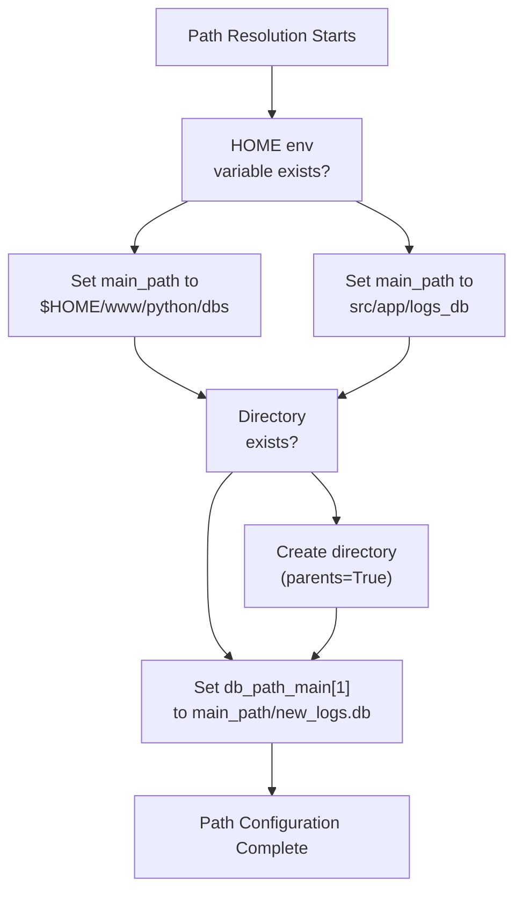
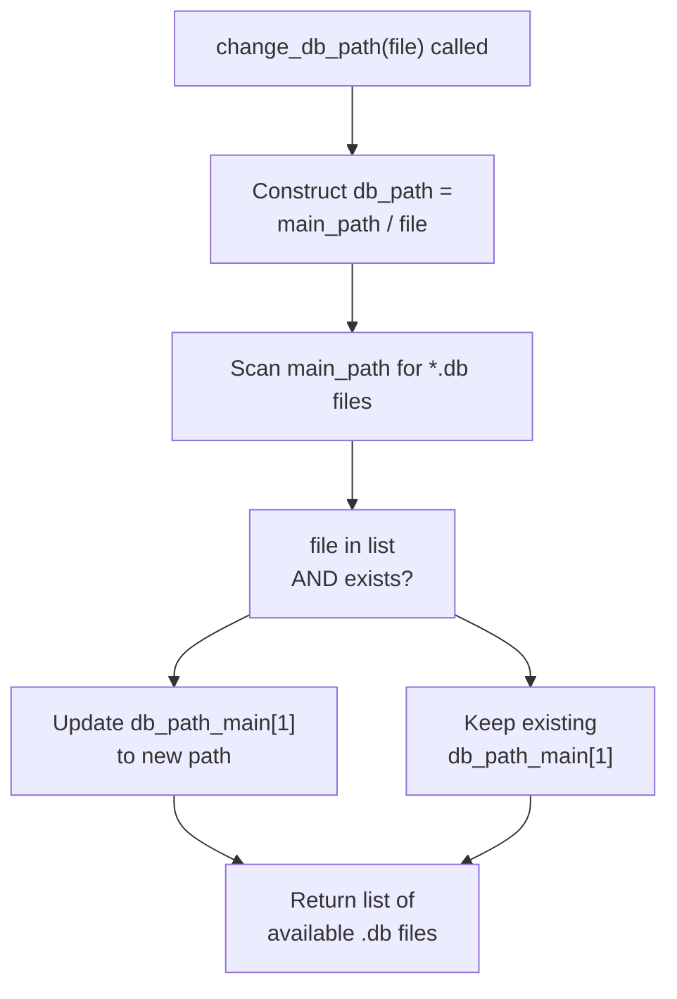
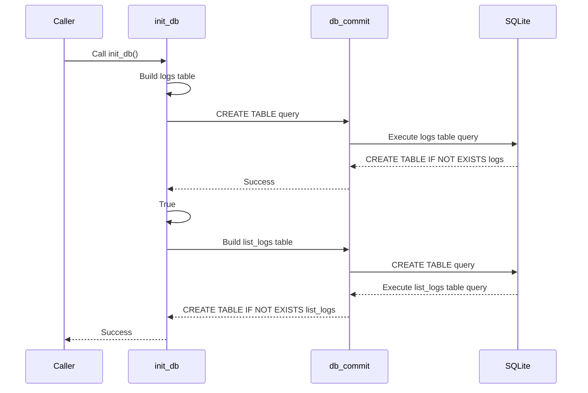
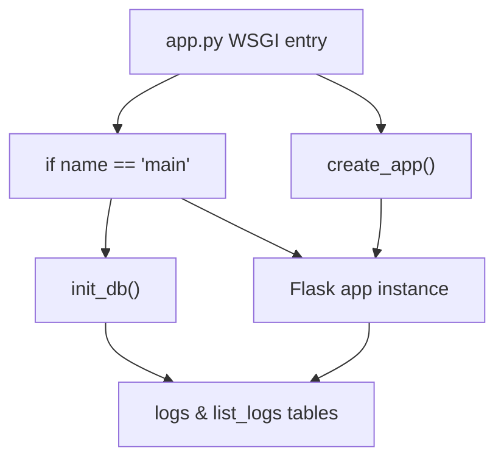
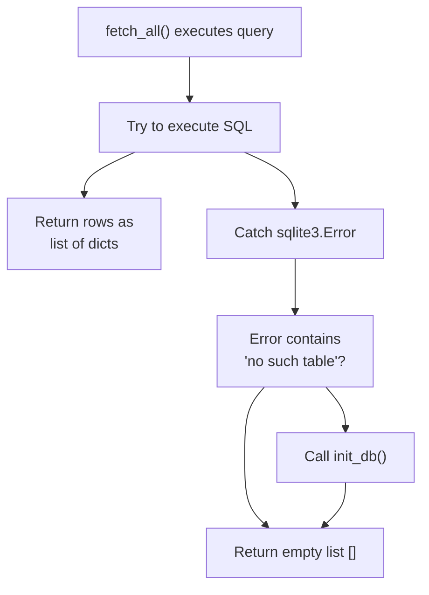

# Database Initialization and Management

> **Relevant source files**
> * [src/app.py](https://github.com/ArWikiCats/ArWikiCatsWeb/blob/88f42d13/src/app.py)
> * [src/app/logs_db/db.py](https://github.com/ArWikiCats/ArWikiCatsWeb/blob/88f42d13/src/app/logs_db/db.py)
> * [src/app/routes/__init__.py](https://github.com/ArWikiCats/ArWikiCatsWeb/blob/88f42d13/src/app/routes/__init__.py)

## Purpose and Scope

This document covers the database initialization and lifecycle management functionality in ArWikiCatsWeb's logging system. It explains how the SQLite database is created, where it is stored, how the database path can be dynamically changed, and how the system ensures the database schema exists before operations are performed.

For information about the actual database operations (queries and commits), see [Core Database Operations](/ArWikiCats/ArWikiCatsWeb/7.1-core-database-operations). For details about the database schema and table structures, see [Log Database Schema](/ArWikiCats/ArWikiCatsWeb/6.1-log-database-schema).

---

## Database Path Resolution and Management

The application uses a flexible path resolution system that adapts to different deployment environments (local development vs. Toolforge production).

### Path Configuration

The database path is determined using environment-based logic:

**Path Resolution Logic:**



Sources: [src/app/logs_db/db.py L11-L17](https://github.com/ArWikiCats/ArWikiCatsWeb/blob/88f42d13/src/app/logs_db/db.py#L11-L17)

The path resolution creates the following variables:

| Variable | Type | Purpose |
| --- | --- | --- |
| `HOME` | str or None | Environment variable for user home directory |
| `main_path` | Path | Base directory for database storage |
| `db_path_main` | dict | Dictionary storing current database path at key `1` |

The `db_path_main` dictionary is used as a mutable reference that can be updated by the `change_db_path()` function without requiring global variable reassignment.

### The change_db_path Function

The `change_db_path(file)` function enables dynamic switching between different database files at runtime.

**Function Signature:**

```python
def change_db_path(file) -> list
```

**Behavior:**



Sources: [src/app/logs_db/db.py L20-L32](https://github.com/ArWikiCats/ArWikiCatsWeb/blob/88f42d13/src/app/logs_db/db.py#L20-L32)

**Implementation Details:**

The function performs these operations:

1. Constructs full path to requested database file
2. Lists all `.db` files in `main_path` directory
3. Validates that requested file exists in the directory listing
4. Updates `db_path_main[1]` if validation passes
5. Returns list of available database files

This design allows for runtime database switching without application restart, useful for:

* Testing with different database files
* Database rotation strategies
* Backup and recovery scenarios

---

## Database Initialization Process

The `init_db()` function is responsible for creating the database schema if it doesn't exist.

### Table Creation

The function creates two tables with identical schemas but different purposes:

**Initialization Flow:**



Sources: [src/app/logs_db/db.py L48-L77](https://github.com/ArWikiCats/ArWikiCatsWeb/blob/88f42d13/src/app/logs_db/db.py#L48-L77)

### Schema Definitions

Both tables are created with identical structure:

| Column Name | Type | Constraints | Purpose |
| --- | --- | --- | --- |
| `id` | INTEGER | PRIMARY KEY AUTOINCREMENT | Unique row identifier |
| `endpoint` | TEXT | NOT NULL | API endpoint that was called |
| `request_data` | TEXT | NOT NULL | Request parameters or payload |
| `response_status` | TEXT | NOT NULL | Response status (e.g., "ok", "error") |
| `response_time` | REAL | - | Time taken to process request (seconds) |
| `response_count` | INTEGER | DEFAULT 1 | Aggregation counter for duplicate requests |
| `timestamp` | DATETIME | DEFAULT CURRENT_TIMESTAMP | When log entry was created/updated |
| `date_only` | DATE | DEFAULT (DATE('now')) | Date portion for efficient grouping |

**Unique Constraint:**

```
UNIQUE(request_data, response_status, date_only)
```

This constraint enables request aggregation: identical requests on the same day increment `response_count` rather than creating duplicate rows.

Sources: [src/app/logs_db/db.py L49-L77](https://github.com/ArWikiCats/ArWikiCatsWeb/blob/88f42d13/src/app/logs_db/db.py#L49-L77)

### Why Two Tables?

The application maintains separate tables:

* **`logs`**: Records from single category resolution endpoints ([src/app/logs_db/db.py L50-L62](https://github.com/ArWikiCats/ArWikiCatsWeb/blob/88f42d13/src/app/logs_db/db.py#L50-L62) )
* **`list_logs`**: Records from batch category resolution endpoints ([src/app/logs_db/db.py L64-L77](https://github.com/ArWikiCats/ArWikiCatsWeb/blob/88f42d13/src/app/logs_db/db.py#L64-L77) )

This separation allows for independent querying and analysis of different endpoint types without complex filtering.

---

## Application Startup Integration

The database is initialized during application startup through the WSGI entry point.

**Initialization Call Graph:**



Sources: [src/app.py L7-L15](https://github.com/ArWikiCats/ArWikiCatsWeb/blob/88f42d13/src/app.py#L7-L15)

**Startup Sequence:**

1. **Production Mode (WSGI)**: When running under UWSGI or similar servers, `create_app()` is called to instantiate the Flask application. The database should already exist from previous initialization, but `init_db()` is idempotent.
2. **Development Mode**: When running with `python app.py`, the `if __name__ == "__main__"` block executes: * Line 13: `init_db()` is called explicitly to ensure tables exist * Line 14: Debug mode is determined from command-line arguments * Line 15: Flask development server starts

This dual-path approach ensures the database is ready in both environments.

---

## Error Handling and Auto-Recovery

The database layer includes automatic recovery mechanisms for missing tables.

### Missing Table Detection

When `fetch_all()` encounters a missing table, it automatically triggers initialization:

**Auto-Recovery Flow:**



Sources: [src/app/logs_db/db.py L98-L102](https://github.com/ArWikiCats/ArWikiCatsWeb/blob/88f42d13/src/app/logs_db/db.py#L98-L102)

**Implementation:**

The error handler at [src/app/logs_db/db.py L98-L102](https://github.com/ArWikiCats/ArWikiCatsWeb/blob/88f42d13/src/app/logs_db/db.py#L98-L102)

 checks if the exception message contains `"no such table"`. If so, it calls `init_db()` to create the missing tables. This provides graceful degradation and automatic recovery from database corruption or deletion scenarios.

**Why Return Empty List?**

After calling `init_db()`, the function returns an empty list rather than retrying the query. This is intentional:

* The tables now exist but contain no data
* Retrying would still return empty results
* Avoids infinite recursion if table creation fails
* Calling code already handles empty result sets

---

## Database Lifecycle Summary

The complete lifecycle of database initialization and management:

```css
#mermaid-meh3p5wgvhm{font-family:ui-sans-serif,-apple-system,system-ui,Segoe UI,Helvetica;font-size:16px;fill:#333;}@keyframes edge-animation-frame{from{stroke-dashoffset:0;}}@keyframes dash{to{stroke-dashoffset:0;}}#mermaid-meh3p5wgvhm .edge-animation-slow{stroke-dasharray:9,5!important;stroke-dashoffset:900;animation:dash 50s linear infinite;stroke-linecap:round;}#mermaid-meh3p5wgvhm .edge-animation-fast{stroke-dasharray:9,5!important;stroke-dashoffset:900;animation:dash 20s linear infinite;stroke-linecap:round;}#mermaid-meh3p5wgvhm .error-icon{fill:#dddddd;}#mermaid-meh3p5wgvhm .error-text{fill:#222222;stroke:#222222;}#mermaid-meh3p5wgvhm .edge-thickness-normal{stroke-width:1px;}#mermaid-meh3p5wgvhm .edge-thickness-thick{stroke-width:3.5px;}#mermaid-meh3p5wgvhm .edge-pattern-solid{stroke-dasharray:0;}#mermaid-meh3p5wgvhm .edge-thickness-invisible{stroke-width:0;fill:none;}#mermaid-meh3p5wgvhm .edge-pattern-dashed{stroke-dasharray:3;}#mermaid-meh3p5wgvhm .edge-pattern-dotted{stroke-dasharray:2;}#mermaid-meh3p5wgvhm .marker{fill:#999;stroke:#999;}#mermaid-meh3p5wgvhm .marker.cross{stroke:#999;}#mermaid-meh3p5wgvhm svg{font-family:ui-sans-serif,-apple-system,system-ui,Segoe UI,Helvetica;font-size:16px;}#mermaid-meh3p5wgvhm p{margin:0;}#mermaid-meh3p5wgvhm defs #statediagram-barbEnd{fill:#999;stroke:#999;}#mermaid-meh3p5wgvhm g.stateGroup text{fill:#dddddd;stroke:none;font-size:10px;}#mermaid-meh3p5wgvhm g.stateGroup text{fill:#333;stroke:none;font-size:10px;}#mermaid-meh3p5wgvhm g.stateGroup .state-title{font-weight:bolder;fill:#333;}#mermaid-meh3p5wgvhm g.stateGroup rect{fill:#ffffff;stroke:#dddddd;}#mermaid-meh3p5wgvhm g.stateGroup line{stroke:#999;stroke-width:1;}#mermaid-meh3p5wgvhm .transition{stroke:#999;stroke-width:1;fill:none;}#mermaid-meh3p5wgvhm .stateGroup .composit{fill:#f4f4f4;border-bottom:1px;}#mermaid-meh3p5wgvhm .stateGroup .alt-composit{fill:#e0e0e0;border-bottom:1px;}#mermaid-meh3p5wgvhm .state-note{stroke:#e6d280;fill:#fff5ad;}#mermaid-meh3p5wgvhm .state-note text{fill:#333;stroke:none;font-size:10px;}#mermaid-meh3p5wgvhm .stateLabel .box{stroke:none;stroke-width:0;fill:#ffffff;opacity:0.5;}#mermaid-meh3p5wgvhm .edgeLabel .label rect{fill:#ffffff;opacity:0.5;}#mermaid-meh3p5wgvhm .edgeLabel{background-color:#ffffff;text-align:center;}#mermaid-meh3p5wgvhm .edgeLabel p{background-color:#ffffff;}#mermaid-meh3p5wgvhm .edgeLabel rect{opacity:0.5;background-color:#ffffff;fill:#ffffff;}#mermaid-meh3p5wgvhm .edgeLabel .label text{fill:#333;}#mermaid-meh3p5wgvhm .label div .edgeLabel{color:#333;}#mermaid-meh3p5wgvhm .stateLabel text{fill:#333;font-size:10px;font-weight:bold;}#mermaid-meh3p5wgvhm .node circle.state-start{fill:#999;stroke:#999;}#mermaid-meh3p5wgvhm .node .fork-join{fill:#999;stroke:#999;}#mermaid-meh3p5wgvhm .node circle.state-end{fill:#dddddd;stroke:#f4f4f4;stroke-width:1.5;}#mermaid-meh3p5wgvhm .end-state-inner{fill:#f4f4f4;stroke-width:1.5;}#mermaid-meh3p5wgvhm .node rect{fill:#ffffff;stroke:#dddddd;stroke-width:1px;}#mermaid-meh3p5wgvhm .node polygon{fill:#ffffff;stroke:#dddddd;stroke-width:1px;}#mermaid-meh3p5wgvhm #statediagram-barbEnd{fill:#999;}#mermaid-meh3p5wgvhm .statediagram-cluster rect{fill:#ffffff;stroke:#dddddd;stroke-width:1px;}#mermaid-meh3p5wgvhm .cluster-label,#mermaid-meh3p5wgvhm .nodeLabel{color:#333;}#mermaid-meh3p5wgvhm .statediagram-cluster rect.outer{rx:5px;ry:5px;}#mermaid-meh3p5wgvhm .statediagram-state .divider{stroke:#dddddd;}#mermaid-meh3p5wgvhm .statediagram-state .title-state{rx:5px;ry:5px;}#mermaid-meh3p5wgvhm .statediagram-cluster.statediagram-cluster .inner{fill:#f4f4f4;}#mermaid-meh3p5wgvhm .statediagram-cluster.statediagram-cluster-alt .inner{fill:#f8f8f8;}#mermaid-meh3p5wgvhm .statediagram-cluster .inner{rx:0;ry:0;}#mermaid-meh3p5wgvhm .statediagram-state rect.basic{rx:5px;ry:5px;}#mermaid-meh3p5wgvhm .statediagram-state rect.divider{stroke-dasharray:10,10;fill:#f8f8f8;}#mermaid-meh3p5wgvhm .note-edge{stroke-dasharray:5;}#mermaid-meh3p5wgvhm .statediagram-note rect{fill:#fff5ad;stroke:#e6d280;stroke-width:1px;rx:0;ry:0;}#mermaid-meh3p5wgvhm .statediagram-note rect{fill:#fff5ad;stroke:#e6d280;stroke-width:1px;rx:0;ry:0;}#mermaid-meh3p5wgvhm .statediagram-note text{fill:#333;}#mermaid-meh3p5wgvhm .statediagram-note .nodeLabel{color:#333;}#mermaid-meh3p5wgvhm .statediagram .edgeLabel{color:red;}#mermaid-meh3p5wgvhm #dependencyStart,#mermaid-meh3p5wgvhm #dependencyEnd{fill:#999;stroke:#999;stroke-width:1;}#mermaid-meh3p5wgvhm .statediagramTitleText{text-anchor:middle;font-size:18px;fill:#333;}#mermaid-meh3p5wgvhm :root{--mermaid-font-family:"trebuchet ms",verdana,arial,sans-serif;}Application startsPath determinedDirectory readyinit_db() calledCREATE TABLE IF NOT EXISTSNormal operationSuccessful queriessqlite3.Error"no such table" errorOther errors loggedchange_db_path() calleddb_path_main[1] updatedApplication shutdownPathResolutionDirectoryCreationInitialSetupTablesExistOperationalReadyQueryExecutionErrorDetectedPathChange
```

Sources: [src/app/logs_db/db.py L11-L104](https://github.com/ArWikiCats/ArWikiCatsWeb/blob/88f42d13/src/app/logs_db/db.py#L11-L104)

 [src/app.py L7-L15](https://github.com/ArWikiCats/ArWikiCatsWeb/blob/88f42d13/src/app.py#L7-L15)

---

## Key Design Patterns

### Idempotent Initialization

The `init_db()` function uses `CREATE TABLE IF NOT EXISTS`, making it safe to call multiple times without errors. This enables:

* Repeated calls during startup in different modes
* Error recovery through re-initialization
* Safe execution in test environments

### Mutable Path Reference

The `db_path_main` dictionary pattern allows path updates without global variable reassignment:

```css
# Initial setup
db_path_main = {1: f"{str(main_path)}/new_logs.db"}

# Later updates (in change_db_path)
db_path_main[1] = str(new_db_path)

# All code referencing db_path_main[1] sees the new path
```

This provides thread-safe path switching since dictionary updates are atomic in CPython.

### Lazy Error Recovery

Rather than eagerly checking table existence before every query, the system uses exception handling to detect missing tables. This optimizes the common case (tables exist) at the cost of slower error recovery (rare case).

Sources: [src/app/logs_db/db.py L11-L104](https://github.com/ArWikiCats/ArWikiCatsWeb/blob/88f42d13/src/app/logs_db/db.py#L11-L104)

---

## Database File Location Reference

| Environment | Path |
| --- | --- |
| Toolforge Production | `$HOME/www/python/dbs/new_logs.db` |
| Local Development | `src/app/logs_db/new_logs.db` |
| Custom (via `change_db_path`) | `{main_path}/{custom_filename}.db` |

The database file is a single SQLite file containing both the `logs` and `list_logs` tables. No separate files are used for each table.

Sources: [src/app/logs_db/db.py L11-L17](https://github.com/ArWikiCats/ArWikiCatsWeb/blob/88f42d13/src/app/logs_db/db.py#L11-L17)