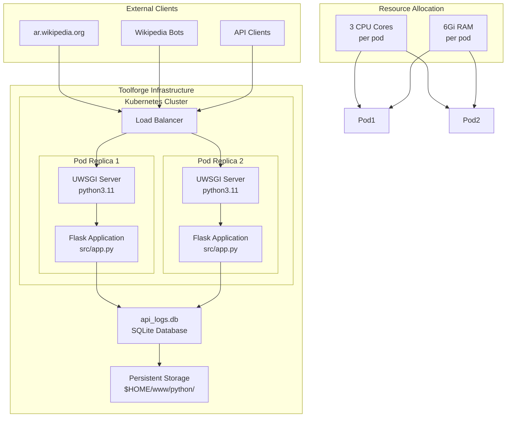
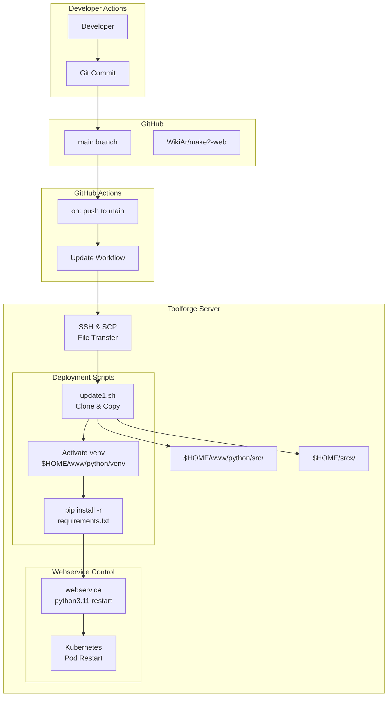
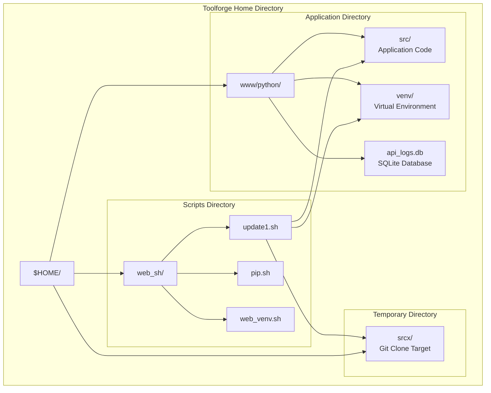

# Deployment

> **Relevant source files**
> * [README.md](https://github.com/ArWikiCats/ArWikiCatsWeb/blob/88f42d13/README.md)
> * [service.template](https://github.com/ArWikiCats/ArWikiCatsWeb/blob/88f42d13/service.template)
> * [web_sh/update1.sh](https://github.com/ArWikiCats/ArWikiCatsWeb/blob/88f42d13/web_sh/update1.sh)

This document provides an overview of the deployment architecture and processes for ArWikiCatsWeb. It covers the production deployment environment on Wikimedia Toolforge, the infrastructure configuration, and the automated deployment workflows.

For detailed information about specific deployment components, see:

* Toolforge-specific configuration details: [8.1](/ArWikiCats/ArWikiCatsWeb/8.1-toolforge-configuration)
* Deployment shell scripts and update processes: [8.2](/ArWikiCats/ArWikiCatsWeb/8.2-deployment-scripts)
* CI/CD pipelines and GitHub Actions workflows: [8.3](/ArWikiCats/ArWikiCatsWeb/8.3-cicd-pipeline)

## Deployment Environment

ArWikiCatsWeb is deployed on **Wikimedia Toolforge**, a free hosting service for tools and bots that work with Wikimedia projects. The application runs as a Kubernetes-based webservice with high availability configuration.

### Target Platform

| Component | Value |
| --- | --- |
| Platform | Wikimedia Toolforge |
| Backend | Kubernetes |
| Python Version | 3.11 |
| Web Server | UWSGI |
| Application Entry | [src/app.py](https://github.com/ArWikiCats/ArWikiCatsWeb/blob/88f42d13/src/app.py) |

The production deployment uses the WSGI application defined in [src/app.py](https://github.com/ArWikiCats/ArWikiCatsWeb/blob/88f42d13/src/app.py)

 which serves as the entry point for the UWSGI server.

Sources: [README.md L195-L214](https://github.com/ArWikiCats/ArWikiCatsWeb/blob/88f42d13/README.md#L195-L214)

 [service.template L1-L27](https://github.com/ArWikiCats/ArWikiCatsWeb/blob/88f42d13/service.template#L1-L27)

## Deployment Architecture

**Deployment Architecture on Toolforge**

The application runs with 2 replica pods for high availability, as configured in [service.template L16](https://github.com/ArWikiCats/ArWikiCatsWeb/blob/88f42d13/service.template#L16-L16)

 Each pod runs a UWSGI server that loads the Flask application from [src/app.py](https://github.com/ArWikiCats/ArWikiCatsWeb/blob/88f42d13/src/app.py)

 The load balancer distributes incoming requests across both replicas. Both pods share access to the persistent storage volume where the SQLite database `api_logs.db` is stored.

Sources: [service.template L1-L27](https://github.com/ArWikiCats/ArWikiCatsWeb/blob/88f42d13/service.template#L1-L27)

 [README.md L195-L214](https://github.com/ArWikiCats/ArWikiCatsWeb/blob/88f42d13/README.md#L195-L214)

## Deployment Workflow

**Automated Deployment Process**

When code is pushed to the `main` branch, GitHub Actions triggers the deployment workflow. The workflow uses SSH to connect to the Toolforge server and executes [web_sh/update1.sh L1-L50](https://github.com/ArWikiCats/ArWikiCatsWeb/blob/88f42d13/web_sh/update1.sh#L1-L50). This script clones the repository to a temporary directory `$HOME/srcx`, copies the files to the target directory `$HOME/www/python/src`, activates the virtual environment, installs dependencies, and restarts the webservice.

Sources: [web_sh/update1.sh L1-L50](https://github.com/ArWikiCats/ArWikiCatsWeb/blob/88f42d13/web_sh/update1.sh#L1-L50)

 [README.md L241-L244](https://github.com/ArWikiCats/ArWikiCatsWeb/blob/88f42d13/README.md#L241-L244)

## Resource Configuration

The application is configured with the following resource allocation on Toolforge:

| Resource | Configuration | Location |
| --- | --- | --- |
| CPU | 3 cores | [service.template L10](https://github.com/ArWikiCats/ArWikiCatsWeb/blob/88f42d13/service.template#L10-L10) |
| Memory | 6Gi | [service.template L13](https://github.com/ArWikiCats/ArWikiCatsWeb/blob/88f42d13/service.template#L13-L13)    (commented) |
| Replicas | 2 pods | [service.template L16](https://github.com/ArWikiCats/ArWikiCatsWeb/blob/88f42d13/service.template#L16-L16) |
| Backend | kubernetes | [service.template L7](https://github.com/ArWikiCats/ArWikiCatsWeb/blob/88f42d13/service.template#L7-L7) |
| Runtime | python3.11 | [service.template L20](https://github.com/ArWikiCats/ArWikiCatsWeb/blob/88f42d13/service.template#L20-L20) |

### High Availability

The deployment uses **2 replica pods** to ensure high availability. If one pod fails or is being updated, the other pod continues serving requests. The Kubernetes load balancer automatically distributes traffic across available pods.

Sources: [service.template L1-L27](https://github.com/ArWikiCats/ArWikiCatsWeb/blob/88f42d13/service.template#L1-L27)

 [README.md L199-L206](https://github.com/ArWikiCats/ArWikiCatsWeb/blob/88f42d13/README.md#L199-L206)

## File System Layout

**File System Organization on Toolforge**

The application files are organized under `$HOME/www/python/` on the Toolforge server. The [web_sh/update1.sh](https://github.com/ArWikiCats/ArWikiCatsWeb/blob/88f42d13/web_sh/update1.sh)

 script clones the repository to a temporary directory `$HOME/srcx/` and then copies the contents to the target directory. The virtual environment and SQLite database are persisted in the same parent directory.

Sources: [web_sh/update1.sh L11-L44](https://github.com/ArWikiCats/ArWikiCatsWeb/blob/88f42d13/web_sh/update1.sh#L11-L44)

## Update Script Details

The primary deployment script is [web_sh/update1.sh](https://github.com/ArWikiCats/ArWikiCatsWeb/blob/88f42d13/web_sh/update1.sh)

 which performs the following operations:

### Script Parameters

| Parameter | Description | Default |
| --- | --- | --- |
| `$1` | Git branch to deploy | `main` |

Usage: `./update1.sh [branch]`

### Deployment Steps

1. **Clone Repository**: Clone from `https://github.com/WikiAr/make2-web.git` to `$HOME/srcx` * [web_sh/update1.sh L22-L27](https://github.com/ArWikiCats/ArWikiCatsWeb/blob/88f42d13/web_sh/update1.sh#L22-L27)
2. **Copy Files**: Copy all files from clone directory to target directory * [web_sh/update1.sh L31](https://github.com/ArWikiCats/ArWikiCatsWeb/blob/88f42d13/web_sh/update1.sh#L31-L31) * Target: `$HOME/www/python/src/`
3. **Activate Virtual Environment**: Source the Python virtual environment * [web_sh/update1.sh L38](https://github.com/ArWikiCats/ArWikiCatsWeb/blob/88f42d13/web_sh/update1.sh#L38-L38) * Path: `$HOME/www/python/venv/bin/activate`
4. **Install Dependencies**: Install/upgrade Python packages * [web_sh/update1.sh L40](https://github.com/ArWikiCats/ArWikiCatsWeb/blob/88f42d13/web_sh/update1.sh#L40-L40) * Command: `pip install -r requirements.txt -U`
5. **Restart Service**: Restart the webservice (manual step) * Command: `webservice python3.11 restart`

Sources: [web_sh/update1.sh L1-L50](https://github.com/ArWikiCats/ArWikiCatsWeb/blob/88f42d13/web_sh/update1.sh#L1-L50)

## Webservice Management

The application is managed using the `webservice` command-line tool provided by Toolforge:

### Common Commands

| Command | Purpose |
| --- | --- |
| `webservice start` | Start the webservice using [service.template](https://github.com/ArWikiCats/ArWikiCatsWeb/blob/88f42d13/service.template)    configuration |
| `webservice stop` | Stop the running webservice |
| `webservice restart` | Restart the webservice |
| `webservice status` | Check webservice status |
| `webservice python3.11 restart` | Restart with specific Python version |

The `webservice start` command reads configuration from [service.template](https://github.com/ArWikiCats/ArWikiCatsWeb/blob/88f42d13/service.template)

 to determine the backend type, resource allocation, and replica count.

Sources: [README.md L208-L210](https://github.com/ArWikiCats/ArWikiCatsWeb/blob/88f42d13/README.md#L208-L210)

 [service.template L1-L27](https://github.com/ArWikiCats/ArWikiCatsWeb/blob/88f42d13/service.template#L1-L27)

## Persistent Data

The application uses persistent storage for:

| Data Type | Location | Description |
| --- | --- | --- |
| SQLite Database | `$HOME/www/python/api_logs.db` | Request logs and analytics data |
| Application Code | `$HOME/www/python/src/` | Flask application and modules |
| Virtual Environment | `$HOME/www/python/venv/` | Python packages and dependencies |

The SQLite database `api_logs.db` is accessed by both replica pods. The database operations are handled through the `logs_db` module, which manages connection pooling and thread safety. For more details on the database schema and operations, see [7](/ArWikiCats/ArWikiCatsWeb/7-database-layer).

Sources: [README.md L195-L214](https://github.com/ArWikiCats/ArWikiCatsWeb/blob/88f42d13/README.md#L195-L214)

## CORS Configuration

The application is configured with CORS support to allow requests from Wikipedia domains. The CORS configuration is applied during application initialization in [src/app/__init__.py](https://github.com/ArWikiCats/ArWikiCatsWeb/blob/88f42d13/src/app/__init__.py)

 allowing cross-origin requests from `ar.wikipedia.org` and related domains.

This configuration enables the API to be consumed directly by Wikipedia bots and client-side scripts running on Arabic Wikipedia pages.

Sources: [README.md L15](https://github.com/ArWikiCats/ArWikiCatsWeb/blob/88f42d13/README.md#L15-L15)

## Deployment Checklist

When deploying updates to production:

1. **Ensure Tests Pass**: Verify all tests pass locally and on GitHub Actions
2. **Update Version**: If applicable, update version numbers
3. **Merge to Main**: Merge changes to the `main` branch
4. **Monitor Deployment**: Check GitHub Actions for deployment workflow status
5. **Verify Service**: Test API endpoints and web interface after deployment
6. **Check Logs**: Review application logs for any errors or warnings
7. **Monitor Performance**: Check resource usage (CPU, memory) through Toolforge dashboard

Sources: [README.md L241-L244](https://github.com/ArWikiCats/ArWikiCatsWeb/blob/88f42d13/README.md#L241-L244)

 [README.md L258-L267](https://github.com/ArWikiCats/ArWikiCatsWeb/blob/88f42d13/README.md#L258-L267)