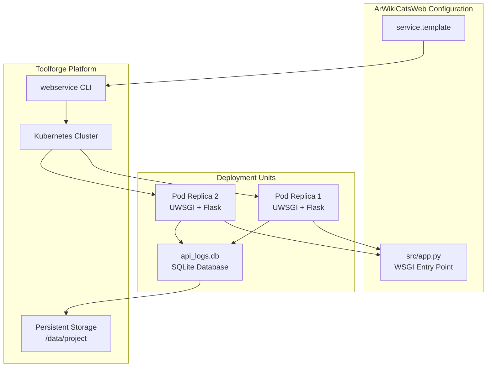
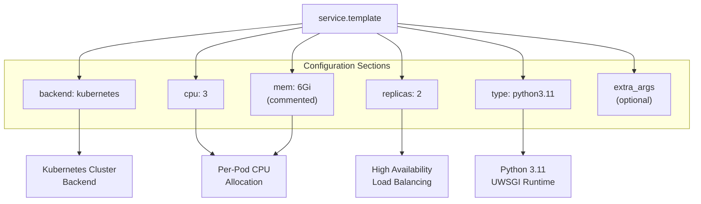
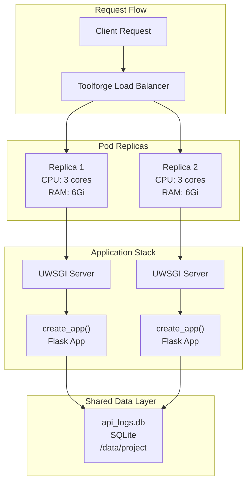

# Toolforge Configuration

> **Relevant source files**
> * [README.md](https://github.com/ArWikiCats/ArWikiCatsWeb/blob/88f42d13/README.md)
> * [service.template](https://github.com/ArWikiCats/ArWikiCatsWeb/blob/88f42d13/service.template)

## Purpose and Scope

This document details the Toolforge deployment configuration for ArWikiCatsWeb, including Kubernetes resource specifications, high-availability settings, and runtime environment configuration defined in the `service.template` file. For information about deployment scripts and update procedures, see [Deployment Scripts](/ArWikiCats/ArWikiCatsWeb/8.2-deployment-scripts). For CI/CD automation, see [CI/CD Pipeline](/ArWikiCats/ArWikiCatsWeb/8.3-cicd-pipeline).

## Toolforge Infrastructure Overview

ArWikiCatsWeb is deployed on **Wikimedia Toolforge**, a Platform-as-a-Service hosting environment provided by the Wikimedia Foundation for tools that support Wikipedia and other Wikimedia projects. Toolforge provides Kubernetes-based infrastructure for running web services with built-in support for Python applications, persistent storage, and SSL termination.

The deployment leverages Toolforge's `webservice` command-line tool, which reads configuration from `service.template` to establish deployment parameters.



**Sources:** [README.md L197-L210](https://github.com/ArWikiCats/ArWikiCatsWeb/blob/88f42d13/README.md#L197-L210)

 [service.template L1-L27](https://github.com/ArWikiCats/ArWikiCatsWeb/blob/88f42d13/service.template#L1-L27)

## Configuration File Structure

The deployment configuration is defined in `service.template`, which follows Toolforge's YAML-based configuration format. This template provides default arguments for the `webservice start` command.

[service.template L1-L27](https://github.com/ArWikiCats/ArWikiCatsWeb/blob/88f42d13/service.template#L1-L27)



**Sources:** [service.template L1-L27](https://github.com/ArWikiCats/ArWikiCatsWeb/blob/88f42d13/service.template#L1-L27)

## Configuration Parameters

### Backend Selection

[service.template L7](https://github.com/ArWikiCats/ArWikiCatsWeb/blob/88f42d13/service.template#L7-L7)

```yaml
backend: kubernetes
```

Specifies that the webservice runs on Toolforge's **Kubernetes** cluster rather than the legacy Grid Engine backend. This is the only supported backend option for new deployments and provides:

* Container-based isolation
* Automatic pod scheduling and health checks
* Built-in service discovery and load balancing
* Rolling updates and rollback capabilities

### Resource Allocation

| Parameter | Value | Location | Purpose |
| --- | --- | --- | --- |
| `cpu` | `3` | [service.template L10](https://github.com/ArWikiCats/ArWikiCatsWeb/blob/88f42d13/service.template#L10-L10) | CPU cores per pod (hard limit) |
| `mem` | `6Gi` | [service.template L13](https://github.com/ArWikiCats/ArWikiCatsWeb/blob/88f42d13/service.template#L13-L13) | Memory per pod (commented in template but active per README) |
| `replicas` | `2` | [service.template L16](https://github.com/ArWikiCats/ArWikiCatsWeb/blob/88f42d13/service.template#L16-L16) | Number of pod instances for high availability |

**CPU Allocation:** Each pod is allocated **3 CPU cores**. This is a hard limit enforced by Kubernetes. The allocation is generous for a Flask application and allows for:

* Handling multiple concurrent UWSGI worker processes
* ArWikiCats library processing (category resolution operations)
* Database I/O operations
* Simultaneous API and UI requests

**Memory Allocation:** Each pod receives **6GiB** of RAM. While commented in the template file, this is documented as active in the deployment [README.md L204](https://github.com/ArWikiCats/ArWikiCatsWeb/blob/88f42d13/README.md#L204-L204)

 This allocation supports:

* Flask application runtime and loaded modules
* ArWikiCats library in-memory data structures
* SQLite database connections and query processing
* UWSGI worker process memory overhead

**Sources:** [service.template L10-L13](https://github.com/ArWikiCats/ArWikiCatsWeb/blob/88f42d13/service.template#L10-L13)

 [README.md L203-L205](https://github.com/ArWikiCats/ArWikiCatsWeb/blob/88f42d13/README.md#L203-L205)

### High Availability Configuration

[service.template L16](https://github.com/ArWikiCats/ArWikiCatsWeb/blob/88f42d13/service.template#L16-L16)

```yaml
replicas: 2
```

The deployment maintains **2 replica pods** running simultaneously. This configuration provides:

**Load Distribution:**

* Incoming requests are distributed across both pods by Toolforge's load balancer
* Each pod independently serves requests, reducing per-pod load
* Horizontal scaling capability (can be increased if needed)

**Fault Tolerance:**

* If one pod fails or becomes unresponsive, the other continues serving traffic
* Zero-downtime deployments during updates (rolling restart)
* Automatic pod replacement if a replica crashes

**Shared State:**
Both replicas access the same SQLite database (`api_logs.db`) stored on persistent storage at `/data/project/<toolname>/`. This creates a shared-nothing architecture at the application layer but shared storage for the data layer.



**Sources:** [service.template L16](https://github.com/ArWikiCats/ArWikiCatsWeb/blob/88f42d13/service.template#L16-L16)

 [README.md L205](https://github.com/ArWikiCats/ArWikiCatsWeb/blob/88f42d13/README.md#L205-L205)

### Runtime Type

[service.template L20](https://github.com/ArWikiCats/ArWikiCatsWeb/blob/88f42d13/service.template#L20-L20)

```yaml
type: python3.11
```

Specifies **Python 3.11** as the runtime environment. This runtime type is provided by Toolforge and includes:

**Included Components:**

* Python 3.11 interpreter
* UWSGI application server (pre-configured)
* pip package manager
* Virtual environment support

**WSGI Entry Point:**
The runtime automatically executes the WSGI application defined in `src/app.py`, which imports and calls the `create_app()` factory function from [src/app/__init__.py](https://github.com/ArWikiCats/ArWikiCatsWeb/blob/88f42d13/src/app/__init__.py)

**Startup Sequence:**

1. Toolforge launches UWSGI with Python 3.11
2. UWSGI loads [src/app.py L1-L3](https://github.com/ArWikiCats/ArWikiCatsWeb/blob/88f42d13/src/app.py#L1-L3)  as the WSGI entry point
3. `app.py` imports `create_app` from [src/app/__init__.py](https://github.com/ArWikiCats/ArWikiCatsWeb/blob/88f42d13/src/app/__init__.py)
4. `create_app()` initializes Flask, registers blueprints, and configures CORS
5. UWSGI begins accepting HTTP requests

**Sources:** [service.template L20](https://github.com/ArWikiCats/ArWikiCatsWeb/blob/88f42d13/service.template#L20-L20)

 [README.md L203](https://github.com/ArWikiCats/ArWikiCatsWeb/blob/88f42d13/README.md#L203-L203)

 [src/app.py L1-L3](https://github.com/ArWikiCats/ArWikiCatsWeb/blob/88f42d13/src/app.py#L1-L3)

### Extra Arguments

[service.template L23-L26](https://github.com/ArWikiCats/ArWikiCatsWeb/blob/88f42d13/service.template#L23-L26)

```markdown
#extra_args:
#  - arg0
#  - arg1
#  - arg2
```

The `extra_args` section is commented out and unused in the current configuration. When uncommented, this section can pass additional arguments to the UWSGI server, such as:

* Custom UWSGI configuration options
* Environment variables
* Socket configurations
* Logging parameters

ArWikiCatsWeb does not currently require custom UWSGI arguments beyond Toolforge's defaults.

**Sources:** [service.template L23-L26](https://github.com/ArWikiCats/ArWikiCatsWeb/blob/88f42d13/service.template#L23-L26)

## Resource Allocation Summary

The following table summarizes the complete resource allocation for the ArWikiCatsWeb deployment:

| Resource Type | Per Pod | Total (2 Replicas) | Usage |
| --- | --- | --- | --- |
| CPU Cores | 3 | 6 | UWSGI workers, Flask app processing, ArWikiCats operations |
| Memory | 6 GiB | 12 GiB | Application runtime, database connections, request buffering |
| Pods | N/A | 2 | High availability, load distribution |
| Storage | Shared | Shared | SQLite database on persistent `/data/project` volume |

**Total Resource Footprint:** The deployment consumes **6 CPU cores** and **12 GiB RAM** across 2 pods, providing high capacity for concurrent request processing.

**Sources:** [service.template L10-L16](https://github.com/ArWikiCats/ArWikiCatsWeb/blob/88f42d13/service.template#L10-L16)

 [README.md L203-L205](https://github.com/ArWikiCats/ArWikiCatsWeb/blob/88f42d13/README.md#L203-L205)

## Deployment Command

The configuration in `service.template` is applied using Toolforge's `webservice` command:

```
webservice start
```

This command:

1. Reads parameters from `service.template`
2. Creates or updates the Kubernetes deployment
3. Ensures 2 pod replicas are running
4. Configures load balancing and service discovery
5. Exposes the service via HTTPS at `https://<toolname>.toolforge.org`

The `webservice` command must be executed from the Toolforge login node after deployment scripts have prepared the application code and dependencies. See [Deployment Scripts](/ArWikiCats/ArWikiCatsWeb/8.2-deployment-scripts) for the complete deployment workflow.

**Sources:** [README.md L208-L210](https://github.com/ArWikiCats/ArWikiCatsWeb/blob/88f42d13/README.md#L208-L210)

## Configuration Best Practices

**Resource Sizing:** The current allocation (3 CPU, 6Gi RAM per pod) is appropriate for ArWikiCatsWeb's workload characteristics:

* API endpoints are I/O bound (database queries, ArWikiCats library calls)
* UI routes serve static templates with minimal processing
* 2 replicas provide adequate capacity for typical Wikipedia bot traffic

**Replica Count:** The 2-replica configuration balances availability and resource consumption. Increasing to 3+ replicas would provide additional capacity but is not currently necessary based on observed traffic patterns.

**Python Version:** Python 3.11 provides modern language features and performance improvements. The version should be updated when Toolforge adds support for newer Python versions to maintain security and performance.

**Sources:** [service.template L1-L27](https://github.com/ArWikiCats/ArWikiCatsWeb/blob/88f42d13/service.template#L1-L27)

 [README.md L197-L210](https://github.com/ArWikiCats/ArWikiCatsWeb/blob/88f42d13/README.md#L197-L210)