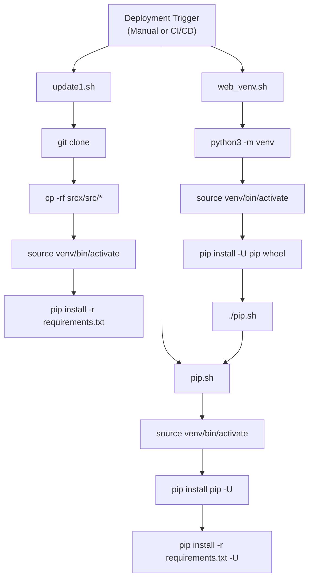
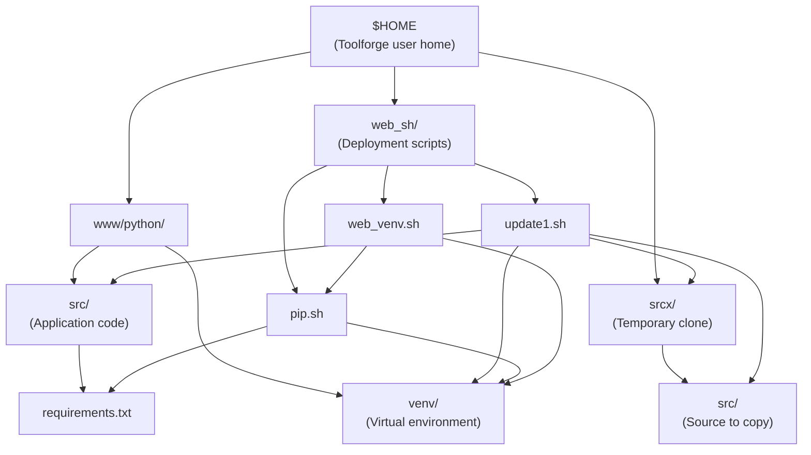
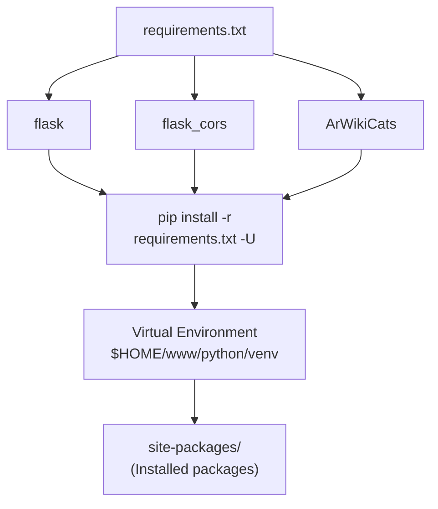
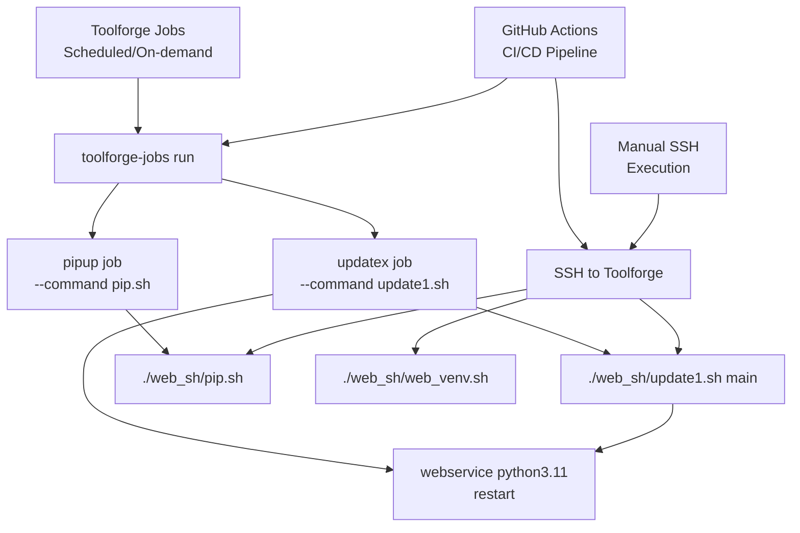

# Deployment Scripts

> **Relevant source files**
> * [src/requirements.txt](https://github.com/ArWikiCats/ArWikiCatsWeb/blob/88f42d13/src/requirements.txt)
> * [web_sh/pip.sh](https://github.com/ArWikiCats/ArWikiCatsWeb/blob/88f42d13/web_sh/pip.sh)
> * [web_sh/update1.sh](https://github.com/ArWikiCats/ArWikiCatsWeb/blob/88f42d13/web_sh/update1.sh)
> * [web_sh/web_venv.sh](https://github.com/ArWikiCats/ArWikiCatsWeb/blob/88f42d13/web_sh/web_venv.sh)

## Purpose and Scope

This document details the shell scripts used to deploy ArWikiCatsWeb to Wikimedia Toolforge. These scripts handle code updates, dependency management, and virtual environment configuration. For information about the Kubernetes deployment configuration, see [Toolforge Configuration](/ArWikiCats/ArWikiCatsWeb/8.1-toolforge-configuration). For information about the automated CI/CD pipeline that triggers these scripts, see [CI/CD Pipeline](/ArWikiCats/ArWikiCatsWeb/8.3-cicd-pipeline).

The deployment scripts are located in the `web_sh/` directory and consist of three primary components:

* **update1.sh**: Main deployment script that clones code and installs dependencies
* **pip.sh**: Dependency update script
* **web_venv.sh**: Virtual environment initialization script

## Script Execution Flow

The deployment scripts follow a sequential execution pattern, with `update1.sh` serving as the primary entry point. The following diagram illustrates the relationship and execution order:

**Diagram: Script Execution Flow**



Sources: [web_sh/update1.sh L1-L50](https://github.com/ArWikiCats/ArWikiCatsWeb/blob/88f42d13/web_sh/update1.sh#L1-L50)

 [web_sh/pip.sh L1-L13](https://github.com/ArWikiCats/ArWikiCatsWeb/blob/88f42d13/web_sh/pip.sh#L1-L13)

 [web_sh/web_venv.sh L1-L17](https://github.com/ArWikiCats/ArWikiCatsWeb/blob/88f42d13/web_sh/web_venv.sh#L1-L17)

## File System Structure

The scripts operate on a specific directory structure within the Toolforge environment. Understanding this structure is essential for troubleshooting and maintenance.

**Diagram: Deployment Directory Structure**



Sources: [web_sh/update1.sh L11-L14](https://github.com/ArWikiCats/ArWikiCatsWeb/blob/88f42d13/web_sh/update1.sh#L11-L14)

 [web_sh/pip.sh L7-L10](https://github.com/ArWikiCats/ArWikiCatsWeb/blob/88f42d13/web_sh/pip.sh#L7-L10)

 [web_sh/web_venv.sh L6-L16](https://github.com/ArWikiCats/ArWikiCatsWeb/blob/88f42d13/web_sh/web_venv.sh#L6-L16)

## update1.sh: Main Deployment Script

The `update1.sh` script is the primary deployment mechanism. It performs a complete code update by cloning the repository and installing dependencies.

### Script Parameters

| Parameter | Description | Default |
| --- | --- | --- |
| `$1` (BRANCH) | Git branch to deploy | `main` |

Usage example:

```sql
./web_sh/update1.sh main
./web_sh/update1.sh update
```

### Execution Steps

The script executes the following sequence:

1. **Clone Repository**: Clones the specified branch from `https://github.com/WikiAr/make2-web.git` to `$HOME/srcx`
2. **Remove Existing Clone**: Deletes any previous temporary clone directory [web_sh/update1.sh L19](https://github.com/ArWikiCats/ArWikiCatsWeb/blob/88f42d13/web_sh/update1.sh#L19-L19)
3. **Copy Source Files**: Copies all files from `$HOME/srcx/src/*` to `$HOME/www/python/src/` [web_sh/update1.sh L31](https://github.com/ArWikiCats/ArWikiCatsWeb/blob/88f42d13/web_sh/update1.sh#L31-L31)
4. **Activate Virtual Environment**: Sources the Python virtual environment at `$HOME/www/python/venv/bin/activate` [web_sh/update1.sh L38](https://github.com/ArWikiCats/ArWikiCatsWeb/blob/88f42d13/web_sh/update1.sh#L38-L38)
5. **Install Dependencies**: Runs `pip install -r requirements.txt -U` to update all dependencies [web_sh/update1.sh L40](https://github.com/ArWikiCats/ArWikiCatsWeb/blob/88f42d13/web_sh/update1.sh#L40-L40)

### Error Handling

The script uses bash strict mode with `set -euo pipefail` [web_sh/update1.sh L3](https://github.com/ArWikiCats/ArWikiCatsWeb/blob/88f42d13/web_sh/update1.sh#L3-L3)

 which provides:

* `-e`: Exit immediately if any command fails
* `-u`: Treat unset variables as errors
* `-o pipefail`: Return exit status of failed commands in pipelines

Error handling patterns:

```php
# Clone with error checking
if git clone --branch "$BRANCH" "$REPO_URL" "$CLONE_DIR"; then
    echo "Repository cloned successfully."
else
    echo "Failed to clone the repository." >&2
    exit 1
fi
```

Sources: [web_sh/update1.sh L1-L50](https://github.com/ArWikiCats/ArWikiCatsWeb/blob/88f42d13/web_sh/update1.sh#L1-L50)

### Toolforge Integration

The script includes commented-out commands for Toolforge-specific operations:

* `webservice python3.11 restart` [web_sh/update1.sh L47](https://github.com/ArWikiCats/ArWikiCatsWeb/blob/88f42d13/web_sh/update1.sh#L47-L47) : Restart the web service after deployment
* `toolforge-jobs run updatex --image python3.11 --command "$HOME/web_sh/update1.sh update" --wait` [web_sh/update1.sh L49](https://github.com/ArWikiCats/ArWikiCatsWeb/blob/88f42d13/web_sh/update1.sh#L49-L49) : Execute as a Toolforge job

These commands are typically executed by the CI/CD pipeline rather than being included in the script itself. See [CI/CD Pipeline](/ArWikiCats/ArWikiCatsWeb/8.3-cicd-pipeline) for details on automated execution.

Sources: [web_sh/update1.sh L47-L49](https://github.com/ArWikiCats/ArWikiCatsWeb/blob/88f42d13/web_sh/update1.sh#L47-L49)

## pip.sh: Dependency Management Script

The `pip.sh` script focuses exclusively on updating Python dependencies without performing a full code deployment.

### Execution Steps

1. **Activate Virtual Environment**: Sources `$HOME/www/python/venv/bin/activate` [web_sh/pip.sh L7](https://github.com/ArWikiCats/ArWikiCatsWeb/blob/88f42d13/web_sh/pip.sh#L7-L7)
2. **Upgrade pip**: Updates pip itself with `pip install pip -U` [web_sh/pip.sh L9](https://github.com/ArWikiCats/ArWikiCatsWeb/blob/88f42d13/web_sh/pip.sh#L9-L9)
3. **Install Dependencies**: Installs all requirements from `$HOME/www/python/src/requirements.txt` with the `-U` (upgrade) flag [web_sh/pip.sh L10](https://github.com/ArWikiCats/ArWikiCatsWeb/blob/88f42d13/web_sh/pip.sh#L10-L10)

### Usage Patterns

This script is useful for:

* **Dependency-only updates**: When only `requirements.txt` has changed
* **Security patches**: Updating dependencies without code changes
* **Manual maintenance**: Running ad-hoc dependency updates

Command execution:

```
./web_sh/pip.sh
```

Toolforge job execution:

```
toolforge-jobs run pipup --image python3.11 --command ~/web_sh/pip.sh --wait
```

Sources: [web_sh/pip.sh L1-L13](https://github.com/ArWikiCats/ArWikiCatsWeb/blob/88f42d13/web_sh/pip.sh#L1-L13)

## web_venv.sh: Virtual Environment Setup

The `web_venv.sh` script performs initial setup of the Python virtual environment. This script is typically run once during initial deployment or when the virtual environment needs to be recreated.

### Execution Steps

1. **Create Directory Structure**: Creates `$HOME/www/python/src` if it doesn't exist [web_sh/web_venv.sh L6](https://github.com/ArWikiCats/ArWikiCatsWeb/blob/88f42d13/web_sh/web_venv.sh#L6-L6)
2. **Create Virtual Environment**: Runs `python3 -m venv $HOME/www/python/venv` [web_sh/web_venv.sh L8](https://github.com/ArWikiCats/ArWikiCatsWeb/blob/88f42d13/web_sh/web_venv.sh#L8-L8)
3. **Activate Environment**: Sources the newly created virtual environment [web_sh/web_venv.sh L11](https://github.com/ArWikiCats/ArWikiCatsWeb/blob/88f42d13/web_sh/web_venv.sh#L11-L11)
4. **Upgrade pip and wheel**: Installs updated pip and wheel support with `pip install -U pip wheel` [web_sh/web_venv.sh L14](https://github.com/ArWikiCats/ArWikiCatsWeb/blob/88f42d13/web_sh/web_venv.sh#L14-L14)
5. **Install Dependencies**: Calls `./pip.sh` to install all application dependencies [web_sh/web_venv.sh L16](https://github.com/ArWikiCats/ArWikiCatsWeb/blob/88f42d13/web_sh/web_venv.sh#L16-L16)

### When to Use

This script should be executed in the following scenarios:

* Initial deployment of the application
* After Python version upgrades
* When the virtual environment becomes corrupted
* When migrating to a new Toolforge instance

Sources: [web_sh/web_venv.sh L1-L17](https://github.com/ArWikiCats/ArWikiCatsWeb/blob/88f42d13/web_sh/web_venv.sh#L1-L17)

## Requirements Management

The application's Python dependencies are managed through `requirements.txt`, which lists the core dependencies:

| Package | Purpose |
| --- | --- |
| `flask` | Web application framework |
| `flask_cors` | CORS support for API endpoints |
| `ArWikiCats` | Arabic Wikipedia category resolution library |

**Diagram: Dependency Installation Flow**



Sources: [src/requirements.txt L1-L4](https://github.com/ArWikiCats/ArWikiCatsWeb/blob/88f42d13/src/requirements.txt#L1-L4)

### Dependency Updates

Dependencies are updated through the following mechanisms:

1. **During full deployment**: `update1.sh` installs dependencies with `-U` flag [web_sh/update1.sh L40](https://github.com/ArWikiCats/ArWikiCatsWeb/blob/88f42d13/web_sh/update1.sh#L40-L40)
2. **Dedicated dependency updates**: `pip.sh` can be run independently [web_sh/pip.sh L10](https://github.com/ArWikiCats/ArWikiCatsWeb/blob/88f42d13/web_sh/pip.sh#L10-L10)
3. **Initial setup**: `web_venv.sh` chains to `pip.sh` for initial installation [web_sh/web_venv.sh L16](https://github.com/ArWikiCats/ArWikiCatsWeb/blob/88f42d13/web_sh/web_venv.sh#L16-L16)

The `-U` (upgrade) flag ensures that all packages are updated to their latest versions that satisfy the requirements specification.

Sources: [web_sh/update1.sh L40](https://github.com/ArWikiCats/ArWikiCatsWeb/blob/88f42d13/web_sh/update1.sh#L40-L40)

 [web_sh/pip.sh L10](https://github.com/ArWikiCats/ArWikiCatsWeb/blob/88f42d13/web_sh/pip.sh#L10-L10)

 [src/requirements.txt L1-L4](https://github.com/ArWikiCats/ArWikiCatsWeb/blob/88f42d13/src/requirements.txt#L1-L4)

## Script Invocation Patterns

The deployment scripts can be invoked through multiple mechanisms depending on the deployment context.

**Diagram: Script Invocation Methods**



Sources: [web_sh/update1.sh L49](https://github.com/ArWikiCats/ArWikiCatsWeb/blob/88f42d13/web_sh/update1.sh#L49-L49)

 [web_sh/pip.sh L12](https://github.com/ArWikiCats/ArWikiCatsWeb/blob/88f42d13/web_sh/pip.sh#L12-L12)

### Manual Execution

Direct execution via SSH to Toolforge:

```
ssh toolforge
cd ~
./web_sh/update1.sh main
```

### Toolforge Jobs

The commented commands in the scripts show the intended Toolforge Jobs integration:

**update1.sh job**:

```sql
toolforge-jobs run updatex --image python3.11 --command "$HOME/web_sh/update1.sh update" --wait
```

**pip.sh job**:

```
toolforge-jobs run pipup --image python3.11 --command ~/web_sh/pip.sh --wait
```

The `--wait` flag ensures the job completes before returning control, which is essential for CI/CD pipeline integration.

Sources: [web_sh/update1.sh L49](https://github.com/ArWikiCats/ArWikiCatsWeb/blob/88f42d13/web_sh/update1.sh#L49-L49)

 [web_sh/pip.sh L12](https://github.com/ArWikiCats/ArWikiCatsWeb/blob/88f42d13/web_sh/pip.sh#L12-L12)

### CI/CD Integration

The GitHub Actions workflow automates deployment by:

1. SSH into Toolforge
2. Execute `update1.sh` with the appropriate branch
3. Restart the web service

See [CI/CD Pipeline](/ArWikiCats/ArWikiCatsWeb/8.3-cicd-pipeline) for complete workflow details.

## Best Practices and Troubleshooting

### Script Execution Best Practices

1. **Always specify branch**: While `main` is the default, explicitly specify the branch to avoid confusion: ``` ./web_sh/update1.sh production ```
2. **Check virtual environment**: Verify the virtual environment is activated when running dependency scripts: ```markdown which python  # Should show path to venv python ```
3. **Monitor disk space**: The `srcx` temporary directory accumulates over time. The `update1.sh` script handles cleanup [web_sh/update1.sh L19](https://github.com/ArWikiCats/ArWikiCatsWeb/blob/88f42d13/web_sh/update1.sh#L19-L19)  but verify available space if cloning fails.

### Common Issues

| Issue | Symptom | Solution |
| --- | --- | --- |
| Clone fails | "Failed to clone the repository" error | Check network connectivity, verify repository URL |
| Activation fails | "Failed to activate virtual environment" | Verify venv exists; run `web_venv.sh` to recreate |
| Permission errors | "Permission denied" during copy | Check file ownership and permissions in target directories |
| Dependency conflicts | pip installation failures | Clear pip cache or recreate virtual environment |

### Verification Steps

After running deployment scripts, verify successful deployment:

1. **Check source files updated**: ``` ls -la $HOME/www/python/src/ ```
2. **Verify virtual environment**: ```markdown source $HOME/www/python/venv/bin/activate python --version  # Should show Python 3.11 ```
3. **Confirm dependencies installed**: ``` pip list | grep -E 'flask|ArWikiCats' ```
4. **Check web service status**: ``` webservice python3.11 status ```

Sources: [web_sh/update1.sh L1-L50](https://github.com/ArWikiCats/ArWikiCatsWeb/blob/88f42d13/web_sh/update1.sh#L1-L50)

 [web_sh/pip.sh L1-L13](https://github.com/ArWikiCats/ArWikiCatsWeb/blob/88f42d13/web_sh/pip.sh#L1-L13)

 [web_sh/web_venv.sh L1-L17](https://github.com/ArWikiCats/ArWikiCatsWeb/blob/88f42d13/web_sh/web_venv.sh#L1-L17)