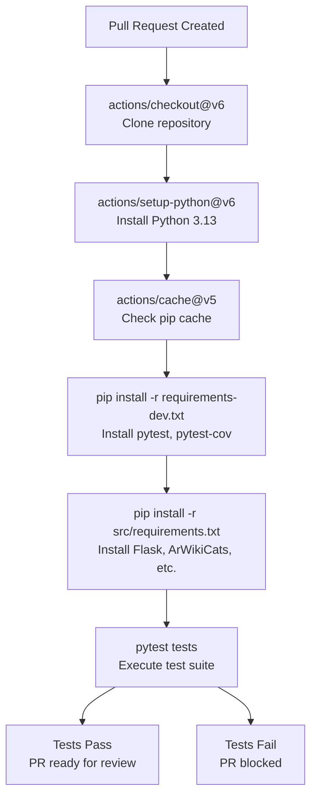
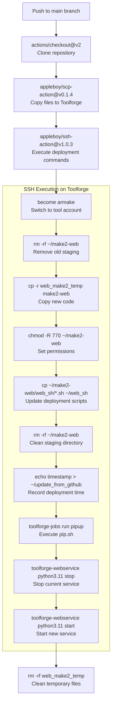
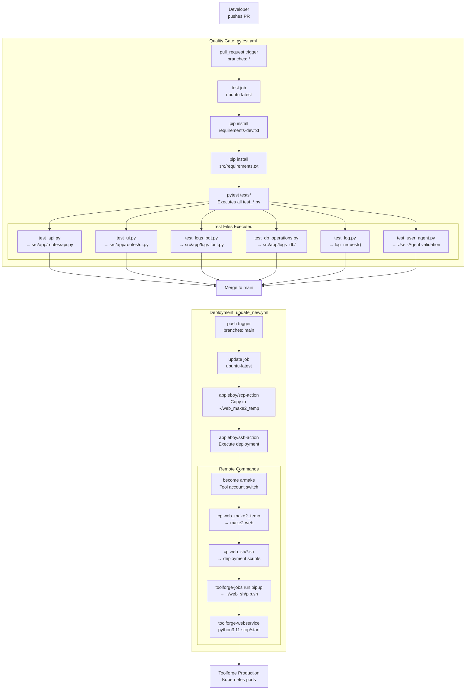
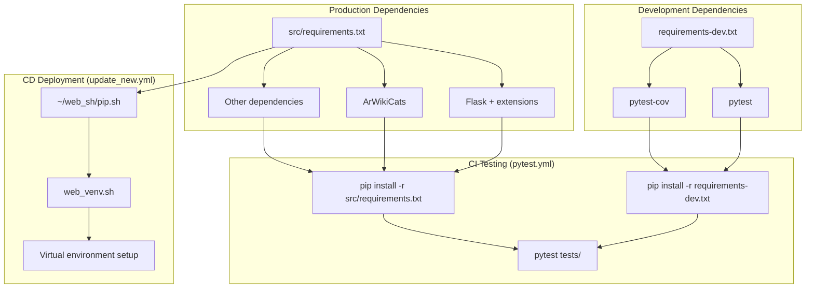

# CI/CD Pipeline

> **Relevant source files**
> * [.github/workflows/pytest.yml](https://github.com/ArWikiCats/ArWikiCatsWeb/blob/88f42d13/.github/workflows/pytest.yml)
> * [.github/workflows/update_new.yml](https://github.com/ArWikiCats/ArWikiCatsWeb/blob/88f42d13/.github/workflows/update_new.yml)
> * [requirements-dev.txt](https://github.com/ArWikiCats/ArWikiCatsWeb/blob/88f42d13/requirements-dev.txt)

This document describes the automated Continuous Integration and Continuous Deployment (CI/CD) infrastructure for ArWikiCatsWeb. The pipeline consists of two GitHub Actions workflows that handle automated testing on pull requests and automated deployment to Toolforge on successful merges to the main branch.

For information about the target deployment environment and Kubernetes configuration, see [Toolforge Configuration](/ArWikiCats/ArWikiCatsWeb/8.1-toolforge-configuration). For details about the shell scripts executed during deployment, see [Deployment Scripts](/ArWikiCats/ArWikiCatsWeb/8.2-deployment-scripts). For information about the test suites that the CI pipeline runs, see [Testing](/ArWikiCats/ArWikiCatsWeb/9-testing).

## Pipeline Overview

The CI/CD pipeline uses GitHub Actions to orchestrate two distinct workflows:

| Workflow | File | Trigger | Purpose |
| --- | --- | --- | --- |
| Python pytest | `pytest.yml` | Pull requests to any branch | Run test suite and validate code quality |
| Auto Update new | `update_new.yml` | Pushes to `main` branch | Deploy code to Toolforge production environment |

These workflows operate independently but form a complete quality gate and deployment pipeline. Code must pass the pytest workflow before merge, and successful merges trigger automatic deployment.

**Sources:** [.github/workflows/pytest.yml L1-L35](https://github.com/ArWikiCats/ArWikiCatsWeb/blob/88f42d13/.github/workflows/pytest.yml#L1-L35)

 [.github/workflows/update_new.yml L1-L52](https://github.com/ArWikiCats/ArWikiCatsWeb/blob/88f42d13/.github/workflows/update_new.yml#L1-L52)

## Testing Workflow

The pytest workflow (`pytest.yml`) executes on every pull request to ensure code quality before merge.

### Trigger Configuration

```yaml
on:
  pull_request:
    branches: ["*"]
```

The workflow triggers on pull requests targeting any branch, providing comprehensive test coverage for all proposed changes.

**Sources:** [.github/workflows/pytest.yml L3-L5](https://github.com/ArWikiCats/ArWikiCatsWeb/blob/88f42d13/.github/workflows/pytest.yml#L3-L5)

### Workflow Steps



**Diagram: pytest Workflow Execution Flow**

The workflow executes the following operations:

1. **Repository Checkout** - Uses `actions/checkout@v6` to clone the repository at the PR's HEAD commit
2. **Python Environment Setup** - Installs Python 3.13 using `actions/setup-python@v6`
3. **Dependency Caching** - Caches pip packages using `~/.cache/pip` with cache key based on `requirements.txt` hash
4. **Test Dependencies Installation** - Installs `pytest` and `pytest-cov` from `requirements-dev.txt`
5. **Production Dependencies Installation** - Installs application dependencies from `src/requirements.txt`
6. **Test Execution** - Runs `pytest tests` to execute all test suites

**Sources:** [.github/workflows/pytest.yml L11-L34](https://github.com/ArWikiCats/ArWikiCatsWeb/blob/88f42d13/.github/workflows/pytest.yml#L11-L34)

 [requirements-dev.txt L1-L2](https://github.com/ArWikiCats/ArWikiCatsWeb/blob/88f42d13/requirements-dev.txt#L1-L2)

### Cache Strategy

The workflow implements pip dependency caching to reduce installation time:

```yaml
path: ~/.cache/pip
key: ${{ runner.os }}-pip-${{ hashFiles('**/requirements.txt') }}
restore-keys: |
  ${{ runner.os }}-pip-
```

The cache key includes:

* Operating system (`ubuntu-latest`)
* Hash of all `requirements.txt` files

This ensures cache invalidation when dependencies change while maintaining cache hits across PRs with identical dependencies.

**Sources:** [.github/workflows/pytest.yml L19-L25](https://github.com/ArWikiCats/ArWikiCatsWeb/blob/88f42d13/.github/workflows/pytest.yml#L19-L25)

### Test Execution Environment

| Configuration | Value |
| --- | --- |
| Runner | `ubuntu-latest` |
| Python Version | 3.13 |
| Test Framework | pytest |
| Coverage Tool | pytest-cov |
| Test Directory | `tests/` |

The test execution runs all test suites documented in [Test Infrastructure](/ArWikiCats/ArWikiCatsWeb/9.1-test-infrastructure), [API Tests](/ArWikiCats/ArWikiCatsWeb/9.2-api-tests), and [UI and Database Tests](/ArWikiCats/ArWikiCatsWeb/9.3-ui-and-database-tests), achieving 89% overall code coverage.

**Sources:** [.github/workflows/pytest.yml L9-L34](https://github.com/ArWikiCats/ArWikiCatsWeb/blob/88f42d13/.github/workflows/pytest.yml#L9-L34)

## Deployment Workflow

The deployment workflow (`update_new.yml`) automatically deploys code to Toolforge when changes are pushed to the main branch.

### Trigger Configuration

```yaml
on:
  push:
    branches:
      - main
```

The workflow triggers exclusively on pushes to the `main` branch, ensuring only merged and approved code reaches production.

**Sources:** [.github/workflows/update_new.yml L3-L6](https://github.com/ArWikiCats/ArWikiCatsWeb/blob/88f42d13/.github/workflows/update_new.yml#L3-L6)

### Deployment Process



**Diagram: Deployment Workflow Execution Flow**

**Sources:** [.github/workflows/update_new.yml L8-L52](https://github.com/ArWikiCats/ArWikiCatsWeb/blob/88f42d13/.github/workflows/update_new.yml#L8-L52)

### File Transfer Stage

The workflow uses `appleboy/scp-action@v0.1.4` to transfer files to Toolforge:

| Parameter | Value | Purpose |
| --- | --- | --- |
| `host` | `${{ secrets.HOST }}` | Toolforge login server hostname |
| `username` | `${{ secrets.USERNAME }}` | User account for SSH access |
| `key` | `${{ secrets.KEY }}` | Private SSH key for authentication |
| `port` | `22` | SSH port |
| `source` | `./` | Repository root (all files) |
| `target` | `~/web_make2_temp` | Temporary staging directory |
| `rm` | `true` | Remove target directory before transfer |

The action copies the entire repository to the temporary directory `~/web_make2_temp` on Toolforge's NFS-backed home directory.

**Sources:** [.github/workflows/update_new.yml L18-L27](https://github.com/ArWikiCats/ArWikiCatsWeb/blob/88f42d13/.github/workflows/update_new.yml#L18-L27)

### Remote Deployment Commands

The workflow executes a series of commands via SSH using `appleboy/ssh-action@v1.0.3`:

```php
become armake bash -lc "
  rm -rf ~/make2-web &&
  cp -r /mnt/nfs/labstore-secondary-tools-home/$USERNAME/web_make2_temp ~/make2-web &&
  chmod -R 770 ~/make2-web &&
  cp -rf ~/make2-web/web_sh/*.sh ~/web_sh -v &&
  rm -rf ~/make2-web &&
  echo \"Updated on: $(date '+%Y-%m-%d %H:%M:%S')\" > ~/update_from_github &&
  toolforge-jobs run pipup --image python3.11 --command \"~/web_sh/pip.sh\" --wait &&
  toolforge-webservice python3.11 stop &&
  toolforge-webservice python3.11 start &&
  echo ''
"
rm -rf web_make2_temp
```

These commands execute under the `armake` tool account and perform:

1. **Staging Cleanup** - Remove previous staging directory
2. **Code Transfer** - Copy from NFS temp location to home directory
3. **Permission Setting** - Set `770` permissions (rwxrwx---)
4. **Script Update** - Copy deployment scripts from `web_sh/` to persistent location
5. **Staging Removal** - Delete staging directory
6. **Deployment Timestamp** - Record deployment time in `~/update_from_github`
7. **Dependency Update** - Execute `pip.sh` via Kubernetes job (see [Deployment Scripts](/ArWikiCats/ArWikiCatsWeb/8.2-deployment-scripts))
8. **Service Restart** - Stop and start the `python3.11` webservice

**Sources:** [.github/workflows/update_new.yml L38-L50](https://github.com/ArWikiCats/ArWikiCatsWeb/blob/88f42d13/.github/workflows/update_new.yml#L38-L50)

### SSH Action Configuration

| Parameter | Value | Purpose |
| --- | --- | --- |
| `request_pty` | `true` | Request pseudo-TTY for interactive commands |
| `script_stop` | `true` | Stop execution on first command failure |
| `key` | `${{ secrets.KEY }}` | SSH private key for authentication |

The `request_pty` parameter enables execution of commands that require TTY, such as `become`. The `script_stop` parameter ensures the deployment halts if any command fails, preventing partial deployments.

**Sources:** [.github/workflows/update_new.yml L30-L37](https://github.com/ArWikiCats/ArWikiCatsWeb/blob/88f42d13/.github/workflows/update_new.yml#L30-L37)

## Workflow Integration and Code Entity Mapping



**Diagram: Complete CI/CD Pipeline with Code Entity Mapping**

This diagram maps the CI/CD pipeline to specific code entities and files in the repository:

* **Test Execution** maps to test files in `tests/` directory, which validate code in `src/app/`
* **Deployment Scripts** map to shell scripts in `web_sh/` directory
* **Service Restart** affects the WSGI application defined in `src/app.py`
* **Tool Account** is `armake`, referenced throughout deployment configuration

**Sources:** [.github/workflows/pytest.yml L1-L35](https://github.com/ArWikiCats/ArWikiCatsWeb/blob/88f42d13/.github/workflows/pytest.yml#L1-L35)

 [.github/workflows/update_new.yml L1-L52](https://github.com/ArWikiCats/ArWikiCatsWeb/blob/88f42d13/.github/workflows/update_new.yml#L1-L52)

## Secrets Management

Both workflows rely on GitHub repository secrets for authentication and access:

| Secret | Used By | Purpose |
| --- | --- | --- |
| `HOST` | update_new.yml | Toolforge login server hostname |
| `USERNAME` | update_new.yml | Toolforge user account name |
| `KEY` | update_new.yml | SSH private key for Toolforge authentication |

These secrets are configured in the GitHub repository settings and injected into the workflow at runtime. The `KEY` secret contains the private SSH key that corresponds to a public key authorized on the Toolforge account.

**Sources:** [.github/workflows/update_new.yml L21-L37](https://github.com/ArWikiCats/ArWikiCatsWeb/blob/88f42d13/.github/workflows/update_new.yml#L21-L37)

## Dependency Management in CI/CD



**Diagram: Dependency Installation in CI/CD Pipelines**

The pytest workflow installs both development and production dependencies to run the complete test suite. The deployment workflow delegates dependency installation to the `pip.sh` script, which is documented in [Deployment Scripts](/ArWikiCats/ArWikiCatsWeb/8.2-deployment-scripts).

**Sources:** [.github/workflows/pytest.yml L28-L31](https://github.com/ArWikiCats/ArWikiCatsWeb/blob/88f42d13/.github/workflows/pytest.yml#L28-L31)

 [.github/workflows/update_new.yml L46](https://github.com/ArWikiCats/ArWikiCatsWeb/blob/88f42d13/.github/workflows/update_new.yml#L46-L46)

 [requirements-dev.txt L1-L2](https://github.com/ArWikiCats/ArWikiCatsWeb/blob/88f42d13/requirements-dev.txt#L1-L2)

## Pipeline Execution Flow

The complete CI/CD lifecycle follows this pattern:

1. **Development Phase** - Developer creates pull request
2. **Quality Gate** - `pytest.yml` executes on PR creation/update
3. **Test Validation** - All test suites must pass (89% coverage target)
4. **Code Review** - Manual review while tests run
5. **Merge Approval** - Tests pass and review approved
6. **Merge to Main** - PR merged to main branch
7. **Deployment Trigger** - `update_new.yml` executes automatically
8. **File Transfer** - Code copied to Toolforge via SCP
9. **Deployment Execution** - SSH commands update code and restart service
10. **Production Active** - New code running in Toolforge Kubernetes pods

This process ensures that all code deployed to production has been tested and approved, maintaining the quality and reliability of the service.

**Sources:** [.github/workflows/pytest.yml L3-L5](https://github.com/ArWikiCats/ArWikiCatsWeb/blob/88f42d13/.github/workflows/pytest.yml#L3-L5)

 [.github/workflows/update_new.yml L3-L6](https://github.com/ArWikiCats/ArWikiCatsWeb/blob/88f42d13/.github/workflows/update_new.yml#L3-L6)

## Error Handling and Rollback

The deployment workflow includes error handling mechanisms:

* **script_stop: true** - Halts deployment on first command failure
* **Staging Directory** - Code copied to temporary location before activation
* **Service Restart** - Explicit stop before start ensures clean state

If deployment fails, the previous version remains active because:

1. The staging directory (`~/make2-web`) is separate from production code
2. Service restart only occurs after successful code copy
3. The `script_stop` parameter prevents partial deployments

Manual rollback requires SSH access to Toolforge to revert code and restart the webservice.

**Sources:** [.github/workflows/update_new.yml L36-L50](https://github.com/ArWikiCats/ArWikiCatsWeb/blob/88f42d13/.github/workflows/update_new.yml#L36-L50)