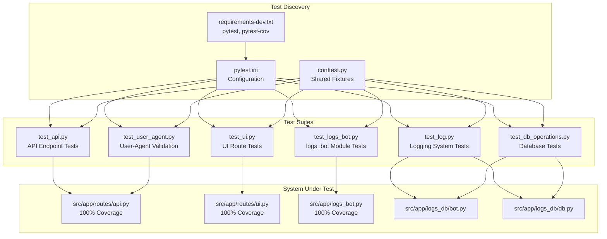
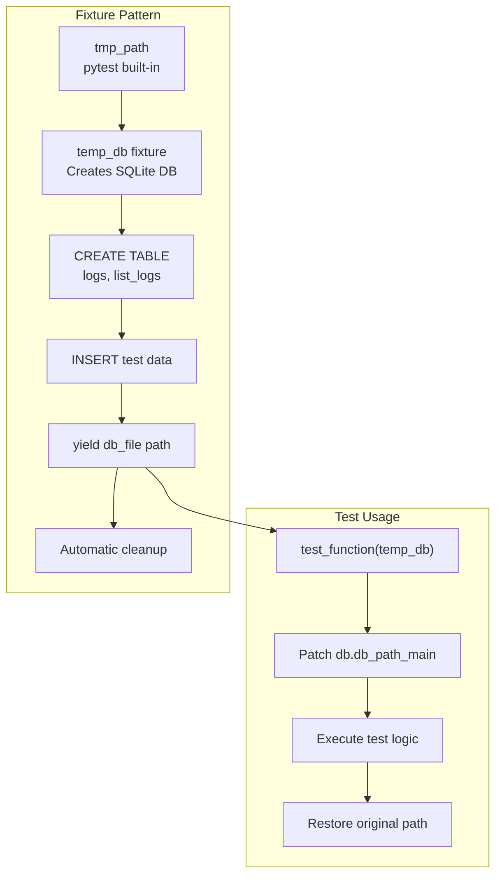
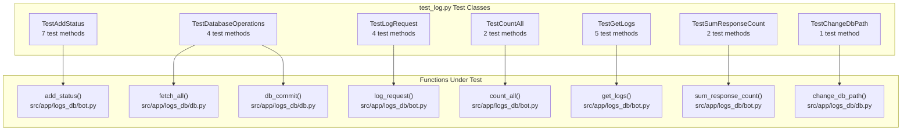
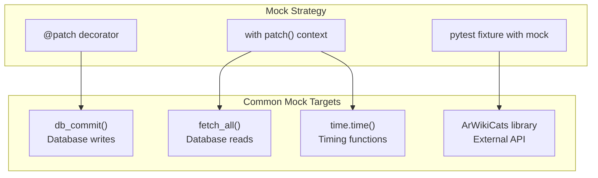
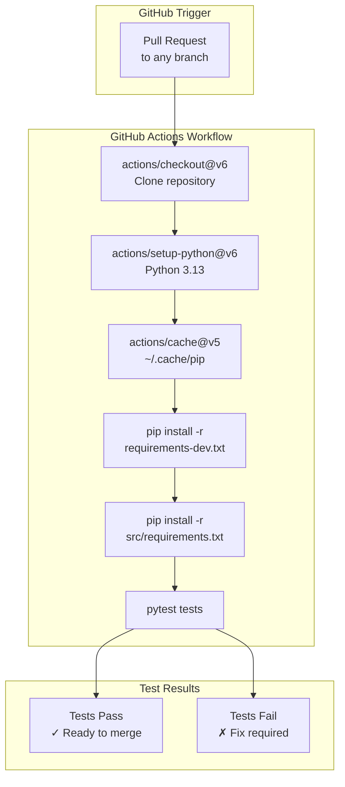
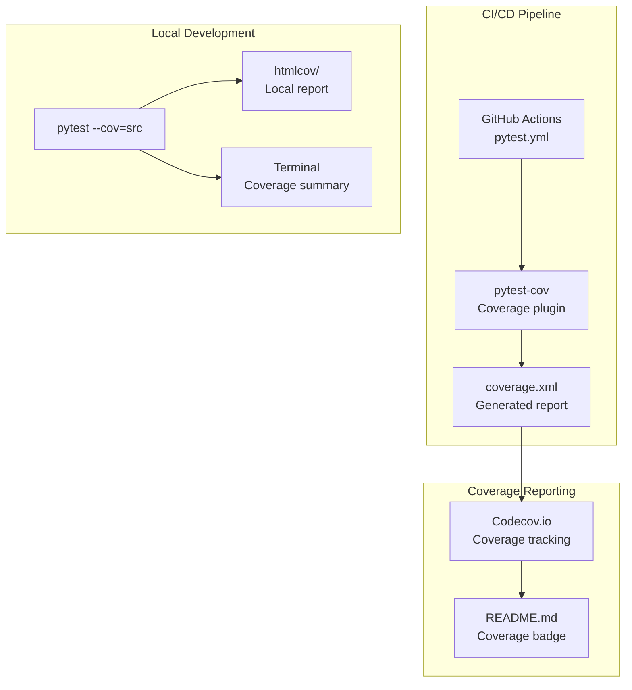

# Testing

> **Relevant source files**
> * [.github/workflows/pytest.yml](https://github.com/ArWikiCats/ArWikiCatsWeb/blob/88f42d13/.github/workflows/pytest.yml)
> * [README.md](https://github.com/ArWikiCats/ArWikiCatsWeb/blob/88f42d13/README.md)
> * [pyproject.toml](https://github.com/ArWikiCats/ArWikiCatsWeb/blob/88f42d13/pyproject.toml)
> * [pytest.ini](https://github.com/ArWikiCats/ArWikiCatsWeb/blob/88f42d13/pytest.ini)
> * [requirements-dev.txt](https://github.com/ArWikiCats/ArWikiCatsWeb/blob/88f42d13/requirements-dev.txt)
> * [tests/conftest.py](https://github.com/ArWikiCats/ArWikiCatsWeb/blob/88f42d13/tests/conftest.py)
> * [tests/test_log.py](https://github.com/ArWikiCats/ArWikiCatsWeb/blob/88f42d13/tests/test_log.py)

This document describes the testing infrastructure, test organization, coverage metrics, and testing practices for ArWikiCatsWeb. It covers the test suite architecture, pytest configuration, test execution patterns, and CI/CD integration.

For information about deployment workflows that include automated testing, see [CI/CD Pipeline](/ArWikiCats/ArWikiCatsWeb/8.3-cicd-pipeline). For details on the database operations being tested, see [Database Layer](/ArWikiCats/ArWikiCatsWeb/7-database-layer).

## Testing Infrastructure

ArWikiCatsWeb uses **pytest** as its primary testing framework, achieving **89% overall test coverage** with 100% coverage on critical modules. The testing infrastructure is configured through [pytest.ini](https://github.com/ArWikiCats/ArWikiCatsWeb/blob/88f42d13/pytest.ini)

 and uses temporary databases with fixtures to ensure isolated, repeatable tests.

### Pytest Configuration

The pytest configuration in [pytest.ini L1-L13](https://github.com/ArWikiCats/ArWikiCatsWeb/blob/88f42d13/pytest.ini#L1-L13)

 defines the testing environment:

| Configuration | Value | Purpose |
| --- | --- | --- |
| `testpaths` | `tests` | Directory containing all test files |
| `pythonpath` | `.` | Root path for imports |
| `python_files` | `test*.py *Test.py Test*.py` | Test file naming patterns |
| `python_classes` | `Test*` | Test class naming pattern |
| `python_functions` | `test*` | Test function naming pattern |
| `addopts` | `-v --tb=short --strict-markers -m "not network" --durations=10 --maxfail=25` | Default command-line options |
| `markers` | `network` | Custom marker for network-dependent tests |

The configuration excludes network-dependent tests by default (`-m "not network"`), displays the 10 slowest tests (`--durations=10`), and stops after 25 failures (`--maxfail=25`).

**Sources:** [pytest.ini L1-L13](https://github.com/ArWikiCats/ArWikiCatsWeb/blob/88f42d13/pytest.ini#L1-L13)

 [README.md L57-L71](https://github.com/ArWikiCats/ArWikiCatsWeb/blob/88f42d13/README.md#L57-L71)

### Test Organization Structure



**Sources:** [pytest.ini L1-L13](https://github.com/ArWikiCats/ArWikiCatsWeb/blob/88f42d13/pytest.ini#L1-L13)

 [tests/conftest.py L1-L5](https://github.com/ArWikiCats/ArWikiCatsWeb/blob/88f42d13/tests/conftest.py#L1-L5)

 [README.md L94-L107](https://github.com/ArWikiCats/ArWikiCatsWeb/blob/88f42d13/README.md#L94-L107)

### Fixtures and Test Utilities

The test infrastructure uses pytest fixtures extensively to create isolated test environments. The primary fixture pattern is temporary database creation:



The `temp_db` fixture pattern seen in [tests/test_log.py L104-L158](https://github.com/ArWikiCats/ArWikiCatsWeb/blob/88f42d13/tests/test_log.py#L104-L158)

 creates a temporary SQLite database with the full schema, inserts test data, yields the database path, and automatically cleans up after the test completes.

**Sources:** [tests/test_log.py L104-L158](https://github.com/ArWikiCats/ArWikiCatsWeb/blob/88f42d13/tests/test_log.py#L104-L158)

 [tests/test_log.py L277-L310](https://github.com/ArWikiCats/ArWikiCatsWeb/blob/88f42d13/tests/test_log.py#L277-L310)

## Test Suites Overview

ArWikiCatsWeb contains six distinct test suites, each targeting specific system components:

| Test Suite | File | Target Module(s) | Coverage | Test Count |
| --- | --- | --- | --- | --- |
| API Tests | `test_api.py` | `src/app/routes/api.py` | 100% | Multiple endpoint tests |
| UI Tests | `test_ui.py` | `src/app/routes/ui.py` | 100% | Route rendering tests |
| Log Tests | `test_log.py` | `src/app/logs_db/bot.py`, `src/app/logs_db/db.py` | High | 85+ test cases |
| Logs Bot Tests | `test_logs_bot.py` | `src/app/logs_bot.py` | 100% | Business logic tests |
| Database Tests | `test_db_operations.py` | `src/app/logs_db/` | High | CRUD operations |
| User-Agent Tests | `test_user_agent.py` | `src/app/routes/api.py` | 100% | Header validation |

**Sources:** [README.md L94-L107](https://github.com/ArWikiCats/ArWikiCatsWeb/blob/88f42d13/README.md#L94-L107)

 [README.md L234-L240](https://github.com/ArWikiCats/ArWikiCatsWeb/blob/88f42d13/README.md#L234-L240)

### Log Tests Structure

The `test_log.py` file demonstrates comprehensive test organization using test classes. Each test class focuses on a specific function or feature:



**Sources:** [tests/test_log.py L13-L521](https://github.com/ArWikiCats/ArWikiCatsWeb/blob/88f42d13/tests/test_log.py#L13-L521)

## Testing Patterns

### Database Testing Pattern

Database tests use temporary SQLite databases with the full schema to ensure isolated, repeatable tests. The pattern involves:

1. **Create temporary database** - Use pytest's `tmp_path` fixture
2. **Initialize schema** - Execute CREATE TABLE statements
3. **Insert test data** - Populate with known test data
4. **Patch db_path_main** - Redirect database operations to temp DB
5. **Execute test** - Run the test logic
6. **Restore original path** - Clean up path modifications
7. **Automatic cleanup** - pytest removes temp files

Example from [tests/test_log.py L160-L174](https://github.com/ArWikiCats/ArWikiCatsWeb/blob/88f42d13/tests/test_log.py#L160-L174)

:

```python
def test_fetch_all_returns_list(self, temp_db):
    from src.app.logs_db import db
    
    original_path = db.db_path_main[1]
    db.db_path_main[1] = temp_db
    
    try:
        result = db.fetch_all("SELECT * FROM logs")
        assert isinstance(result, list)
        assert len(result) == 3
        assert all(isinstance(row, dict) for row in result)
    finally:
        db.db_path_main[1] = original_path
```

**Sources:** [tests/test_log.py L160-L174](https://github.com/ArWikiCats/ArWikiCatsWeb/blob/88f42d13/tests/test_log.py#L160-L174)

 [tests/test_log.py L207-L221](https://github.com/ArWikiCats/ArWikiCatsWeb/blob/88f42d13/tests/test_log.py#L207-L221)

### Mocking Pattern

Tests use `unittest.mock` to isolate components and control external dependencies. The primary mocking patterns include:



Example mock fixture from [tests/test_log.py L227-L232](https://github.com/ArWikiCats/ArWikiCatsWeb/blob/88f42d13/tests/test_log.py#L227-L232)

:

```python
@pytest.fixture
def mock_db(self):
    """Mock database functions."""
    with patch("src.app.logs_db.bot.db_commit") as mock_commit:
        mock_commit.return_value = True
        yield mock_commit
```

**Sources:** [tests/test_log.py L227-L232](https://github.com/ArWikiCats/ArWikiCatsWeb/blob/88f42d13/tests/test_log.py#L227-L232)

 [tests/test_log.py L234-L242](https://github.com/ArWikiCats/ArWikiCatsWeb/blob/88f42d13/tests/test_log.py#L234-L242)

### Test Case Organization

Tests are organized into classes by the function or feature they test. Each class contains multiple test methods covering different scenarios:

| Test Scenario Types | Examples |
| --- | --- |
| **Happy Path** | Valid inputs produce expected outputs |
| **Edge Cases** | Boundary conditions, empty inputs, maximum values |
| **Error Handling** | Invalid inputs, missing parameters, exceptions |
| **Data Validation** | Type conversions, format validation, constraints |
| **Integration** | Multiple components working together |

Example test class structure from [tests/test_log.py L13-L99](https://github.com/ArWikiCats/ArWikiCatsWeb/blob/88f42d13/tests/test_log.py#L13-L99)

:

* `test_add_status_with_status` - Happy path with status parameter
* `test_add_status_with_category` - Special case handling for 'Category'
* `test_add_status_with_like` - LIKE clause functionality
* `test_add_status_with_valid_day` - Date filtering validation
* `test_add_status_with_invalid_day` - Invalid input handling
* `test_add_status_with_multiple_conditions` - Complex query building
* `test_add_status_with_tuple_params` - Type conversion edge case

**Sources:** [tests/test_log.py L13-L99](https://github.com/ArWikiCats/ArWikiCatsWeb/blob/88f42d13/tests/test_log.py#L13-L99)

## Test Execution

### Running Tests Locally

Tests can be executed using various pytest commands:

| Command | Purpose |
| --- | --- |
| `pytest` | Run all tests with default configuration |
| `pytest --cov=src --cov-report=html` | Run with HTML coverage report |
| `pytest tests/test_api.py` | Run specific test file |
| `pytest -v` | Verbose output with test names |
| `pytest -k "test_add_status"` | Run tests matching pattern |
| `pytest --maxfail=1` | Stop after first failure |

The default pytest invocation uses options from [pytest.ini L7](https://github.com/ArWikiCats/ArWikiCatsWeb/blob/88f42d13/pytest.ini#L7-L7)

:

* `-v` - Verbose output
* `--tb=short` - Short traceback format
* `--strict-markers` - Error on unknown markers
* `-m "not network"` - Skip network tests
* `--durations=10` - Show 10 slowest tests
* `--maxfail=25` - Stop after 25 failures

**Sources:** [README.md L57-L71](https://github.com/ArWikiCats/ArWikiCatsWeb/blob/88f42d13/README.md#L57-L71)

 [pytest.ini L7](https://github.com/ArWikiCats/ArWikiCatsWeb/blob/88f42d13/pytest.ini#L7-L7)

### CI/CD Testing Pipeline



The CI workflow in [.github/workflows/pytest.yml L1-L35](https://github.com/ArWikiCats/ArWikiCatsWeb/blob/88f42d13/.github/workflows/pytest.yml#L1-L35)

 runs automatically on all pull requests. It uses Python 3.13, caches pip dependencies for faster builds, and runs the full test suite with `pytest tests`.

**Sources:** [.github/workflows/pytest.yml L1-L35](https://github.com/ArWikiCats/ArWikiCatsWeb/blob/88f42d13/.github/workflows/pytest.yml#L1-L35)

 [README.md L3-L4](https://github.com/ArWikiCats/ArWikiCatsWeb/blob/88f42d13/README.md#L3-L4)

## Coverage Analysis

ArWikiCatsWeb achieves **89% overall test coverage** with 100% coverage on critical modules:

### Coverage by Module

| Module | Coverage | File Path |
| --- | --- | --- |
| `logs_bot.py` | 100% | `src/app/logs_bot.py` |
| `routes/api.py` | 100% | `src/app/routes/api.py` |
| `routes/ui.py` | 100% | `src/app/routes/ui.py` |
| `logs_db/bot.py` | High | `src/app/logs_db/bot.py` |
| `logs_db/db.py` | High | `src/app/logs_db/db.py` |
| Overall | 89% | All modules |

The 100% coverage on route handlers (`api.py`, `ui.py`) and business logic (`logs_bot.py`) ensures that all API endpoints, UI routes, and log processing functions are thoroughly tested.

**Sources:** [README.md L234-L240](https://github.com/ArWikiCats/ArWikiCatsWeb/blob/88f42d13/README.md#L234-L240)

 [README.md L16](https://github.com/ArWikiCats/ArWikiCatsWeb/blob/88f42d13/README.md#L16-L16)

### Generating Coverage Reports

Coverage reports can be generated in multiple formats:

```markdown
# Terminal output with missing lines
pytest --cov=src --cov-report=term-missing

# HTML report with line-by-line coverage
pytest --cov=src --cov-report=html

# XML report for CI tools
pytest --cov=src --cov-report=xml
```

The HTML report is generated in the `htmlcov/` directory and provides detailed line-by-line coverage information with color-coded source code.

**Sources:** [README.md L223-L229](https://github.com/ArWikiCats/ArWikiCatsWeb/blob/88f42d13/README.md#L223-L229)

### Coverage Integration



Coverage data is automatically uploaded to Codecov during CI builds, and the coverage badge in [README.md L4](https://github.com/ArWikiCats/ArWikiCatsWeb/blob/88f42d13/README.md#L4-L4)

 displays the current coverage percentage.

**Sources:** [README.md L4](https://github.com/ArWikiCats/ArWikiCatsWeb/blob/88f42d13/README.md#L4-L4)

 [requirements-dev.txt L1-L2](https://github.com/ArWikiCats/ArWikiCatsWeb/blob/88f42d13/requirements-dev.txt#L1-L2)

## Test Data and Fixtures

### Temporary Database Fixtures

Test fixtures create isolated SQLite databases with realistic schemas and test data. Multiple fixture patterns are used:

| Fixture Name | Purpose | Tables Created | Test Data |
| --- | --- | --- | --- |
| `temp_db` | Basic database operations | `logs`, `list_logs` | 3 diverse log entries |
| `temp_db_with_data` | Count operations | `logs` | 5 no_result, 3 success entries |
| `temp_db_for_logs` | Pagination testing | `logs` | 15 entries with varying response_count |
| `temp_db_for_sum` | Sum calculations | `logs` | 3 entries with specific counts |

Example fixture from [tests/test_log.py L104-L158](https://github.com/ArWikiCats/ArWikiCatsWeb/blob/88f42d13/tests/test_log.py#L104-L158)

:

```python
@pytest.fixture
def temp_db(self, tmp_path):
    """Create a temporary database for testing."""
    db_file = tmp_path / "test_logs.db"
    conn = sqlite3.connect(str(db_file))
    cursor = conn.cursor()
    
    # Create logs table with full schema
    cursor.execute("""
        CREATE TABLE IF NOT EXISTS logs (
            id INTEGER PRIMARY KEY AUTOINCREMENT,
            endpoint TEXT NOT NULL,
            request_data TEXT NOT NULL,
            response_status TEXT NOT NULL,
            response_time REAL,
            response_count INTEGER DEFAULT 1,
            timestamp DATETIME DEFAULT CURRENT_TIMESTAMP,
            date_only DATE DEFAULT (DATE('now')),
            UNIQUE(request_data, response_status, date_only)
        );
    """)
    
    # Insert test data
    cursor.execute("""
        INSERT INTO logs (...) VALUES (...)
    """)
    
    conn.commit()
    conn.close()
    
    yield str(db_file)
```

**Sources:** [tests/test_log.py L104-L158](https://github.com/ArWikiCats/ArWikiCatsWeb/blob/88f42d13/tests/test_log.py#L104-L158)

 [tests/test_log.py L277-L310](https://github.com/ArWikiCats/ArWikiCatsWeb/blob/88f42d13/tests/test_log.py#L277-L310)

### Test Data Characteristics

Test data in fixtures is designed to test specific scenarios:

* **Status variations**: `تصنيف:اختبار` (category), `no_result`, `success`
* **Date variations**: Different `date_only` values for temporal testing
* **Count variations**: Different `response_count` values for aggregation testing
* **Time variations**: Different `response_time` values for performance testing

**Sources:** [tests/test_log.py L142-L153](https://github.com/ArWikiCats/ArWikiCatsWeb/blob/88f42d13/tests/test_log.py#L142-L153)

## Testing Best Practices

### Isolation and Independence

Each test is fully isolated:

* Uses temporary databases that don't interfere with others
* Patches global state (`db.db_path_main`) and restores it
* No shared state between tests
* Tests can run in any order

**Sources:** [tests/test_log.py L160-L174](https://github.com/ArWikiCats/ArWikiCatsWeb/blob/88f42d13/tests/test_log.py#L160-L174)

### Descriptive Test Names

Test method names clearly describe what they test:

* `test_add_status_with_status` - Tests normal status parameter
* `test_add_status_with_category` - Tests special Category handling
* `test_fetch_all_returns_list` - Tests return type
* `test_get_logs_pagination` - Tests pagination behavior
* `test_log_request_rounds_response_time` - Tests rounding behavior

**Sources:** [tests/test_log.py L16-L98](https://github.com/ArWikiCats/ArWikiCatsWeb/blob/88f42d13/tests/test_log.py#L16-L98)

### Comprehensive Assertions

Tests verify multiple aspects:

```sql
result = db.fetch_all("SELECT * FROM logs")
assert isinstance(result, list)        # Type check
assert len(result) == 3                # Count check
assert all(isinstance(row, dict) for row in result)  # Element type
```

**Sources:** [tests/test_log.py L169-L172](https://github.com/ArWikiCats/ArWikiCatsWeb/blob/88f42d13/tests/test_log.py#L169-L172)

### Edge Case Coverage

Tests explicitly cover edge cases:

* Invalid input formats ([tests/test_log.py L64-L73](https://github.com/ArWikiCats/ArWikiCatsWeb/blob/88f42d13/tests/test_log.py#L64-L73) )
* Empty result sets ([tests/test_log.py L192-L205](https://github.com/ArWikiCats/ArWikiCatsWeb/blob/88f42d13/tests/test_log.py#L192-L205) )
* Type conversions ([tests/test_log.py L89-L98](https://github.com/ArWikiCats/ArWikiCatsWeb/blob/88f42d13/tests/test_log.py#L89-L98) )
* Boundary conditions ([tests/test_log.py L373-L384](https://github.com/ArWikiCats/ArWikiCatsWeb/blob/88f42d13/tests/test_log.py#L373-L384) )
* Multiple conditions combined ([tests/test_log.py L75-L87](https://github.com/ArWikiCats/ArWikiCatsWeb/blob/88f42d13/tests/test_log.py#L75-L87) )

**Sources:** [tests/test_log.py L64-L73](https://github.com/ArWikiCats/ArWikiCatsWeb/blob/88f42d13/tests/test_log.py#L64-L73)

 [tests/test_log.py L192-L205](https://github.com/ArWikiCats/ArWikiCatsWeb/blob/88f42d13/tests/test_log.py#L192-L205)

## Dependencies

The testing infrastructure requires the following dependencies:

| Package | Purpose | Specified In |
| --- | --- | --- |
| `pytest` | Test framework and runner | `requirements-dev.txt` |
| `pytest-cov` | Coverage reporting plugin | `requirements-dev.txt` |
| `unittest.mock` | Mocking framework | Python standard library |
| `sqlite3` | Database testing | Python standard library |

Development dependencies are specified in [requirements-dev.txt L1-L2](https://github.com/ArWikiCats/ArWikiCatsWeb/blob/88f42d13/requirements-dev.txt#L1-L2)

 and installed separately from application dependencies.

**Sources:** [requirements-dev.txt L1-L2](https://github.com/ArWikiCats/ArWikiCatsWeb/blob/88f42d13/requirements-dev.txt#L1-L2)

 [README.md L40-L43](https://github.com/ArWikiCats/ArWikiCatsWeb/blob/88f42d13/README.md#L40-L43)