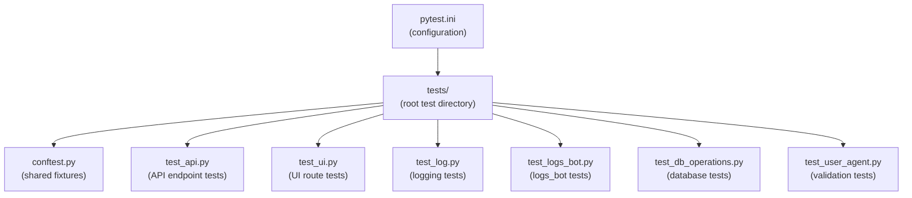
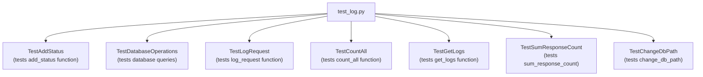
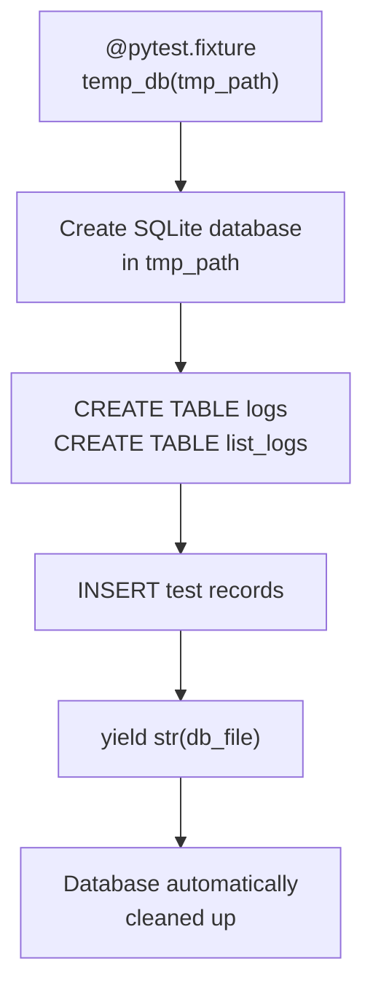
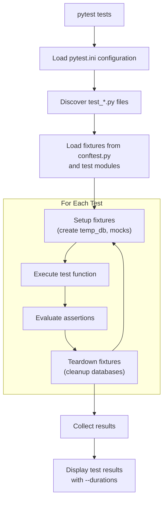
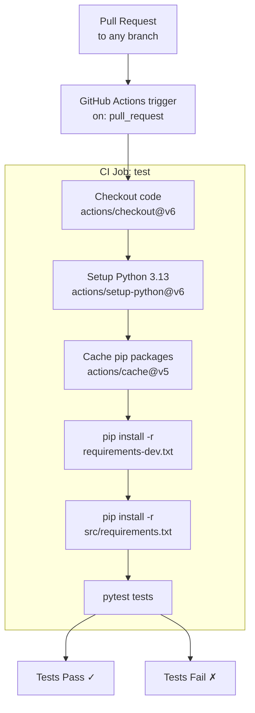
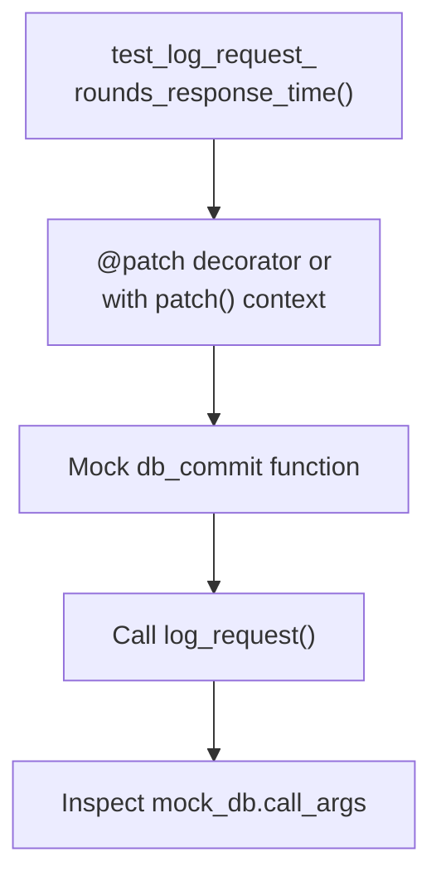
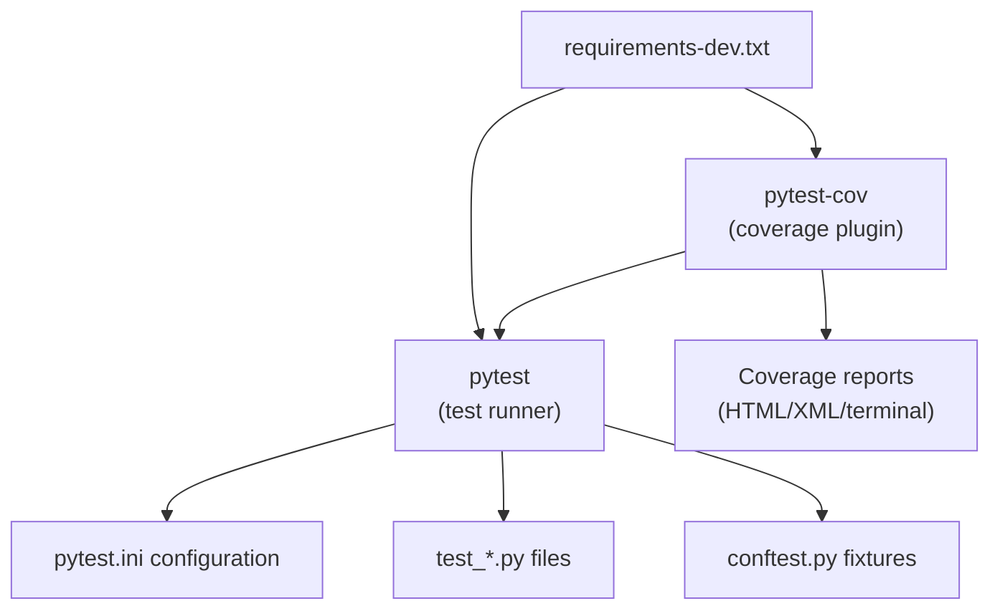

# Test Infrastructure

> **Relevant source files**
> * [.github/workflows/pytest.yml](https://github.com/ArWikiCats/ArWikiCatsWeb/blob/88f42d13/.github/workflows/pytest.yml)
> * [pyproject.toml](https://github.com/ArWikiCats/ArWikiCatsWeb/blob/88f42d13/pyproject.toml)
> * [pytest.ini](https://github.com/ArWikiCats/ArWikiCatsWeb/blob/88f42d13/pytest.ini)
> * [requirements-dev.txt](https://github.com/ArWikiCats/ArWikiCatsWeb/blob/88f42d13/requirements-dev.txt)
> * [tests/conftest.py](https://github.com/ArWikiCats/ArWikiCatsWeb/blob/88f42d13/tests/conftest.py)
> * [tests/test_log.py](https://github.com/ArWikiCats/ArWikiCatsWeb/blob/88f42d13/tests/test_log.py)

## Purpose and Scope

This document describes the testing infrastructure for ArWikiCatsWeb, including pytest configuration, test organization patterns, fixture management, and CI/CD integration. For documentation of the actual test suites and their coverage, see [API Tests](/ArWikiCats/ArWikiCatsWeb/9.2-api-tests) and [UI and Database Tests](/ArWikiCats/ArWikiCatsWeb/9.3-ui-and-database-tests). For the overall testing strategy and coverage metrics, see [Testing](/ArWikiCats/ArWikiCatsWeb/9-testing).

The test infrastructure provides:

* Centralized pytest configuration via `pytest.ini`
* Shared test fixtures via `conftest.py`
* Automated test execution via GitHub Actions
* Coverage reporting with pytest-cov
* Mocking capabilities for isolated unit testing

---

## Pytest Configuration

### Configuration File Structure

The pytest configuration is defined in [pytest.ini L1-L16](https://github.com/ArWikiCats/ArWikiCatsWeb/blob/88f42d13/pytest.ini#L1-L16)

 which establishes the testing framework parameters:

| Setting | Value | Purpose |
| --- | --- | --- |
| `testpaths` | `tests` | Root directory for test discovery |
| `pythonpath` | `.` | Enables imports from project root |
| `python_files` | `test*.py`, `*Test.py`, `Test*.py` | Test file naming patterns |
| `python_classes` | `Test*` | Test class naming pattern |
| `python_functions` | `test*` | Test function naming pattern |

### Command-Line Options

The `addopts` parameter in [pytest.ini L7](https://github.com/ArWikiCats/ArWikiCatsWeb/blob/88f42d13/pytest.ini#L7-L7)

 configures default pytest behavior:

```
-v --tb=short --strict-markers -m "not network" --durations=10 --maxfail=25
```

| Option | Effect |
| --- | --- |
| `-v` | Verbose output showing each test |
| `--tb=short` | Shorter traceback format on failures |
| `--strict-markers` | Enforce marker registration |
| `-m "not network"` | Skip network-dependent tests by default |
| `--durations=10` | Show 10 slowest tests |
| `--maxfail=25` | Stop after 25 failures |

### Test Markers

Test markers are defined in [pytest.ini L8-L9](https://github.com/ArWikiCats/ArWikiCatsWeb/blob/88f42d13/pytest.ini#L8-L9)

 to categorize tests:

* `network`: Marks tests requiring network access (skipped by default)

This allows selective test execution:

```markdown
# Run only network tests
pytest -m network

# Run all tests including network tests
pytest -m ""
```

### Warning Filters

The configuration suppresses common warnings in [pytest.ini L10-L12](https://github.com/ArWikiCats/ArWikiCatsWeb/blob/88f42d13/pytest.ini#L10-L12)

:

* `DeprecationWarning`: Deprecated API usage
* `PendingDeprecationWarning`: Future deprecations

**Sources:** [pytest.ini L1-L16](https://github.com/ArWikiCats/ArWikiCatsWeb/blob/88f42d13/pytest.ini#L1-L16)

---

## Test Discovery and Organization

### Directory Structure



### Test Class Organization

Tests are organized into classes based on the function or component being tested. Example from [test_log.py L13-L99](https://github.com/ArWikiCats/ArWikiCatsWeb/blob/88f42d13/test_log.py#L13-L99)

:



Each test class groups related test methods:

* `test_add_status_with_status()` - Tests status parameter handling
* `test_add_status_with_category()` - Tests special Category handling
* `test_add_status_with_like()` - Tests LIKE clause generation
* `test_add_status_with_valid_day()` - Tests date filtering
* `test_add_status_with_multiple_conditions()` - Tests AND clause combination

**Sources:** [pytest.ini L1-L16](https://github.com/ArWikiCats/ArWikiCatsWeb/blob/88f42d13/pytest.ini#L1-L16)

 [tests/test_log.py L13-L521](https://github.com/ArWikiCats/ArWikiCatsWeb/blob/88f42d13/tests/test_log.py#L13-L521)

---

## Fixture System

### Shared Fixtures via conftest.py

The [tests/conftest.py L1-L5](https://github.com/ArWikiCats/ArWikiCatsWeb/blob/88f42d13/tests/conftest.py#L1-L5)

 file serves as the central location for shared pytest fixtures accessible to all test modules. Currently, it contains only the module docstring, indicating fixtures are defined inline within test files.

### Common Fixture Patterns

#### Database Fixtures

Temporary database fixtures create isolated test environments in [tests/test_log.py L104-L158](https://github.com/ArWikiCats/ArWikiCatsWeb/blob/88f42d13/tests/test_log.py#L104-L158)

:



The `temp_db` fixture:

1. Creates a temporary database using pytest's `tmp_path` fixture
2. Executes schema creation SQL [test_log.py L112-L139](https://github.com/ArWikiCats/ArWikiCatsWeb/blob/88f42d13/test_log.py#L112-L139)
3. Inserts test data with known values [test_log.py L142-L153](https://github.com/ArWikiCats/ArWikiCatsWeb/blob/88f42d13/test_log.py#L142-L153)
4. Yields the database path as a string
5. Automatically cleans up when the test completes

#### Mock Fixtures

Mock fixtures use `unittest.mock.patch` to isolate components in [tests/test_log.py L227-L232](https://github.com/ArWikiCats/ArWikiCatsWeb/blob/88f42d13/tests/test_log.py#L227-L232)

:

```python
@pytest.fixture
def mock_db(self):
    """Mock database functions."""
    with patch("src.app.logs_db.bot.db_commit") as mock_commit:
        mock_commit.return_value = True
        yield mock_commit
```

This pattern:

* Patches database functions to prevent actual database writes
* Returns controlled values for testing logic
* Automatically restores original functions after test completion

#### Fixture Parameterization

Multiple variations of database fixtures support different test scenarios:

* `temp_db` - Basic logs table [test_log.py L105-L158](https://github.com/ArWikiCats/ArWikiCatsWeb/blob/88f42d13/test_log.py#L105-L158)
* `temp_db_with_data` - Pre-populated with categorized data [test_log.py L277-L310](https://github.com/ArWikiCats/ArWikiCatsWeb/blob/88f42d13/test_log.py#L277-L310)
* `temp_db_for_logs` - Optimized for pagination tests [test_log.py L343-L371](https://github.com/ArWikiCats/ArWikiCatsWeb/blob/88f42d13/test_log.py#L343-L371)
* `temp_db_for_sum` - Designed for aggregation tests [test_log.py L434-L469](https://github.com/ArWikiCats/ArWikiCatsWeb/blob/88f42d13/test_log.py#L434-L469)

**Sources:** [tests/conftest.py L1-L5](https://github.com/ArWikiCats/ArWikiCatsWeb/blob/88f42d13/tests/conftest.py#L1-L5)

 [tests/test_log.py L104-L232](https://github.com/ArWikiCats/ArWikiCatsWeb/blob/88f42d13/tests/test_log.py#L104-L232)

 [tests/test_log.py L277-L469](https://github.com/ArWikiCats/ArWikiCatsWeb/blob/88f42d13/tests/test_log.py#L277-L469)

---

## Test Execution

### Local Execution

#### Basic Test Run

```
pytest tests
```

This executes all tests with default options from [pytest.ini L7](https://github.com/ArWikiCats/ArWikiCatsWeb/blob/88f42d13/pytest.ini#L7-L7)

#### Coverage Analysis

```
pytest tests --cov=src --cov-report=html
```

Generates an HTML coverage report in `htmlcov/`.

#### Selective Execution

```markdown
# Run specific test file
pytest tests/test_log.py

# Run specific test class
pytest tests/test_log.py::TestAddStatus

# Run specific test method
pytest tests/test_log.py::TestAddStatus::test_add_status_with_status

# Run with network tests
pytest tests -m ""
```

### Test Execution Flow



**Sources:** [pytest.ini L1-L16](https://github.com/ArWikiCats/ArWikiCatsWeb/blob/88f42d13/pytest.ini#L1-L16)

---

## CI/CD Integration

### GitHub Actions Workflow

The pytest workflow in [.github/workflows/pytest.yml L1-L35](https://github.com/ArWikiCats/ArWikiCatsWeb/blob/88f42d13/.github/workflows/pytest.yml#L1-L35)

 executes automatically on pull requests:



### Workflow Configuration

| Step | Action | Purpose |
| --- | --- | --- |
| Checkout | `actions/checkout@v6` | Clone repository code |
| Setup Python | `actions/setup-python@v6` | Install Python 3.13 runtime |
| Cache pip | `actions/cache@v5` | Cache dependencies with key based on requirements.txt hash |
| Install test deps | `pip install -r requirements-dev.txt` | Install pytest and pytest-cov |
| Install app deps | `pip install -r src/requirements.txt` | Install Flask and application dependencies |
| Run tests | `pytest tests` | Execute test suite with pytest.ini configuration |

### Pip Caching Strategy

The workflow caches pip packages in [.github/workflows/pytest.yml L19-L25](https://github.com/ArWikiCats/ArWikiCatsWeb/blob/88f42d13/.github/workflows/pytest.yml#L19-L25)

 to speed up subsequent runs:

```yaml
path: ~/.cache/pip
key: ${{ runner.os }}-pip-${{ hashFiles('**/requirements.txt') }}
restore-keys: |
  ${{ runner.os }}-pip-
```

Cache invalidation occurs when:

* `requirements.txt` content changes (hash-based key)
* OS platform changes (runner.os prefix)

**Sources:** [.github/workflows/pytest.yml L1-L35](https://github.com/ArWikiCats/ArWikiCatsWeb/blob/88f42d13/.github/workflows/pytest.yml#L1-L35)

---

## Coverage and Reporting

### Coverage Configuration

Code coverage is measured using `pytest-cov`, installed via [requirements-dev.txt L2](https://github.com/ArWikiCats/ArWikiCatsWeb/blob/88f42d13/requirements-dev.txt#L2-L2)

 The plugin integrates directly with pytest.

### Running Coverage Locally

```markdown
# Terminal report
pytest tests --cov=src

# HTML report
pytest tests --cov=src --cov-report=html

# XML report for CI tools
pytest tests --cov=src --cov-report=xml
```

### Coverage Metrics Access

The project achieves 89% overall coverage with 100% coverage on critical modules:

* `src/app/routes/api.py` - 100%
* `src/app/routes/ui.py` - 100%
* `src/app/logs_bot.py` - 100%

Coverage data flows to Codecov via the CI pipeline (referenced in the high-level testing architecture diagram).

### Test Duration Reporting

The [pytest.ini L7](https://github.com/ArWikiCats/ArWikiCatsWeb/blob/88f42d13/pytest.ini#L7-L7)

 configuration includes `--durations=10` to identify slow tests:

```
============================= slowest 10 durations =============================
0.15s call     tests/test_log.py::TestDatabaseOperations::test_fetch_all_returns_list
0.12s call     tests/test_log.py::TestGetLogs::test_get_logs_pagination
0.08s call     tests/test_log.py::TestCountAll::test_count_all_total
...
```

This helps identify performance bottlenecks in the test suite.

**Sources:** [requirements-dev.txt L1-L3](https://github.com/ArWikiCats/ArWikiCatsWeb/blob/88f42d13/requirements-dev.txt#L1-L3)

 [pytest.ini L7](https://github.com/ArWikiCats/ArWikiCatsWeb/blob/88f42d13/pytest.ini#L7-L7)

---

## Mocking Infrastructure

### Unittest.mock Integration

Tests extensively use `unittest.mock.patch` to isolate components for unit testing, as shown in [tests/test_log.py L8](https://github.com/ArWikiCats/ArWikiCatsWeb/blob/88f42d13/tests/test_log.py#L8-L8)

### Common Mocking Patterns

#### Function-Level Patching



Example from [tests/test_log.py L234-L242](https://github.com/ArWikiCats/ArWikiCatsWeb/blob/88f42d13/tests/test_log.py#L234-L242)

:

```javascript
def test_log_request_rounds_response_time(self, mock_db):
    """Test that response_time is rounded to 3 decimal places."""
    from src.app.logs_db.bot import log_request
    
    log_request("/api/test", "test_data", "success", 0.123456789)
    
    # Check that the call was made with rounded time
    call_args = mock_db.call_args
    assert call_args[0][1][3] == 0.123  # 4th param is response_time
```

#### Database Path Patching

Tests patch database paths to redirect operations to temporary databases in [tests/test_log.py L164-L174](https://github.com/ArWikiCats/ArWikiCatsWeb/blob/88f42d13/tests/test_log.py#L164-L174)

:

```sql
original_path = db.db_path_main[1]
db.db_path_main[1] = temp_db

try:
    result = db.fetch_all("SELECT * FROM logs")
    assert isinstance(result, list)
finally:
    db.db_path_main[1] = original_path
```

This pattern:

1. Saves original database path
2. Points to temporary test database
3. Executes test operations
4. Restores original path in finally block

### Mock Verification

Tests verify mock calls using `call_args` to inspect:

* Function call arguments [test_log.py L241](https://github.com/ArWikiCats/ArWikiCatsWeb/blob/88f42d13/test_log.py#L241-L241)
* SQL query strings [test_log.py L250-L251](https://github.com/ArWikiCats/ArWikiCatsWeb/blob/88f42d13/test_log.py#L250-L251)
* Parameter values [test_log.py L269-L270](https://github.com/ArWikiCats/ArWikiCatsWeb/blob/88f42d13/test_log.py#L269-L270)

**Sources:** [tests/test_log.py L8](https://github.com/ArWikiCats/ArWikiCatsWeb/blob/88f42d13/tests/test_log.py#L8-L8)

 [tests/test_log.py L227-L271](https://github.com/ArWikiCats/ArWikiCatsWeb/blob/88f42d13/tests/test_log.py#L227-L271)

 [tests/test_log.py L160-L206](https://github.com/ArWikiCats/ArWikiCatsWeb/blob/88f42d13/tests/test_log.py#L160-L206)

---

## Test Tool Ecosystem

### Development Dependencies



### Code Quality Tools

While not directly part of test execution, [pyproject.toml L1-L99](https://github.com/ArWikiCats/ArWikiCatsWeb/blob/88f42d13/pyproject.toml#L1-L99)

 configures code quality tools that maintain test code standards:

| Tool | Purpose | Configuration Section |
| --- | --- | --- |
| Black | Code formatting | `[tool.black]` |
| isort | Import sorting | `[tool.isort]` |
| Ruff | Linting and formatting | `[tool.ruff]` |
| Flynt | f-string conversion | `[tool.flynt]` |

These tools ensure test code maintains the same quality standards as application code.

**Sources:** [requirements-dev.txt L1-L3](https://github.com/ArWikiCats/ArWikiCatsWeb/blob/88f42d13/requirements-dev.txt#L1-L3)

 [pyproject.toml L1-L99](https://github.com/ArWikiCats/ArWikiCatsWeb/blob/88f42d13/pyproject.toml#L1-L99)