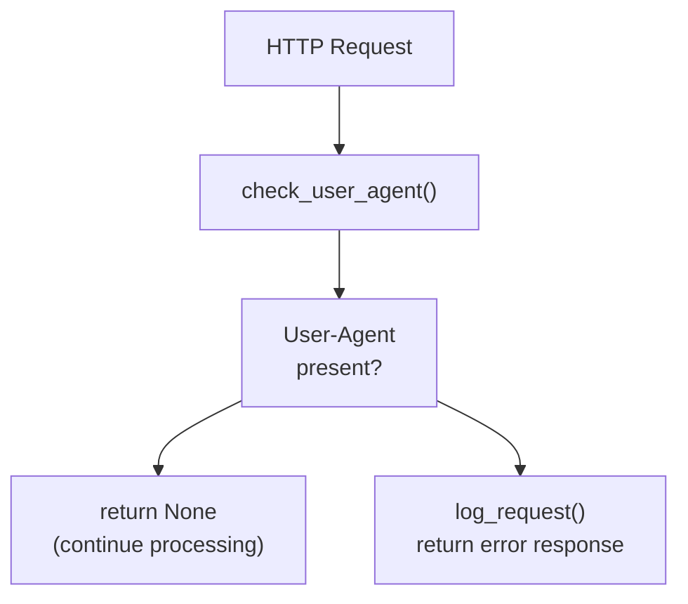
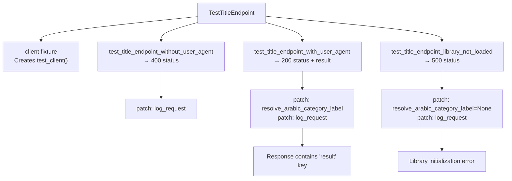
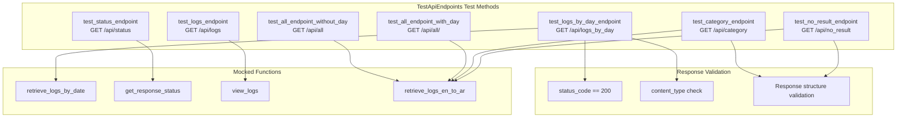
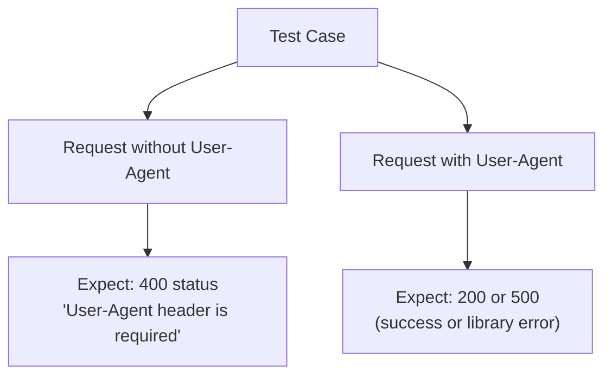
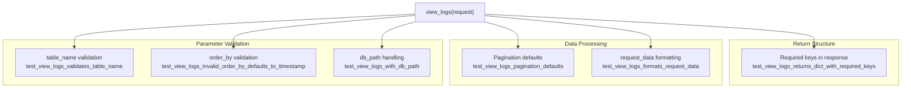
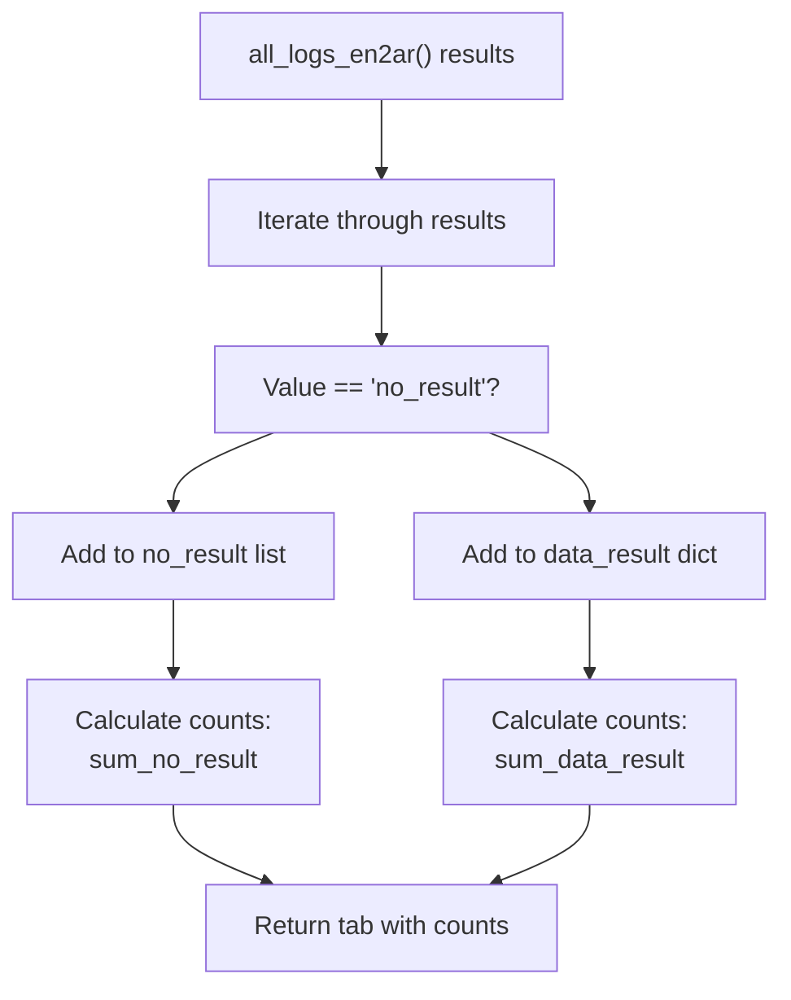
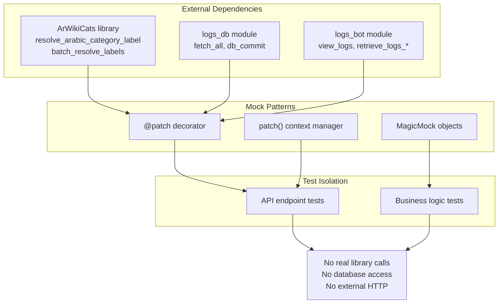

# API Tests

> **Relevant source files**
> * [tests/test_api.py](https://github.com/ArWikiCats/ArWikiCatsWeb/blob/88f42d13/tests/test_api.py)
> * [tests/test_logs_bot.py](https://github.com/ArWikiCats/ArWikiCatsWeb/blob/88f42d13/tests/test_logs_bot.py)
> * [tests/test_user_agent.py](https://github.com/ArWikiCats/ArWikiCatsWeb/blob/88f42d13/tests/test_user_agent.py)

## Purpose and Scope

This document covers the test suite for the REST API endpoints defined in [src/app/routes/api.py](https://github.com/ArWikiCats/ArWikiCatsWeb/blob/88f42d13/src/app/routes/api.py)

 The API test suite validates category resolution functionality, log retrieval endpoints, User-Agent header validation, and custom JSON response formatting. These tests achieve 100% coverage on the API route handlers.

For information about the general test infrastructure and fixtures, see [Test Infrastructure](/ArWikiCats/ArWikiCatsWeb/9.1-test-infrastructure). For tests covering UI routes and database operations, see [UI and Database Tests](/ArWikiCats/ArWikiCatsWeb/9.3-ui-and-database-tests).

## Test File Organization

The API test suite is organized across three primary test files:

| Test File | Primary Focus | Test Classes | Coverage Target |
| --- | --- | --- | --- |
| `tests/test_api.py` | API endpoint functionality | 5 classes, 24 test methods | [src/app/routes/api.py](https://github.com/ArWikiCats/ArWikiCatsWeb/blob/88f42d13/src/app/routes/api.py) |
| `tests/test_user_agent.py` | User-Agent validation | 1 class, 5 test methods | User-Agent checking logic |
| `tests/test_logs_bot.py` | Log retrieval business logic | 5 classes, 19 test methods | [src/app/logs_bot.py](https://github.com/ArWikiCats/ArWikiCatsWeb/blob/88f42d13/src/app/logs_bot.py) |

**Sources:** [tests/test_api.py L1-L336](https://github.com/ArWikiCats/ArWikiCatsWeb/blob/88f42d13/tests/test_api.py#L1-L336)

 [tests/test_user_agent.py L1-L113](https://github.com/ArWikiCats/ArWikiCatsWeb/blob/88f42d13/tests/test_user_agent.py#L1-L113)

 [tests/test_logs_bot.py L1-L383](https://github.com/ArWikiCats/ArWikiCatsWeb/blob/88f42d13/tests/test_logs_bot.py#L1-L383)

## Test Class Architecture

```mermaid
flowchart TD

TestJsonify["TestJsonify<br>Custom jsonify tests"]
TestCheckUserAgent["TestCheckUserAgent<br>check_user_agent function"]
TestApiEndpoints["TestApiEndpoints<br>Log retrieval endpoints"]
TestTitleEndpoint["TestTitleEndpoint<br>/api/<title> endpoint"]
TestListEndpoint["TestListEndpoint<br>/api/list endpoint"]
TestUserAgentHeader["TestUserAgentHeader<br>Integration tests"]
TestViewLogs["TestViewLogs<br>view_logs function"]
TestRetrieveLogsByDate["TestRetrieveLogsByDate<br>retrieve_logs_by_date"]
TestRetrieveLogsEnToAr["TestRetrieveLogsEnToAr<br>retrieve_logs_en_to_ar"]
TestViewLogsEdgeCases["TestViewLogsEdgeCases<br>Edge case handling"]
TestRetrieveLogsByDateEdgeCases["TestRetrieveLogsByDateEdgeCases<br>Edge cases"]
APIRoutes["src/app/routes/api.py<br>Route handlers"]
LogsBot["src/app/logs_bot.py<br>Business logic"]

TestJsonify --> APIRoutes
TestCheckUserAgent --> APIRoutes
TestApiEndpoints --> APIRoutes
TestTitleEndpoint --> APIRoutes
TestListEndpoint --> APIRoutes
TestUserAgentHeader --> APIRoutes
TestViewLogs --> LogsBot
TestRetrieveLogsByDate --> LogsBot
TestRetrieveLogsEnToAr --> LogsBot
TestViewLogsEdgeCases --> LogsBot
TestRetrieveLogsByDateEdgeCases --> LogsBot

subgraph subGraph3 ["System Under Test"]
    APIRoutes
    LogsBot
end

subgraph tests/test_logs_bot.py ["tests/test_logs_bot.py"]
    TestViewLogs
    TestRetrieveLogsByDate
    TestRetrieveLogsEnToAr
    TestViewLogsEdgeCases
    TestRetrieveLogsByDateEdgeCases
end

subgraph tests/test_user_agent.py ["tests/test_user_agent.py"]
    TestUserAgentHeader
end

subgraph tests/test_api.py ["tests/test_api.py"]
    TestJsonify
    TestCheckUserAgent
    TestApiEndpoints
    TestTitleEndpoint
    TestListEndpoint
end
```



**Sources:** [tests/test_api.py L11-L336](https://github.com/ArWikiCats/ArWikiCatsWeb/blob/88f42d13/tests/test_api.py#L11-L336)

 [tests/test_user_agent.py L10-L113](https://github.com/ArWikiCats/ArWikiCatsWeb/blob/88f42d13/tests/test_user_agent.py#L10-L113)

 [tests/test_logs_bot.py L10-L383](https://github.com/ArWikiCats/ArWikiCatsWeb/blob/88f42d13/tests/test_logs_bot.py#L10-L383)

## Custom Helper Function Tests

### TestJsonify Class

The `TestJsonify` class validates the custom `jsonify` function that handles proper Unicode encoding for Arabic text responses.

| Test Method | Purpose | Validation |
| --- | --- | --- |
| `test_jsonify_returns_response` | Verifies Response object creation | Checks `content_type == "application/json; charset=utf-8"` |
| `test_jsonify_handles_unicode` | Arabic text preservation | Ensures Arabic characters are not escaped |
| `test_jsonify_formats_output` | Pretty-printing validation | Confirms JSON indentation with newlines |

**Key Testing Pattern:** The tests verify that Arabic category labels like `"تصنيف:اختبار"` are properly preserved in JSON responses without Unicode escaping.

**Sources:** [tests/test_api.py L11-L42](https://github.com/ArWikiCats/ArWikiCatsWeb/blob/88f42d13/tests/test_api.py#L11-L42)

### TestCheckUserAgent Class

The `TestCheckUserAgent` class tests the `check_user_agent` function that validates User-Agent header presence.



| Test Method | Scenario | Expected Behavior |
| --- | --- | --- |
| `test_check_user_agent_missing` | Empty User-Agent header | Returns error response (not None) |
| `test_check_user_agent_present` | Valid User-Agent header | Returns None (allows processing) |

**Sources:** [tests/test_api.py L44-L76](https://github.com/ArWikiCats/ArWikiCatsWeb/blob/88f42d13/tests/test_api.py#L44-L76)

## Category Resolution Endpoint Tests

### TestTitleEndpoint Class

Tests for the single category resolution endpoint `GET /api/<title>`.



**Test Coverage:**

* User-Agent validation enforcement
* Integration with `resolve_arabic_category_label` from ArWikiCats library
* Error handling when library is not loaded
* Response structure verification

**Sources:** [tests/test_api.py L179-L226](https://github.com/ArWikiCats/ArWikiCatsWeb/blob/88f42d13/tests/test_api.py#L179-L226)

### TestListEndpoint Class

Tests for the batch category resolution endpoint `POST /api/list`.

| Test Method | Scenario | Key Assertion |
| --- | --- | --- |
| `test_list_endpoint_without_user_agent` | Missing User-Agent | `status_code == 400` |
| `test_list_endpoint_invalid_data` | Non-list titles parameter | `status_code == 400` |
| `test_list_endpoint_success` | Valid batch request | `status_code == 200`, response contains `results` and `with_labs` |
| `test_list_endpoint_removes_duplicates` | Duplicate titles in input | Response includes `duplicates` count |
| `test_list_endpoint_library_not_loaded` | Library initialization failure | `status_code == 500` |
| `test_list_endpoint_no_labels_added_to_results` | Categories without labels | No-label entries added with empty string `""` |

**Critical Test Logic:**

[tests/test_api.py L283-L301](https://github.com/ArWikiCats/ArWikiCatsWeb/blob/88f42d13/tests/test_api.py#L283-L301)

 validates duplicate removal:

```css
json={"titles": ["Category:Test1", "Category:Test1", "Category:Test1"]}
# Expects: data["duplicates"] == 2
```

[tests/test_api.py L315-L336](https://github.com/ArWikiCats/ArWikiCatsWeb/blob/88f42d13/tests/test_api.py#L315-L336)

 validates that categories in `no_labels` list are added to results with empty strings:

```markdown
mock_result.no_labels = ["Category:NotFound", "Category:Test1"]
# Expects: data["results"]["Category:NotFound"] == ""
```

**Sources:** [tests/test_api.py L228-L336](https://github.com/ArWikiCats/ArWikiCatsWeb/blob/88f42d13/tests/test_api.py#L228-L336)

## Log Retrieval Endpoint Tests

### TestApiEndpoints Class

Tests for log querying and aggregation endpoints that do not require User-Agent validation.



**Key Response Transformations:**

| Endpoint | Response Modification | Test Line Reference |
| --- | --- | --- |
| `/api/category` | Removes `no_result` field | [tests/test_api.py L160](https://github.com/ArWikiCats/ArWikiCatsWeb/blob/88f42d13/tests/test_api.py#L160-L160) |
| `/api/no_result` | Removes `data_result` field | [tests/test_api.py L176](https://github.com/ArWikiCats/ArWikiCatsWeb/blob/88f42d13/tests/test_api.py#L176-L176) |
| `/api/all/<day>` | Passes day parameter to retrieval function | [tests/test_api.py L144](https://github.com/ArWikiCats/ArWikiCatsWeb/blob/88f42d13/tests/test_api.py#L144-L144) |

**Sources:** [tests/test_api.py L78-L177](https://github.com/ArWikiCats/ArWikiCatsWeb/blob/88f42d13/tests/test_api.py#L78-L177)

## User-Agent Validation Integration Tests

### TestUserAgentHeader Class

The `TestUserAgentHeader` class in `tests/test_user_agent.py` provides integration-level tests that verify User-Agent enforcement across all API endpoints.

**Test Strategy:**



| Test Method | Endpoints Tested | Expected Behavior |
| --- | --- | --- |
| `test_single_title_endpoint_without_user_agent` | `GET /api/Category:Yemen` | 400 with error message |
| `test_single_title_endpoint_with_user_agent` | `GET /api/Category:Yemen` | 200 or 500 (library-dependent) |
| `test_list_endpoint_without_user_agent` | `POST /api/list` | 400 with error message |
| `test_list_endpoint_with_user_agent` | `POST /api/list` | 200 or 500 (library-dependent) |
| `test_all_api_respect_user_agent_requirement` | Multiple endpoints in loop | All return 400 without User-Agent |

**Comprehensive Validation:** [tests/test_user_agent.py L85-L112](https://github.com/ArWikiCats/ArWikiCatsWeb/blob/88f42d13/tests/test_user_agent.py#L85-L112)

 iterates through multiple API endpoints to ensure consistent User-Agent enforcement:

```markdown
endpoints = [
    ("/api/Category:Test", "GET"),
    ("/api/list", "POST"),
]
# All should return 400 for missing User-Agent
```

**Sources:** [tests/test_user_agent.py L10-L113](https://github.com/ArWikiCats/ArWikiCatsWeb/blob/88f42d13/tests/test_user_agent.py#L10-L113)

## Logs Bot Business Logic Tests

### TestViewLogs Class

Tests for the `view_logs` function that handles paginated log retrieval with filtering.

**Test Coverage Map:**



**Key Test Assertions:**

* Default pagination: `per_page=10`, `page=1`, `order="desc"`, `order_by="response_count"`
* Invalid `table_name` defaults to `"logs"`
* Invalid `order_by` defaults to `"timestamp"`
* `request_data` field has underscores replaced with spaces for display
* Response contains keys: `logs`, `tab`, `status_table`

**Sources:** [tests/test_logs_bot.py L10-L121](https://github.com/ArWikiCats/ArWikiCatsWeb/blob/88f42d13/tests/test_logs_bot.py#L10-L121)

 [tests/test_logs_bot.py L249-L336](https://github.com/ArWikiCats/ArWikiCatsWeb/blob/88f42d13/tests/test_logs_bot.py#L249-L336)

### TestRetrieveLogsByDate Class

Tests for date-based log aggregation functionality.

| Test Method | Validation Focus |
| --- | --- |
| `test_retrieve_logs_by_date_returns_dict` | Return structure contains `logs`, `tab`, `logs_data` |
| `test_retrieve_logs_by_date_aggregates_data` | Proper aggregation by date with `title_count` and `count` summation |
| `test_retrieve_logs_by_date_sorts_by_day` | Logs sorted chronologically by day |

**Aggregation Logic Test:** [tests/test_logs_bot.py L148-L167](https://github.com/ArWikiCats/ArWikiCatsWeb/blob/88f42d13/tests/test_logs_bot.py#L148-L167)

 validates that multiple status groups for the same day are properly summed:

```css
# Input: Two entries for 2025-01-27
{"date_only": "2025-01-27", "status_group": "no_result", "title_count": 5, "count": 10}
{"date_only": "2025-01-27", "status_group": "Category", "title_count": 3, "count": 5}
# Expected: title_count=8, total=15
```

**Sources:** [tests/test_logs_bot.py L123-L183](https://github.com/ArWikiCats/ArWikiCatsWeb/blob/88f42d13/tests/test_logs_bot.py#L123-L183)

 [tests/test_logs_bot.py L338-L383](https://github.com/ArWikiCats/ArWikiCatsWeb/blob/88f42d13/tests/test_logs_bot.py#L338-L383)

### TestRetrieveLogsEnToAr Class

Tests for English-to-Arabic category log retrieval and classification.

**Result Classification:**



**Test Validations:**

* Separation of results into `no_result` and `data_result`
* Count calculations: `sum_all`, `sum_data_result`, `sum_no_result`
* Day parameter is passed to `all_logs_en2ar(day=...)`
* Empty results handling

**Example from [tests/test_logs_bot.py L189-L205](https://github.com/ArWikiCats/ArWikiCatsWeb/blob/88f42d13/tests/test_logs_bot.py#L189-L205)

:**

```css
mock_result = {
    "Category:Test1": "تصنيف:اختبار1",  # → data_result
    "Category:Test2": "no_result",       # → no_result list
    "Category:Test3": "تصنيف:اختبار3",   # → data_result
}
# Expects: len(no_result)==1, len(data_result)==2
```

**Sources:** [tests/test_logs_bot.py L185-L247](https://github.com/ArWikiCats/ArWikiCatsWeb/blob/88f42d13/tests/test_logs_bot.py#L185-L247)

## Testing Patterns and Techniques

### Mocking Strategy

The test suite extensively uses `unittest.mock` for isolating components:



**Common Mock Patterns:**

1. **Library Function Mocking:** [tests/test_api.py L203-L214](https://github.com/ArWikiCats/ArWikiCatsWeb/blob/88f42d13/tests/test_api.py#L203-L214) `with patch("src.app.routes.api.resolve_arabic_category_label") as mock_resolve: mock_resolve.return_value = "تصنيف:اختبار"`
2. **Database Function Mocking:** [tests/test_logs_bot.py L39-L48](https://github.com/ArWikiCats/ArWikiCatsWeb/blob/88f42d13/tests/test_logs_bot.py#L39-L48) ```python @patch("src.app.logs_bot.logs_db") def test_view_logs_returns_dict_with_required_keys(self, mock_logs_db): mock_logs_db.get_logs.return_value = [] ```
3. **Flask Request Mocking:** [tests/test_logs_bot.py L14-L19](https://github.com/ArWikiCats/ArWikiCatsWeb/blob/88f42d13/tests/test_logs_bot.py#L14-L19) ```python @pytest.fixture def mock_request(self): request = MagicMock() request.args.get = MagicMock(side_effect=self._mock_args_get) return request ```

**Sources:** [tests/test_api.py L6](https://github.com/ArWikiCats/ArWikiCatsWeb/blob/88f42d13/tests/test_api.py#L6-L6)

 [tests/test_logs_bot.py L5](https://github.com/ArWikiCats/ArWikiCatsWeb/blob/88f42d13/tests/test_logs_bot.py#L5-L5)

 [tests/test_user_agent.py L35](https://github.com/ArWikiCats/ArWikiCatsWeb/blob/88f42d13/tests/test_user_agent.py#L35-L35)

### Fixture Usage

**Client Fixture Pattern:**
All endpoint test classes use a common `client` fixture pattern:

```javascript
@pytest.fixture
def client(self):
    """Create Flask test client."""
    from src.app import create_app
    app = create_app()
    app.config["TESTING"] = True
    with app.test_client() as client:
        yield client
```

This pattern appears in:

* [tests/test_api.py L82-L88](https://github.com/ArWikiCats/ArWikiCatsWeb/blob/88f42d13/tests/test_api.py#L82-L88)  - `TestApiEndpoints`
* [tests/test_api.py L183-L189](https://github.com/ArWikiCats/ArWikiCatsWeb/blob/88f42d13/tests/test_api.py#L183-L189)  - `TestTitleEndpoint`
* [tests/test_api.py L232-L238](https://github.com/ArWikiCats/ArWikiCatsWeb/blob/88f42d13/tests/test_api.py#L232-L238)  - `TestListEndpoint`
* [tests/test_user_agent.py L14-L19](https://github.com/ArWikiCats/ArWikiCatsWeb/blob/88f42d13/tests/test_user_agent.py#L14-L19)  - `TestUserAgentHeader`

**Sources:** [tests/test_api.py L82-L88](https://github.com/ArWikiCats/ArWikiCatsWeb/blob/88f42d13/tests/test_api.py#L82-L88)

 [tests/test_user_agent.py L14-L19](https://github.com/ArWikiCats/ArWikiCatsWeb/blob/88f42d13/tests/test_user_agent.py#L14-L19)

### Response Validation Patterns

**JSON Response Parsing:**

```python
response = client.get("/api/endpoint")
data = json.loads(response.get_data(as_text=True))
assert "expected_key" in data
```

**Status Code Validation:**

```markdown
assert response.status_code == 200
assert response.status_code in [200, 500]  # For library-dependent tests
```

**Content Type Verification:**

```python
assert response.content_type == "application/json; charset=utf-8"
```

**Sources:** [tests/test_api.py L156-L177](https://github.com/ArWikiCats/ArWikiCatsWeb/blob/88f42d13/tests/test_api.py#L156-L177)

 [tests/test_user_agent.py L29-L31](https://github.com/ArWikiCats/ArWikiCatsWeb/blob/88f42d13/tests/test_user_agent.py#L29-L31)

### Edge Case Testing

The test suite includes dedicated classes for edge case validation:

| Edge Case Category | Test Class | Examples |
| --- | --- | --- |
| Invalid parameters | `TestViewLogsEdgeCases` | Invalid `order_by`, `table_name`, `db_path` |
| Empty results | `TestRetrieveLogsEnToAr` | Empty dictionary from database |
| Duplicate handling | `TestListEndpoint` | Duplicate titles in batch requests |
| Library not loaded | Multiple classes | `resolve_arabic_category_label = None` |

**Sources:** [tests/test_logs_bot.py L249-L383](https://github.com/ArWikiCats/ArWikiCatsWeb/blob/88f42d13/tests/test_logs_bot.py#L249-L383)

 [tests/test_api.py L216-L226](https://github.com/ArWikiCats/ArWikiCatsWeb/blob/88f42d13/tests/test_api.py#L216-L226)

 [tests/test_api.py L303-L313](https://github.com/ArWikiCats/ArWikiCatsWeb/blob/88f42d13/tests/test_api.py#L303-L313)

## Test Coverage Metrics

The API test suite contributes to the overall 89% test coverage, with specific modules achieving 100%:

| Module | Coverage | Test Files Involved |
| --- | --- | --- |
| `src/app/routes/api.py` | 100% | `test_api.py`, `test_user_agent.py` |
| `src/app/logs_bot.py` | 100% | `test_logs_bot.py` |

The comprehensive coverage includes:

* All API endpoints (`/api/<title>`, `/api/list`, `/api/logs`, `/api/logs_by_day`, etc.)
* Error handling paths (missing User-Agent, library not loaded, invalid parameters)
* Data transformation logic (Unicode handling, duplicate removal, result classification)
* Edge cases (empty results, invalid inputs, database path changes)

**Sources:** [tests/test_api.py L1-L336](https://github.com/ArWikiCats/ArWikiCatsWeb/blob/88f42d13/tests/test_api.py#L1-L336)

 [tests/test_user_agent.py L1-L113](https://github.com/ArWikiCats/ArWikiCatsWeb/blob/88f42d13/tests/test_user_agent.py#L1-L113)

 [tests/test_logs_bot.py L1-L383](https://github.com/ArWikiCats/ArWikiCatsWeb/blob/88f42d13/tests/test_logs_bot.py#L1-L383)