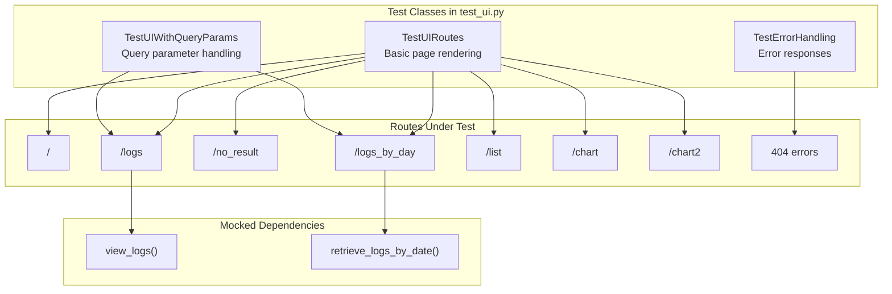
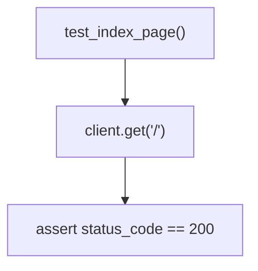
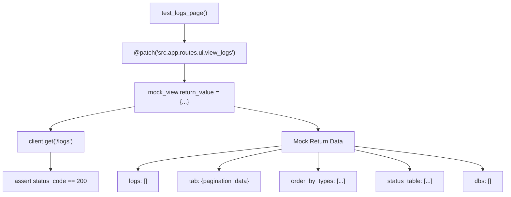
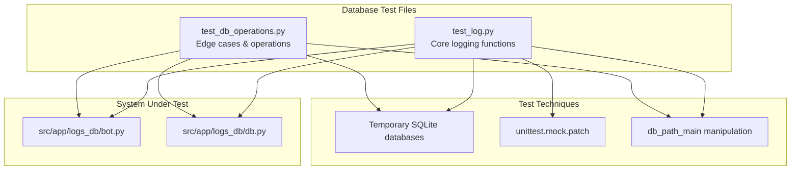
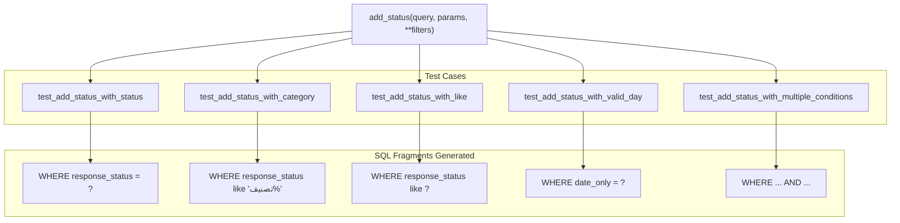
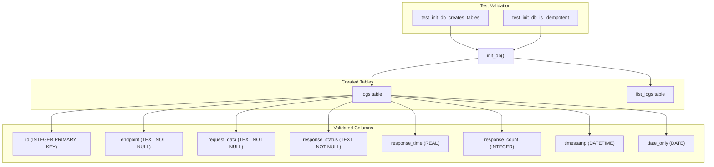
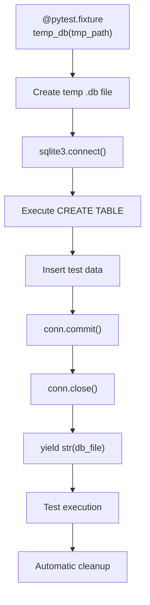
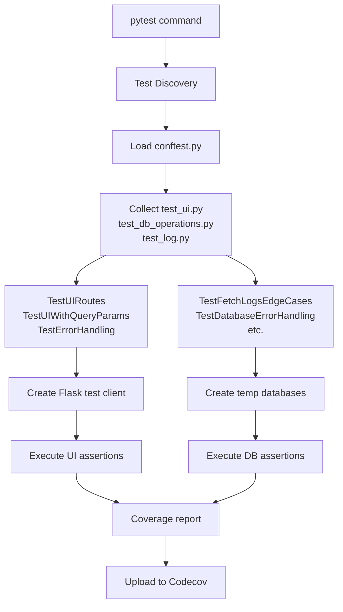

# UI and Database Tests

> **Relevant source files**
> * [pyproject.toml](https://github.com/ArWikiCats/ArWikiCatsWeb/blob/88f42d13/pyproject.toml)
> * [pytest.ini](https://github.com/ArWikiCats/ArWikiCatsWeb/blob/88f42d13/pytest.ini)
> * [tests/conftest.py](https://github.com/ArWikiCats/ArWikiCatsWeb/blob/88f42d13/tests/conftest.py)
> * [tests/test_db_operations.py](https://github.com/ArWikiCats/ArWikiCatsWeb/blob/88f42d13/tests/test_db_operations.py)
> * [tests/test_log.py](https://github.com/ArWikiCats/ArWikiCatsWeb/blob/88f42d13/tests/test_log.py)
> * [tests/test_ui.py](https://github.com/ArWikiCats/ArWikiCatsWeb/blob/88f42d13/tests/test_ui.py)

## Purpose and Scope

This document covers the test suites for UI routes and database operations in the ArWikiCatsWeb application. The UI test suite validates that all web interface routes render correctly and interact properly with the backend, while the database test suite ensures data integrity, query correctness, and proper error handling in the logging infrastructure.

For information about API endpoint tests and user-agent validation, see [API Tests](/ArWikiCats/ArWikiCatsWeb/9.2-api-tests). For the overall testing infrastructure and pytest configuration, see [Test Infrastructure](/ArWikiCats/ArWikiCatsWeb/9.1-test-infrastructure).

**Sources:** [tests/test_ui.py L1-L208](https://github.com/ArWikiCats/ArWikiCatsWeb/blob/88f42d13/tests/test_ui.py#L1-L208)

 [tests/test_db_operations.py L1-L409](https://github.com/ArWikiCats/ArWikiCatsWeb/blob/88f42d13/tests/test_db_operations.py#L1-L409)

 [tests/test_log.py L1-L521](https://github.com/ArWikiCats/ArWikiCatsWeb/blob/88f42d13/tests/test_log.py#L1-L521)

---

## UI Route Test Suite

The UI test suite is located in [tests/test_ui.py L1-L208](https://github.com/ArWikiCats/ArWikiCatsWeb/blob/88f42d13/tests/test_ui.py#L1-L208)

 and validates all web interface routes defined in `src.app.routes.ui`. The suite achieves 100% coverage on the UI blueprint through systematic testing of page rendering, query parameter handling, and error cases.

### Test Class Organization

The UI tests are organized into three test classes, each focusing on different aspects of UI functionality:



**Sources:** [tests/test_ui.py L10-L97](https://github.com/ArWikiCats/ArWikiCatsWeb/blob/88f42d13/tests/test_ui.py#L10-L97)

 [tests/test_ui.py L99-L189](https://github.com/ArWikiCats/ArWikiCatsWeb/blob/88f42d13/tests/test_ui.py#L99-L189)

 [tests/test_ui.py L191-L207](https://github.com/ArWikiCats/ArWikiCatsWeb/blob/88f42d13/tests/test_ui.py#L191-L207)

### Test Client Fixture

Each test class defines a `client` fixture that creates a Flask test client with `TESTING` mode enabled:

| Fixture Component | Implementation | Purpose |
| --- | --- | --- |
| **Factory Pattern** | `create_app()` from `src.app` | Creates application instance |
| **Test Configuration** | `app.config["TESTING"] = True` | Enables testing mode |
| **Context Manager** | `app.test_client()` | Provides test client |
| **Yield Pattern** | `yield client` | Returns client to tests |

**Sources:** [tests/test_ui.py L14-L20](https://github.com/ArWikiCats/ArWikiCatsWeb/blob/88f42d13/tests/test_ui.py#L14-L20)

 [tests/test_ui.py L103-L109](https://github.com/ArWikiCats/ArWikiCatsWeb/blob/88f42d13/tests/test_ui.py#L103-L109)

 [tests/test_ui.py L195-L201](https://github.com/ArWikiCats/ArWikiCatsWeb/blob/88f42d13/tests/test_ui.py#L195-L201)

### UI Testing Patterns

The test suite employs several patterns to ensure comprehensive coverage:

#### Pattern 1: Basic Page Rendering

Simple tests verify that pages return HTTP 200 status codes without requiring database interactions:



Routes tested with this pattern: `/`, `/no_result`, `/list`, `/chart`, `/chart2`

**Sources:** [tests/test_ui.py L22-L26](https://github.com/ArWikiCats/ArWikiCatsWeb/blob/88f42d13/tests/test_ui.py#L22-L26)

 [tests/test_ui.py L60-L64](https://github.com/ArWikiCats/ArWikiCatsWeb/blob/88f42d13/tests/test_ui.py#L60-L64)

 [tests/test_ui.py L80-L96](https://github.com/ArWikiCats/ArWikiCatsWeb/blob/88f42d13/tests/test_ui.py#L80-L96)

#### Pattern 2: Mocked Data Rendering

Tests for data-driven pages mock backend functions to provide predictable test data:



**Sources:** [tests/test_ui.py L28-L58](https://github.com/ArWikiCats/ArWikiCatsWeb/blob/88f42d13/tests/test_ui.py#L28-L58)

 [tests/test_ui.py L66-L78](https://github.com/ArWikiCats/ArWikiCatsWeb/blob/88f42d13/tests/test_ui.py#L66-L78)

#### Pattern 3: Query Parameter Testing

Tests validate that routes correctly handle URL query parameters:

| Test Case | Route | Parameters | Validation |
| --- | --- | --- | --- |
| `test_logs_page_with_pagination` | `/logs` | `page=2&per_page=10` | Mock called with correct args |
| `test_logs_page_with_status_filter` | `/logs` | `status=no_result` | Status filter applied |
| `test_logs_by_day_with_table_name` | `/logs_by_day` | `table_name=list_logs` | Table selection works |

**Sources:** [tests/test_ui.py L111-L143](https://github.com/ArWikiCats/ArWikiCatsWeb/blob/88f42d13/tests/test_ui.py#L111-L143)

 [tests/test_ui.py L144-L175](https://github.com/ArWikiCats/ArWikiCatsWeb/blob/88f42d13/tests/test_ui.py#L144-L175)

 [tests/test_ui.py L176-L188](https://github.com/ArWikiCats/ArWikiCatsWeb/blob/88f42d13/tests/test_ui.py#L176-L188)

---

## Database Test Suite

The database test suite consists of two main files that validate the logging infrastructure's data layer:



**Sources:** [tests/test_log.py L1-L521](https://github.com/ArWikiCats/ArWikiCatsWeb/blob/88f42d13/tests/test_log.py#L1-L521)

 [tests/test_db_operations.py L1-L409](https://github.com/ArWikiCats/ArWikiCatsWeb/blob/88f42d13/tests/test_db_operations.py#L1-L409)

### Log Database Tests (test_log.py)

This file contains 10 test classes covering core logging functionality:

#### Test Class Summary

| Test Class | Purpose | Key Methods Tested |
| --- | --- | --- |
| `TestAddStatus` | SQL query building with filters | `add_status()` |
| `TestDatabaseOperations` | Basic CRUD operations | `fetch_all()`, `db_commit()` |
| `TestLogRequest` | Request logging logic | `log_request()` |
| `TestCountAll` | Record counting with filters | `count_all()` |
| `TestGetLogs` | Paginated log retrieval | `get_logs()` |
| `TestSumResponseCount` | Response count aggregation | `sum_response_count()` |
| `TestChangeDbPath` | Database path management | `change_db_path()` |

**Sources:** [tests/test_log.py L13-L99](https://github.com/ArWikiCats/ArWikiCatsWeb/blob/88f42d13/tests/test_log.py#L13-L99)

 [tests/test_log.py L101-L222](https://github.com/ArWikiCats/ArWikiCatsWeb/blob/88f42d13/tests/test_log.py#L101-L222)

 [tests/test_log.py L224-L271](https://github.com/ArWikiCats/ArWikiCatsWeb/blob/88f42d13/tests/test_log.py#L224-L271)

 [tests/test_log.py L273-L337](https://github.com/ArWikiCats/ArWikiCatsWeb/blob/88f42d13/tests/test_log.py#L273-L337)

 [tests/test_log.py L339-L428](https://github.com/ArWikiCats/ArWikiCatsWeb/blob/88f42d13/tests/test_log.py#L339-L428)

 [tests/test_log.py L430-L496](https://github.com/ArWikiCats/ArWikiCatsWeb/blob/88f42d13/tests/test_log.py#L430-L496)

 [tests/test_log.py L498-L521](https://github.com/ArWikiCats/ArWikiCatsWeb/blob/88f42d13/tests/test_log.py#L498-L521)

#### Critical Test: add_status() Query Building

The `add_status()` function dynamically constructs SQL WHERE clauses based on filter parameters:



**Sources:** [tests/test_log.py L13-L98](https://github.com/ArWikiCats/ArWikiCatsWeb/blob/88f42d13/tests/test_log.py#L13-L98)

#### Critical Test: log_request() Table Selection

The `log_request()` function routes logs to different tables based on the endpoint:

| Endpoint Pattern | Table Used | Test Case |
| --- | --- | --- |
| `/api/list` | `list_logs` | `test_log_request_uses_list_logs_table` |
| Other endpoints | `logs` | `test_log_request_uses_logs_table` |

Additional validations:

* Response time rounded to 3 decimal places ([tests/test_log.py L234-L242](https://github.com/ArWikiCats/ArWikiCatsWeb/blob/88f42d13/tests/test_log.py#L234-L242) )
* Response status converted to string ([tests/test_log.py L263-L270](https://github.com/ArWikiCats/ArWikiCatsWeb/blob/88f42d13/tests/test_log.py#L263-L270) )

**Sources:** [tests/test_log.py L224-L271](https://github.com/ArWikiCats/ArWikiCatsWeb/blob/88f42d13/tests/test_log.py#L224-L271)

### Database Operations Tests (test_db_operations.py)

This file focuses on edge cases, error handling, and complex database scenarios through 8 test classes:

#### Test Class Summary

| Test Class | Focus Area | Key Scenarios |
| --- | --- | --- |
| `TestFetchLogsEdgeCases` | `fetch_all()` edge cases | Empty tables, special characters, Unicode |
| `TestDatabaseErrorHandling` | Error conditions | Invalid SQL, missing tables |
| `TestAllLogsEn2Ar` | `all_logs_en2ar()` function | Dictionary construction, date filtering |
| `TestFetchLogsByDate` | Date-based grouping | `fetch_logs_by_date()` aggregation |
| `TestGetResponseStatus` | Status filtering | `get_response_status()` with threshold |
| `TestInitDb` | Database initialization | Table creation, idempotency |

**Sources:** [tests/test_db_operations.py L11-L90](https://github.com/ArWikiCats/ArWikiCatsWeb/blob/88f42d13/tests/test_db_operations.py#L11-L90)

 [tests/test_db_operations.py L92-L132](https://github.com/ArWikiCats/ArWikiCatsWeb/blob/88f42d13/tests/test_db_operations.py#L92-L132)

 [tests/test_db_operations.py L134-L214](https://github.com/ArWikiCats/ArWikiCatsWeb/blob/88f42d13/tests/test_db_operations.py#L134-L214)

 [tests/test_db_operations.py L216-L274](https://github.com/ArWikiCats/ArWikiCatsWeb/blob/88f42d13/tests/test_db_operations.py#L216-L274)

 [tests/test_db_operations.py L276-L337](https://github.com/ArWikiCats/ArWikiCatsWeb/blob/88f42d13/tests/test_db_operations.py#L276-L337)

 [tests/test_db_operations.py L339-L409](https://github.com/ArWikiCats/ArWikiCatsWeb/blob/88f42d13/tests/test_db_operations.py#L339-L409)

#### Critical Test: Unicode and Special Character Handling

Tests ensure proper handling of Arabic text and special characters in database operations:

**Sources:** [tests/test_db_operations.py L51-L69](https://github.com/ArWikiCats/ArWikiCatsWeb/blob/88f42d13/tests/test_db_operations.py#L51-L69)

 [tests/test_db_operations.py L71-L89](https://github.com/ArWikiCats/ArWikiCatsWeb/blob/88f42d13/tests/test_db_operations.py#L71-L89)

#### Critical Test: Error Handling

Database error handling tests ensure graceful degradation:

| Error Scenario | Test | Expected Behavior |
| --- | --- | --- |
| Invalid SQL | `test_db_commit_invalid_sql` | Returns `sqlite3.Error`, not `True` |
| Missing table | `test_fetch_all_handles_missing_table` | Calls `init_db()` to recreate schema |

**Sources:** [tests/test_db_operations.py L95-L112](https://github.com/ArWikiCats/ArWikiCatsWeb/blob/88f42d13/tests/test_db_operations.py#L95-L112)

 [tests/test_db_operations.py L114-L131](https://github.com/ArWikiCats/ArWikiCatsWeb/blob/88f42d13/tests/test_db_operations.py#L114-L131)

#### Critical Test: init_db() Schema Creation

Tests validate that `init_db()` correctly creates database schema:



**Sources:** [tests/test_db_operations.py L342-L379](https://github.com/ArWikiCats/ArWikiCatsWeb/blob/88f42d13/tests/test_db_operations.py#L342-L379)

 [tests/test_db_operations.py L381-L408](https://github.com/ArWikiCats/ArWikiCatsWeb/blob/88f42d13/tests/test_db_operations.py#L381-L408)

### Temporary Database Fixtures

All database tests use temporary SQLite databases to ensure test isolation and prevent side effects on production data:

#### Fixture Pattern



**Sources:** [tests/test_log.py L104-L158](https://github.com/ArWikiCats/ArWikiCatsWeb/blob/88f42d13/tests/test_log.py#L104-L158)

 [tests/test_db_operations.py L15-L36](https://github.com/ArWikiCats/ArWikiCatsWeb/blob/88f42d13/tests/test_db_operations.py#L15-L36)

 [tests/test_db_operations.py L138-L173](https://github.com/ArWikiCats/ArWikiCatsWeb/blob/88f42d13/tests/test_db_operations.py#L138-L173)

#### Path Manipulation Technique

Tests temporarily modify `db.db_path_main[1]` to redirect database operations to temporary files:

```sql
# Pattern used throughout test suite
original_path = db.db_path_main[1]
db.db_path_main[1] = temp_db
try:
    # Test execution with temp database
    result = db.fetch_all("SELECT * FROM logs")
finally:
    db.db_path_main[1] = original_path
```

**Sources:** [tests/test_log.py L164-L174](https://github.com/ArWikiCats/ArWikiCatsWeb/blob/88f42d13/tests/test_log.py#L164-L174)

 [tests/test_db_operations.py L42-L49](https://github.com/ArWikiCats/ArWikiCatsWeb/blob/88f42d13/tests/test_db_operations.py#L42-L49)

 [tests/test_db_operations.py L179-L187](https://github.com/ArWikiCats/ArWikiCatsWeb/blob/88f42d13/tests/test_db_operations.py#L179-L187)

---

## Testing Infrastructure

Both test suites leverage pytest features configured in [pytest.ini L1-L13](https://github.com/ArWikiCats/ArWikiCatsWeb/blob/88f42d13/pytest.ini#L1-L13)

:

### Configuration Settings

| Setting | Value | Purpose |
| --- | --- | --- |
| `testpaths` | `tests` | Root directory for test discovery |
| `python_files` | `test*.py *Test.py Test*.py` | Test file patterns |
| `python_classes` | `Test*` | Test class naming convention |
| `python_functions` | `test*` | Test function naming convention |
| `addopts` | `-v --tb=short --strict-markers` | Verbose output, short tracebacks |
| `markers` | `network` | Custom marker for network tests |

**Sources:** [pytest.ini L1-L13](https://github.com/ArWikiCats/ArWikiCatsWeb/blob/88f42d13/pytest.ini#L1-L13)

### Test Execution Flow



**Sources:** [pytest.ini L1-L13](https://github.com/ArWikiCats/ArWikiCatsWeb/blob/88f42d13/pytest.ini#L1-L13)

 [tests/conftest.py L1-L5](https://github.com/ArWikiCats/ArWikiCatsWeb/blob/88f42d13/tests/conftest.py#L1-L5)

### Mock Usage Patterns

The test suite employs `unittest.mock.patch` to isolate units under test:

| Mock Target | Purpose | Test Files |
| --- | --- | --- |
| `src.app.routes.ui.view_logs` | Prevent actual database queries in UI tests | test_ui.py |
| `src.app.routes.ui.retrieve_logs_by_date` | Mock log aggregation functions | test_ui.py |
| `src.app.logs_db.bot.db_commit` | Verify logging calls without writes | test_log.py |
| `src.app.logs_db.db.init_db` | Test error handling without schema creation | test_db_operations.py |

**Sources:** [tests/test_ui.py L30](https://github.com/ArWikiCats/ArWikiCatsWeb/blob/88f42d13/tests/test_ui.py#L30-L30)

 [tests/test_ui.py L68](https://github.com/ArWikiCats/ArWikiCatsWeb/blob/88f42d13/tests/test_ui.py#L68-L68)

 [tests/test_log.py L230](https://github.com/ArWikiCats/ArWikiCatsWeb/blob/88f42d13/tests/test_log.py#L230-L230)

 [tests/test_db_operations.py L128](https://github.com/ArWikiCats/ArWikiCatsWeb/blob/88f42d13/tests/test_db_operations.py#L128-L128)

---

## Test Coverage Summary

The UI and database test suites contribute significantly to the overall 89% test coverage:

| Module | Coverage | Test File | Test Classes |
| --- | --- | --- | --- |
| `src/app/routes/ui.py` | 100% | test_ui.py | 3 classes, 10 tests |
| `src/app/logs_db/bot.py` | High | test_log.py, test_db_operations.py | 13 classes, 50+ tests |
| `src/app/logs_db/db.py` | High | test_log.py, test_db_operations.py | 13 classes, 50+ tests |

**Sources:** [tests/test_ui.py L1-L208](https://github.com/ArWikiCats/ArWikiCatsWeb/blob/88f42d13/tests/test_ui.py#L1-L208)

 [tests/test_log.py L1-L521](https://github.com/ArWikiCats/ArWikiCatsWeb/blob/88f42d13/tests/test_log.py#L1-L521)

 [tests/test_db_operations.py L1-L409](https://github.com/ArWikiCats/ArWikiCatsWeb/blob/88f42d13/tests/test_db_operations.py#L1-L409)
