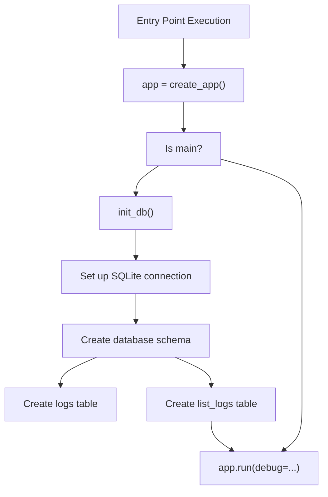
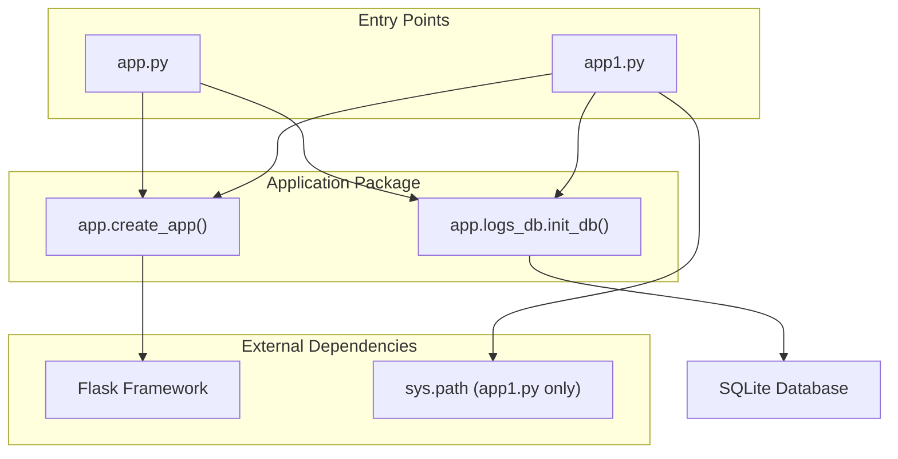
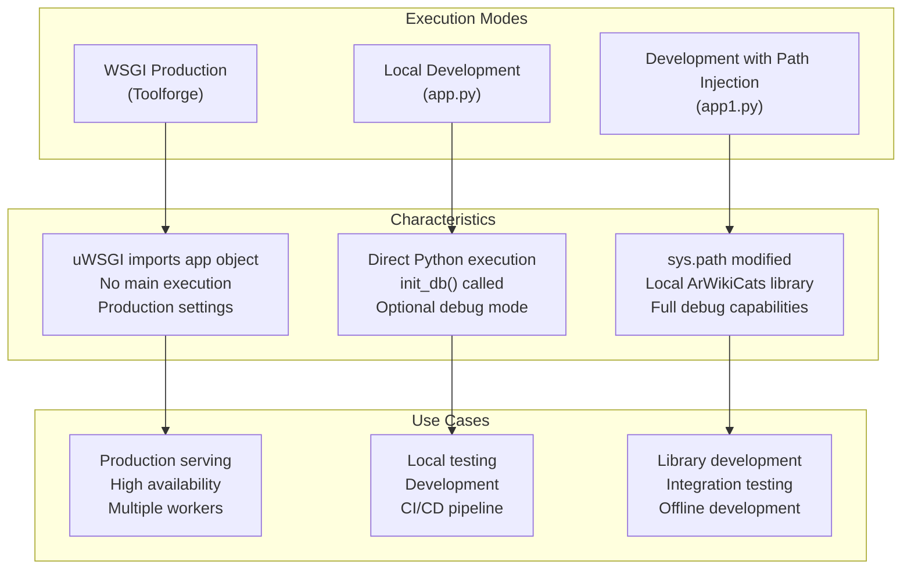

# Application Core

> **Relevant source files**
> * [src/app.py](https://github.com/ArWikiCats/ArWikiCatsWeb/blob/88f42d13/src/app.py)
> * [src/app1.py](https://github.com/ArWikiCats/ArWikiCatsWeb/blob/88f42d13/src/app1.py)

## Purpose and Scope

This page documents the core application initialization mechanisms in ArWikiCatsWeb, including the WSGI entry points, the Flask application factory pattern, and the database initialization process.

For information about the route handlers that are registered during application creation, see [Routing and Blueprints](/ArWikiCats/ArWikiCatsWeb/3.2-routing-and-blueprints). For deployment-specific configuration and execution, see [Deployment](/ArWikiCats/ArWikiCatsWeb/8-deployment).

## Entry Points

ArWikiCatsWeb provides two distinct entry points for running the application in different environments.

### Production Entry Point: app.py

The production entry point [src/app.py L1-L16](https://github.com/ArWikiCats/ArWikiCatsWeb/blob/88f42d13/src/app.py#L1-L16)

 serves as the WSGI application entry point for deployment on Wikimedia Toolforge.

```python
Key characteristics:
- Imports create_app from app module
- Imports init_db from app.logs_db
- Creates the Flask application instance
- Supports debug mode via command-line arguments
```

The file defines a module-level `app` variable at [src/app.py L10](https://github.com/ArWikiCats/ArWikiCatsWeb/blob/88f42d13/src/app.py#L10-L10)

 which is the WSGI application object that web servers (such as uWSGI) use to serve the application.

**Sources:** [src/app.py L1-L16](https://github.com/ArWikiCats/ArWikiCatsWeb/blob/88f42d13/src/app.py#L1-L16)

### Development Entry Point: app1.py

The development entry point [src/app1.py L1-L20](https://github.com/ArWikiCats/ArWikiCatsWeb/blob/88f42d13/src/app1.py#L1-L20)

 is specifically designed for local development with a hardcoded path injection.

**Key difference:** Line [src/app1.py L9](https://github.com/ArWikiCats/ArWikiCatsWeb/blob/88f42d13/src/app1.py#L9-L9)

 injects a specific local path `"D:/categories_bot/make2_new"` into `sys.path`, allowing the development environment to locate the ArWikiCats library dependency.

**Sources:** [src/app1.py L1-L20](https://github.com/ArWikiCats/ArWikiCatsWeb/blob/88f42d13/src/app1.py#L1-L20)

### Entry Points Comparison

| Aspect | app.py | app1.py |
| --- | --- | --- |
| **Purpose** | Production WSGI entry | Local development |
| **Path Manipulation** | None | Adds local ArWikiCats path |
| **Usage** | Deployed on Toolforge | Run directly on developer machine |
| **sys.path Modification** | No | Yes (line 9) |
| **WSGI Compatibility** | Full | Full |

## Application Initialization Flow

The following diagram illustrates the complete initialization sequence from entry point to running application:

```mermaid
sequenceDiagram
  participant Entry Point
  participant (app.py or app1.py)
  participant create_app()
  participant init_db()
  participant Blueprints
  participant Flask Instance

  Entry Point->>create_app(): Import and call create_app()
  create_app()->>Flask Instance: Create Flask(__name__)
  create_app()->>Flask Instance: Configure app settings
  create_app()->>Blueprints: Register UI Blueprint
  create_app()->>Blueprints: Register API Blueprint
  create_app()->>Flask Instance: Configure error handlers
  Flask Instance-->>create_app(): Return configured app
  create_app()-->>Entry Point: Return app instance
  Entry Point->>init_db(): Call init_db()
  init_db()->>init_db(): Create database schema
  init_db()->>init_db(): Initialize logs table
  init_db()->>init_db(): Initialize list_logs table
  init_db()-->>Entry Point: Database ready
  Entry Point->>Flask Instance: app.run(debug=...)
  Flask Instance->>Flask Instance: Start development server
```

**Sources:** [src/app.py L1-L16](https://github.com/ArWikiCats/ArWikiCatsWeb/blob/88f42d13/src/app.py#L1-L16)

 [src/app1.py L1-L20](https://github.com/ArWikiCats/ArWikiCatsWeb/blob/88f42d13/src/app1.py#L1-L20)

## The Application Factory Pattern

ArWikiCatsWeb uses the Flask application factory pattern through the `create_app()` function. This function is imported from the `app` module at [src/app.py L7](https://github.com/ArWikiCats/ArWikiCatsWeb/blob/88f42d13/src/app.py#L7-L7)

 and [src/app1.py L11](https://github.com/ArWikiCats/ArWikiCatsWeb/blob/88f42d13/src/app1.py#L11-L11)

### Factory Function Location

```markdown
app/
  __init__.py         # Contains create_app()
  routes/
    ui.py            # UI Blueprint
    api.py           # API Blueprint
  logs_db/
    __init__.py      # Contains init_db()
```

### Factory Responsibilities

Based on the system architecture, `create_app()` performs the following initialization tasks:

1. **Flask Instance Creation** - Instantiates the Flask application object
2. **Configuration Loading** - Sets up application configuration (database paths, CORS settings, etc.)
3. **Blueprint Registration** - Registers the UI and API blueprints
4. **Error Handler Configuration** - Sets up error handling for 404, 500, and other HTTP errors
5. **Static File Configuration** - Configures static asset serving
6. **Template Configuration** - Sets up Jinja2 template engine

The factory pattern enables:

* **Testability** - Tests can create isolated application instances
* **Multiple Instances** - Different configurations for different environments
* **Late Binding** - Configuration happens at runtime, not import time

**Sources:** [src/app.py L7](https://github.com/ArWikiCats/ArWikiCatsWeb/blob/88f42d13/src/app.py#L7-L7)

 [src/app1.py L11](https://github.com/ArWikiCats/ArWikiCatsWeb/blob/88f42d13/src/app1.py#L11-L11)

## Database Initialization

The `init_db()` function from `app.logs_db` module is called immediately after application creation but before running the server.

### Initialization Sequence



The initialization only occurs when the script is executed as the main module (lines [src/app.py L12-L15](https://github.com/ArWikiCats/ArWikiCatsWeb/blob/88f42d13/src/app.py#L12-L15)

 and [src/app1.py L16-L19](https://github.com/ArWikiCats/ArWikiCatsWeb/blob/88f42d13/src/app1.py#L16-L19)

), as indicated by the `if __name__ == "__main__":` guard.

For detailed information about the database schema created during initialization, see [Log Database Schema](/ArWikiCats/ArWikiCatsWeb/6.1-log-database-schema). For database management functions, see [Database Initialization and Management](/ArWikiCats/ArWikiCatsWeb/7.2-database-initialization-and-management).

**Sources:** [src/app.py L8-L13](https://github.com/ArWikiCats/ArWikiCatsWeb/blob/88f42d13/src/app.py#L8-L13)

 [src/app1.py L12-L17](https://github.com/ArWikiCats/ArWikiCatsWeb/blob/88f42d13/src/app1.py#L12-L17)

## Debug Mode Configuration

Both entry points support debug mode activation through command-line arguments:

```
debug = "debug" in sys.argv or "DEBUG" in sys.argv
app.run(debug=debug)
```

This check at [src/app.py L14](https://github.com/ArWikiCats/ArWikiCatsWeb/blob/88f42d13/src/app.py#L14-L14)

 and [src/app1.py L18](https://github.com/ArWikiCats/ArWikiCatsWeb/blob/88f42d13/src/app1.py#L18-L18)

 enables debug mode when either `debug` or `DEBUG` appears in the command-line arguments.

### Debug Mode Capabilities

| Feature | Production | Debug Mode |
| --- | --- | --- |
| **Auto-reload** | Disabled | Enabled |
| **Stack Traces** | Hidden | Visible |
| **Error Pages** | Generic | Detailed |
| **Performance** | Optimized | Development-focused |

**Usage:**

```markdown
# Production mode
python src/app.py

# Debug mode
python src/app.py debug
python src/app.py DEBUG
```

**Sources:** [src/app.py L14-L15](https://github.com/ArWikiCats/ArWikiCatsWeb/blob/88f42d13/src/app.py#L14-L15)

 [src/app1.py L18-L19](https://github.com/ArWikiCats/ArWikiCatsWeb/blob/88f42d13/src/app1.py#L18-L19)

## Component Dependencies

The application core has the following import dependencies:



**Sources:** [src/app.py L7-L8](https://github.com/ArWikiCats/ArWikiCatsWeb/blob/88f42d13/src/app.py#L7-L8)

 [src/app1.py L9-L12](https://github.com/ArWikiCats/ArWikiCatsWeb/blob/88f42d13/src/app1.py#L9-L12)

## WSGI Application Object

The module-level variable `app` defined at [src/app.py L10](https://github.com/ArWikiCats/ArWikiCatsWeb/blob/88f42d13/src/app.py#L10-L10)

 is crucial for WSGI deployment:

```
app = create_app()
```

This variable is:

* **Globally accessible** - Can be imported by WSGI servers
* **Pre-initialized** - Created at module import time
* **Stateless** - Contains no request-specific data
* **Thread-safe** - Flask handles concurrent requests safely

### WSGI Server Configuration

On Toolforge, the uWSGI server is configured to import this module and use the `app` object:

```yaml
Module: app
Callable: app
```

For details on the uWSGI configuration and Kubernetes deployment, see [Toolforge Configuration](/ArWikiCats/ArWikiCatsWeb/8.1-toolforge-configuration).

**Sources:** [src/app.py L10](https://github.com/ArWikiCats/ArWikiCatsWeb/blob/88f42d13/src/app.py#L10-L10)

## Execution Modes

The application supports three primary execution modes:



**Sources:** [src/app.py L1-L16](https://github.com/ArWikiCats/ArWikiCatsWeb/blob/88f42d13/src/app.py#L1-L16)

 [src/app1.py L1-L20](https://github.com/ArWikiCats/ArWikiCatsWeb/blob/88f42d13/src/app1.py#L1-L20)