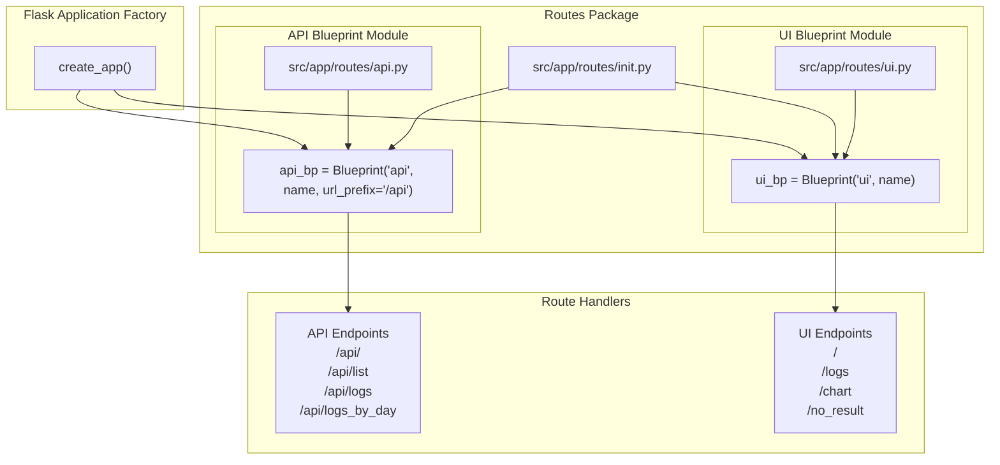
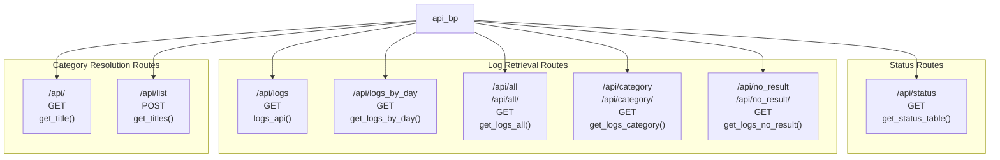
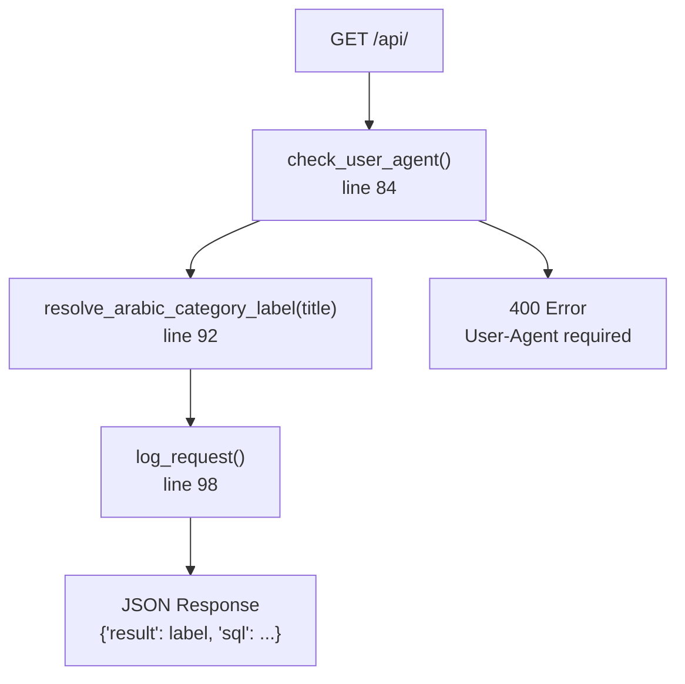
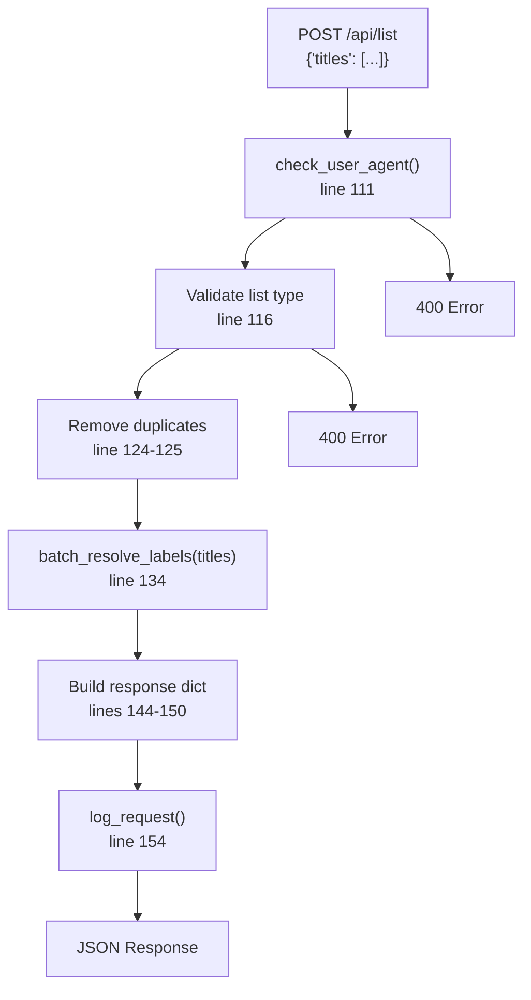
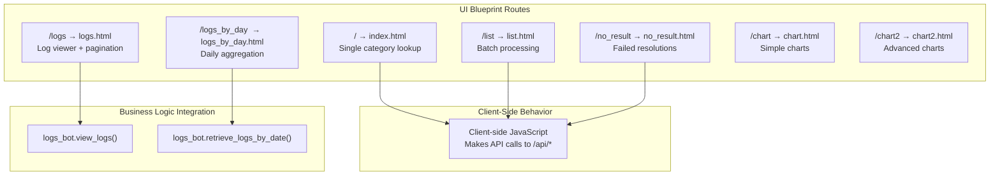
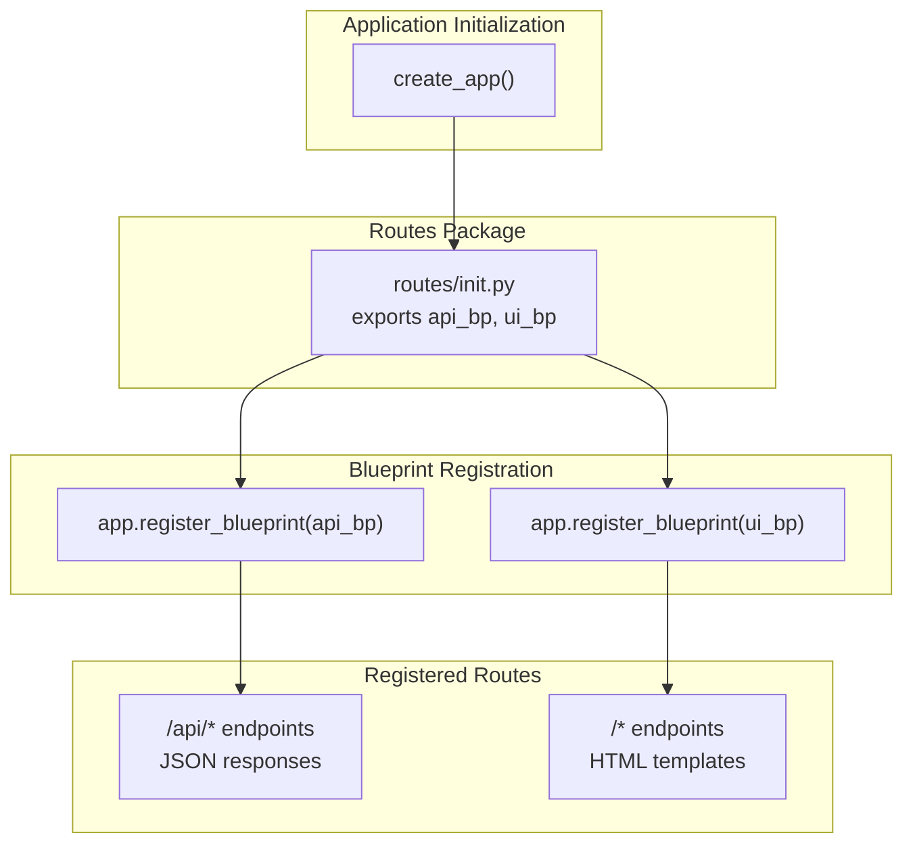

# Routing and Blueprints

> **Relevant source files**
> * [src/app/logs_db/db.py](https://github.com/ArWikiCats/ArWikiCatsWeb/blob/88f42d13/src/app/logs_db/db.py)
> * [src/app/routes/__init__.py](https://github.com/ArWikiCats/ArWikiCatsWeb/blob/88f42d13/src/app/routes/__init__.py)
> * [src/app/routes/api.py](https://github.com/ArWikiCats/ArWikiCatsWeb/blob/88f42d13/src/app/routes/api.py)
> * [tests/test_db_operations.py](https://github.com/ArWikiCats/ArWikiCatsWeb/blob/88f42d13/tests/test_db_operations.py)
> * [tests/test_ui.py](https://github.com/ArWikiCats/ArWikiCatsWeb/blob/88f42d13/tests/test_ui.py)

## Purpose and Scope

This document explains how ArWikiCatsWeb organizes its HTTP routes using Flask blueprints. The application uses two separate blueprints to logically separate REST API endpoints from web UI routes. For details about the Flask application factory that registers these blueprints, see [Application Core](/ArWikiCats/ArWikiCatsWeb/3.1-application-core). For comprehensive API endpoint documentation, see [REST API](/ArWikiCats/ArWikiCatsWeb/4-rest-api). For web interface details, see [Web Interface](/ArWikiCats/ArWikiCatsWeb/5-web-interface).

---

## Blueprint Architecture Overview

ArWikiCatsWeb employs Flask's Blueprint pattern to modularize routing into two distinct subsystems:

| Blueprint | URL Prefix | Purpose | Primary Clients |
| --- | --- | --- | --- |
| `api_bp` | `/api` | JSON REST API endpoints | Wikipedia bots, programmatic clients |
| `ui_bp` | `/` | HTML page rendering | Web browsers, human users |

Both blueprints are defined in the `src/app/routes/` package and exported via [src/app/routes/__init__.py L2-L8](https://github.com/ArWikiCats/ArWikiCatsWeb/blob/88f42d13/src/app/routes/__init__.py#L2-L8)

**Blueprint Architecture:**



**Sources:** [src/app/routes/__init__.py](https://github.com/ArWikiCats/ArWikiCatsWeb/blob/88f42d13/src/app/routes/__init__.py)

 [src/app/routes/api.py L17](https://github.com/ArWikiCats/ArWikiCatsWeb/blob/88f42d13/src/app/routes/api.py#L17-L17)

---

## API Blueprint (api_bp)

The API Blueprint handles all REST API endpoints with JSON responses. It is instantiated at [src/app/routes/api.py L17](https://github.com/ArWikiCats/ArWikiCatsWeb/blob/88f42d13/src/app/routes/api.py#L17-L17)

:

```python
api_bp = Blueprint("api", __name__, url_prefix="/api")
```

### URL Prefix and Route Registration

All routes registered on `api_bp` automatically receive the `/api` prefix. For example, a route decorated with `@api_bp.route("/<title>")` becomes accessible at `/api/<title>`.

### API Route Structure



**Sources:** [src/app/routes/api.py L17-L164](https://github.com/ArWikiCats/ArWikiCatsWeb/blob/88f42d13/src/app/routes/api.py#L17-L164)

### Category Resolution Routes

These routes integrate with the ArWikiCats library to resolve English Wikipedia category labels to Arabic equivalents:

| Route | Method | Function | Purpose |
| --- | --- | --- | --- |
| `/api/<title>` | GET | `get_title()` | Single category resolution |
| `/api/list` | POST | `get_titles()` | Batch category resolution |

Both routes implement User-Agent validation via the `check_user_agent()` helper function at [src/app/routes/api.py L25-L30](https://github.com/ArWikiCats/ArWikiCatsWeb/blob/88f42d13/src/app/routes/api.py#L25-L30)

**Single Category Resolution Flow:**



**Sources:** [src/app/routes/api.py L78-L100](https://github.com/ArWikiCats/ArWikiCatsWeb/blob/88f42d13/src/app/routes/api.py#L78-L100)

**Batch Category Resolution Flow:**



**Sources:** [src/app/routes/api.py L103-L156](https://github.com/ArWikiCats/ArWikiCatsWeb/blob/88f42d13/src/app/routes/api.py#L103-L156)

### Log Retrieval Routes

These routes query the logging database to retrieve historical request data:

| Route | Function | Purpose |
| --- | --- | --- |
| `/api/logs` | `logs_api()` | Paginated log viewer with filtering |
| `/api/logs_by_day` | `get_logs_by_day()` | Aggregated logs grouped by date |
| `/api/all[/<day>]` | `get_logs_all()` | All logs with optional day filter |
| `/api/category[/<day>]` | `get_logs_category()` | Successful resolution logs only |
| `/api/no_result[/<day>]` | `get_logs_no_result()` | Failed resolution logs only |
| `/api/status` | `get_status_table()` | Available response status types |

All log retrieval routes delegate to the `logs_bot` module for data processing. For example, [src/app/routes/api.py L159-L164](https://github.com/ArWikiCats/ArWikiCatsWeb/blob/88f42d13/src/app/routes/api.py#L159-L164)

:

```python
@api_bp.route("/logs", methods=["GET"])
def logs_api() -> str:
    result = logs_bot.view_logs(request)
    return jsonify(result)
```

**Sources:** [src/app/routes/api.py L33-L76](https://github.com/ArWikiCats/ArWikiCatsWeb/blob/88f42d13/src/app/routes/api.py#L33-L76)

 [src/app/routes/api.py L159-L164](https://github.com/ArWikiCats/ArWikiCatsWeb/blob/88f42d13/src/app/routes/api.py#L159-L164)

### Helper Functions

**`jsonify(data: dict) -> str`** [src/app/routes/api.py L20-L22](https://github.com/ArWikiCats/ArWikiCatsWeb/blob/88f42d13/src/app/routes/api.py#L20-L22)

Custom JSON serialization function ensuring UTF-8 encoding and proper Content-Type headers:

```python
def jsonify(data: dict) -> str:
    response_json = json.dumps(data, ensure_ascii=False, indent=4)
    return Response(response=response_json, content_type="application/json; charset=utf-8")
```

**`check_user_agent(endpoint, data, start_time)`** [src/app/routes/api.py L25-L30](https://github.com/ArWikiCats/ArWikiCatsWeb/blob/88f42d13/src/app/routes/api.py#L25-L30)

Validates presence of User-Agent header, logs violations, and returns error response if missing. See [User-Agent Validation](/ArWikiCats/ArWikiCatsWeb/4.3-user-agent-validation) for complete documentation.

**Sources:** [src/app/routes/api.py L20-L30](https://github.com/ArWikiCats/ArWikiCatsWeb/blob/88f42d13/src/app/routes/api.py#L20-L30)

---

## UI Blueprint (ui_bp)

The UI Blueprint renders HTML templates for the web interface. Unlike the API Blueprint, it has no URL prefix, serving pages directly from the root path.

### UI Route Organization

While the UI Blueprint file is not included in the provided sources, the test file [tests/test_ui.py](https://github.com/ArWikiCats/ArWikiCatsWeb/blob/88f42d13/tests/test_ui.py)

 reveals the complete route structure:

| Route | Purpose | Template | Test Reference |
| --- | --- | --- | --- |
| `/` | Single category lookup page | `index.html` | [tests/test_ui.py L22-L26](https://github.com/ArWikiCats/ArWikiCatsWeb/blob/88f42d13/tests/test_ui.py#L22-L26) |
| `/list` | Batch processing interface | `list.html` | [tests/test_ui.py L80-L84](https://github.com/ArWikiCats/ArWikiCatsWeb/blob/88f42d13/tests/test_ui.py#L80-L84) |
| `/logs` | Log viewer with pagination | `logs.html` | [tests/test_ui.py L28-L58](https://github.com/ArWikiCats/ArWikiCatsWeb/blob/88f42d13/tests/test_ui.py#L28-L58) |
| `/logs_by_day` | Daily log aggregation | `logs_by_day.html` | [tests/test_ui.py L66-L78](https://github.com/ArWikiCats/ArWikiCatsWeb/blob/88f42d13/tests/test_ui.py#L66-L78) |
| `/no_result` | Failed resolution viewer | `no_result.html` | [tests/test_ui.py L60-L64](https://github.com/ArWikiCats/ArWikiCatsWeb/blob/88f42d13/tests/test_ui.py#L60-L64) |
| `/chart` | Simple chart visualization | `chart.html` | [tests/test_ui.py L86-L90](https://github.com/ArWikiCats/ArWikiCatsWeb/blob/88f42d13/tests/test_ui.py#L86-L90) |
| `/chart2` | Advanced chart visualization | `chart2.html` | [tests/test_ui.py L92-L96](https://github.com/ArWikiCats/ArWikiCatsWeb/blob/88f42d13/tests/test_ui.py#L92-L96) |

**UI Route Architecture:**



**Sources:** [tests/test_ui.py L10-L97](https://github.com/ArWikiCats/ArWikiCatsWeb/blob/88f42d13/tests/test_ui.py#L10-L97)

### Query Parameter Support

UI routes accept query parameters for filtering and pagination. Test examples demonstrate this pattern:

**Pagination Parameters** [tests/test_ui.py L111-L142](https://github.com/ArWikiCats/ArWikiCatsWeb/blob/88f42d13/tests/test_ui.py#L111-L142)

:

* `page` - Page number (e.g., `?page=2`)
* `per_page` - Items per page (e.g., `?per_page=10`)

**Filter Parameters** [tests/test_ui.py L144-L174](https://github.com/ArWikiCats/ArWikiCatsWeb/blob/88f42d13/tests/test_ui.py#L144-L174)

:

* `status` - Response status filter (e.g., `?status=no_result`)
* `table_name` - Database table selection (e.g., `?table_name=list_logs`)

**Sources:** [tests/test_ui.py L99-L189](https://github.com/ArWikiCats/ArWikiCatsWeb/blob/88f42d13/tests/test_ui.py#L99-L189)

---

## Blueprint Registration Process

Both blueprints are exported from the routes package via [src/app/routes/__init__.py L2-L8](https://github.com/ArWikiCats/ArWikiCatsWeb/blob/88f42d13/src/app/routes/__init__.py#L2-L8)

:

```javascript
from .api import api_bp
from .ui import ui_bp

__all__ = [
    "api_bp",
    "ui_bp",
]
```

The Flask application factory imports and registers these blueprints during app initialization. While the factory code is not included in the provided sources, the registration follows this pattern:

```javascript
from src.app.routes import api_bp, ui_bp

def create_app():
    app = Flask(__name__)
    app.register_blueprint(api_bp)
    app.register_blueprint(ui_bp)
    return app
```

**Blueprint Registration Flow:**



**Sources:** [src/app/routes/__init__.py L1-L8](https://github.com/ArWikiCats/ArWikiCatsWeb/blob/88f42d13/src/app/routes/__init__.py#L1-L8)

---

## Route Testing Strategy

The test suite validates both blueprints comprehensively, achieving 100% coverage on route handlers:

**API Blueprint Tests** - See [API Tests](/ArWikiCats/ArWikiCatsWeb/9.2-api-tests) for detailed coverage
**UI Blueprint Tests** [tests/test_ui.py L10-L208](https://github.com/ArWikiCats/ArWikiCatsWeb/blob/88f42d13/tests/test_ui.py#L10-L208)

:

* `TestUIRoutes` - Basic page rendering validation
* `TestUIWithQueryParams` - Query parameter handling
* `TestErrorHandling` - 404 error responses

Test fixtures create Flask test clients using the application factory:

```javascript
@pytest.fixture
def client(self):
    from src.app import create_app
    app = create_app()
    app.config["TESTING"] = True
    with app.test_client() as client:
        yield client
```

**Sources:** [tests/test_ui.py L14-L20](https://github.com/ArWikiCats/ArWikiCatsWeb/blob/88f42d13/tests/test_ui.py#L14-L20)

 [tests/test_ui.py L10-L208](https://github.com/ArWikiCats/ArWikiCatsWeb/blob/88f42d13/tests/test_ui.py#L10-L208)

---

## Blueprint Design Patterns

### Separation of Concerns

The two-blueprint architecture enforces clear separation:

| Concern | API Blueprint | UI Blueprint |
| --- | --- | --- |
| **Response Format** | JSON | HTML |
| **Authentication** | User-Agent validation | None |
| **Logging** | All requests logged | Not logged directly |
| **Client Type** | Programmatic (bots) | Interactive (browsers) |
| **Business Logic** | Direct ArWikiCats integration | Client-side API calls |

### URL Namespace Isolation

The `/api` prefix prevents route conflicts and makes it explicit which endpoints are programmatic APIs versus web pages. This also enables separate CORS policies and rate limiting if needed.

### Module Independence

Each blueprint is self-contained in its own module with minimal coupling. The API blueprint imports `logs_bot` and `ArWikiCats`, while the UI blueprint only imports `logs_bot` for server-side data retrieval. Client-side JavaScript in UI pages makes asynchronous calls back to API endpoints.

**Sources:** [src/app/routes/api.py L1-L164](https://github.com/ArWikiCats/ArWikiCatsWeb/blob/88f42d13/src/app/routes/api.py#L1-L164)

 [tests/test_ui.py](https://github.com/ArWikiCats/ArWikiCatsWeb/blob/88f42d13/tests/test_ui.py)