# REST API

> **Relevant source files**
> * [README.md](https://github.com/ArWikiCats/ArWikiCatsWeb/blob/88f42d13/README.md)
> * [src/app/routes/api.py](https://github.com/ArWikiCats/ArWikiCatsWeb/blob/88f42d13/src/app/routes/api.py)
> * [tests/test_api.py](https://github.com/ArWikiCats/ArWikiCatsWeb/blob/88f42d13/tests/test_api.py)
> * [tests/test_logs_bot.py](https://github.com/ArWikiCats/ArWikiCatsWeb/blob/88f42d13/tests/test_logs_bot.py)

The REST API provides programmatic access to Arabic Wikipedia category label resolution and request logging functionality. This document covers the API blueprint architecture, response format, authentication requirements, and provides an overview of all available endpoints.

For detailed documentation on specific endpoint categories, see:

* Category resolution endpoints: [Category Resolution Endpoints](/ArWikiCats/ArWikiCatsWeb/4.1-category-resolution-endpoints)
* Log retrieval and analytics endpoints: [Log Retrieval Endpoints](/ArWikiCats/ArWikiCatsWeb/4.2-log-retrieval-endpoints)
* User-Agent header validation: [User-Agent Validation](/ArWikiCats/ArWikiCatsWeb/4.3-user-agent-validation)

For information about the web UI that consumes this API, see [Web Interface](/ArWikiCats/ArWikiCatsWeb/5-web-interface).

**Sources:** [README.md L110-L193](https://github.com/ArWikiCats/ArWikiCatsWeb/blob/88f42d13/README.md#L110-L193)

 [src/app/routes/api.py L1-L165](https://github.com/ArWikiCats/ArWikiCatsWeb/blob/88f42d13/src/app/routes/api.py#L1-L165)

## API Blueprint Architecture

The API is implemented as a Flask Blueprint named `api_bp` with URL prefix `/api`. The blueprint is registered with the main application through the factory pattern in `create_app`.

```mermaid
flowchart TD

CreateApp["create_app()<br>src/app/init.py"]
ApiBP["api_bp = Blueprint('api', ...)<br>src/app/routes/api.py:17"]
GetTitle["get_title(title)<br>@api_bp.route('/')"]
GetTitles["get_titles()<br>@api_bp.route('/list')"]
GetLogsAll["get_logs_all(day)<br>@api_bp.route('/all')"]
GetLogsCategory["get_logs_category(day)<br>@api_bp.route('/category')"]
GetLogsNoResult["get_logs_no_result(day)<br>@api_bp.route('/no_result')"]
GetLogsByDay["get_logs_by_day()<br>@api_bp.route('/logs_by_day')"]
GetStatus["get_status_table()<br>@api_bp.route('/status')"]
LogsAPI["logs_api()<br>@api_bp.route('/logs')"]
Jsonify["jsonify(data)<br>Custom JSON serializer"]
CheckUserAgent["check_user_agent()<br>Validates User-Agent header"]
ArWikiCats["ArWikiCats Library<br>resolve_arabic_category_label<br>batch_resolve_labels"]
LogsBot["logs_bot module<br>src/app/logs_bot.py"]
LogsDB["logs_db module<br>log_request()<br>get_response_status()"]

CreateApp --> ApiBP
GetTitle --> ArWikiCats
GetTitle --> LogsDB
GetTitles --> ArWikiCats
GetTitles --> LogsDB
GetLogsAll --> LogsBot
GetLogsCategory --> LogsBot
GetLogsNoResult --> LogsBot
GetLogsByDay --> LogsBot
LogsAPI --> LogsBot
GetStatus --> LogsDB

subgraph subGraph4 ["External Dependencies"]
    ArWikiCats
    LogsBot
    LogsDB
end

subgraph subGraph3 ["API Blueprint"]
    ApiBP
    GetTitle --> CheckUserAgent
    GetTitles --> CheckUserAgent
    GetTitle --> Jsonify
    GetTitles --> Jsonify
    GetLogsAll --> Jsonify
    GetLogsCategory --> Jsonify
    GetLogsNoResult --> Jsonify
    GetLogsByDay --> Jsonify
    GetStatus --> Jsonify
    LogsAPI --> Jsonify

subgraph subGraph2 ["Helper Functions"]
    Jsonify
    CheckUserAgent
end

subgraph subGraph1 ["Endpoint Handlers"]
    GetTitle
    GetTitles
    GetLogsAll
    GetLogsCategory
    GetLogsNoResult
    GetLogsByDay
    GetStatus
    LogsAPI
end
end

subgraph subGraph0 ["Application Factory"]
    CreateApp
end
```



**Blueprint Registration**

The `api_bp` blueprint is created at [src/app/routes/api.py L17](https://github.com/ArWikiCats/ArWikiCatsWeb/blob/88f42d13/src/app/routes/api.py#L17-L17)

 and registered with the application in the `create_app` factory function. All routes are automatically prefixed with `/api`.

**Sources:** [src/app/routes/api.py L16-L17](https://github.com/ArWikiCats/ArWikiCatsWeb/blob/88f42d13/src/app/routes/api.py#L16-L17)

 [README.md L78-L88](https://github.com/ArWikiCats/ArWikiCatsWeb/blob/88f42d13/README.md#L78-L88)

## Custom JSON Response Format

The API uses a custom `jsonify` function instead of Flask's default to ensure proper Unicode handling for Arabic text.

### jsonify Function

```python
def jsonify(data: dict) -> str:
    response_json = json.dumps(data, ensure_ascii=False, indent=4)
    return Response(response=response_json, content_type="application/json; charset=utf-8")
```

**Key Features:**

* `ensure_ascii=False`: Prevents escaping of Arabic characters (e.g., outputs `تصنيف` instead of `\u062a\u0635\u0646\u064a\u0641`)
* `indent=4`: Pretty-prints JSON for readability
* `charset=utf-8`: Explicitly sets UTF-8 encoding in Content-Type header

**Implementation:** [src/app/routes/api.py L20-L22](https://github.com/ArWikiCats/ArWikiCatsWeb/blob/88f42d13/src/app/routes/api.py#L20-L22)

**Sources:** [src/app/routes/api.py L20-L22](https://github.com/ArWikiCats/ArWikiCatsWeb/blob/88f42d13/src/app/routes/api.py#L20-L22)

 [tests/test_api.py L14-L41](https://github.com/ArWikiCats/ArWikiCatsWeb/blob/88f42d13/tests/test_api.py#L14-L41)

## User-Agent Requirement

All API endpoints require a `User-Agent` header. Requests without this header receive a `400 Bad Request` response.

### check_user_agent Function

The `check_user_agent` helper function validates the presence of the User-Agent header:

```python
def check_user_agent(endpoint, data, start_time):
    if not request.headers.get("User-Agent"):
        response_status = "User-Agent missing"
        log_request(endpoint, data, response_status, time.time() - start_time)
        return jsonify({"error": "User-Agent header is required"}), 400
    return None
```

**Behavior:**

* Returns `None` if User-Agent is present (validation passes)
* Returns error response tuple if User-Agent is missing
* Logs the failed request with status `"User-Agent missing"`

**Implementation:** [src/app/routes/api.py L25-L30](https://github.com/ArWikiCats/ArWikiCatsWeb/blob/88f42d13/src/app/routes/api.py#L25-L30)

For detailed information about User-Agent validation, see [User-Agent Validation](/ArWikiCats/ArWikiCatsWeb/4.3-user-agent-validation).

**Sources:** [src/app/routes/api.py L25-L30](https://github.com/ArWikiCats/ArWikiCatsWeb/blob/88f42d13/src/app/routes/api.py#L25-L30)

 [README.md L178-L193](https://github.com/ArWikiCats/ArWikiCatsWeb/blob/88f42d13/README.md#L178-L193)

 [tests/test_api.py L44-L76](https://github.com/ArWikiCats/ArWikiCatsWeb/blob/88f42d13/tests/test_api.py#L44-L76)

## API Endpoints Overview

The API provides two categories of endpoints: category resolution and log retrieval.

### Endpoint Summary Table

| Endpoint | Method | Purpose | User-Agent Required |
| --- | --- | --- | --- |
| `/api/<title>` | GET | Resolve single category label | Yes |
| `/api/list` | POST | Batch resolve multiple categories | Yes |
| `/api/logs_by_day` | GET | Aggregate logs by date | No |
| `/api/all` | GET | All logs (with optional day filter) | No |
| `/api/all/<day>` | GET | All logs for specific day | No |
| `/api/category` | GET | Category logs (excludes no_result) | No |
| `/api/category/<day>` | GET | Category logs for specific day | No |
| `/api/no_result` | GET | Failed resolution attempts | No |
| `/api/no_result/<day>` | GET | Failed attempts for specific day | No |
| `/api/status` | GET | Response status statistics | No |
| `/api/logs` | GET | Paginated log viewer | No |

**Sources:** [README.md L110-L168](https://github.com/ArWikiCats/ArWikiCatsWeb/blob/88f42d13/README.md#L110-L168)

 [src/app/routes/api.py L33-L165](https://github.com/ArWikiCats/ArWikiCatsWeb/blob/88f42d13/src/app/routes/api.py#L33-L165)

## Request Processing Flow

The following diagram illustrates how API requests are processed, from initial validation through to response generation.

```mermaid
sequenceDiagram
  participant HTTP Response
  participant api_bp Blueprint
  participant check_user_agent()
  participant ArWikiCats Library
  participant log_request()
  participant logs_bot module
  participant jsonify()

  note over HTTP Response: Category Resolution Flow
  HTTP Response->>api_bp Blueprint: GET /api/Category:Test
  api_bp Blueprint->>api_bp Blueprint: start_time = time.time()
  api_bp Blueprint->>check_user_agent(): check_user_agent(endpoint, data, start_time)
  loop [No User-Agent]
    check_user_agent()->>log_request(): log_request(..., "User-Agent missing", ...)
    check_user_agent()->>jsonify(): jsonify({"error": "..."})
    check_user_agent()-->>HTTP Response: 400 Bad Request
    check_user_agent()-->>api_bp Blueprint: None (validation passed)
    api_bp Blueprint->>ArWikiCats Library: resolve_arabic_category_label(title)
    ArWikiCats Library-->>api_bp Blueprint: "تصنيف:اختبار" or None
    api_bp Blueprint->>api_bp Blueprint: delta = time.time() - start_time
    api_bp Blueprint->>log_request(): log_request(endpoint, title, label, delta)
    log_request()-->>api_bp Blueprint: log_entry_id
    api_bp Blueprint->>jsonify(): jsonify({"result": label, "sql": id})
    jsonify()-->>HTTP Response: 200 OK + JSON
  end
  note over HTTP Response: Log Retrieval Flow
  HTTP Response->>api_bp Blueprint: GET /api/logs_by_day
  api_bp Blueprint->>logs_bot module: retrieve_logs_by_date(request)
  logs_bot module-->>api_bp Blueprint: {"logs": [...], "tab": {...}}
  api_bp Blueprint->>jsonify(): jsonify(result["logs"])
  jsonify()-->>HTTP Response: 200 OK + JSON
```

**Key Processing Steps:**

1. **Timing**: Start time captured at request entry for performance logging
2. **Validation**: User-Agent checked for category resolution endpoints
3. **Resolution**: ArWikiCats library invoked for category label lookup
4. **Logging**: All requests logged with status, data, and response time
5. **Serialization**: Custom `jsonify` formats response with UTF-8 encoding

**Sources:** [src/app/routes/api.py L78-L101](https://github.com/ArWikiCats/ArWikiCatsWeb/blob/88f42d13/src/app/routes/api.py#L78-L101)

 [src/app/routes/api.py L103-L156](https://github.com/ArWikiCats/ArWikiCatsWeb/blob/88f42d13/src/app/routes/api.py#L103-L156)

 [src/app/routes/api.py L33-L68](https://github.com/ArWikiCats/ArWikiCatsWeb/blob/88f42d13/src/app/routes/api.py#L33-L68)

## Category Resolution Endpoints

These endpoints integrate with the ArWikiCats library to resolve English Wikipedia category labels to their Arabic equivalents.

### Single Category Resolution: GET /api/<title>

Resolves a single category title.

**Example Request:**

```
curl -H "User-Agent: MyBot/1.0" \
  "http://localhost:5000/api/Category:Yemen"
```

**Example Response:**

```json
{
    "result": "تصنيف:اليمن",
    "sql": "12345"
}
```

**Response Fields:**

* `result`: Arabic label or `null` if not found
* `sql`: Database log entry ID

**Implementation:** [src/app/routes/api.py L78-L100](https://github.com/ArWikiCats/ArWikiCatsWeb/blob/88f42d13/src/app/routes/api.py#L78-L100)

### Batch Resolution: POST /api/list

Resolves multiple categories in a single request.

**Example Request:**

```
curl -H "User-Agent: MyBot/1.0" \
  -H "Content-Type: application/json" \
  -X POST \
  -d '{"titles": ["Category:Yemen", "Category:Saudi_Arabia"]}' \
  "http://localhost:5000/api/list"
```

**Example Response:**

```json
{
    "results": {
        "Category:Yemen": "تصنيف:اليمن",
        "Category:Saudi_Arabia": "تصنيف:السعودية"
    },
    "no_labs": 0,
    "with_labs": 2,
    "duplicates": 0,
    "time": 0.123
}
```

**Response Fields:**

* `results`: Dictionary mapping input titles to Arabic labels (empty string for not found)
* `no_labs`: Count of titles without labels
* `with_labs`: Count of successfully resolved titles
* `duplicates`: Number of duplicate titles removed
* `time`: Total processing time in seconds

**Duplicate Handling:** The endpoint automatically deduplicates the input list using `list(set(titles))` at [src/app/routes/api.py L124](https://github.com/ArWikiCats/ArWikiCatsWeb/blob/88f42d13/src/app/routes/api.py#L124-L124)

**Implementation:** [src/app/routes/api.py L103-L156](https://github.com/ArWikiCats/ArWikiCatsWeb/blob/88f42d13/src/app/routes/api.py#L103-L156)

For complete details, see [Category Resolution Endpoints](/ArWikiCats/ArWikiCatsWeb/4.1-category-resolution-endpoints).

**Sources:** [src/app/routes/api.py L78-L156](https://github.com/ArWikiCats/ArWikiCatsWeb/blob/88f42d13/src/app/routes/api.py#L78-L156)

 [README.md L112-L156](https://github.com/ArWikiCats/ArWikiCatsWeb/blob/88f42d13/README.md#L112-L156)

 [tests/test_api.py L179-L336](https://github.com/ArWikiCats/ArWikiCatsWeb/blob/88f42d13/tests/test_api.py#L179-L336)

## Log Retrieval Endpoints

These endpoints provide access to request logs stored in the SQLite database. They delegate to functions in the `logs_bot` module.

### Logs by Day: GET /api/logs_by_day

Returns logs aggregated by date with counts and statistics.

**Implementation:** [src/app/routes/api.py L33-L38](https://github.com/ArWikiCats/ArWikiCatsWeb/blob/88f42d13/src/app/routes/api.py#L33-L38)

**Delegates to:** `logs_bot.retrieve_logs_by_date()`

### All Logs: GET /api/all and GET /api/all/<day>

Returns all logs with separation into successful resolutions and failures.

**Implementation:** [src/app/routes/api.py L41-L46](https://github.com/ArWikiCats/ArWikiCatsWeb/blob/88f42d13/src/app/routes/api.py#L41-L46)

**Delegates to:** `logs_bot.retrieve_logs_en_to_ar(day)`

### Category Logs: GET /api/category and GET /api/category/<day>

Returns only successful category resolutions (excludes `no_result` entries).

**Implementation:** [src/app/routes/api.py L49-L57](https://github.com/ArWikiCats/ArWikiCatsWeb/blob/88f42d13/src/app/routes/api.py#L49-L57)

**Delegates to:** `logs_bot.retrieve_logs_en_to_ar(day)` with `no_result` filtered out

### No Result Logs: GET /api/no_result and GET /api/no_result/<day>

Returns only failed resolution attempts (excludes successful `data_result` entries).

**Implementation:** [src/app/routes/api.py L60-L68](https://github.com/ArWikiCats/ArWikiCatsWeb/blob/88f42d13/src/app/routes/api.py#L60-L68)

**Delegates to:** `logs_bot.retrieve_logs_en_to_ar(day)` with `data_result` filtered out

### Status Table: GET /api/status

Returns aggregated status statistics.

**Implementation:** [src/app/routes/api.py L71-L75](https://github.com/ArWikiCats/ArWikiCatsWeb/blob/88f42d13/src/app/routes/api.py#L71-L75)

**Delegates to:** `get_response_status()` from `logs_db`

### Paginated Logs: GET /api/logs

Returns paginated logs with filtering options via query parameters.

**Implementation:** [src/app/routes/api.py L159-L164](https://github.com/ArWikiCats/ArWikiCatsWeb/blob/88f42d13/src/app/routes/api.py#L159-L164)

**Delegates to:** `logs_bot.view_logs(request)`

For complete details on all log endpoints, see [Log Retrieval Endpoints](/ArWikiCats/ArWikiCatsWeb/4.2-log-retrieval-endpoints).

**Sources:** [src/app/routes/api.py L33-L75](https://github.com/ArWikiCats/ArWikiCatsWeb/blob/88f42d13/src/app/routes/api.py#L33-L75)

 [src/app/routes/api.py L159-L164](https://github.com/ArWikiCats/ArWikiCatsWeb/blob/88f42d13/src/app/routes/api.py#L159-L164)

 [README.md L158-L168](https://github.com/ArWikiCats/ArWikiCatsWeb/blob/88f42d13/README.md#L158-L168)

 [tests/test_api.py L90-L177](https://github.com/ArWikiCats/ArWikiCatsWeb/blob/88f42d13/tests/test_api.py#L90-L177)

## Error Handling

The API returns standard HTTP status codes with JSON error messages.

### Error Response Format

All error responses follow this structure:

```json
{
    "error": "Error message in Arabic or English"
}
```

### Common Error Scenarios

| Status Code | Scenario | Response Body | Location |
| --- | --- | --- | --- |
| 400 | Missing User-Agent | `{"error": "User-Agent header is required"}` | [src/app/routes/api.py L29](https://github.com/ArWikiCats/ArWikiCatsWeb/blob/88f42d13/src/app/routes/api.py#L29-L29) |
| 400 | Invalid data type | `{"error": "بيانات غير صالحة"}` | [src/app/routes/api.py L119](https://github.com/ArWikiCats/ArWikiCatsWeb/blob/88f42d13/src/app/routes/api.py#L119-L119) |
| 500 | ArWikiCats not loaded | `{"error": "حدث خطأ أثناء تحميل المكتبة"}` | [src/app/routes/api.py L90](https://github.com/ArWikiCats/ArWikiCatsWeb/blob/88f42d13/src/app/routes/api.py#L90-L90) |

**Error Logging:** All errors are logged to the database via `log_request()` with appropriate status strings (`"User-Agent missing"`, `"error"`, etc.).

**Sources:** [src/app/routes/api.py L25-L30](https://github.com/ArWikiCats/ArWikiCatsWeb/blob/88f42d13/src/app/routes/api.py#L25-L30)

 [src/app/routes/api.py L88-L90](https://github.com/ArWikiCats/ArWikiCatsWeb/blob/88f42d13/src/app/routes/api.py#L88-L90)

 [src/app/routes/api.py L116-L119](https://github.com/ArWikiCats/ArWikiCatsWeb/blob/88f42d13/src/app/routes/api.py#L116-L119)

 [tests/test_api.py L191-L225](https://github.com/ArWikiCats/ArWikiCatsWeb/blob/88f42d13/tests/test_api.py#L191-L225)

## Integration with ArWikiCats Library

The API attempts to import resolution functions from the external ArWikiCats library:

```javascript
try:
    from ArWikiCats import batch_resolve_labels, resolve_arabic_category_label
except ImportError:
    batch_resolve_labels = None
    resolve_arabic_category_label = None
```

**Graceful Degradation:** If the library is not available:

* Functions are set to `None` at [src/app/routes/api.py L10-L14](https://github.com/ArWikiCats/ArWikiCatsWeb/blob/88f42d13/src/app/routes/api.py#L10-L14)
* Endpoints check for `None` before calling functions
* 500 errors returned with Arabic error message if library unavailable

**Library Functions Used:**

* `resolve_arabic_category_label(title)`: Single category resolution
* `batch_resolve_labels(titles)`: Batch resolution returning object with `labels` and `no_labels` attributes

**Sources:** [src/app/routes/api.py L10-L14](https://github.com/ArWikiCats/ArWikiCatsWeb/blob/88f42d13/src/app/routes/api.py#L10-L14)

 [src/app/routes/api.py L88-L92](https://github.com/ArWikiCats/ArWikiCatsWeb/blob/88f42d13/src/app/routes/api.py#L88-L92)

 [src/app/routes/api.py L130-L134](https://github.com/ArWikiCats/ArWikiCatsWeb/blob/88f42d13/src/app/routes/api.py#L130-L134)

## CORS Configuration

The application is configured with CORS support in the factory function to allow cross-origin requests from Wikipedia domains. While this configuration occurs outside the API blueprint, it affects all API endpoints.

For details on deployment and CORS configuration, see [Deployment](/ArWikiCats/ArWikiCatsWeb/8-deployment) and [Toolforge Configuration](/ArWikiCats/ArWikiCatsWeb/8.1-toolforge-configuration).

**Sources:** [README.md L250](https://github.com/ArWikiCats/ArWikiCatsWeb/blob/88f42d13/README.md#L250-L250)