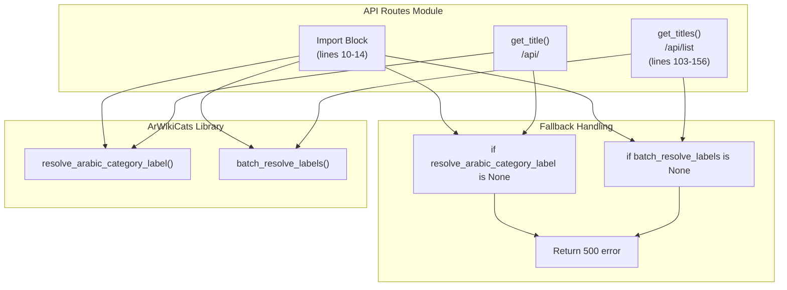
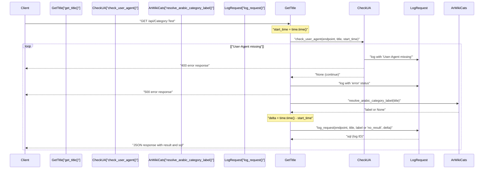
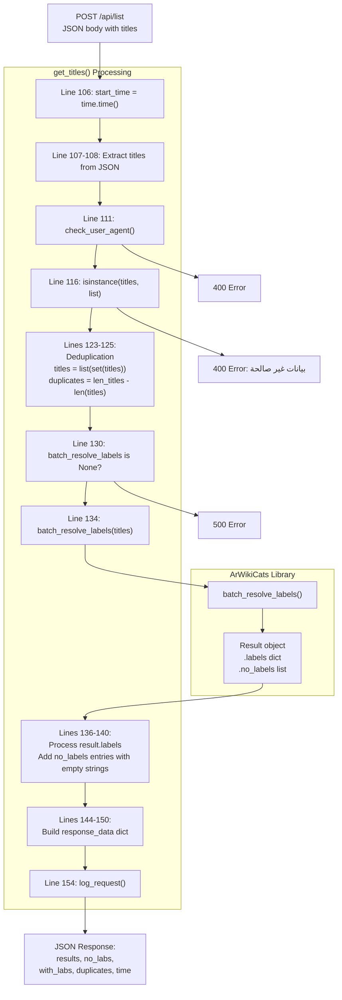
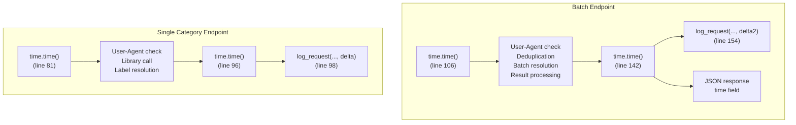
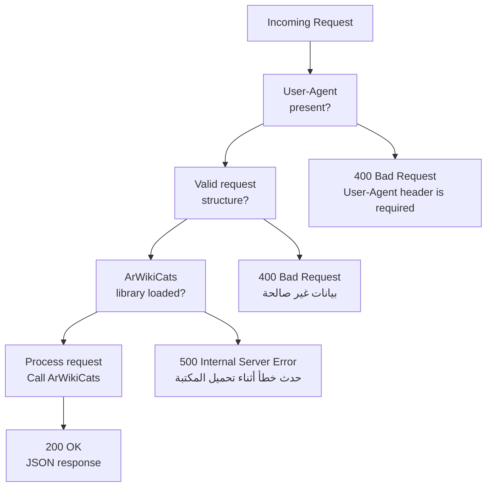

# Category Resolution Endpoints

> **Relevant source files**
> * [src/app/routes/api.py](https://github.com/ArWikiCats/ArWikiCatsWeb/blob/88f42d13/src/app/routes/api.py)
> * [tests/test_api.py](https://github.com/ArWikiCats/ArWikiCatsWeb/blob/88f42d13/tests/test_api.py)
> * [tests/test_logs_bot.py](https://github.com/ArWikiCats/ArWikiCatsWeb/blob/88f42d13/tests/test_logs_bot.py)

## Purpose and Scope

This document covers the two primary category resolution endpoints that integrate with the ArWikiCats library to translate English Wikipedia category labels to their Arabic equivalents. These endpoints form the core functionality of the ArWikiCatsWeb service.

* `/api/<title>` - Single category label resolution via GET request
* `/api/list` - Batch category label resolution via POST request

For information about User-Agent validation requirements, see [User-Agent Validation](/ArWikiCats/ArWikiCatsWeb/4.3-user-agent-validation). For log retrieval endpoints, see [Log Retrieval Endpoints](/ArWikiCats/ArWikiCatsWeb/4.2-log-retrieval-endpoints). For client-side JavaScript that interacts with these endpoints, see [Client-Side JavaScript](/ArWikiCats/ArWikiCatsWeb/5.5-client-side-javascript).

Sources: [src/app/routes/api.py L1-L165](https://github.com/ArWikiCats/ArWikiCatsWeb/blob/88f42d13/src/app/routes/api.py#L1-L165)

---

## ArWikiCats Library Integration

Both category resolution endpoints depend on the external `ArWikiCats` library, which provides the actual label translation logic. The library is imported at module initialization with graceful fallback if unavailable.

```python
try:
    from ArWikiCats import batch_resolve_labels, resolve_arabic_category_label
except ImportError:
    batch_resolve_labels = None
    resolve_arabic_category_label = None
```

The two core functions imported from ArWikiCats are:

| Function | Purpose | Used By |
| --- | --- | --- |
| `resolve_arabic_category_label` | Resolves a single English category label to Arabic | `/api/<title>` endpoint |
| `batch_resolve_labels` | Resolves multiple category labels in a single operation | `/api/list` endpoint |

If the library fails to load, both endpoints return HTTP 500 with an Arabic error message: "حدث خطأ أثناء تحميل المكتبة" (An error occurred while loading the library).

**Diagram: ArWikiCats Integration Architecture**



Sources: [src/app/routes/api.py L10-L14](https://github.com/ArWikiCats/ArWikiCatsWeb/blob/88f42d13/src/app/routes/api.py#L10-L14)

 [src/app/routes/api.py L88-L90](https://github.com/ArWikiCats/ArWikiCatsWeb/blob/88f42d13/src/app/routes/api.py#L88-L90)

 [src/app/routes/api.py L130-L132](https://github.com/ArWikiCats/ArWikiCatsWeb/blob/88f42d13/src/app/routes/api.py#L130-L132)

 [tests/test_api.py L216-L225](https://github.com/ArWikiCats/ArWikiCatsWeb/blob/88f42d13/tests/test_api.py#L216-L225)

 [tests/test_api.py L303-L313](https://github.com/ArWikiCats/ArWikiCatsWeb/blob/88f42d13/tests/test_api.py#L303-L313)

---

## Single Category Resolution Endpoint

### Endpoint Definition

**Route**: `/api/<title>`
**Method**: `GET`
**Handler**: `get_title(title)`
**Blueprint**: `api_bp`

The endpoint accepts a category title as a URL path parameter and returns the corresponding Arabic label. The `title` parameter is captured directly from the URL and passed to the handler function.

### Request Format

**Required Headers**:

| Header | Value | Validation |
| --- | --- | --- |
| `User-Agent` | Any non-empty string | Validated by `check_user_agent()` at line 84 |

**URL Structure**:

```
GET /api/Category:Example
GET /api/Category:Computer_science
```

The title parameter should be URL-encoded if it contains special characters.

### Processing Flow

**Diagram: Single Category Resolution Flow**



The processing steps, as implemented in [src/app/routes/api.py L78-L100](https://github.com/ArWikiCats/ArWikiCatsWeb/blob/88f42d13/src/app/routes/api.py#L78-L100)

:

1. **Line 81**: Record start time with `time.time()`
2. **Line 84**: Validate User-Agent header via `check_user_agent()`
3. **Lines 88-90**: Check if `resolve_arabic_category_label` is loaded
4. **Line 92**: Call `resolve_arabic_category_label(title)` to get Arabic label
5. **Line 96**: Calculate elapsed time (`delta`)
6. **Line 98**: Log the request with `log_request()`
7. **Line 100**: Return JSON response with result and SQL log ID

### Response Format

**Success Response** (HTTP 200):

```json
{
    "result": "تصنيف:علوم الحاسوب",
    "sql": "12345"
}
```

**Fields**:

| Field | Type | Description |
| --- | --- | --- |
| `result` | string | Arabic category label, or empty string if not found |
| `sql` | string | Database log record ID from `log_request()` |

**Error Responses**:

| Status Code | Condition | Response Body |
| --- | --- | --- |
| 400 | Missing User-Agent header | `{"error": "User-Agent header is required"}` |
| 500 | ArWikiCats library not loaded | `{"error": "حدث خطأ أثناء تحميل المكتبة"}` |

Sources: [src/app/routes/api.py L78-L100](https://github.com/ArWikiCats/ArWikiCatsWeb/blob/88f42d13/src/app/routes/api.py#L78-L100)

 [tests/test_api.py L179-L226](https://github.com/ArWikiCats/ArWikiCatsWeb/blob/88f42d13/tests/test_api.py#L179-L226)

---

## Batch Category Resolution Endpoint

### Endpoint Definition

**Route**: `/api/list`
**Method**: `POST`
**Handler**: `get_titles()`
**Blueprint**: `api_bp`

The endpoint accepts a JSON array of category titles and returns a dictionary mapping each title to its Arabic label. This endpoint is optimized for bulk operations.

### Request Format

**Required Headers**:

| Header | Value | Validation |
| --- | --- | --- |
| `User-Agent` | Any non-empty string | Validated by `check_user_agent()` at line 111 |
| `Content-Type` | `application/json` | Implicit Flask validation |

**Request Body**:

```json
{
    "titles": [
        "Category:Computer_science",
        "Category:Mathematics",
        "Category:Physics"
    ]
}
```

**Body Schema**:

| Field | Type | Required | Description |
| --- | --- | --- | --- |
| `titles` | array[string] | Yes | List of English category titles to resolve |

### Processing Flow

**Diagram: Batch Resolution Data Flow**



The processing steps, as implemented in [src/app/routes/api.py L103-L156](https://github.com/ArWikiCats/ArWikiCatsWeb/blob/88f42d13/src/app/routes/api.py#L103-L156)

:

1. **Line 106**: Record start time
2. **Lines 107-108**: Extract `titles` array from JSON request body
3. **Line 111**: Validate User-Agent header
4. **Line 116**: Validate that `titles` is a list (not a string or other type)
5. **Lines 123-125**: Remove duplicates and count them
6. **Line 130**: Check if `batch_resolve_labels` is loaded
7. **Line 134**: Call `batch_resolve_labels(titles)` to get results
8. **Lines 138-140**: Add entries with empty strings for titles in `result.no_labels`
9. **Lines 142-150**: Build response data dictionary with statistics
10. **Line 154**: Log the request with appropriate status
11. **Line 156**: Return JSON response

### Deduplication Logic

The endpoint automatically removes duplicate titles from the input array [src/app/routes/api.py L123-L125](https://github.com/ArWikiCats/ArWikiCatsWeb/blob/88f42d13/src/app/routes/api.py#L123-L125)

:

```
len_titles = len(titles)
titles = list(set(titles))
duplicates = len_titles - len(titles)
```

This ensures each unique title is only resolved once, improving performance. The number of duplicates removed is included in the response.

### Response Format

**Success Response** (HTTP 200):

```json
{
    "results": {
        "Category:Computer_science": "تصنيف:علوم الحاسوب",
        "Category:Mathematics": "تصنيف:رياضيات",
        "Category:NotFound": ""
    },
    "no_labs": 1,
    "with_labs": 2,
    "duplicates": 0,
    "time": 0.234
}
```

**Response Fields**:

| Field | Type | Description | Source |
| --- | --- | --- | --- |
| `results` | object | Dictionary mapping titles to Arabic labels (empty string if not found) | Lines 138-140, 145 |
| `no_labs` | integer | Count of titles without Arabic labels | Line 146 |
| `with_labs` | integer | Count of titles with Arabic labels | Lines 136, 147 |
| `duplicates` | integer | Count of duplicate titles removed from input | Lines 123-125, 148 |
| `time` | float | Total processing time in seconds | Lines 142, 149 |

**Error Responses**:

| Status Code | Condition | Response Body |
| --- | --- | --- |
| 400 | Missing User-Agent header | `{"error": "User-Agent header is required"}` |
| 400 | `titles` is not a list | `{"error": "بيانات غير صالحة"}` |
| 500 | ArWikiCats library not loaded | `{"error": "حدث خطأ أثناء تحميل المكتبة"}` |

### No Labels Handling

The endpoint merges `result.no_labels` entries into the `results` dictionary with empty string values [src/app/routes/api.py L138-L140](https://github.com/ArWikiCats/ArWikiCatsWeb/blob/88f42d13/src/app/routes/api.py#L138-L140)

:

```
for x in result.no_labels:
    if x not in result.labels:
        result.labels[x] = ""
```

This ensures that every requested title appears in the `results` dictionary, making it easier for clients to process the response without cross-referencing multiple fields.

Sources: [src/app/routes/api.py L103-L156](https://github.com/ArWikiCats/ArWikiCatsWeb/blob/88f42d13/src/app/routes/api.py#L103-L156)

 [tests/test_api.py L228-L336](https://github.com/ArWikiCats/ArWikiCatsWeb/blob/88f42d13/tests/test_api.py#L228-L336)

---

## Performance Tracking

Both endpoints track execution time for monitoring and logging purposes.

**Timing Implementation**:

| Endpoint | Start Time | End Time | Delta Calculation |
| --- | --- | --- | --- |
| `/api/<title>` | Line 81: `start_time = time.time()` | Line 96 | `delta = time.time() - start_time` |
| `/api/list` | Line 106: `start_time = time.time()` | Lines 121, 142 | `delta2 = time.time() - start_time` |

The calculated delta is:

1. Passed to `log_request()` for database logging
2. Included in the response for `/api/list` (field: `time`)
3. Used for performance analysis in the logging system (see [Log Recording](/ArWikiCats/ArWikiCatsWeb/6.2-log-recording))

**Diagram: Performance Tracking Points**



Sources: [src/app/routes/api.py L81](https://github.com/ArWikiCats/ArWikiCatsWeb/blob/88f42d13/src/app/routes/api.py#L81-L81)

 [src/app/routes/api.py L96](https://github.com/ArWikiCats/ArWikiCatsWeb/blob/88f42d13/src/app/routes/api.py#L96-L96)

 [src/app/routes/api.py L106](https://github.com/ArWikiCats/ArWikiCatsWeb/blob/88f42d13/src/app/routes/api.py#L106-L106)

 [src/app/routes/api.py L142](https://github.com/ArWikiCats/ArWikiCatsWeb/blob/88f42d13/src/app/routes/api.py#L142-L142)

 [src/app/routes/api.py L149](https://github.com/ArWikiCats/ArWikiCatsWeb/blob/88f42d13/src/app/routes/api.py#L149-L149)

---

## Request Logging

Both endpoints log all requests to the database using the `log_request()` function imported from `..logs_db` [src/app/routes/api.py L8](https://github.com/ArWikiCats/ArWikiCatsWeb/blob/88f42d13/src/app/routes/api.py#L8-L8)

**Logging Behavior**:

| Endpoint | Logged Data | Response Status Values | Log Location |
| --- | --- | --- | --- |
| `/api/<title>` | `endpoint="/api/<title>"`, `title`, `label or "no_result"`, `delta` | `"no_result"`, label value, `"error"`, `"User-Agent missing"` | Line 98 |
| `/api/list` | `endpoint="/api/list"`, `titles`, status, `delta2` | `"success"`, `"no_result"`, `"error"`, `"User-Agent missing"` | Line 154 |

**Response Status Determination for `/api/list`** [src/app/routes/api.py L153](https://github.com/ArWikiCats/ArWikiCatsWeb/blob/88f42d13/src/app/routes/api.py#L153-L153)

:

```
response_status = "success" if len_result > 0 else "no_result"
```

The status is `"success"` if at least one label was resolved, `"no_result"` if no labels were found.

For detailed information on the logging infrastructure, see [Logging System](/ArWikiCats/ArWikiCatsWeb/6-logging-system), [Log Recording](/ArWikiCats/ArWikiCatsWeb/6.2-log-recording), and [Log Retrieval and Analysis](/ArWikiCats/ArWikiCatsWeb/6.3-log-retrieval-and-analysis).

Sources: [src/app/routes/api.py L8](https://github.com/ArWikiCats/ArWikiCatsWeb/blob/88f42d13/src/app/routes/api.py#L8-L8)

 [src/app/routes/api.py L98](https://github.com/ArWikiCats/ArWikiCatsWeb/blob/88f42d13/src/app/routes/api.py#L98-L98)

 [src/app/routes/api.py L153-L154](https://github.com/ArWikiCats/ArWikiCatsWeb/blob/88f42d13/src/app/routes/api.py#L153-L154)

 [tests/test_api.py L61-L62](https://github.com/ArWikiCats/ArWikiCatsWeb/blob/88f42d13/tests/test_api.py#L61-L62)

 [tests/test_api.py L193-L197](https://github.com/ArWikiCats/ArWikiCatsWeb/blob/88f42d13/tests/test_api.py#L193-L197)

 [tests/test_api.py L242-L243](https://github.com/ArWikiCats/ArWikiCatsWeb/blob/88f42d13/tests/test_api.py#L242-L243)

---

## Common Helper Functions

### jsonify()

Custom JSON serialization function that properly handles Arabic text encoding [src/app/routes/api.py L20-L22](https://github.com/ArWikiCats/ArWikiCatsWeb/blob/88f42d13/src/app/routes/api.py#L20-L22)

:

```python
def jsonify(data: dict) -> str:
    response_json = json.dumps(data, ensure_ascii=False, indent=4)
    return Response(response=response_json, content_type="application/json; charset=utf-8")
```

**Features**:

* `ensure_ascii=False`: Preserves Arabic characters without escaping
* `indent=4`: Pretty-prints JSON for readability
* Sets content type to `application/json; charset=utf-8`

This function is used by all API endpoints to return responses.

Sources: [src/app/routes/api.py L20-L22](https://github.com/ArWikiCats/ArWikiCatsWeb/blob/88f42d13/src/app/routes/api.py#L20-L22)

 [tests/test_api.py L11-L42](https://github.com/ArWikiCats/ArWikiCatsWeb/blob/88f42d13/tests/test_api.py#L11-L42)

### check_user_agent()

Validates the presence of the User-Agent header and logs failures [src/app/routes/api.py L25-L30](https://github.com/ArWikiCats/ArWikiCatsWeb/blob/88f42d13/src/app/routes/api.py#L25-L30)

:

```python
def check_user_agent(endpoint, data, start_time):
    if not request.headers.get("User-Agent"):
        response_status = "User-Agent missing"
        log_request(endpoint, data, response_status, time.time() - start_time)
        return jsonify({"error": "User-Agent header is required"}), 400
    return None
```

**Return Values**:

* `None`: User-Agent is present, continue processing
* `(response, 400)`: User-Agent is missing, return error immediately

Both category resolution endpoints call this function early in their processing. For detailed information on User-Agent validation requirements, see [User-Agent Validation](/ArWikiCats/ArWikiCatsWeb/4.3-user-agent-validation).

Sources: [src/app/routes/api.py L25-L30](https://github.com/ArWikiCats/ArWikiCatsWeb/blob/88f42d13/src/app/routes/api.py#L25-L30)

 [tests/test_api.py L44-L76](https://github.com/ArWikiCats/ArWikiCatsWeb/blob/88f42d13/tests/test_api.py#L44-L76)

---

## Error Handling Summary

**Diagram: Error Handling Flow**



**Error Response Summary Table**:

| HTTP Status | Trigger Condition | Response Error Field | Logged Status | Applies To |
| --- | --- | --- | --- | --- |
| 400 | Missing User-Agent header | `"User-Agent header is required"` | `"User-Agent missing"` | Both endpoints |
| 400 | Invalid data type (not list) | `"بيانات غير صالحة"` | `"error"` | `/api/list` only |
| 500 | ArWikiCats library not loaded | `"حدث خطأ أثناء تحميل المكتبة"` | `"error"` | Both endpoints |

Sources: [src/app/routes/api.py L25-L30](https://github.com/ArWikiCats/ArWikiCatsWeb/blob/88f42d13/src/app/routes/api.py#L25-L30)

 [src/app/routes/api.py L88-L90](https://github.com/ArWikiCats/ArWikiCatsWeb/blob/88f42d13/src/app/routes/api.py#L88-L90)

 [src/app/routes/api.py L116-L119](https://github.com/ArWikiCats/ArWikiCatsWeb/blob/88f42d13/src/app/routes/api.py#L116-L119)

 [src/app/routes/api.py L130-L132](https://github.com/ArWikiCats/ArWikiCatsWeb/blob/88f42d13/src/app/routes/api.py#L130-L132)

 [tests/test_api.py L191-L200](https://github.com/ArWikiCats/ArWikiCatsWeb/blob/88f42d13/tests/test_api.py#L191-L200)

 [tests/test_api.py L216-L225](https://github.com/ArWikiCats/ArWikiCatsWeb/blob/88f42d13/tests/test_api.py#L216-L225)

 [tests/test_api.py L240-L260](https://github.com/ArWikiCats/ArWikiCatsWeb/blob/88f42d13/tests/test_api.py#L240-L260)

 [tests/test_api.py L303-L313](https://github.com/ArWikiCats/ArWikiCatsWeb/blob/88f42d13/tests/test_api.py#L303-L313)