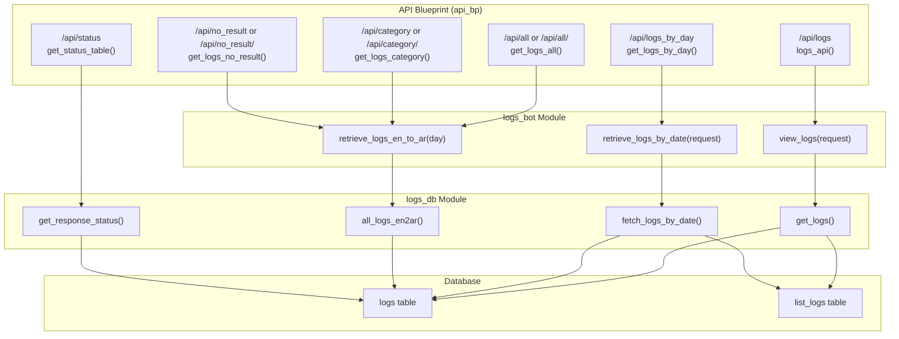
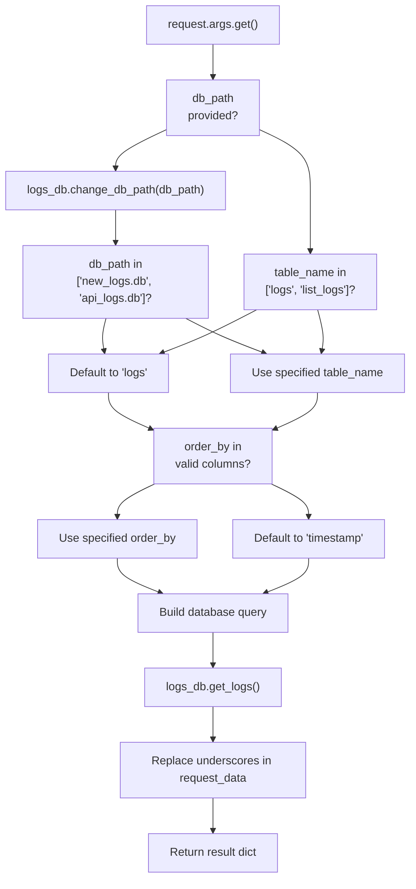

# Log Retrieval Endpoints

> **Relevant source files**
> * [src/app/routes/api.py](https://github.com/ArWikiCats/ArWikiCatsWeb/blob/88f42d13/src/app/routes/api.py)
> * [tests/test_api.py](https://github.com/ArWikiCats/ArWikiCatsWeb/blob/88f42d13/tests/test_api.py)
> * [tests/test_logs_bot.py](https://github.com/ArWikiCats/ArWikiCatsWeb/blob/88f42d13/tests/test_logs_bot.py)

## Purpose and Scope

This document describes the REST API endpoints that retrieve and query logged request data from the ArWikiCatsWeb application. These endpoints provide access to historical usage data, including pagination, filtering, date aggregation, and status-based filtering capabilities.

For information about how log data is initially recorded, see [Log Recording](/ArWikiCats/ArWikiCatsWeb/6.2-log-recording). For details about the underlying database schema, see [Log Database Schema](/ArWikiCats/ArWikiCatsWeb/6.1-log-database-schema). For information about the category resolution endpoints that generate these logs, see [Category Resolution Endpoints](/ArWikiCats/ArWikiCatsWeb/4.1-category-resolution-endpoints).

**Sources:** [src/app/routes/api.py L1-L165](https://github.com/ArWikiCats/ArWikiCatsWeb/blob/88f42d13/src/app/routes/api.py#L1-L165)

## Endpoint Overview

The log retrieval API consists of six primary endpoints, all registered under the `api_bp` Blueprint with the `/api` prefix:

| Endpoint | HTTP Method | Purpose | Key Function |
| --- | --- | --- | --- |
| `/api/logs` | GET | Paginated log retrieval with filtering | `logs_bot.view_logs()` |
| `/api/logs_by_day` | GET | Daily aggregated statistics | `logs_bot.retrieve_logs_by_date()` |
| `/api/all` or `/api/all/<day>` | GET | All resolution results with optional date filter | `logs_bot.retrieve_logs_en_to_ar()` |
| `/api/category` or `/api/category/<day>` | GET | Successful resolution results only | `logs_bot.retrieve_logs_en_to_ar()` (filtered) |
| `/api/no_result` or `/api/no_result/<day>` | GET | Failed resolution results only | `logs_bot.retrieve_logs_en_to_ar()` (filtered) |
| `/api/status` | GET | Available response status types | `get_response_status()` |

**Sources:** [src/app/routes/api.py L33-L165](https://github.com/ArWikiCats/ArWikiCatsWeb/blob/88f42d13/src/app/routes/api.py#L33-L165)

 [tests/test_api.py L90-L177](https://github.com/ArWikiCats/ArWikiCatsWeb/blob/88f42d13/tests/test_api.py#L90-L177)

## Architecture Overview



**Sources:** [src/app/routes/api.py L1-L165](https://github.com/ArWikiCats/ArWikiCatsWeb/blob/88f42d13/src/app/routes/api.py#L1-L165)

 [tests/test_logs_bot.py L1-L383](https://github.com/ArWikiCats/ArWikiCatsWeb/blob/88f42d13/tests/test_logs_bot.py#L1-L383)

## Detailed Endpoint Documentation

### /api/logs - Paginated Log Retrieval

The primary endpoint for retrieving paginated and filtered log data. Implemented by the `logs_api()` function at [src/app/routes/api.py L159-L164](https://github.com/ArWikiCats/ArWikiCatsWeb/blob/88f42d13/src/app/routes/api.py#L159-L164)

**HTTP Method:** GET

**Request Flow:**

1. Accepts query parameters via Flask `request` object
2. Invokes `logs_bot.view_logs(request)` to process the request
3. Returns JSON response via custom `jsonify()` function

**Query Parameters:**

| Parameter | Type | Default | Valid Values | Description |
| --- | --- | --- | --- | --- |
| `page` | int | 1 | > 0 | Current page number for pagination |
| `per_page` | int | 10 | > 0 | Number of records per page |
| `order` | str | "desc" | "asc", "desc" | Sort order |
| `order_by` | str | "response_count" | "timestamp", "response_count", "response_time", "response_status" | Sort column |
| `table_name` | str | "logs" | "logs", "list_logs" | Target database table |
| `day` | str | "" | YYYY-MM-DD format | Filter by specific date |
| `status` | str | "" | Status value | Filter by response status |
| `like` | str | "" | Any string | Search in request_data field |
| `db_path` | str | None | File path | Alternative database file path |

**Response Structure:**

```json
{
  "logs": [
    {
      "id": 123,
      "endpoint": "/api/<title>",
      "request_data": "Category:Test Data",
      "response_status": "success",
      "response_time": 0.15,
      "response_count": 5,
      "timestamp": "2025-01-27 10:30:00",
      "date_only": "2025-01-27"
    }
  ],
  "tab": {
    "page": 1,
    "per_page": 10,
    "total_records": 100,
    "total_response_count": 500,
    "table_name": "logs"
  },
  "status_table": ["no_result", "success", "error"]
}
```

**Special Behavior:**

* Underscores in `request_data` are replaced with spaces for display purposes
* Invalid `table_name` values default to "logs"
* Invalid `order_by` values default to "timestamp"
* When `db_path` parameter is provided, `logs_db.change_db_path()` is called

**Sources:** [src/app/routes/api.py L159-L164](https://github.com/ArWikiCats/ArWikiCatsWeb/blob/88f42d13/src/app/routes/api.py#L159-L164)

 [tests/test_api.py L109-L117](https://github.com/ArWikiCats/ArWikiCatsWeb/blob/88f42d13/tests/test_api.py#L109-L117)

 [tests/test_logs_bot.py L10-L121](https://github.com/ArWikiCats/ArWikiCatsWeb/blob/88f42d13/tests/test_logs_bot.py#L10-L121)

 [tests/test_logs_bot.py L249-L336](https://github.com/ArWikiCats/ArWikiCatsWeb/blob/88f42d13/tests/test_logs_bot.py#L249-L336)

### /api/logs_by_day - Daily Aggregated Statistics

Returns log data aggregated by date with daily statistics. Implemented by `get_logs_by_day()` at [src/app/routes/api.py L33-L38](https://github.com/ArWikiCats/ArWikiCatsWeb/blob/88f42d13/src/app/routes/api.py#L33-L38)

**HTTP Method:** GET

**Request Flow:**

1. Calls `logs_bot.retrieve_logs_by_date(request)` to aggregate data by date
2. Extracts the `logs` key from the result dictionary
3. Returns only the logs array (excludes `tab` and `logs_data` keys)

**Query Parameters:**

| Parameter | Type | Default | Description |
| --- | --- | --- | --- |
| `db_path` | str | None | Alternative database file path |

**Response Structure:**

```json
[
  {
    "day": "2025-01-27",
    "title_count": 150,
    "total": 500,
    "no_result": 50,
    "Category": 100
  },
  {
    "day": "2025-01-26",
    "title_count": 120,
    "total": 400,
    "no_result": 40,
    "Category": 80
  }
]
```

**Response Fields:**

* `day`: Date in YYYY-MM-DD format
* `title_count`: Total number of unique titles processed on that day
* `total`: Total number of requests on that day
* `no_result`: Count of requests that returned no results
* `Category`: Count of successful category resolutions
* Additional status-specific counts may be present

**Aggregation Logic:**

* Data is grouped by `date_only` field
* Multiple status types per day are aggregated together
* Results are sorted by day in ascending order

**Sources:** [src/app/routes/api.py L33-L38](https://github.com/ArWikiCats/ArWikiCatsWeb/blob/88f42d13/src/app/routes/api.py#L33-L38)

 [tests/test_api.py L90-L99](https://github.com/ArWikiCats/ArWikiCatsWeb/blob/88f42d13/tests/test_api.py#L90-L99)

 [tests/test_logs_bot.py L123-L183](https://github.com/ArWikiCats/ArWikiCatsWeb/blob/88f42d13/tests/test_logs_bot.py#L123-L183)

### /api/all and /api/all/<day> - Complete Resolution Data

Returns all English-to-Arabic category resolution data, with optional date filtering. Implemented by `get_logs_all()` at [src/app/routes/api.py L41-L46](https://github.com/ArWikiCats/ArWikiCatsWeb/blob/88f42d13/src/app/routes/api.py#L41-L46)

**HTTP Method:** GET

**URL Patterns:**

* `/api/all` - Returns all historical data
* `/api/all/<day>` - Returns data for specific date (YYYY-MM-DD format)

**Request Flow:**

1. Accepts optional `day` parameter from URL path
2. Calls `logs_bot.retrieve_logs_en_to_ar(day)` with the day parameter
3. Returns complete result without filtering

**Response Structure:**

```json
{
  "tab": {
    "sum_all": "300",
    "sum_data_result": "250",
    "sum_no_result": "50"
  },
  "no_result": [
    "Category:NotFound1",
    "Category:NotFound2"
  ],
  "data_result": {
    "Category:Test1": "تصنيف:اختبار1",
    "Category:Test2": "تصنيف:اختبار2"
  }
}
```

**Response Fields:**

* `tab.sum_all`: Total count of all resolution attempts (string)
* `tab.sum_data_result`: Count of successful resolutions (string)
* `tab.sum_no_result`: Count of failed resolutions (string)
* `no_result`: Array of category titles that returned "no_result"
* `data_result`: Dictionary mapping English category names to Arabic labels

**Sources:** [src/app/routes/api.py L41-L46](https://github.com/ArWikiCats/ArWikiCatsWeb/blob/88f42d13/src/app/routes/api.py#L41-L46)

 [tests/test_api.py L118-L144](https://github.com/ArWikiCats/ArWikiCatsWeb/blob/88f42d13/tests/test_api.py#L118-L144)

 [tests/test_logs_bot.py L185-L247](https://github.com/ArWikiCats/ArWikiCatsWeb/blob/88f42d13/tests/test_logs_bot.py#L185-L247)

### /api/category and /api/category/<day> - Successful Resolutions Only

Returns only successful category resolution data, excluding failed lookups. Implemented by `get_logs_category()` at [src/app/routes/api.py L49-L57](https://github.com/ArWikiCats/ArWikiCatsWeb/blob/88f42d13/src/app/routes/api.py#L49-L57)

**HTTP Method:** GET

**URL Patterns:**

* `/api/category` - Returns all successful resolutions
* `/api/category/<day>` - Returns successful resolutions for specific date

**Request Flow:**

1. Calls `logs_bot.retrieve_logs_en_to_ar(day)` to get all data
2. Deletes the `no_result` key from the response dictionary
3. Returns filtered result containing only successful resolutions

**Response Structure:**

```json
{
  "tab": {
    "sum_all": "300",
    "sum_data_result": "250",
    "sum_no_result": "50"
  },
  "data_result": {
    "Category:Test1": "تصنيف:اختبار1",
    "Category:Test2": "تصنيف:اختبار2"
  }
}
```

**Note:** The `no_result` key is explicitly removed at [src/app/routes/api.py L54-L55](https://github.com/ArWikiCats/ArWikiCatsWeb/blob/88f42d13/src/app/routes/api.py#L54-L55)

 The `tab` statistics still reflect total counts including failed resolutions.

**Sources:** [src/app/routes/api.py L49-L57](https://github.com/ArWikiCats/ArWikiCatsWeb/blob/88f42d13/src/app/routes/api.py#L49-L57)

 [tests/test_api.py L146-L160](https://github.com/ArWikiCats/ArWikiCatsWeb/blob/88f42d13/tests/test_api.py#L146-L160)

### /api/no_result and /api/no_result/<day> - Failed Resolutions Only

Returns only failed category resolution attempts. Implemented by `get_logs_no_result()` at [src/app/routes/api.py L60-L68](https://github.com/ArWikiCats/ArWikiCatsWeb/blob/88f42d13/src/app/routes/api.py#L60-L68)

**HTTP Method:** GET

**URL Patterns:**

* `/api/no_result` - Returns all failed resolutions
* `/api/no_result/<day>` - Returns failed resolutions for specific date

**Request Flow:**

1. Calls `logs_bot.retrieve_logs_en_to_ar(day)` to get all data
2. Deletes the `data_result` key from the response dictionary
3. Returns filtered result containing only failed resolutions

**Response Structure:**

```json
{
  "tab": {
    "sum_all": "300",
    "sum_data_result": "250",
    "sum_no_result": "50"
  },
  "no_result": [
    "Category:NotFound1",
    "Category:NotFound2"
  ]
}
```

**Note:** The `data_result` key is explicitly removed at [src/app/routes/api.py L65-L66](https://github.com/ArWikiCats/ArWikiCatsWeb/blob/88f42d13/src/app/routes/api.py#L65-L66)

 The `tab` statistics still reflect total counts including successful resolutions.

**Sources:** [src/app/routes/api.py L60-L68](https://github.com/ArWikiCats/ArWikiCatsWeb/blob/88f42d13/src/app/routes/api.py#L60-L68)

 [tests/test_api.py L162-L177](https://github.com/ArWikiCats/ArWikiCatsWeb/blob/88f42d13/tests/test_api.py#L162-L177)

### /api/status - Response Status Types

Returns a list of all unique response status values present in the database. Implemented by `get_status_table()` at [src/app/routes/api.py L71-L75](https://github.com/ArWikiCats/ArWikiCatsWeb/blob/88f42d13/src/app/routes/api.py#L71-L75)

**HTTP Method:** GET

**Request Flow:**

1. Calls `get_response_status()` from `logs_db` module
2. Returns the list of status strings directly

**Response Structure:**

```json
[
  "no_result",
  "success",
  "error",
  "User-Agent missing"
]
```

**Response Format:** Array of strings representing distinct `response_status` values from the logs table.

**Usage:** This endpoint is typically used to populate filter dropdowns in the UI and to understand what status types exist in the database.

**Sources:** [src/app/routes/api.py L71-L75](https://github.com/ArWikiCats/ArWikiCatsWeb/blob/88f42d13/src/app/routes/api.py#L71-L75)

 [tests/test_api.py L100-L108](https://github.com/ArWikiCats/ArWikiCatsWeb/blob/88f42d13/tests/test_api.py#L100-L108)

## Data Flow Diagram

**Sources:** [src/app/routes/api.py L159-L164](https://github.com/ArWikiCats/ArWikiCatsWeb/blob/88f42d13/src/app/routes/api.py#L159-L164)

 [tests/test_logs_bot.py L40-L121](https://github.com/ArWikiCats/ArWikiCatsWeb/blob/88f42d13/tests/test_logs_bot.py#L40-L121)

## Query Parameter Processing

The `view_logs()` function in the `logs_bot` module processes query parameters with validation and defaults. This section documents the parameter handling logic.

### Parameter Extraction and Validation



### Valid Columns for order_by

The following columns are valid for the `order_by` parameter:

* `timestamp` (default if invalid value provided)
* `response_count`
* `response_time`
* `response_status`
* `endpoint`
* `request_data`

### Database Path Switching

When the `db_path` parameter is provided:

1. `logs_db.change_db_path(db_path)` is called
2. Returns list of available database files: `["new_logs.db", "api_logs.db"]`
3. If the specified `db_path` is not in the returned list, defaults to `table_name="logs"`

**Sources:** [tests/test_logs_bot.py L259-L336](https://github.com/ArWikiCats/ArWikiCatsWeb/blob/88f42d13/tests/test_logs_bot.py#L259-L336)

## Response Format Details

### JSON Serialization

All log retrieval endpoints use a custom `jsonify()` function defined at [src/app/routes/api.py L20-L22](https://github.com/ArWikiCats/ArWikiCatsWeb/blob/88f42d13/src/app/routes/api.py#L20-L22)

 with the following characteristics:

* **Unicode Handling:** Sets `ensure_ascii=False` to preserve Arabic characters without escaping
* **Pretty Printing:** Uses `indent=4` for human-readable output
* **Content Type:** Returns `application/json; charset=utf-8` headers
* **Character Encoding:** Properly handles Arabic text (e.g., "تصنيف:اختبار")

**Example of Arabic character preservation:**

```json
{
  "result": "تصنيف:اختبار"
}
```

The Arabic characters are rendered directly, not escaped as Unicode sequences.

**Sources:** [src/app/routes/api.py L20-L22](https://github.com/ArWikiCats/ArWikiCatsWeb/blob/88f42d13/src/app/routes/api.py#L20-L22)

 [tests/test_api.py L11-L42](https://github.com/ArWikiCats/ArWikiCatsWeb/blob/88f42d13/tests/test_api.py#L11-L42)

### Request Data Formatting

The `view_logs()` function applies special formatting to the `request_data` field:

**Before formatting:** `"Category:Test_Data_Here"`

**After formatting:** `"Category:Test Data Here"`

This transformation replaces underscores with spaces for improved readability in the UI. The replacement occurs at the presentation layer; the database stores the original format.

**Sources:** [tests/test_logs_bot.py L96-L121](https://github.com/ArWikiCats/ArWikiCatsWeb/blob/88f42d13/tests/test_logs_bot.py#L96-L121)

## Error Handling

Log retrieval endpoints generally do not require User-Agent validation, unlike the category resolution endpoints. However, they handle errors gracefully:

### Database Errors

* If database path is invalid or inaccessible, operations fall back to default table
* If specified table doesn't exist, defaults to "logs" table

### Parameter Validation

* Invalid `order_by` values default to "timestamp"
* Invalid `table_name` values default to "logs"
* Invalid `page` or `per_page` values are handled by database layer

### Empty Results

All endpoints return valid JSON structures even when no data is found:

* `/api/logs`: Returns `{"logs": [], "tab": {...}, "status_table": []}`
* `/api/logs_by_day`: Returns `[]`
* `/api/all`: Returns `{"tab": {"sum_all": "0", ...}, "no_result": [], "data_result": {}}`

**Sources:** [tests/test_logs_bot.py L249-L336](https://github.com/ArWikiCats/ArWikiCatsWeb/blob/88f42d13/tests/test_logs_bot.py#L249-L336)

 [tests/test_api.py L90-L177](https://github.com/ArWikiCats/ArWikiCatsWeb/blob/88f42d13/tests/test_api.py#L90-L177)

## Integration with logs_bot Module

The API endpoints act as thin wrappers around the `logs_bot` module functions. The following table maps endpoints to their underlying functions:

| Endpoint | Function | Module | Purpose |
| --- | --- | --- | --- |
| `/api/logs` | `view_logs(request)` | logs_bot | Paginated retrieval with full parameter support |
| `/api/logs_by_day` | `retrieve_logs_by_date(request)` | logs_bot | Date-based aggregation |
| `/api/all`, `/api/category`, `/api/no_result` | `retrieve_logs_en_to_ar(day)` | logs_bot | EN→AR resolution data with optional filtering |
| `/api/status` | `get_response_status()` | logs_db | Status type enumeration |

For detailed information about these underlying functions, see [Log Retrieval and Analysis](/ArWikiCats/ArWikiCatsWeb/6.3-log-retrieval-and-analysis).

**Sources:** [src/app/routes/api.py L1-L165](https://github.com/ArWikiCats/ArWikiCatsWeb/blob/88f42d13/src/app/routes/api.py#L1-L165)