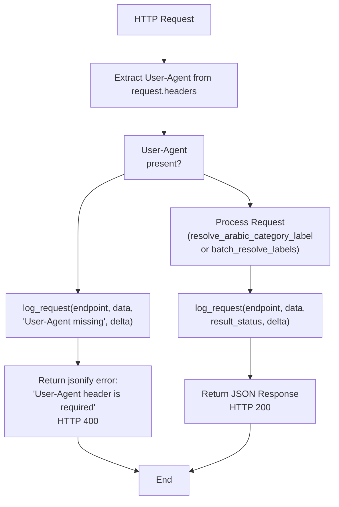
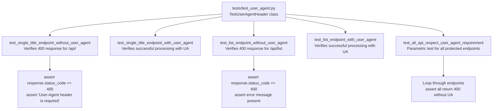

# User-Agent Validation

> **Relevant source files**
> * [src/app/routes/api.py](https://github.com/ArWikiCats/ArWikiCatsWeb/blob/88f42d13/src/app/routes/api.py)
> * [tests/test_user_agent.py](https://github.com/ArWikiCats/ArWikiCatsWeb/blob/88f42d13/tests/test_user_agent.py)

## Purpose and Scope

This document explains the User-Agent header validation mechanism implemented for specific API endpoints. User-Agent validation ensures that all API clients identify themselves with a proper User-Agent header, which is essential for monitoring usage patterns, preventing abuse, and maintaining logs that can be analyzed for operational insights.

For information about the endpoints themselves and their functionality, see [Category Resolution Endpoints](/ArWikiCats/ArWikiCatsWeb/4.1-category-resolution-endpoints). For details about how validation failures are logged, see [Log Recording](/ArWikiCats/ArWikiCatsWeb/6.2-log-recording).

---

## Overview

User-Agent validation is a mandatory requirement for API endpoints that perform category resolution operations. This validation prevents anonymous or unidentified clients from using the service and ensures proper request attribution for logging and analytics purposes.

### Endpoints Requiring User-Agent

The following API endpoints require a valid User-Agent header:

| Endpoint | HTTP Method | Purpose | Reference |
| --- | --- | --- | --- |
| `/api/<title>` | GET | Single category resolution | [src/app/routes/api.py L78-L100](https://github.com/ArWikiCats/ArWikiCatsWeb/blob/88f42d13/src/app/routes/api.py#L78-L100) |
| `/api/list` | POST | Batch category resolution | [src/app/routes/api.py L103-L156](https://github.com/ArWikiCats/ArWikiCatsWeb/blob/88f42d13/src/app/routes/api.py#L103-L156) |

### Endpoints Not Requiring User-Agent

Log retrieval and analytics endpoints do not require User-Agent validation:

* `/api/logs_by_day`
* `/api/all`
* `/api/category`
* `/api/no_result`
* `/api/status`
* `/api/logs`

**Sources:** [src/app/routes/api.py L1-L165](https://github.com/ArWikiCats/ArWikiCatsWeb/blob/88f42d13/src/app/routes/api.py#L1-L165)

---

## Validation Implementation

### The check_user_agent Function

The validation logic is centralized in the `check_user_agent` function, which provides a reusable validation mechanism across protected endpoints.

```yaml
Function signature: check_user_agent(endpoint, data, start_time)
Parameters:
  - endpoint: The API endpoint path being accessed
  - data: The request data (title string or list of titles)
  - start_time: Request start timestamp for performance tracking
  
Returns:
  - None if validation passes
  - (response, status_code) tuple if validation fails
```

The function performs the following operations:

1. Checks for the presence of `User-Agent` header via `request.headers.get("User-Agent")`
2. If missing, sets `response_status` to `"User-Agent missing"`
3. Logs the failed request with `log_request(endpoint, data, response_status, delta)`
4. Returns a JSON error response with HTTP 400 status code

**Sources:** [src/app/routes/api.py L25-L30](https://github.com/ArWikiCats/ArWikiCatsWeb/blob/88f42d13/src/app/routes/api.py#L25-L30)

---

## Validation Flow

### Request Processing with User-Agent Check



### Integration Points in API Routes

```mermaid
flowchart TD

GetTitles["get_titles()"]
StartTime2["start_time = time.time()"]
ExtractData["data = request.get_json()<br>titles = data.get('titles', [])"]
CheckUA2["ua_check = check_user_agent<br>('/api/list', titles, start_time)"]
Conditional2["ua_check?"]
ReturnError2["return ua_check"]
Continue2["Continue processing<br>batch_resolve_labels"]
GetTitle["get_title(title)"]
StartTime1["start_time = time.time()"]
CheckUA1["ua_check = check_user_agent<br>('/api/', title, start_time)"]
Conditional1["ua_check?"]
ReturnError1["return ua_check"]
Continue1["Continue processing<br>resolve_arabic_category_label"]

subgraph subGraph1 ["POST /api/list"]
    GetTitles
    StartTime2
    ExtractData
    CheckUA2
    Conditional2
    ReturnError2
    Continue2
    GetTitles --> StartTime2
    StartTime2 --> ExtractData
    ExtractData --> CheckUA2
    CheckUA2 --> Conditional2
    Conditional2 --> ReturnError2
    Conditional2 --> Continue2
end

subgraph subGraph0 ["GET /api/"]
    GetTitle
    StartTime1
    CheckUA1
    Conditional1
    ReturnError1
    Continue1
    GetTitle --> StartTime1
    StartTime1 --> CheckUA1
    CheckUA1 --> Conditional1
    Conditional1 --> ReturnError1
    Conditional1 --> Continue1
end
```



**Sources:** [src/app/routes/api.py L78-L100](https://github.com/ArWikiCats/ArWikiCatsWeb/blob/88f42d13/src/app/routes/api.py#L78-L100)

 [src/app/routes/api.py L103-L156](https://github.com/ArWikiCats/ArWikiCatsWeb/blob/88f42d13/src/app/routes/api.py#L103-L156)

---

## Error Response Format

### Missing User-Agent Response

When a request lacks a User-Agent header, the API returns the following response:

**HTTP Status Code:** `400 Bad Request`

**Response Body:**

```json
{
    "error": "User-Agent header is required"
}
```

**Content-Type:** `application/json; charset=utf-8`

The response is generated by the `jsonify` helper function at [src/app/routes/api.py L20-L22](https://github.com/ArWikiCats/ArWikiCatsWeb/blob/88f42d13/src/app/routes/api.py#L20-L22)

 which ensures proper UTF-8 encoding and JSON formatting with pretty-printing enabled.

**Sources:** [src/app/routes/api.py L20-L30](https://github.com/ArWikiCats/ArWikiCatsWeb/blob/88f42d13/src/app/routes/api.py#L20-L30)

---

## Logging Behavior

### Validation Failure Logging

When User-Agent validation fails, the request is still logged to enable monitoring of rejected requests. The logging occurs before the error response is returned.

**Log Entry Details:**

| Field | Value |
| --- | --- |
| `endpoint` | The API endpoint path (`/api/<title>` or `/api/list`) |
| `data` | Request data (category title or list of titles) |
| `response_status` | `"User-Agent missing"` |
| `response_time` | Time delta calculated as `time.time() - start_time` |

This logging allows operators to:

* Monitor abuse attempts or misconfigured clients
* Identify clients that need to be contacted about proper integration
* Track the rate of rejected requests over time

**Sources:** [src/app/routes/api.py L25-L30](https://github.com/ArWikiCats/ArWikiCatsWeb/blob/88f42d13/src/app/routes/api.py#L25-L30)

---

## Validation Logic Details

### Header Extraction

The validation uses Flask's `request.headers.get("User-Agent")` method, which:

* Returns the header value if present
* Returns `None` if the header is missing
* Is case-insensitive (both `User-Agent` and `user-agent` are accepted by HTTP standards)

### Truthiness Check

The validation employs a simple truthiness check:

```
if not request.headers.get("User-Agent"):
```

This means the following values trigger validation failure:

* Header completely absent (`None`)
* Empty string (`""`)
* Whitespace-only strings (evaluated as falsy after strip operations by Flask)

This strict approach ensures clients provide meaningful identification.

**Sources:** [src/app/routes/api.py L26](https://github.com/ArWikiCats/ArWikiCatsWeb/blob/88f42d13/src/app/routes/api.py#L26-L26)

---

## Testing Strategy

### Test Coverage

The User-Agent validation is comprehensively tested in the test suite, achieving 100% coverage for the validation logic.



### Key Test Cases

1. **Missing User-Agent on Single Title Endpoint** ([tests/test_user_agent.py L21-L31](https://github.com/ArWikiCats/ArWikiCatsWeb/blob/88f42d13/tests/test_user_agent.py#L21-L31) ): * Sends request with empty User-Agent header * Asserts 400 status code * Verifies error message content
2. **Valid User-Agent on Single Title Endpoint** ([tests/test_user_agent.py L33-L47](https://github.com/ArWikiCats/ArWikiCatsWeb/blob/88f42d13/tests/test_user_agent.py#L33-L47) ): * Sends request with `TestAgent/1.0` User-Agent * Uses mocking to isolate validation from category resolution * Verifies request proceeds to processing
3. **Missing User-Agent on List Endpoint** ([tests/test_user_agent.py L49-L61](https://github.com/ArWikiCats/ArWikiCatsWeb/blob/88f42d13/tests/test_user_agent.py#L49-L61) ): * Sends POST request with empty User-Agent * Validates batch endpoint protection
4. **Valid User-Agent on List Endpoint** ([tests/test_user_agent.py L63-L83](https://github.com/ArWikiCats/ArWikiCatsWeb/blob/88f42d13/tests/test_user_agent.py#L63-L83) ): * Tests POST endpoint with valid User-Agent * Mocks `batch_resolve_labels` for isolation
5. **Comprehensive Endpoint Coverage** ([tests/test_user_agent.py L85-L113](https://github.com/ArWikiCats/ArWikiCatsWeb/blob/88f42d13/tests/test_user_agent.py#L85-L113) ): * Parametrically tests multiple endpoints * Ensures consistency across the API

### Mocking Strategy

Tests use `unittest.mock.patch` to isolate User-Agent validation from:

* `resolve_arabic_category_label` (ArWikiCats library)
* `batch_resolve_labels` (ArWikiCats library)
* `log_request` (logging infrastructure)

This isolation ensures tests focus solely on validation logic without requiring external dependencies.

**Sources:** [tests/test_user_agent.py L1-L113](https://github.com/ArWikiCats/ArWikiCatsWeb/blob/88f42d13/tests/test_user_agent.py#L1-L113)

---

## Client Implementation Guidelines

### Proper User-Agent Format

Clients should provide a User-Agent header following this format:

```
BotName/Version (Contact information; Purpose)
```

**Examples:**

```
ArticleBot/1.0 (https://example.org/bot; Category maintenance)
WikiSync/2.3 (user@example.com; Cross-wiki synchronization)
CategoryResolver/1.0 (+http://en.wikipedia.org/wiki/User:BotOperator)
```

### Implementation Examples

**Python (requests library):**

```javascript
import requests

headers = {
    'User-Agent': 'MyCategoryBot/1.0 (user@example.com; Category sync)'
}

response = requests.get(
    'https://arwikicatsweb.toolforge.org/api/Category:Yemen',
    headers=headers
)
```

**JavaScript (fetch API):**

```
fetch('https://arwikicatsweb.toolforge.org/api/Category:Yemen', {
    headers: {
        'User-Agent': 'MyCategoryBot/1.0 (user@example.com; Category sync)'
    }
})
```

**curl:**

```yaml
curl -H "User-Agent: MyCategoryBot/1.0 (user@example.com)" \
     https://arwikicatsweb.toolforge.org/api/Category:Yemen
```

---

## Related Components

### Request Logging Integration

The `check_user_agent` function integrates directly with the logging system by calling `log_request` when validation fails. This ensures rejected requests are tracked alongside successful requests for comprehensive analytics.

See [Log Recording](/ArWikiCats/ArWikiCatsWeb/6.2-log-recording) for details on how requests are logged.

### Blueprint Registration

The User-Agent validation is implemented within the `api_bp` Blueprint, which is registered with the Flask application during initialization.

See [Routing and Blueprints](/ArWikiCats/ArWikiCatsWeb/3.2-routing-and-blueprints) for details on Blueprint architecture.

**Sources:** [src/app/routes/api.py L1-L165](https://github.com/ArWikiCats/ArWikiCatsWeb/blob/88f42d13/src/app/routes/api.py#L1-L165)