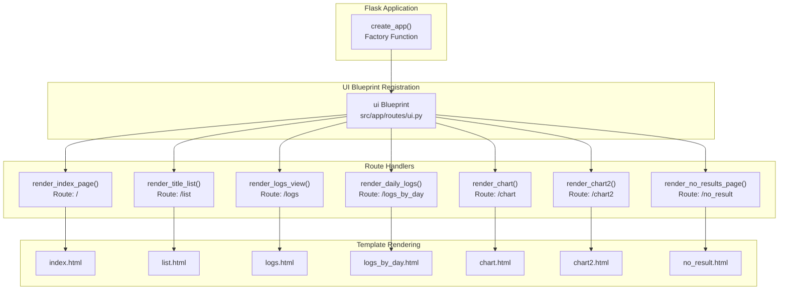
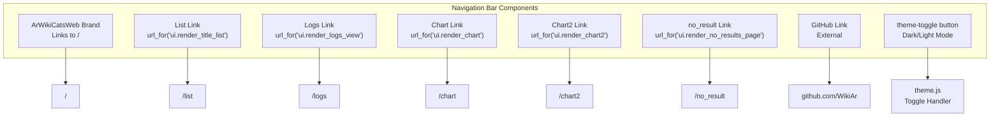

# Web Interface

> **Relevant source files**
> * [README.md](https://github.com/ArWikiCats/ArWikiCatsWeb/blob/88f42d13/README.md)
> * [src/templates/chart2.html](https://github.com/ArWikiCats/ArWikiCatsWeb/blob/88f42d13/src/templates/chart2.html)
> * [src/templates/main.html](https://github.com/ArWikiCats/ArWikiCatsWeb/blob/88f42d13/src/templates/main.html)
> * [tests/test_db_operations.py](https://github.com/ArWikiCats/ArWikiCatsWeb/blob/88f42d13/tests/test_db_operations.py)
> * [tests/test_ui.py](https://github.com/ArWikiCats/ArWikiCatsWeb/blob/88f42d13/tests/test_ui.py)

## Purpose and Scope

The Web Interface provides a browser-based graphical user interface for interacting with ArWikiCatsWeb's category resolution and logging capabilities. It consists of server-side rendered HTML pages that combine Jinja2 templates with client-side JavaScript to create an interactive user experience.

For details about the underlying REST API that the web interface consumes, see [REST API](/ArWikiCats/ArWikiCatsWeb/4-rest-api). For information about specific template structure and inheritance, see [Base Template System](/ArWikiCats/ArWikiCatsWeb/5.1-base-template-system). For details about client-side functionality, see [Client-Side JavaScript](/ArWikiCats/ArWikiCatsWeb/5.5-client-side-javascript).

Sources: [README.md L1-L271](https://github.com/ArWikiCats/ArWikiCatsWeb/blob/88f42d13/README.md#L1-L271)

 [src/templates/main.html L1-L157](https://github.com/ArWikiCats/ArWikiCatsWeb/blob/88f42d13/src/templates/main.html#L1-L157)

## UI Blueprint Architecture

All web interface routes are defined in the UI Blueprint, which is registered with the Flask application during initialization. The blueprint handles server-side rendering, data retrieval from the logging system, and serves static assets.



Sources: [tests/test_ui.py L10-L97](https://github.com/ArWikiCats/ArWikiCatsWeb/blob/88f42d13/tests/test_ui.py#L10-L97)

 [src/templates/main.html L38-L103](https://github.com/ArWikiCats/ArWikiCatsWeb/blob/88f42d13/src/templates/main.html#L38-L103)

## Available Pages

The web interface consists of seven primary pages, each serving a specific purpose:

| Route | Handler Function | Template | Purpose |
| --- | --- | --- | --- |
| `/` | `render_index_page()` | `index.html` | Single category lookup interface |
| `/list` | `render_title_list()` | `list.html` | Batch category processing interface |
| `/logs` | `render_logs_view()` | `logs.html` | Paginated log viewer with filtering |
| `/logs_by_day` | `render_daily_logs()` | `logs_by_day.html` | Daily aggregated log statistics |
| `/chart` | `render_chart()` | `chart.html` | Simple visualization charts |
| `/chart2` | `render_chart2()` | `chart2.html` | Advanced charts with filtering |
| `/no_result` | `render_no_results_page()` | `no_result.html` | Failed category resolution viewer |

Sources: [tests/test_ui.py L22-L96](https://github.com/ArWikiCats/ArWikiCatsWeb/blob/88f42d13/tests/test_ui.py#L22-L96)

 [src/templates/main.html L41-L87](https://github.com/ArWikiCats/ArWikiCatsWeb/blob/88f42d13/src/templates/main.html#L41-L87)

## Navigation Structure

All pages share a common navigation bar defined in the base template. The navbar provides consistent access to all major features and includes a theme toggle for dark/light mode switching.



Sources: [src/templates/main.html L38-L103](https://github.com/ArWikiCats/ArWikiCatsWeb/blob/88f42d13/src/templates/main.html#L38-L103)

 [src/templates/main.html L112-L113](https://github.com/ArWikiCats/ArWikiCatsWeb/blob/88f42d13/src/templates/main.html#L112-L113)

## Template Architecture

All UI pages extend the base template `main.html`, which provides a consistent layout structure, shared dependencies, and common UI elements.

### Base Template Structure

The base template [src/templates/main.html L1-L157](https://github.com/ArWikiCats/ArWikiCatsWeb/blob/88f42d13/src/templates/main.html#L1-L157)

 defines three Jinja2 blocks for content injection:

| Block Name | Purpose | Default Content |
| --- | --- | --- |
| `title` | Page-specific `<title>` tag | "Categories titles" |
| `content` | Main content area (centered, 8-column width) | Empty |
| `content2` | Full-width content area below main content | Empty |

### Shared Dependencies

The base template loads the following third-party libraries from CDN:

**CSS Frameworks and Icons:**

* Bootstrap 5.3.0 - Main UI framework
* Bootstrap Icons 1.11.3 - Icon set
* jQuery UI 1.13.2 - UI components
* Font Awesome 6.7.2 - Additional icons
* DataTables 2.2.2 - Table enhancement
* Bootstrap Select 1.14.0-beta3 - Enhanced select inputs

**JavaScript Libraries:**

* jQuery 3.7.0 - DOM manipulation
* jQuery UI 1.13.2 - UI interactions
* Popper.js 2.11.8 - Tooltip positioning
* Bootstrap 5.3.0 - UI components
* DataTables 2.2.2 - Table functionality

**Custom Assets:**

* `static/style.css` - Application-specific styles
* `static/theme.css` - Theme-related styles
* `static/theme.js` - Theme toggle functionality
* `static/autocomplete.js` - Input autocomplete features

Sources: [src/templates/main.html L1-L35](https://github.com/ArWikiCats/ArWikiCatsWeb/blob/88f42d13/src/templates/main.html#L1-L35)

 [src/templates/main.html L112-L113](https://github.com/ArWikiCats/ArWikiCatsWeb/blob/88f42d13/src/templates/main.html#L112-L113)

## Request Processing Flow

The web interface uses a hybrid architecture where pages are server-side rendered but make client-side API calls for dynamic data retrieval and updates.

```mermaid
sequenceDiagram
  participant Browser
  participant UI Route Handler
  participant (src/app/routes/ui.py)
  participant logs_bot Module
  participant (src/app/logs_bot.py)
  participant Jinja2 Template
  participant (src/templates/*.html)
  participant Client-Side JS
  participant (src/static/*.js)
  participant API Route Handler
  participant (src/app/routes/api.py)

  Browser->>UI Route Handler: GET /logs?page=1
  UI Route Handler->>logs_bot Module: view_logs(page=1, per_page=10)
  logs_bot Module-->>UI Route Handler: {"logs": [...], "tab": {...}}
  UI Route Handler->>Jinja2 Template: render_template("logs.html", data)
  Jinja2 Template-->>Browser: HTML Response
  note over Browser,(src/static/*.js): Page loads with initial data
  Browser->>Client-Side JS: User interaction (filter, sort)
  Client-Side JS->>API Route Handler: fetch("/api/logs?status=no_result")
  API Route Handler-->>Client-Side JS: JSON Response
  Client-Side JS->>Browser: Update DOM without page reload
```

Sources: [tests/test_ui.py L28-L58](https://github.com/ArWikiCats/ArWikiCatsWeb/blob/88f42d13/tests/test_ui.py#L28-L58)

 [README.md L170-L177](https://github.com/ArWikiCats/ArWikiCatsWeb/blob/88f42d13/README.md#L170-L177)

## Common UI Features

### DataTables Integration

The base template includes DataTables initialization for table enhancement. All pages can apply the `soro` class to tables for automatic DataTables functionality:

```yaml
$('.soro').DataTable({
    paging: false,
    info: false,
    searching: false,
    order: []
});
```

[src/templates/main.html L116-L121](https://github.com/ArWikiCats/ArWikiCatsWeb/blob/88f42d13/src/templates/main.html#L116-L121)

### Copy to Clipboard Functionality

The base template provides a `copyResult(id, event)` function that uses the Clipboard API to copy text content with visual feedback. This function is available to all child templates for implementing copy-to-clipboard buttons.

[src/templates/main.html L122-L150](https://github.com/ArWikiCats/ArWikiCatsWeb/blob/88f42d13/src/templates/main.html#L122-L150)

### Theme Toggle

The navigation bar includes a theme toggle button that switches between light and dark modes. The theme state is managed by `theme.js` and persists across page loads.

[src/templates/main.html L98-L100](https://github.com/ArWikiCats/ArWikiCatsWeb/blob/88f42d13/src/templates/main.html#L98-L100)

Sources: [src/templates/main.html L114-L151](https://github.com/ArWikiCats/ArWikiCatsWeb/blob/88f42d13/src/templates/main.html#L114-L151)

## Page-Specific Functionality

### Category Lookup Pages

Pages at `/` (index) and `/list` provide interfaces for resolving Arabic category labels. These pages load client-side JavaScript modules (`api.js` and `api_list.js` respectively) that make asynchronous API calls to category resolution endpoints. See [Category Lookup Pages](/ArWikiCats/ArWikiCatsWeb/5.2-category-lookup-pages) for details.

### Log Viewing Pages

The `/logs` route handler accepts query parameters for filtering and pagination:

| Parameter | Type | Purpose | Default |
| --- | --- | --- | --- |
| `page` | integer | Current page number | 1 |
| `per_page` | integer | Results per page | 10 |
| `status` | string | Filter by response status | "All" |
| `like` | string | Search filter | "" |
| `day` | string | Date filter | "" |
| `order` | string | Sort direction (ASC/DESC) | "DESC" |
| `order_by` | string | Sort column | "response_count" |
| `table_name` | string | Database table | "logs" |

The route handler calls `view_logs()` from the `logs_bot` module to retrieve paginated results and passes the data to the template for rendering. See [Log Viewing Pages](/ArWikiCats/ArWikiCatsWeb/5.3-log-viewing-pages) for details.

Sources: [tests/test_ui.py L111-L189](https://github.com/ArWikiCats/ArWikiCatsWeb/blob/88f42d13/tests/test_ui.py#L111-L189)

### Chart and Visualization Pages

The `/chart` and `/chart2` routes render visualization interfaces. The `chart2.html` template includes Chart.js for rendering graphs and provides filtering controls for year, month, and date ranges. The page loads `x.js` which fetches data from API endpoints and renders charts dynamically. See [Chart and Visualization Pages](/ArWikiCats/ArWikiCatsWeb/5.4-chart-and-visualization-pages) for details.

Sources: [src/templates/chart2.html L1-L61](https://github.com/ArWikiCats/ArWikiCatsWeb/blob/88f42d13/src/templates/chart2.html#L1-L61)

 [tests/test_ui.py L86-L96](https://github.com/ArWikiCats/ArWikiCatsWeb/blob/88f42d13/tests/test_ui.py#L86-L96)

## Error Handling

The UI Blueprint relies on Flask's default error handling. 404 errors return Flask's standard 404 page. Server errors are logged but not specially handled at the UI layer.

Sources: [tests/test_ui.py L203-L207](https://github.com/ArWikiCats/ArWikiCatsWeb/blob/88f42d13/tests/test_ui.py#L203-L207)

## Testing Coverage

The UI routes have 100% test coverage as verified by [tests/test_ui.py L1-L208](https://github.com/ArWikiCats/ArWikiCatsWeb/blob/88f42d13/tests/test_ui.py#L1-L208)

 Tests cover:

* Basic page rendering for all routes
* Query parameter handling for logs page
* Pagination functionality
* Status filtering
* Table name parameter
* Error handling (404 responses)

Tests use `unittest.mock.patch` to mock `view_logs()` and `retrieve_logs_by_date()` functions, ensuring tests focus on route logic rather than database operations.

Sources: [tests/test_ui.py L1-L208](https://github.com/ArWikiCats/ArWikiCatsWeb/blob/88f42d13/tests/test_ui.py#L1-L208)

 [README.md L236-L239](https://github.com/ArWikiCats/ArWikiCatsWeb/blob/88f42d13/README.md#L236-L239)